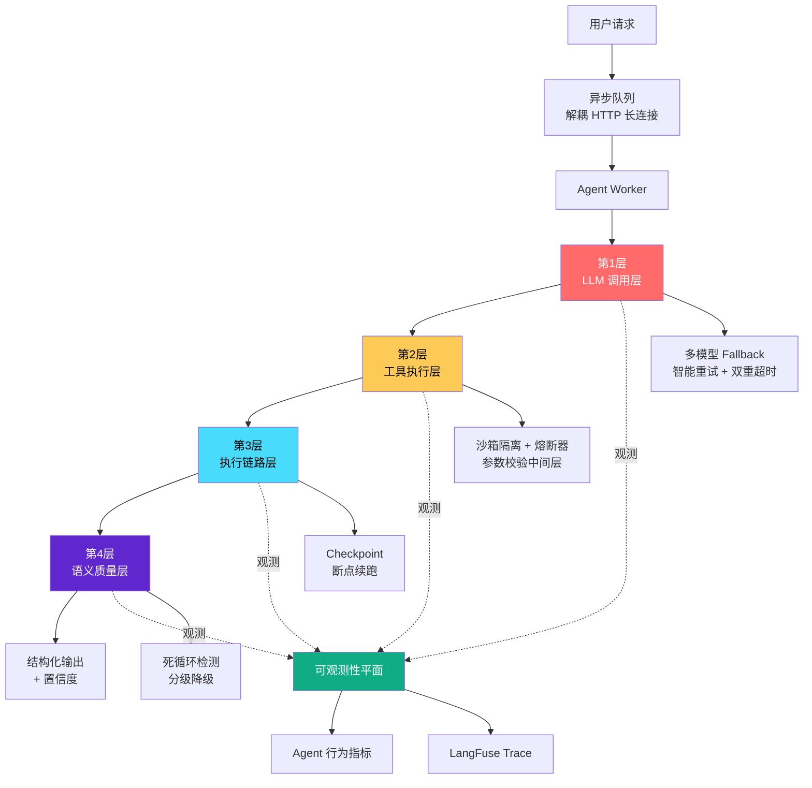
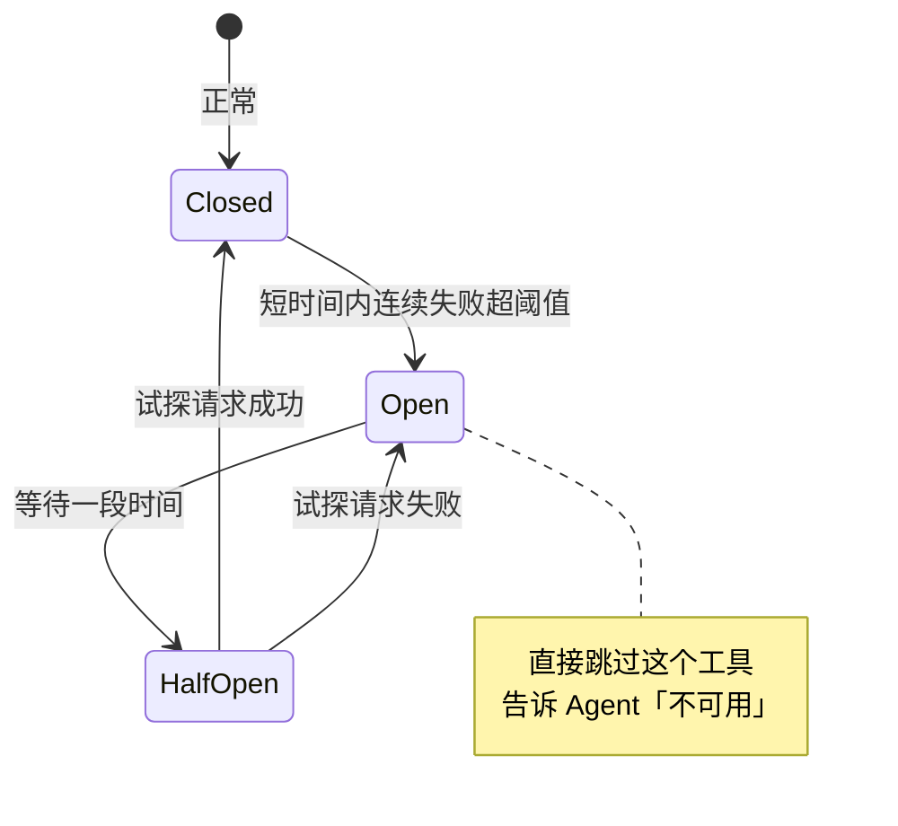
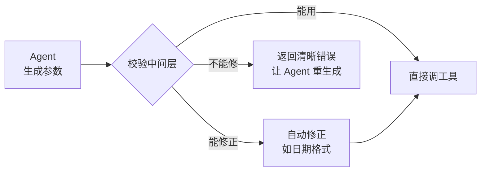
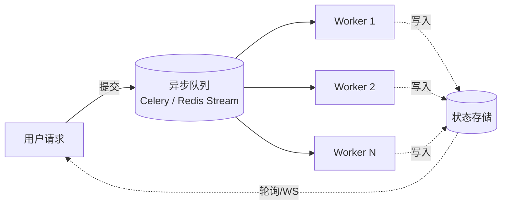
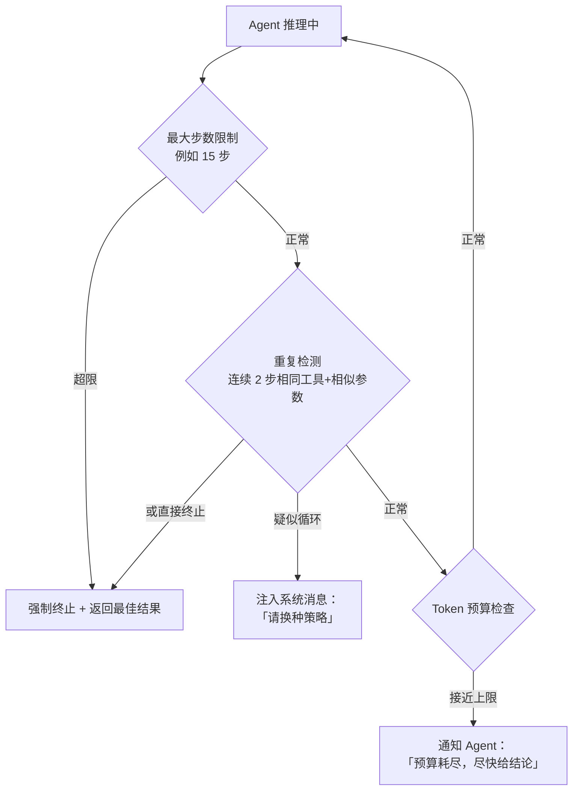
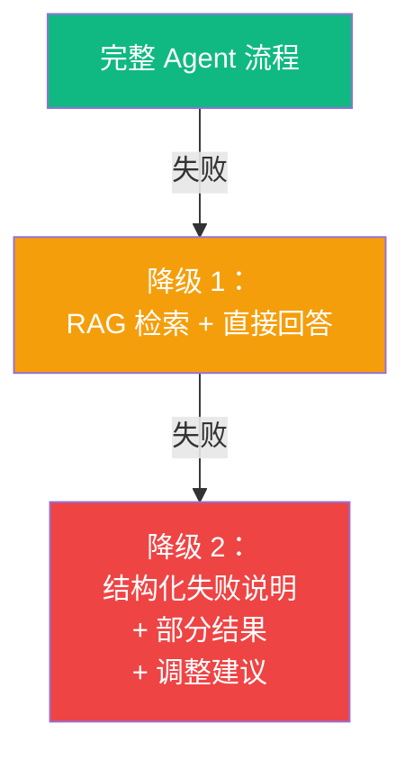

# 字节大模型二面：你的 Agent 服务是如何保证高可用和稳健性的？

!!! quote "原文出处"
    **来源**：知乎专栏《大模型面试题》—《字节大模型二面：你的 Agent 服务是如何保证高可用和稳健性的？》
    **作者**：[@IT杨秀才](https://golangstar.cn/)（专栏 39 篇）
    **链接**：<https://zhuanlan.zhihu.com/p/2032581603285809114>
    **读于**：2026-05-15

> **一句话定位**：Agent 服务的故障面比传统服务**多一整层「软故障」**——HTTP 200、健康检查全绿，但用户拿到的是垃圾结果。能讲清这层，就拿到了大模型岗高可用题的入场券。

---

## 🎯 这篇为什么值得收藏

第一篇 [TrustZone 那篇](ai-agent-interview-tour.md) 是**面试官提问思路的全景图**，覆盖广但每点不深。

这篇正好是它的对偶：**单题深挖**——把"线上会不会出事"这条线**打满**。原文 1 万多字，结构清晰、可背可抄、能直接迁移到任何 Agent 岗的可靠性题上。

读完这篇，你应该能在面试间里**口述**出来：

1. 为什么 Agent 服务比传统服务更难做高可用（**故障面分析**）
2. 四层防御体系都在防什么（**LLM / 工具 / 链路 / 语义**）
3. 可观测性怎么做（**Trace + Agent 行为指标**）
4. 一个 60 秒的标杆答案（**总结陈词模板**）

---

## 🧩 它本质上是什么？

::: tip 核心判断
**Agent 高可用 ≠ 传统微服务高可用 + LLM**
**Agent 高可用 = 传统微服务高可用 + 一整层针对「软故障」的语义防御。**
:::

「软故障」是这篇的关键概念。先把它理解透：

| 维度 | 硬故障 | 软故障 |
|---|---|---|
| 表现 | 进程崩溃、OOM、连接超时 | 死循环、参数静默错、上下文污染、目标漂移 |
| 监控 | 健康检查能感知 | **健康检查全绿，HTTP 200** |
| 用户体验 | 立刻报错 | 等很久拿到垃圾结果 |
| 解法 | 重启、扩容、切换 | **语义层防御 + Agent 级 Trace** |
| 出现频率（Agent 服务） | 跟传统服务差不多 | **远多于传统服务** |

---

## 🏗️ 四层防御 + 可观测性：完整骨架



下面把每一层的考点和标杆答法详细拆开。

## 🔴 第 1 层：LLM 调用层

> **要点一句话**：LLM 是整条链路里**最不稳定**的依赖，必须假设它会以各种方式坏掉。

### 三个考点

=== "考点 1：智能重试"

    **不要无脑重试。** Agent 场景下重试成本极高（每次烧 token），且很多失败重试也救不回来。

    | 失败类型 | 该不该重试 | 重试策略 |
    |---|---|---|
    | 网络超时 / 5xx | ✅ 该 | 指数退避 |
    | 限流 429 | ✅ 该 | 退避 + 等更久 |
    | 模型返回格式错 | ⚠️ 看情况 | **改 Prompt 再重试**，不是原样重发 |
    | 模型返回幻觉 | ❌ 不该 | 重试大概率还是错，应该换模型 |

=== "考点 2：多模型 Fallback"

    **核心策略**：搭一个 **LLM Gateway**，维护一个降级链：

    ```
    GPT-4o（主）
       ↓ 连续失败 N 次
    Claude Sonnet（备）
       ↓ 还失败
    自部署开源模型（兜底）
    ```

    !!! quote "原文金句"
        > 降级确实会带来质量下降，但**「质量稍差的回答」远好过「完全不可用」**。

=== "考点 3：双重超时"

    Agent 的超时设计比传统服务更细：

    - **单次 LLM 调用超时**：15-30 秒
    - **整个 Agent 任务超时**：2-5 分钟
    - 任意一个先触发就**终止 + 返回降级结果**

    > 为什么要双重？——一次用户请求可能触发 5-10 次 LLM 调用，单次超时控不住总耗时。

### 标杆答法（30 秒口播版）

> "LLM 调用层我们搭了 LLM Gateway 做统一管理：智能重试区分故障类型，**网络/限流退避重试**、**格式错改 Prompt 再试**、**幻觉直接换模型**。然后是多模型 Fallback——主用 GPT-4o、降级 Claude、兜底自部署模型，靠连续失败次数自动切。最后是双重超时，单次 LLM 30 秒、整任务 5 分钟，任一先触发就走降级。"

---

## 🟡 第 2 层：工具执行层

> **要点一句话**：工具是 Agent 能力的边界，也是**最脆弱**的一环——隔离 + 限制 + 熔断。

### 三个考点

#### 1. 沙箱隔离

每个工具调用必须在受控环境中跑：

- ⏱️ **独立超时**（不能让一个慢工具拖死整个 Agent）
- 💾 **资源配额**（CPU / 内存 / 网络带宽上限）
- 🔐 **权限边界**（只能访问被授权的资源）
- 🛡️ **代码执行类工具**：必须真正的沙箱（防任意代码执行）

#### 2. 熔断器模式

直接借鉴微服务领域的成熟做法：



**关键收益**：

- 避免对已知故障工具的无效重试（省 token、省时间）
- 防止故障传播导致整个 Agent 卡住
- 给 Agent 提供「该工具暂不可用」的明确信号，让它换路径

#### 3. 参数校验中间层（最容易被忽略！）

这是原文里很实战的一个点：

!!! warning "LLM 生成的工具参数到底有多差"
    - 日期格式不对（"2024年5月" vs "2024-05-01"）
    - 枚举值拼写错误（"美元" vs "USD"）
    - 必填字段缺失
    - 类型错误（字符串塞进数字字段）

**解法**：在 Agent 和实际工具之间夹一层校验中间层



### 标杆答法（30 秒口播版）

> "工具执行层有三道防线：沙箱隔离保证一个工具不会把整个 Agent 拖死，每个工具有独立超时和资源配额；熔断器模式防止故障传播，连续失败就自动熔断，过段时间半开试探；最关键的是**参数校验中间层**——LLM 生成的工具参数经常有日期格式、枚举值这些小错，我们在 Agent 和工具之间加一层校验，能自动修就修，不能修就生成清晰错误反馈让 Agent 重生成参数。"

---

## 🔵 第 3 层：执行链路层

> **要点一句话**：Agent 任务**长且有状态**——必须能从任意节点恢复。

### 核心矛盾

| 维度 | 传统 API | Agent 任务 |
|---|---|---|
| 执行时间 | 毫秒级 | **几分钟** |
| 状态 | 无状态 | **强状态**，每步是下一步的输入 |
| 中断成本 | 重试一次即可 | 第 8 步挂了，**前 7 步全白干** |

### 三个考点

**1. Checkpoint 机制（核心）**

在关键节点做状态快照：

- 当前执行到哪一步
- 已经收集到的中间结果
- 上下文中有哪些信息

→ 持久化到 **Redis 或数据库** → 服务中断后**断点续跑**

!!! tip "LangGraph 是这个思路的标杆实现"
    LangGraph 的 Checkpoint 机制把图执行过程中每个节点的状态都存下来，**支持任意节点的恢复和重放**。如果你用的就是 LangGraph，面试时直接点这个名字加分。

**2. 断点续跑（用户视角的红利）**

Checkpoint 不只是为了容灾，还能直接给用户体验加分：

> 用户发起一个长任务（"分析 10 个竞品的产品策略"）→ 中间网络断了 → 重连后**从断点继续**，不用重跑。

**3. 任务执行 ≠ 用户连接（解耦）**



**为什么要解耦**：

- ❌ 绑死在 HTTP 长连接 → Worker 挂 → 用户白等
- ✅ 异步队列 + Checkpoint → Worker 挂 → 其他 Worker 接管 → 用户**完全无感**

### 标杆答法（30 秒口播版）

> "执行链路层最核心的就是**Checkpoint 机制**——在关键节点做状态快照存到 Redis，服务中断后能从断点续跑，LangGraph 就是这个思路的典型实现。在此之上我们做了**任务执行和用户连接的解耦**，任务通过异步队列分发给 Worker，前端轮询拿进度，这样某个 Worker 挂了其他 Worker 自动接管，用户完全无感。这套机制还顺带支持长任务断网重连，体验上是个大加分项。"

---

## 🟣 第 4 层：语义质量层

> **要点一句话**：前三层防的是「系统挂了」，**这一层防的是「系统没挂但行为坏了」**——也就是开篇说的「软故障」。

### 这一层最值得讲

为什么？因为面试官最想听的就是这一层。**前三层任何后端 SRE 都能讲**，能讲清楚这一层才说明你**真的把 Agent 推上线过**。

### 三个考点

#### 1. 死循环检测（最经典的软故障）

**症状**：Agent 反复调用相同/相似步骤，没取得任何进展。

!!! danger "灾难性后果"
    一个死循环的 Agent **几分钟就能烧掉数百美元的 token**。

**三重防御**叠加：



#### 2. 输出质量校验

最终输出**返回给用户前**要过一道质量检查：

| 输出类型 | 检查方法 |
|---|---|
| **JSON / 结构化** | 合法性 + Schema 校验 |
| **自然语言** | 轻量级 LLM 评估（是否回答了问题、有无明显事实错、幻觉指标） |

→ 不通过就**重新生成**，或者至少**附带置信度标识**让上层应用决定怎么处理。

#### 3. 分级降级（兜底策略）

> 不管防御多好，总会有 Agent 搞不定的情况。**返回错误页是最差选择**。



!!! quote "原文金句"
    > 这种降级策略让用户始终能拿到「**某种有价值的响应**」，而不是面对一个冰冷的错误页面。

### 标杆答法（45 秒口播版）

> "语义层是 Agent 服务最有特色的一层，专门防那些**HTTP 200 但结果是垃圾**的软故障。最经典的是**死循环检测**，我们用三重机制叠加——最大步数 15 步、连续两步相似调用就注入系统消息让 Agent 换策略、Token 预算接近上限就提示快出结论。然后是**输出质量校验**，结构化输出做 Schema 校验，自然语言用一个小模型快速评估是否答到点上、有没有幻觉。最后是**分级降级**——Agent 搞不定就降到 RAG 直接回答，再不行就返回结构化的失败说明加部分已完成结果，确保用户**始终能拿到有价值的响应**而不是错误页。"

---

## 🟢 第 5 层：可观测性 — 把前 4 层串起来

> **要点一句话**：传统监控**看不见软故障**，必须建一套 Agent 级可观测体系。

### 两套指标缺一不可

=== "❌ 只有这些是不够的"

    **系统级指标**（传统监控）

    - CPU / 内存
    - 请求延迟
    - 错误率 / QPS

    > 这些当然要有，但 Agent 软故障下这些**全是绿的**。

=== "✅ 还需要 Agent 行为级指标"

    | 指标 | 异常意味着 |
    |---|---|
    | 平均执行步数 | 突然从 6 跳到 12 → **新部署 Prompt 有问题** |
    | 工具调用成功率 | 某工具骤降 → **该熔断了** |
    | Token 消耗分布 | 长尾变长 → **可能在死循环** |
    | 任务完成率 | 降级率突然上升 → **LLM 服务在抖** |

    !!! tip "原文金句"
        > Agent 行为级指标的异常**往往比系统级指标更早**反映出问题。

### 链路追踪：LangFuse / LangSmith

专门为 LLM 应用设计的 Trace 平台。**记录每一步的完整上下文**：

- LLM 的输入输出
- 工具调用的参数和返回值
- 每步的耗时和 token 消耗

!!! warning "没有 Trace 的 Agent 调试是玄学"
    用户反馈"Agent 给我一个错误结果"——

    - LLM 理解错了用户意图？
    - 工具返回了错误数据？
    - 多步推理中逐渐偏离了正确方向？

    没有细粒度 Trace，**根本定不到位**。

### Agent 化的告警规则

不要只设系统级告警，要针对 Agent 特有异常：

- 单任务 token 消耗超阈值 → **可能在死循环**
- 某工具失败率飙升 → **该熔断了**
- 任务降级率突然上升 → **LLM 在抖动**

→ **在用户大规模受影响之前**就能发现并处理。

---


## 🎤 60 秒标杆答案（背下来）

下面这版是把原文「参考回答」**重新组织成 60 秒可口播**的版本，结构上**先抛核心论点 → 再讲四层 → 收尾**。

!!! example "60 秒口播模板"
    > "Agent 服务的高可用和传统服务**有本质区别**——它不仅有进程崩溃、网络超时这些**硬故障**，还有一类传统监控**感知不到的软故障**：推理死循环、工具参数静默错、语义结果偏差。这些情况下 HTTP 200、健康检查全绿，但用户拿到的是垃圾结果。所以我在实际项目中是**分四层**做防御的。
    >
    > **LLM 调用层**：搭了 LLM Gateway，做带指数退避的智能重试 + 多模型 Fallback（GPT-4o → Claude → 自部署）+ 单次和任务级双重超时。
    >
    > **工具执行层**：每个工具走中间层做参数校验和沙箱执行，引入熔断器模式防止故障传播。
    >
    > **执行链路层**：任务执行和用户连接解耦，异步队列分发给 Worker，关键步骤 Checkpoint 持久化，Worker 挂了能从断点续跑。
    >
    > **语义层**：死循环检测 + 步数和 token 预算控制 + 输出质量校验 + 分级降级，确保用户**始终能拿到有价值的响应**。
    >
    > 最后是**可观测性**：用 LangFuse 做 Agent 级 Trace，加上一套 Agent 行为指标——平均步数、工具成功率、任务完成率、token 消耗分布，这些指标比系统指标**更早暴露问题**。"

**为什么这版好用**：

- ✅ 开头一句**先抛核心区分**（硬故障 vs 软故障）—— 直接显示你看过线上
- ✅ 中间四层**节奏感强**，每层一句话讲完核心动作
- ✅ 结尾的可观测性是**升华句**，把前面串起来
- ✅ 总长 60 秒左右，**不会被面试官打断**

---

## 💡 我的批注与启发

### 启发 1：「软故障」是这类题的胜负手

回头看一下原文最反复强调的概念——**软故障**。这个词不是 SRE 圈的标准术语，但抓得非常准：

```
传统服务故障 = 硬故障（系统层面挂了）
Agent 服务故障 = 硬故障 + 一整层软故障（语义层面坏了）
```

任何后端 SRE 都能讲清前者；**只有真上过线的 Agent 工程师才能讲清后者**。所以面试时一定要：

1. **开场点破这个区分** —— 立刻和那些只会背 SRE 八股的候选人拉开差距
2. **后面所有防御措施围绕「为什么传统手段不够」展开**

### 启发 2：四层结构是个**通用 Mental Model**

这个 LLM / 工具 / 链路 / 语义的四层划分，**不只能用在面试题上**——做 Agent 系统架构评审、写 RFC、做事故复盘，都可以套这个框架：

- 「这个 Bug 在第几层？」—— 立刻定位讨论焦点
- 「我们在第 X 层有没有覆盖？」—— 立刻发现防御缺口
- 「这层的 SLO 是什么？」—— 立刻引出可观测性需求

> 把这个框架背下来，受用一辈子。

### 启发 3：和第一篇的关系——**广 vs 深**

[TrustZone 那篇](ai-agent-interview-tour.md) 是**广度图**——10+ 个考点的清单，告诉你**会被问什么**。

这一篇是**深度模板**——把其中一个考点（高可用）**讲到能直接上场**。

两篇配合的正确读法：


每个考点都应该有一篇这种「**问题分析 + 分层拆解 + 标杆答案**」结构的深度模板。我打算后面看到好的就一篇篇沉淀进来。

### 启发 4：原文最值得抄的不是技术，是**结构**

抛开技术细节，这篇文章的**写作结构本身**就是一个标杆：

```
1. 题目分析（这个题在考什么）
   ├─ 1.1 故障面分析（建立认知框架）
   ├─ 1.2 LLM 调用层
   ├─ 1.3 工具执行层
   ├─ 1.4 执行链路层
   ├─ 1.5 语义层
   └─ 1.6 可观测性
2. 参考回答（标杆答案）
```

**「先建认知框架，再分层拆解，最后给口播模板」**——这个结构以后我自己写技术分享、做 Brown Bag、写 Design Doc，都可以直接套。

### 启发 5：`golangstar.cn` 这个个人站值得长期关注

作者是国内做大模型面试题最系统的之一（专栏 39 篇、800+ 赞）。对着字节/京东/美团/小米/快手二面都有成系列的题。如果要冲一线大厂大模型岗，**这个站可以当 leetcode 刷**。

→ [golangstar.cn](https://golangstar.cn/){target=_blank}

---

## 📝 这篇没覆盖到、值得继续挖的话题

| 话题 | 为什么值得挖 |
|---|---|
| **Checkpoint 怎么设计存储 schema** | 原文提了思路，没给具体表结构 |
| **多模型 Fallback 的成本控制** | GPT-4o → Claude → 自部署，账单怎么记？ |
| **熔断器阈值怎么调** | 短时间多少次失败才熔断？经验值是多少？ |
| **死循环的「相似」怎么定义** | 参数完全相同 vs 语义相似？怎么算 embedding 距离？ |
| **LangFuse vs LangSmith vs Phoenix 对比** | 三个 Trace 平台到底怎么选 |

→ 这些都是后续可以单独开篇的话题。

---

## 🔗 延伸阅读

- 本系列第一篇（**广度图**）：[Ai Agent 面试记录 — TrustZone](ai-agent-interview-tour.md)
- 原文链接：[字节大模型二面：你的 Agent 服务是如何保证高可用和稳健性的？](https://zhuanlan.zhihu.com/p/2032581603285809114){target=_blank}
- 作者个人站：[golangstar.cn](https://golangstar.cn/){target=_blank}
- 专栏：[大模型面试题](https://www.zhihu.com/column/c_1830916756583981057){target=_blank}（39 篇）

---

!!! quote "一句话总结"
    Agent 高可用 = 传统微服务高可用 + 一整层针对**软故障**的语义防御。
    讲清后半句，你就拿到了大模型岗高可用题的入场券。
