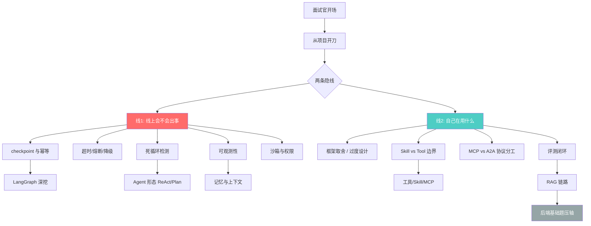
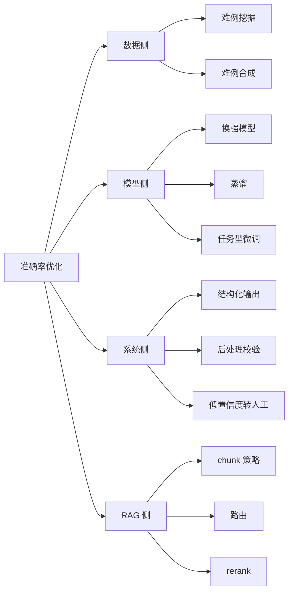
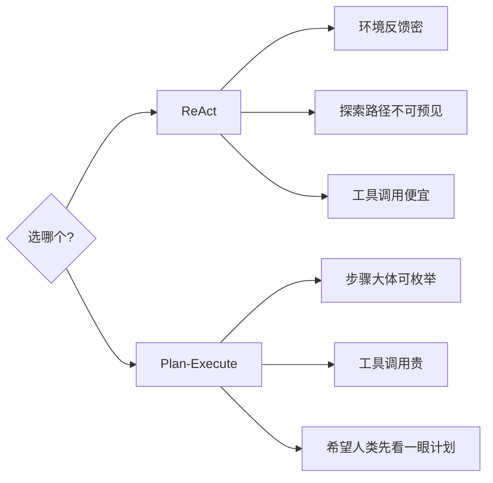
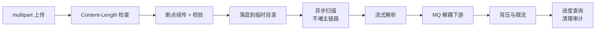

# AI Agent 面试题合集（TrustZone 版）

!!! quote "原文出处"
    **来源**：知乎专栏 — 《Ai Agent 面试记录》
    **作者**：[@TrustZone](https://www.zhihu.com/people/TrustZone)（海思技术员工，176 赞同）
    **链接**：<https://zhuanlan.zhihu.com/p/2034667289245636223>
    **读于**：2026-05-15

> **一句话定位**：Agent 岗面试官的注意力始终在**两条隐线**上来回晃 ——「这东西在线上会不会出事」 和 「你知不知道自己在用什么、没用上什么」。会了这两条线，多数题都能展开。

---

## 🎯 这篇为什么值得收藏

市面上的"Agent 面试 100 题"绝大部分是**名词清单**：什么是 ReAct、什么是 RAG、向量库选型对比……背完上场反而显得空。

TrustZone 这篇不一样——它是**真实多场面谈的复盘**，而且作者刻意把题串成两条隐线：

- **线 1：线上会不会出事** —— checkpoint、幂等、超时、降级、可观测性、循环检测
- **线 2：你知不知道自己在用什么** —— 框架取舍、为什么不用 Cursor、是不是过度设计、Skill 化的边界

**这两条线就是 Agent 岗位面试的「真考察轴」**。把任何一道八股题往这两条线上挂，回答立刻就有结构。

---

## 🧩 它本质上是什么？

!!! tip "核心判断"
    **这是 Agent 岗的「面试官提问思路图」，不是题库。**
    背单题没用——Agent 这个赛道半年前还在问 LangChain，现在主要问 MCP / Skill / Memory。**单题会过时，提问思路不会**。

把作者整篇文章按问题域拆开重组后，是这张图：

下面按这张图把作者的整理重新组织一遍。

---

## 1️⃣ 从项目讲起：先别急着报框架名 { #project-storytelling }

::: tip 面试官真正在测的
**不是技术选型朗诵，是一条画得出来的因果链。**
:::

### 三个最常被追问的问题

| 题面 | 表层 | 隐线 | 加分答法 |
|---|---|---|---|
| 「为什么用 LangGraph、有什么缺点、是不是过度设计」 | 框架对比 | **取舍** | 拆解：图框架价值 = 把分支+状态+人机协同从业务代码抽出去；checkpoint/interrupt 真用上才划算；若退化成线性三步就是过度设计 |
| 「为什么不直接用 Cursor / 公司现成 agent」 | 抬杠 | **边界与主权** | 数据路径可控、工具与权限模型对齐内部、评测指标对齐业务、回滚不绑外部发版 |
| 「基于现成方案改造怎么讲？」 | 落地经验 | **工程化能力** | 拆四层：协议层 / 资产层 / 运行层 / 组织层；说一句"别 fork 到死，先 adapter 再接" |

### 「Skill 化」与「演进价值」联问

作者的关键判断很硬：

> **Skill 化不是把 markdown 换个名字，而是把「高频任务的打法」变成可版本、可组合、可测的资产。**

演进价值要落到具体可量化的成本/收益：

- 新数据源接进来要改几处？
- 线上 bad case 有没有入库闭环？
- 新人接手要不要读 5000 行 prompt？

::: warning 我的批注
这一段是全文最反"八股"的部分。一般候选人答 Skill 化会立刻往 Anthropic Claude Code Skills 这个名词上挂，但作者把它拽回到**资产化**——版本、组合、测试、回归用例。**这才是工程化的本质**：让一个东西从"某个人脑里的隐性知识"变成"团队可继承的显性资产"。
:::

### 评测、数据集、沙箱、监控四件套

面试官想听**闭环**，不是名词表：

- **离线集**：分层（简单/长尾/对抗）、谁标的、有没有泄漏到训练
- **在线指标**：成功率 + 延迟 + token + 工具错误率 + **人工抽检比例和抽样策略**
- **沙箱**：隔离了什么——网络？文件系统？进程？整个容器？
- **监控**：trace id、节点级耗时、**失败重放**能不能做

### 准确率优化的四象限

如果只答"调 prompt"会显得薄。完整答法是四个层面：

---

## 2️⃣ LangGraph：checkpoint 不是「存档」 { #langgraph }

::: tip 核心判断
**checkpoint 是「可重放的状态机快照」，interrupt 是「人机协同的挂起点」。**
背"序列化进数据库"远远不够。
:::

### Interrupt 的语义到底是什么

不是"暂停"，是 **「挂起 + 移交决策权」**：

> 图跑到某个节点发现缺信息、或需要审批，把当前已提交的状态和尚未完成的副作用边界交代清楚。

### 恢复（resume）时必答清单

- 哪些 channel 的值被写入了 checkpoint？
- pending 的边在 resume 时**会不会重跑**？
- 外部副作用（发邮件、扣款）有没有**幂等键**？

### thread_id 设计陷阱

作者的处理方式很值得抄：

| 维度 | 编排用的会话 id | 领域里的订单号 |
|---|---|---|
| 角色 | 给图框架用 | 进 state 字段 |
| 持久性 | 跟图生命周期 | 跟业务生命周期 |
| 恢复幂等 | 不直接用它 | **用业务键做幂等** |

> ⚠️ **反模式**：把领域模型和框架状态糊在一个 giant dict 里。

### Reducer 不是语法糖

节点之间传复杂数据，**表面是 TypedDict / Pydantic 一路堆字段**，实质是状态演化策略：

- 哪些字段是 **append-only**
- 哪些要 **merge**
- 哪些要在某条边之后**清空**

> **LangGraph 的 reducer 在约束「并发写同一字段时语义是什么」**。如果团队里没人写这份约定，半年以后图一定变成谁也不敢动的黑箱。

### checkpoint 膨胀：图内 state vs 外置记忆划界

| 进 checkpoint | 进外置存储 |
|---|---|
| 当前任务推进必需 | 跨会话用户偏好 |
| 最近几轮对话 | 海量历史 |
| 未完成的工具结果 | 可检索知识 |
| 路由需要的标志位 | —— |

工程上还要谈：**TTL · 里程碑裁剪 · 敏感字段脱敏 · 多租户命名空间** —— 说出来对方就知道你考虑过线上跑一年之后会发生什么。

### A2A 怎么答（如果被问到）

不必装做过分布式 agent。**降维成「多进程协作里协议与超时」**：

- 子图或节点 = 另一个 agent
- 外层负责：信封格式、correlation id、超时、幂等
- 或者用消息总线解耦，图只管本地编排

> **关键不是炫架构名词，而是消息 schema、失败语义、重试会不会重复扣费。**

---

## 3️⃣ 上下文与记忆：难的不是「记住」，是「记对」和「别记爆」 { #memory }

::: tip 核心判断
**长对话系统的问题，表面是窗口不够长，底层经常是「注意力分配」与「事实一致性」一起崩。**
:::

### 滚动摘要的事实漂移陷阱

作者点出了一个最容易被漏掉的坑：

> **摘要不是无损压缩，滚动摘要会带来事实漂移**——后面轮次模型以为用户同意的是 A，其实用户早期说的是 B 的否定形式。

防御方案：

1. 长期记忆**写入前**要有触发与校验
2. 读出时要有**时间戳或置信度**
3. 必要时让模型**显式引用记忆条目**而不是自由发挥

### 长短期记忆怎么分

不要停留在定义。作者的判别标准很操作化：

- **短期**：仍在当前任务闭环内的、且尚未被结构化吸收的多模态往返
- **长期**：跨 session 仍应成立的用户偏好、结论、可检索知识

### 写入策略：别"每轮都存"

|   | 反模式 | 推荐做法 |
|---|---|---|
| 写入触发 | 默认每轮都存 | 显式指令 + 对话结束事件 + 实体抽取置信度阈值 |
| 读取策略 | 简单近邻检索 | query 改写 + metadata 过滤 |
| 后果（反模式） | 向量库里全是噪声 | 检索把八百年前的闲聊拉回来 |

### 哪些能删哪些不能删

**没有银弹，但有可操作的启发式**：

| 别动 | 可裁 |
|---|---|
| 未完成任务状态 | 寒暄 |
| 用户硬约束 | 重复表述 |
| 尚未写进摘要的工具原始返回 | 已被摘要覆盖的细节 |

> **规则 + 小模型辅助 + 业务白名单**，听起来土，线上比"全靠大模型自己决定删什么"稳。

### 还能再深一层的话题

- **上下文路由**：不同子任务用不同窗口
- **外置真相源**：以数据库为准，不以对话为准
- **小模型专责压缩**：主模型只消费压缩产物

---

## 4️⃣ Agent 形态：ReAct 与 Plan-Execute 差的不只是「先想再做」 { #agent-shapes }

### ReAct 循环防失控的全套手段

「最大步数」只是入门答法。**深一点想：这是部分可观测环境里做决策的过程**。完整工具箱：

| 维度 | 限制方式 |
|---|---|
| 步数 | max_steps（典型 15） |
| token | 单任务预算上限 |
| 时间 | wall-clock 超时（典型 2-5 分钟） |
| 重复 | 同工具同参连续 N 次检测 |
| 语义 | 「连续空转」检测（参数不同但意图一致） |

稳定性除了 schema 严格、解析失败重试，还可以谈 **观测性**：每一步的输入输出能否结构化日志、能否离线重放——**这对线上排障比"我 prompt 写得很严"有用**。

### ReAct vs Plan-Execute：用「成本与可修正性」框架来讲

::: warning 我的批注
作者用「**环境反馈密集度** × **路径可预见性** × **工具单次成本**」三个维度来挑选范式，比"哪个框架先进"层次高得多。**这是面试场上最容易拿分的回答方式**——不站队，给出选择函数。
:::

### Plan 错了谁负责

不能空谈"重规划"。要落到执行细节：

- **计划阶段就人机确认**（适合高代价操作）
- **执行阶段允许局部重规划**（适合中等不确定性）
- 解析失败那刀也要接：tool call JSON 坏了，是**自纠一轮**还是**模板化重问**？

### 多智能体架构：缺点要会讲

光堆名词（supervisor / 流水线 / 对等协作）不够，**会讲缺点才显得做过**：

- 调试地狱
- 责任边界模糊
- 消息风暴

### 让 agent「越用越聪明」别往玄学走

具体到可落地的四件事：

1. **bad case 入库**
2. **策略从轨迹里蒸馏**
3. **工具文档迭代**
4. **评测驱动发布**

> **没有数据闭环，"聪明"没有落脚点。**

### Harness 工程的实质

不是"有个测试脚本"，是**可复现实验台**：

- 环境镜像
- 依赖 pin
- 数据集版本
- 评分器定义
- 并发与超时
- 对抗与长尾用例

### Benchmark 怎么提

| Benchmark | 测的是 |
|---|---|
| SWE-bench | 真实代码仓库的 issue 修复 |
| GAIA | 通用助手任务 |
| AgentBench | 多场景 agent 综合 |
| τ-bench | 客服类对话 agent |

> **挑一两个说清适用域**比报菜名强。CC 类产品（Claude Code 等）公开架构有限，用「模型层 + 工具路由 + 上下文与产品层」这种粗粒度描述反而安全，**别装内部人士**。

---

## 5️⃣ 工具 / Skill / MCP：「能力」还是「契约」 { #tools-skills-mcp }

### 工具失败的语义层答法

往深里说是 **错误语义与重试风暴**：

| 问题 | 浅层答法 | 深层答法 |
|---|---|---|
| 超时多长 | "30秒" | 取决于下游 p99 和你的 SLA |
| 重试 | "3次" | 带 jitter；写路径要么幂等键要么人工介入 |
| 错误信息回模型 | "全文返回" | **裁剪**（含 PII / 堆栈泄漏风险） |
| 循环检测 | 同参同结果 | 还要谈"**语义重复**"——模型用不同措辞刷同一个读接口 |

### 一百个 tool 的设计

::: tip 核心判断
**核心是「发现与加载」，不是"塞 schema 到上下文"。**
:::

四种解法可以并用：

1. **分层** —— 先选大类，再选具体工具
2. **meta-tool 列目录** —— 让 LLM 主动查工具清单
3. **检索式 tool selection** —— 按 query 召回相关工具
4. **按租户裁剪可见工具集** —— 和后端 RBAC 是同一类问题

并行与顺序：

- 无依赖 → `asyncio.gather`
- 有依赖 → 拓扑排序
- **planner 显式产出 DAG** 比全靠模型隐式排序稳

### Skill / Tool / MCP 的边界

作者给了一个非常清晰的三轴定义：

| 概念 | 本质 |
|---|---|
| **Tool** | 可调用的原子能力 |
| **Skill** | 可版本的「工作方式说明」+ 少量入口工具 |
| **MCP** | 宿主与能力之间的**传输与描述契约** |

> **MCP 的两种部署模式**：stdio 适合本地紧耦合，HTTP/SSE 适合远程服务化。

::: warning 我的批注
**这一段我建议背熟**——它是当前 Agent 工程里最容易混淆的三个概念，能讲清楚就能 pin 住。
作者最后那句尤其精辟：
> **「没有 tool 的 skill 是文档，没有 skill 约束的一百个 tool 是灾难。」**
:::

---

## 6️⃣ RAG：从「能搜到」到「敢引用」 { #rag }

### 索引生命周期

「用什么库、多少数据」的潜台词是 **索引一致性**：

| 全量重建 | 增量 upsert |
|---|---|
| 简单 | 省时间 |
| 窗口期长 | 要处理删除、更新、embedding 升级后的**重嵌入** |

### 为什么不用普通数据库

不是不能，而是当**规模、延迟、混合检索需求**上来后，pgvector 这类扩展或专用向量索引更省事。本质是 **ANN + 倒排的组合战**，不是"向量神秘学"。

### 检索方式的取舍

| 方法 | 适合场景 |
|---|---|
| **Hybrid（向量 + BM25）** | 大多数文本域的默认合理答案 |
| **Multi-query** | 解决表述多样性 |
| **HyDE** | query 极短或极口语 |
| **Parent-child** | 小块精准 + 大块上下文 |

### Rerank 单独存在的理由

不只是成本问题。**核心矛盾**：

> 排序目标 vs 生成目标**不一致**。

- Cross-encoder 类 reranker 对候选列表做**细粒度交互**，比让生成模型在千级候选上"顺便排一下"更可控
- **tail latency 也好谈**
- "大模型排十条可以，排一千条是另一套经济账"

### 召回不到时的排查表

除了扩 query、降阈值，还要怀疑：

- **chunk 是否切在句中**
- **元数据是否丢**
- **域内词是否没进词表**
- Code-RAG 多提一句**符号级召回与结构感知**

### 引用与拒答（RAG 的进阶题）

- 检索块是否带 citations 给到生成？
- 模型胡说时**后处理能不能校验 span**？

---

## 7️⃣ 后端与基础：靠「链条」不是「定义」 { #backend }

### 大文件全链路（按时间讲）

优化：**别一次性读进内存** → sendfile → mmap → worker 池 — 已经够体面。

### HTTP 请求生命周期

把这条链串完：DNS 缓存 → TCP/TLS → 反向代理 → worker → ORM → 连接池。**状态码抓 401/403、502/504、408 讲清场景**。

### 流式响应

别只背 SSE 和 WS：

- chunked transfer-encoding
- nginx **proxy_buffering off**
- SSE 的 event 格式和**注释心跳**

> 能说到这一层，对方能判断你是不是只调过高层封装。

### 装饰器与迭代器

- **装饰器** = 横切关注点
- **迭代器** = 惰性消费

`*args / **kwargs` 题里常见的 args 笔误，**顺手纠正成 \*\*kwargs**。

### C/C++ vs Python

**预处理 → 编译 → 链接** vs **解释 → 字节码**，够用了。

---

## 🤔 我的几点判断

!!! abstract "TL;DR"
    1. **这篇值得每三个月重读一次**——Agent 赛道的题目变得快，但作者那两条隐线（线上会不会出事 / 你在用什么）至少能稳两年。
    2. **「闭环」是高频词** —— 评测闭环、bad case 入库闭环、策略蒸馏闭环。**有闭环就显得做过，没闭环就显得只在玩 demo**。
    3. **Skill / Tool / MCP 的三轴定义**是当前最值钱的一段——背下来下次面试碰到立刻用。
    4. **后端基础题轻松不掉链子**才是现在 Agent 岗的隐性门槛——JD 里夹一两条后端要求、简历偏 agent 的情况越来越多。

### 这篇文章不太涉及的（我会自己补）

- ❌ **Eval 框架的具体选型**（lm-eval-harness / DeepEval / Promptfoo）
- ❌ **Token 经济账**（成本结构 / KV cache / prompt caching 优化）
- ❌ **Prompt Injection 的具体防御** —— 作者只点到为止，第二篇《字节二面：Agent 高可用》补了一部分
- ❌ **GEPA / DSPy 这类 Prompt 自动优化** —— 还没成为面试常考点

---

## 🔗 延伸阅读

- [字节二面：Agent 服务的高可用与稳健性](agent-service-reliability.md) —— 把"线上会不会出事"那条线打满的标杆答案
- [TrustZone 知乎主页](https://www.zhihu.com/people/TrustZone) —— 作者其他文章
- [LangGraph 官方文档：checkpoint](https://langchain-ai.github.io/langgraph/concepts/persistence/) —— 把"可重放状态机快照"讲透
- [MCP 官方协议](https://modelcontextprotocol.io/) —— 文中说的"宿主与能力的传输契约"

---

*这是 garden 「💼 面试题集」的第 1 篇。*
