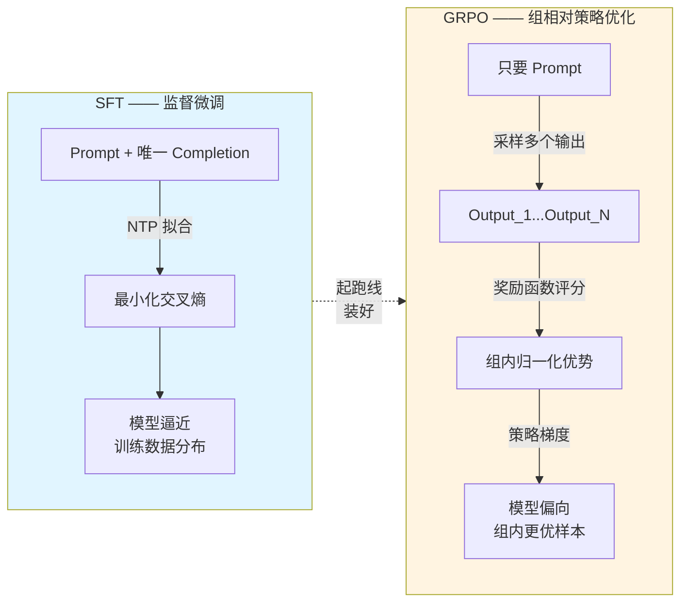
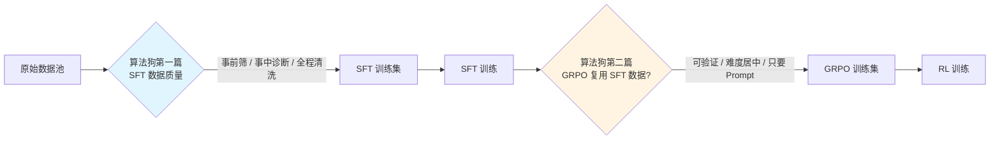

# 淘天面试：GRPO 的训练数据能不能直接复用 SFT 的？

!!! quote "原文出处"
    **来源**：公众号《算法狗》—《淘天面试官追问："GRPO 的训练数据能不能直接复用 SFT 的？" 我自信点头，他追问："那假如 SFT 数据里有开放式写作，你拿什么当奖励信号？"》
    **作者 / 公众号**：算法狗
    **原文链接**：<https://mp.weixin.qq.com/s/L2tS_Zs6rHRdArqakHC6fg>
    **读于**：2026-06-06

> **一句话定位**：**数据可以同源，用法必须不同。** SFT 是给模型装起跑线，GRPO 是告诉它往哪个方向跑——赛道本就不同。这道题真正在测的不是"GRPO 的 G 是什么"，是**有没有真在生产里跑过 RL 后训练**。

---

## 🎯 这篇为什么值得收藏

这是 garden 里**第二篇出自《算法狗》的面试题**（第一篇是 [字节二面 SFT 数据质量](sft-data-quality-system.md)），同一位作者两道题正好把后训练的两个核心环节讲完了：**SFT 怎么挑数据 → GRPO 怎么用数据**。

前一篇拷打的是 **SFT 阶段** 的数据质量判断（事前 / 事中 / 全程清洗），这篇拷打的是 **RL 阶段**——同一批 Prompt，凭什么 SFT 能用 GRPO 就不能直接用？

读完这篇你应该能在面试间里**主动**说出：

- ✅ **一句话总结**："数据可以同源，用法必须不同"——这句先抛出来，剩下的全是论证
- ✅ **本质差异**：SFT = NTP（Next Token Prediction）拟合分布；GRPO = 组内相对优势更新策略，PPO 变体去掉 Critic
- ✅ **三重约束**：可验证性（前提）、难度居中（效率）、只要 Prompt（结构性差异）
- ✅ **DeepSeek-R1 的实证**：RL 阶段问题集**就是** SFT 阶段的子集——印证"数据同源"在技术上没障碍
- ✅ **三个延伸坑**：开放式任务奖励信号噪声 / 过度 SFT 抑制 RL 探索 / 小模型只用低难度数据反而 step 减半

---

## 🧩 这道题真正在测什么？

!!! tip "核心判断"
    面试官的真实意图，**不是问你 GRPO 是什么算法**，是问你**有没有把 SFT 和 RL 两个训练阶段的"数据使用方式"分开想过**。能脱口而出"技术上可以"是入门档；接下来追问"那开放式写作怎么办"才是淘汰档。

把面试官的隐藏评分卡画出来：

| 候选人答什么 | 真实潜台词 |
|---|---|
| "可以啊，数据格式都差不多" | **没意识到二者有本质差异**——直接淘汰档 |
| "技术上可以，把 SFT 的 Prompt 抽出来配奖励函数就行" | 知道接口能对上，但**不知道为什么不该这么做**（中位档） |
| "可以但不建议，GRPO 需要可验证奖励、难度居中、只要 Prompt" | **真在生产跑过** —— 进入 offer 区间 |
| "...还能补一句 DeepSeek-R1 的 RL 问题集是 SFT 子集，过度 SFT 还会抑制 RL 探索" | **跑过 + 读过文献 + 看过工程报告** —— 一面给过的那种 |

最低档的"格式都差不多"为什么是淘汰答案？因为它把 SFT 和 RL 当成**同一个流程的两次跑**，但实际上这两个阶段在**优化目标、数据角色、采样方式**三个层面都不同。把它们按"格式对不对"等价起来，等于说"PPO 和监督学习就是 batch_size 不一样"——面试官立刻就知道你没自己跑过。

---

## 🏗️ SFT vs GRPO：本质差异在哪一层



| 维度 { #core-diff } | SFT | GRPO |
|---|---|---|
| **底层机制** | NTP（Next Token Prediction） | 组内相对策略梯度（PPO 变体） |
| **数据形态** | (Prompt, Completion) 配对 | 只要 Prompt，Completion 自采样 |
| **训练信号** | "正确答案是什么" | "你自己生成的这些里，哪个更好" |
| **反馈来源** | 标注好的标签 | 奖励函数（可执行 / 可验证） |
| **Critic 模型** | 不需要 | PPO 需要，**GRPO 去掉了**（核心改进） |
| **优点** | 稳定、可控、好调 | 显存省、能突破训练数据上限 |
| **致命弱点** | 上限被数据本身锁死 | 任务必须可验证，否则信号全是噪声 |

这张表里**最关键的一行是"训练信号"**——SFT 给的是"绝对答案"，GRPO 给的是"组内相对位置"。这一行决定了下面所有约束。

---

## 🔧 GRPO 对数据的三重约束 { #three-constraints }

这是答这道题的**主轴**。东一句"要可验证"西一句"要分布合理"是中位档；按这三层讲清楚才是 offer 档。

### 第一重：可验证性 —— 这是**前提条件**

GRPO 依赖奖励函数区分输出好坏。所以 DeepSeek 把 GRPO 主要用在**数学推理**和**代码生成**——这两类任务有天然的二元验证：

- 数学：答案对即对、错即错
- 代码：能跑就是能跑、报错就是报错

那 SFT 数据里的**开放式写作怎么办？**

!!! warning "原文里这一段是真考人"
    面试官追问的就是这个：「假如 SFT 数据里有开放式写作（写诗、创意写作、通用指令跟随），你拿什么当奖励信号？」
    
    **正确回答**：开放式任务**没有客观评估标准**。即便引入通用奖励模型，这类模型的评分**往往与输出长度高度相关**，而不是真正反映质量。结果就是 GRPO 学会**投机取巧**——比如用正确格式包裹一个错误答案、或生成能通过测试但实际是硬编码的代码。
    
    **所以答案是**：开放式数据**不该走 GRPO**，要么留在 SFT 阶段、要么走 RLHF/DPO（用偏好对而非二元奖励）。

### 第二重：难度居中 —— 这是**效率问题**

GRPO 隐性地要求训练样本难度合理。从机制推一下就明白：

- **题目太简单**：模型采样所有输出都接近满分 → 组内优势趋近零 → **没学习信号**
- **题目太难**：所有输出都错 → 奖励一致 → **同样没学习信号**

最有价值的训练样本是**模型有时对、有时错**的中等难度题（通过率既不是 0 也不是 1）。

实际落地怎么做：

```python
# 业内常见的难度过滤伪代码
for prompt in candidate_prompts:
    pass_rate = estimate_pass_rate(prompt, model, n_samples=8)
    if 0.2 < pass_rate < 0.8:  # 中等难度区间
        keep(prompt)
    # 配合 N-gram 和向量相似度过滤保多样性
```

> **反直觉的发现**：对小模型（0.5B–3B），有研究证明**只用低难度数据训练 GRPO**，效果与全量难度持平，而且**只需要约 45% 的训练步数**。
> 
> 这说明"难度越高越好"是错的——GRPO 数据策略**得结合基础模型的实际能力**来定。

### 第三重：只要 Prompt —— 这是**结构性差异**

```text
SFT 数据：(Prompt, Completion) 完整配对
         ↑
         人工标注成本主要在"写出高质量答案"

GRPO 数据：(Prompt,) 只要这个
         ↑
         Completion 由模型自己采样生成
         Ground Truth 答案的用途是构建奖励函数，而不是直接喂给模型
         成本主要在"设计可靠的验证逻辑"
```

这个区别**不是格式上的小差异**，它影响整套数据处理流程：

| { #cost-shift } | SFT 工程师 | GRPO 工程师 |
|---|---|---|
| 主要时间花在 | 找 / 写 / 标注高质量 Completion | 设计奖励函数 + 通过率筛选 |
| 主要技能 | 领域专家 + 标注质量控制 | 工程实现（沙箱、单测、验证器） |
| 数据可复用性 | 高（人工标注的答案能跨阶段用） | 低（奖励函数和场景强绑定） |

---

## ✅ 为什么说"可以用一样的数据"——但不该直接用 { #same-data-different-use }

从工程实现角度，**把 SFT 数据的 Prompt 抽出来 + 配自定义奖励函数 = 能直接跑 GRPO**。这没毛病。

DeepSeek-R1 的训练过程也印证了这点：他们 RL 阶段的问题集**就是指令微调阶段问题集的子集**——两个阶段底层数据来源是有重叠的。

但"能用"不等于"该直接用"：

!!! abstract "同源数据进入 GRPO 之前必须做的三件事"
    1. **只保留可验证的任务** —— 把 SFT 里的开放式写作、主观对话筛掉
    2. **剔除通过率两极化样本** —— 太简单和太难的都丢
    3. **专门设计奖励函数** —— 不是拿 Completion 当标签，而是把 Completion 作为构建验证逻辑的参考

换句话说：**原始数据可以共享，但对应的数据工程需要重做一遍**。

这呼应了 GRPO 在算法生态里的定位：

```text
SFT  ──→  建立"格式 + 指令跟随"基础能力
            │
            ↓
GRPO ──→  在此基础上对特定规则做二次优化
```

**两者是接力关系，不是替代关系。** 把 GRPO 当成"另一个 SFT"——数据照搬、流程照抄——本质上就是把一个用于"探索与比较"的算法硬塞进了"模仿"的框架，既没发挥优势，还可能因无效信号浪费算力。

---

## ⚠️ 三个容易翻车的延伸坑 { #pitfalls }

### 坑 1：开放式任务硬塞 GRPO，模型学会作弊

前面提过的"格式正确但内容错"、"硬编码通过测试"。这不是模型 bug 是奖励函数的设计 bug——任务不可验证就别上 GRPO。

### 坑 2：过度 SFT 反而拖累后续 RL

研究发现：**SFT 训练轮数过多时，模型在 RL 阶段的探索能力会被明显抑制**——采样多样性下降，GRPO 性能提升甚至**低于适度 SFT 的基线**。

这意味着 SFT 和 GRPO 之间不光是"数据接力"，更是一种**需要动态平衡的协同关系**。SFT 阶段把模型"压"得太死，留给 GRPO 探索的空间就没了。

### 坑 3：CoT 长度增长让 GRPO 偏袒短输出

DAPO 这篇工作出来就是在解这个问题——**当 CoT 输出变长时，GRPO 序列级损失归一化会悄悄偏袒短输出**（越长越吃亏），训练稳定性下降。

> 这说明 GRPO 自身也不是终点。RL 后训练领域工程问题的解法，**最终都指向更精细的数据设计**，而不是单纯堆算力。

---

## 🤔 我的几点判断

!!! abstract "TL;DR"
    1. **这道题表面问 GRPO，实际在测"训练流程理解"**——能不能把"数据 / 优化目标 / 采样方式"三个层次分开讲。
    2. **答这道题的最优结构是"一句话总结 → 三重约束 → DeepSeek 实证 → 延伸坑"**——主轴清楚，比堆名词强十倍。
    3. **如果让我自己跑**：原始 Prompt 共享没问题，但**奖励函数和难度筛选必须从零搭**——这两件事是 RL 工程师的真核心活儿。

### 这篇和前一篇《字节二面 SFT 数据质量》合起来的意义

把两篇合在一起读：



**两篇连起来**：第一篇告诉你 **SFT 数据怎么挑**（事前 / 事中 / 全程），这一篇告诉你 **同一批数据进入 RL 阶段要做什么不同处理**（三重约束）。算法狗这位作者把后训练这条流水线讲得**特别工程**——不是论文综述、也不是名词解释，是面试间里能用的判断框架。

如果你下一场面试可能撞上 RL 后训练话题，**这两篇必须连着读**——同一个作者的同一套思维方式，扫盲效率最高。

### 一个值得提的反直觉信息

"小模型只用低难度数据训练 GRPO，效果持平且步数减半"——这个发现挺颠覆直觉的（传统观念是数据越难越值钱）。**说明 RL 训练的数据策略和模型能力强相关**，不存在万能模板。这也间接说明为什么大厂二面爱问这种细节——他们要的不是"知道 GRPO"，是"对自己模型有 sense"。

---

## 🔗 延伸阅读

### Garden 内的相关读文

- [字节二面：SFT 数据质量怎么判断的？](sft-data-quality-system.md) —— **同一作者《算法狗》的前一篇**，讲 SFT 阶段的数据质量判断体系。两篇合起来 = 后训练数据工程全景。
- [Agent 全景图：从 RAG 到 Multi-Agent](ai-agent-interview-tour.md) —— 应用层全景，理解 SFT/RL 在哪一层之上服务
- [字节高可用：Agent 服务怎么扛住流量](agent-service-reliability.md) —— 训练完之后的工程侧
- [向量库三连击：Milvus / 检索 / 编码](vector-db-milvus.md) —— 数据基建侧

### 跨分类延伸

- [Karpathy LLM 深度系列](../reading/karpathy-llm-deep-dive.md) —— 想从底层理解 NTP（SFT 的本质）和 RLHF 演化
- [Agent 评估与追踪](../reading/agent-evaluation-tracing.md) —— 训练完了怎么评，和 GRPO 的"奖励函数设计"形成对照

### 外部资料

- [DeepSeek-R1 论文](https://arxiv.org/abs/2501.12948) —— 印证 "RL 问题集是 SFT 子集" 的工程报告
- [DAPO: A Dynamic sAmpling Policy Optimization](https://arxiv.org/abs/2503.14476) —— 解 GRPO 长输出偏置的后续工作
- [GRPO 原始论文（DeepSeekMath）](https://arxiv.org/abs/2402.03300) —— 算法本身的细节

---

*这是 garden 里的第 5 篇面试题，也是《算法狗》系列的第 2 篇。如果哪天我去淘天面这个问题，希望我能脱口而出："数据可以同源，用法必须不同。"*
