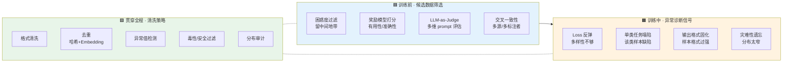
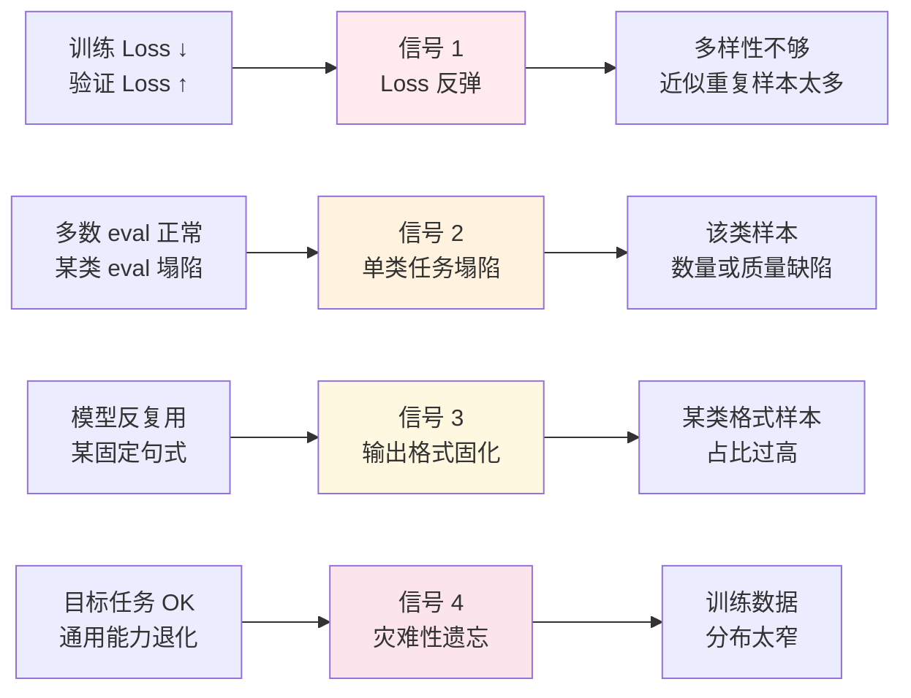
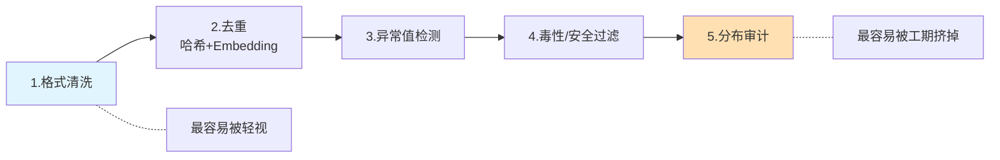

# 字节二面：你们做了那么多 SFT，数据质量怎么判断的？

!!! quote "原文出处"
    **来源**：公众号《算法狗》—《字节二面我反问面试官：你们做了那么多的 SFT，这个数据质量是怎么判断的，他好像很懂，他说了 5 分钟，但我感觉也没啥逻辑》
    **作者 / 公众号**：算法狗
    **原文链接**：<https://mp.weixin.qq.com/s/c6p84bM8bXnZvA6Jjn3WxQ>
    **读于**：2026-06-02

> **一句话定位**：这道题厉害在——**它能让面试官自己也讲砸**。"困惑度、奖励模型、LLM-as-Judge、交叉一致性"四个名词谁都背得出，但**怎么串成一套判断体系**，绝大多数人讲不清楚。原文里那位字节面试官讲了 5 分钟"东一句西一句"，本质就是缺一根主轴：**事前筛选 / 事中诊断 / 全程清洗**。

---

## 🎯 这篇为什么值得收藏

这是我 garden 里第四篇面试题（前三篇：[Agent 全景图](ai-agent-interview-tour.md) / [字节高可用](agent-service-reliability.md) / [向量库三连击](vector-db-milvus.md)），但**视角第一次换到了模型训练侧**。

前三篇都在测 **Agent 应用层 / RAG 存储层** 的工程经验，这篇往下挖到**模型微调层** —— 数据工程是 SFT 项目里最接近"成败的边界"的一段，也是大厂二面最爱反复拷打的一段。

读完这篇你应该能在面试间里**主动**说出：

- ✅ **三层主轴**：事前筛选、事中诊断、全程清洗（不再东一句西一句）
- ✅ **事前四工具**：困惑度过滤 / 奖励模型 / LLM-as-Judge / 交叉一致性 —— 各自的边界在哪
- ✅ **事中四信号**：Loss 反弹 / 单类任务塌陷 / 输出格式固化 / 灾难性遗忘 —— 怎么从信号反推到数据
- ✅ **清洗五步**：格式 → 去重 → 异常值 → 毒性 → 分布审计
- ✅ **一个反例**：OpenAI 60% 剧答数据 vs 5% 真实需求 —— 分布失控的代价

---

## 🧩 这道题真正在测什么？

!!! tip "核心判断"
    面试官的真实意图，**不是问你认不认识那几个方法名词**，是问你**有没有把它们拆开放在训练流程的不同位置上**。东一句西一句的人，脑子里只有一个名词袋；能讲清楚的人，脑子里有一张时间轴。

把面试官的隐藏评分卡画出来：

| 候选人答什么 | 真实潜台词 |
|---|---|
| "训练完看效果，效果好说明数据好" | **错位回答**——给的是结论而不是方法 |
| "用困惑度过滤一下" | 知道一个名词，停留在语料筛选层面 |
| "困惑度 + 奖励模型 + LLM-as-Judge" | 名词记得多，**但不知道这些方法各自的盲区**（评分卡上是中位档） |
| "事前筛 / 事中诊断 / 全程清洗，三层分开讲" | **真正在生产里跑过 SFT 项目** —— offer 信号 |
| "...还会主动做分布审计，OpenAI 那个 60% 剧答的反例就是这个" | **跑过 + 踩过坑 + 读过文献** —— 一面就给过的那种 |

最低档的"训练完再评估"为什么是错位答案？因为它回答的是**结果验证**，但题目问的是**事前事中的判断能力**。这两个能力是不同维度——前者人人都会（看 eval 分数），后者才是工程区分度。

---

## 🏗️ 整体骨架：把答案放在时间轴上

这张图就是你脑子里要搭起来的"主轴"——面试官问任何一个细节，你都知道它属于哪一层、和其他层是什么关系。**讲砸的人是名词袋，讲赢的人是时间轴。**

---

## 🟦 事前 · 四把筛子，各有盲区

候选数据动不动就是几万到几十万条，靠人眼是肯定不行的。原作者强调一个前提：**没有"放之四海皆准的单一指标"，可靠的方案是把四种方法叠加使用、互相印证**。这条话本身就是面试加分点——能说出"叠加印证"这四个字，已经超过 80% 只会列名词的候选人。

### 1. 困惑度过滤 —— 找"最近发展区"

做法：用目标模型或同系列基座模型，对每条数据的**回复部分**计算困惑度（Perplexity，PPL）。

| PPL 区间 | 含义 | 处理 |
|---|---|---|
| **极低** | 模型本来就能生成 → 几乎没新信息量 | 去掉 |
| **极高** | 与模型现有认知差距过大，要么数据有问题，要么超出能力边界 | 去掉 |
| **中等** | 模型能理解但还没完全掌握 → 学习效率最高 | **保留** |

中等区间被原文类比为 **"最近发展区"** —— 维果茨基心理学概念。这个类比有面试加分效果，能让面试官点头。

!!! example "HuggingFace SmolLM 的实战"
    HuggingFace 在训练 SmolLM 系列小模型时，**专门剔除了高难度数学数据**。逻辑：对小模型而言，PPL 过高的样本不是"有价值的挑战"，而是噪声输入——强行学习只会放大噪声。

    操作上，对所有候选数据批量算 PPL，绘制分布图，**去掉两端极值**。常见起点是去掉最低和最高各 10%。

**这把筛子的盲区**：PPL 只衡量统计意外程度，**不衡量有用性**。一段格式漂亮、语法通顺但事实错误的回复，PPL 可能很低——困惑度过滤会把它留下来。

### 2. 奖励模型打分 —— 比 PPL 更接近"人类直觉"

奖励模型（RM）评估的是**有用性、准确性、安全性、格式规范**等更实质的维度，比 PPL 更贴近人类对"好回复"的判断。

!!! note "Anthropic 的路径"
    Constitutional AI 和 RLHF 工作中，Anthropic 大量依赖奖励模型对回复质量做排序——这里用 RM 做事前筛选，是同一套底层逻辑的延伸。

**这把筛子的盲区**：RM 自己也是被训练出来的——**它的评分标准取决于自身训练数据**。如果 RM 是在某种特定风格上训练的，它会**系统性低估其他风格**的回复。所以 RM 适合做辅助筛选，不能作为唯一决策。

### 3. LLM-as-Judge —— 最灵活，也最容易被偏见污染

直接调用一个强大的语言模型，给它设计评估 prompt，让它从多维度（准确性 / 完整性 / 指令遵循 / 格式规范）打分。**场景特别在乎什么，prompt 里就重点强调什么。**

!!! warning "已知且稳定复现的偏见：长度偏见"
    LLM-as-Judge **倾向于给更长、更详细的回复打更高分**，即便简洁的回复完全正确。

    如果你的目标场景需要简洁输出（客服 / 摘要 / 工具 call），这种偏见会**系统性误导筛选**。

    应对：在评估 prompt 里**显式约束**——例如写入"简洁准确的回复应当得到高分"、"回复长度本身不作为质量指标"。

这是面试加分细节——能主动说出 LLM-as-Judge 的长度偏见，能让面试官认为你"真用过"而不是"听过"。

### 4. 交叉一致性检验 —— 多源时的杀手锏

对同一个问题，看多个标注者 / 多个生成模型的回复**是否高度一致**：

- 高度一致 → 这条数据可信度高
- 差异很大 → **要么问题本身有歧义，要么某个来源质量有问题**

!!! quote "OpenAI 微调最佳实践里的硬数据"
    "如果标注者之间的一致率只有 70%，那模型也不太可能突破这个上限。"

    交叉一致性检验本质上是**在量化这个一致率**，让问题在训练开始之前就暴露出来。

这条 OpenAI 经验值得背下来——一致率是天花板，是个有数字、有出处、能在面试间脱口而出的硬料。

### 四把筛子怎么组合？

| 数据特点 | 优先用哪把 |
|---|---|
| 来源单一，纯网络爬取或单一模型生成 | 困惑度过滤 + LLM-as-Judge |
| 来源多元（多人标注 / 多模型生成） | **交叉一致性优先** + 其他兜底 |
| 已经有训好的 RM（接 RLHF 项目） | 奖励模型打分主导 |
| 场景对格式 / 简洁度有强要求 | LLM-as-Judge + **显式 prompt 约束** |

!!! tip "我的批注：四把筛子的真正用法"
    **不是按顺序串行使用，是分头跑、再投票。** 困惑度负责"信息量维度"，RM 负责"人类偏好维度"，LLM-Judge 负责"任务定制维度"，交叉一致性负责"标注可靠性维度"——四个维度正交，**任何一把单独用都有盲区，叠加才能交叉印证**。

    面试时这句话比单纯列名词更值钱：**"这四个方法的关系是互补不是替代，每一个都有它擅长的维度和已知的盲区"** —— 直接拉开档次。

---

## 🟧 事中 · Loss 走势之外，三个常被忽略的信号

训练已经开始了。怎么从训练过程中的迹象，**反推出问题在数据上**？这是 SFT 数据工程里**最能拉开差距**的一段——大多数人只会看 Loss 曲线，看到反弹就 reduce epoch，根本不去想"是不是数据的锅"。

### 信号 1 · Loss 反弹 ≠ 训练轮数太多

经典的过拟合形态：**训练 Loss 持续下降，验证 Loss 开始反弹。**

普通做法：减少 epoch。但在 **SFT 语境**下，原作者明确指出——

!!! warning "误诊与正诊"
    **误诊**：把 Loss 反弹归咎于"epoch 太多"，调小 epoch。
    **正诊**：根因往往是**数据多样性不够**——模型在有限的数据模式上记住了答案，而不是提炼出泛化能力。

正确动作：**回去检查数据**，三个问题——

1. 某类问题是否占比过高？
2. 回复风格是否过于单一？
3. 数据集里是否混入了大量近似重复样本？

减少 epoch 只是治标，回去盘数据才是正路。

### 信号 2 · 单类任务塌陷 —— 定位最精准的信号

模型在大多数评估集上表现正常，**偏偏在某一类任务上持续拉胯**——这是定位最精准的一个信号。

!!! tip "实用诊断动作"
    **把评估集按任务类型分组，分别统计每组指标。** 哪组明显偏低，就回去检查训练数据里**对应类型样本的数量和质量**。

    这个动作的价值在于：把"模型不行"这种模糊判断，变成"代码生成数据缺陷"这种可执行修复路径。

### 信号 3 · 输出格式固化 —— 模型把"格式"当成了"内容"

微调后的模型开始**高频出现某些固定句式**：

- 每次回复都以"好的，让我来帮你分析"开头
- 某个特定表达模式反复出现
- 总用一种格式（编号列表 / 三段式 / 总分总）

这说明模型在这些样本上**过拟合**了。原因：**这类样本在数据集里出现频率过高**，或它们的格式特征太强烈，模型把格式本身误认为需要学习的核心模式。

### 信号 4 · 灾难性遗忘 —— 微调最容易翻车的地方

微调后的模型在目标任务上表现不错，**但通用能力明显退化**：

- 原本能流畅写代码的，微调后代码能力变差
- 原本数学推理还过得去，微调后明显走样
- 原本中文流畅，专项微调后开始夹生

根源**不是训练时间太长**，而是**训练数据的分布太窄**——SFT 数据全集中在某一类任务上，模型把注意力资源几乎全部倾斜到这里，其他能力被逐步挤占。

!!! example "HuggingFace SmolTalk 的反遗忘机制"
    HuggingFace 在构建 SmolTalk 数据集时，**专门混入了 10 万条 Open Hermes 通用数据**，目的正是对抗这种遗忘效应，维持通用基准测试的基线水平。

    Meta 在 LLaMA 系列微调实践中也有类似处理——**在专项数据之外保留一定比例的通用对话数据**，以维持基础能力的稳健性。

    这不是"凑配额"，**是必要的能力保底机制**。

!!! tip "我的批注：四个信号的真正力量"
    把这四个信号背下来，比记住"Loss 走势"管用得多。它们的**共性**：每一个都从一个**表象**（loss / eval / 输出 / 通用能力）反推到一个**数据层根因**（多样性 / 单类缺陷 / 格式占比 / 分布宽度）。

    面试时如果对方追问"训练遇到 Loss 反弹你怎么办"，最差的答案是"减少 epoch"，最好的答案是 **"我会先确认是 epoch 问题还是数据多样性问题——SFT 里 Loss 反弹常见根因不是过训，而是近似样本太多导致的伪记忆。我会跑一次去重审计和样本分布检查再决定动哪边。"**

---

## 🟩 全程 · 五步清洗，最容易被工期挤掉的是最后一步

清洗不是一次性任务，是**贯穿数据准备、训练过程、上线运营全周期**的持续工程。原文给了五步：

### 1. 格式清洗 —— 最容易被轻视

检查每条数据的格式是否满足规范：系统提示词是否存在且格式一致、角色标记是否正确、特殊 token 是否完整、回复是否有正常的结束标记。

!!! tip "数据多源时尤其重要"
    不同来源的格式规范往往不统一，拼合之后会出现各种**隐性问题**——某些样本缺 `<|im_end|>`、某些 system prompt 多了空格、某些角色标记被截断。

    **写一个自动化检查脚本遍历全部数据，把不合格样本标记出来——这个脚本的投入产出比极高，值得花时间做扎实。**

### 2. 去重 —— Google Gemini 的硬经验

!!! quote "Google Gemini 微调最佳实践"
    重复样本会引导模型走向**记忆化**，损害泛化能力，还浪费计算资源。

去重分两个层面：

| 类型 | 方法 | 阈值参考 |
|---|---|---|
| **精确去重** | 哈希（MD5 / SHA1） | 完全一致即删 |
| **模糊去重** | Embedding 相似度 / 编辑距离 | **>0.9 人工审查；>0.95 直接去重** |

模糊去重的阈值通常没有固定答案，**实用做法**：先计算全量样本对的相似度分布，找到分布曲线上的自然分界点。

### 3. 异常值检测 —— 不一定都删，但要标记

要筛查的目标：

- 回复特别短（只有几个 token）
- 特别长（远超平均长度）
- 回复语言与问题不匹配
- 回复内容与问题完全无关

!!! note "极短不一定是异常"
    判断题的"是 / 否"是合理的极短回复。但如果一条数据回复只有"好的"两个字，**大概率是标注质量问题**——留在数据集里会拉低整体水准。

    **关键差别**：异常值不一定都要删，**但至少需要标记后人工审查**。

### 4. 毒性和安全过滤 —— 早过滤的代价远小于后补救

数据源包含网络数据或用户交互日志时**绝对不能省**。用开源毒性分类器过滤掉：

- 有害内容
- 偏见表达
- 个人隐私信息

!!! warning "源头过滤 vs 后补救的代价"
    有毒数据让模型习得不期望的行为模式，**这类影响往往很难通过后续 RLHF 或对齐微调彻底纠正**。

    **先污染后补救的代价远大于源头过滤。**

### 5. 分布审计 —— 工期压力下最容易被跳过的一步

!!! danger "原作者的核心论断"
    在实际工程中，**最容易被忽视的往往不是某条数据有没有质量问题，而是数据集整体的分布是否健康**。

    单条数据质量是必要条件，但"数据集作为一个系统"在**格式一致性 / 分布合理性 / 多样性 / 纯净度** 四个维度上是否达标，**才是决定最终效果的充分条件**。

    分布审计这一步，**恰恰是最容易在工期压力下被跳过的一步**。

要审计什么：

- 任务类型分布是否合理？
- 回复长度分布是否符合预期？
- 难度梯度是否健康？
- 是否存在某类数据占比严重偏高 / 偏低？

### OpenAI 60% 剧答的反例 —— 一个值得背下来的故事

!!! example "OpenAI 微调实践里的一个真实案例"
    **训练数据**里 60% 是"剧答"（戏剧化、详细展开式回复）。
    **生产环境**中只有 5% 的请求真正需要这种风格。

    分布的严重偏差直接导致模型**过度倾向"剧答"**，在不该展开的地方反复展开。

    教训不在于"某类数据不该有"，**而在于分布失控会让模型形成「错误的默认行为」**。

这个案例值得背下来——它把"分布审计为什么重要"从抽象原则变成了具体故事。**面试间里能讲出来一个有出处、有数字、有教训的故事，胜过 5 分钟的概念讲述**。

---

## 🎤 面试间里的标准答法 —— 90 秒讲完不慌

把整套体系**浓缩到 90 秒**，结构如下：

!!! abstract "推荐回答模板"
    "这个问题我会分三层讲——**事前、事中、全程**，因为各自要解决的问题不一样。

    **事前**主要是从候选数据里筛掉低价值和高风险的——常用四个工具叠加：困惑度过滤留中间地带、奖励模型打分贴近人类偏好、LLM-as-Judge 做多维定制评分（这里要注意它有长度偏见）、交叉一致性在多源数据时尤其有用。这四个**互相印证而不是替代**，每个都有自己的盲区。

    **事中**是训练已经开始之后，从迹象反推到数据问题——**Loss 反弹**别急着调 epoch，往往是多样性不够；**单类任务塌陷**说明对应类型样本有缺陷；**输出格式固化**说明某类样本占比过高；**通用能力退化**是分布太窄导致的灾难性遗忘——HuggingFace SmolTalk 专门混 10 万条 Open Hermes 通用数据就是为了对抗这个。

    **全程**是清洗五步——格式清洗 / 去重 / 异常值 / 毒性 / 分布审计。前四步基本是工程套路，**最容易被工期压力挤掉的是分布审计**——OpenAI 那个 60% 剧答 vs 5% 真实需求的案例就是分布失控的教训。

    我的总判断：单条数据的质量是必要条件，**'数据集作为一个系统'的分布健康度才是充分条件**。"

这套答法的优势：

- ✅ **有主轴**（事前 / 事中 / 全程）—— 不会东一句西一句
- ✅ **有具体方法**（4+4+5）—— 不是空谈
- ✅ **有外部 anchor**（HuggingFace / OpenAI / Google）—— 显示读过文献
- ✅ **有自己的判断**（必要 vs 充分）—— 显示真在思考，不是搬运

---

## 💡 我的判断：这道题为什么是"分水岭题"

读完这篇，我的看法是——**这道题在大厂二面/三面里出现频率会越来越高**，原因很现实：

1. **大模型应用层的工程难度正在被工具链抹平**。RAG 框架、Agent 框架、prompt 调优工具，**应用层正在快速变成"接框架"的活**——从面试角度，这一层的区分度在下降。

2. **数据工程是少数还没被工具化的硬骨头**。困惑度过滤、奖励模型、LLM-as-Judge 这些方法**没有一个"开箱即用"的端到端工具**——每一项都需要工程师根据自己的模型、任务、预算去校准。**这是真正能区分"读过 paper"和"做过项目"的领域。**

3. **SFT 数据质量直接决定模型上限**。下游 RLHF、DPO、对齐，无论怎么调都纠正不了 SFT 阶段引入的系统性问题——所以**事前事中的判断能力，是真金白银**。这一点在原文最后一段被点透：**"先污染后补救的代价远大于源头过滤"**。

4. **它能反过来淘汰面试官**。原文那位字节面试官讲了 5 分钟"东一句西一句"——这道题对**面试官自己**的要求其实也不低。能把这道题问明白、追问到位的面试官，本身就是在筛选自己的同事。

所以这篇文章的真正价值，**不只是教你应付面试**，是给你一个**自检的体系框架**——如果你在做 SFT 项目，把这三层九点过一遍，能立刻看出自己漏掉了什么。

---

## 🔗 延伸阅读

**garden 内的相关面试题**

- [Agent 应用层全景图](ai-agent-interview-tour.md)：上一篇大厂 Agent 面试笔记，应用层 vs 模型层的对照
- [字节高可用 Agent 服务](agent-service-reliability.md)：字节同样系列，工程可靠性视角
- [向量库 Milvus 三连击](vector-db-milvus.md)：RAG 存储底座的生产经验考察

**garden 内的相关读文**

- [Karpathy 3.5 小时 LLM 全栈课](../reading/karpathy-llm-deep-dive.md)：把 SFT 放到完整训练链里看，理解为什么 SFT 数据决定上限
- [Agent 评估与可观测性](../reading/agent-evaluation-tracing.md)：评估方法论的相邻视角

**外部阅读路径**

- [SmolLM 训练数据集](https://huggingface.co/blog/smollm) —— HuggingFace 关于 SmolLM 数据策略的官方博客
- [OpenAI Fine-tuning Best Practices](https://platform.openai.com/docs/guides/fine-tuning) —— 标注一致率 / 分布审计的官方建议
- [Anthropic Constitutional AI](https://www.anthropic.com/research/constitutional-ai-harmlessness-from-ai-feedback) —— 奖励模型在数据筛选中的延伸用法

*面试官能讲 5 分钟却讲不明白的题，多半是因为他自己脑子里也没有那根主轴——而你只要有了这根主轴，90 秒就能讲赢他。*
