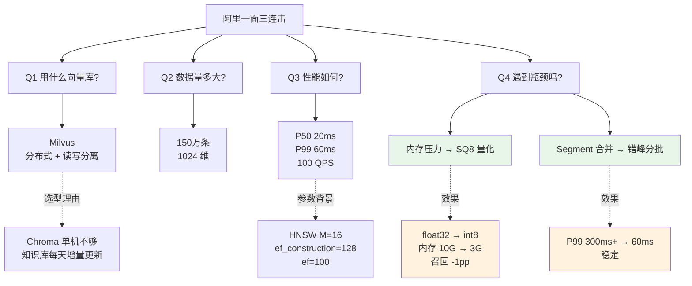
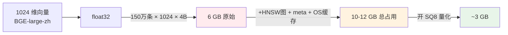
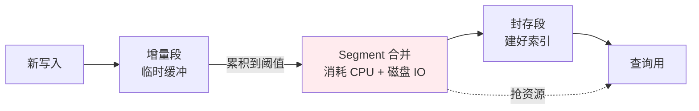

# 阿里一面：你用的什么向量数据库？数据量多大？性能如何？踩过坑吗？

!!! quote "原文出处"
    **来源**：公众号《小林coding》—《阿里一面连环拷打：讲讲你用的向量数据库？数据量级是多大？性能如何？遇到过性能瓶颈吗？》
    **作者**：[小林哥（小林面试笔记）](https://xiaolinnote.com/)
    **链接**：<https://mp.weixin.qq.com/s/i9L-II6miRrQ1em3O3UFnw>
    **读于**：2026-05-16

> **一句话定位**：这道题是大模型面试官区分**"跑过 Demo 的"和"真上过生产的"**的标准三连击。能脱口而出 P50/P99/QPS 三个数字 + 一个真实瓶颈 + 一个解法 = 入场券；只会说 "Chroma 挺快的" = 直接回炉。

---

## 🎯 这篇为什么值得收藏

前两篇面试题（[TrustZone 全景图](ai-agent-interview-tour.md) / [字节高可用](agent-service-reliability.md)）是 Agent 应用层的，**这篇是往下挖一层——RAG 的存储底座**。

阿里这道题厉害在它问的方式：**不是"Milvus 怎么用"这种死答题**，而是用追问把候选人逼出生产经验的真实尺寸。听到这种问法，你只有两条路：

1. **被动模式**：被三连击问到底层崩溃 → "回去积累点经验再来"
2. **主动模式**：主动报出 数据规模 / 索引参数 / P99 / QPS / 一个真实瓶颈 + 解法 → 三句话拿下这一题

读完这篇你应该能在面试间里**主动**说出：

- ✅ 三个数字（数据规模 + 维度 + P99）
- ✅ 一个索引参数组合（HNSW M=16, ef_construction=128, ef=100）
- ✅ 一个内存优化（SQ8 量化，10GB → 3GB）
- ✅ 一个写入优化（错峰 + 分批，规避 Segment 合并抖动）

---

## 🧩 它本质上是在测什么？

!!! tip "核心判断"
    **这道题的真正考点不是 Milvus 知识，是「你有没有见过百万级向量的真实重力」。** 数据量从几万到几百万，是质变不是量变——内存模型、索引算法、写入策略全部需要重新考虑。

面试官的隐藏评分卡是这样的：

| 候选人说什么 | 真实潜台词 |
|---|---|
| "Chroma，几万条，挺快的" | 跑过 Demo，没上过生产 |
| "Milvus，百万条，HNSW" | 知道选型，可能上过测试环境 |
| "Milvus 150 万条 1024 维，P99 60ms，开了 SQ8" | **真在生产维护过** |
| "...还遇到过 Segment 合并抖动，用错峰 + 分批解决了" | **生产 + 真踩过坑 + 自己解的** |

最后一档是 offer 信号。前两档大概率挂在二面。

---

## 🏗️ 完整骨架：从问题到答案的全图



---

## 1️⃣ 选型这一步：为什么是 Milvus { #pick-milvus }

!!! abstract "速记表"
    | 库 | 适合 | 不适合 |
    |---|---|---|
    | **Chroma** | 实验、Demo、几万条以内 | 生产、分布式 |
    | **Qdrant** | 中小规模、运维资源少、Rust 单机性能强 | 真正大规模分布式 |
    | **Weaviate** | 向量 + 结构化混合查询 | 极致性能 |
    | **Milvus** ⭐ | 百万到十亿、分布式、读写分离 | 个人小项目（重） |
    | **pgvector** | 已有 PG，向量量不大、不想多一个系统 | 高并发查询 |

**面试要给的选型逻辑链**（不是简单说"Milvus 好"）：

> "我们数据量到百万级了，单机扛不住——这是第一个分水岭；同时知识库每天有增量更新，需要写入和查询互不影响——这是第二个分水岭。Milvus 的分布式 + 读写分离正好对上这两个点。"

**注意**：如果你的实际场景就是几万条的小知识库，回答 Qdrant 或 pgvector **比硬说 Milvus 更扣分**——面试官最反感"为了显得高大上而过度设计"。**真实是最有说服力的答案**。

---

## 2️⃣ 数据规模 + 性能数字：必须报出来 { #data-and-perf }



**这张图本质上是 Milvus 内存账**：原始向量只是底层，HNSW 图本身、metadata、Collection 管理、OS 缓存合起来差不多再翻一倍。

### 性能数字必须有「环境标签」

报数字的时候**一定要带硬件 + 参数背景**，否则会被追问到死：

| 维度 | 我的环境 | 数字 |
|---|---|---|
| 硬件 | 单机 16 核 32G | — |
| 网络 | 本地千兆 | — |
| 索引 | HNSW M=16, ef_construction=128 | — |
| 查询参数 | ef=100, top-5 | — |
| **P50 延迟** | | **20 ms** |
| **P99 延迟** | | **60 ms** |
| **稳定 QPS** | | **100** |

**为什么要带环境**：因为同样是 Milvus，跑在 8 核机器、跨机房调用、ef 设到 200，数字能差**一个量级**。带环境标签让面试官知道你懂"性能数字是相对的"——这本身就是高级工程师的标志。

---

## 3️⃣ HNSW 三个参数：用社交网络类比记住 { #hnsw-params }

HNSW（Hierarchical Navigable Small World）是当前向量检索的事实标准。三个参数面试常问：

!!! tip "记忆口诀"
    把 HNSW 想象成**一个分层的社交网络**：
    
    - `M` = **每个人最多认识几个朋友**（图密度）
    - `ef_construction` = **建社交网络时每个新人考察多少候选朋友**（建图质量）
    - `ef`（查询时）= **找人时一次问多少个朋友**（查询召回）

| 参数 | 默认范围 | 调大的代价 | 调大的好处 |
|---|---|---|---|
| **M** | 16-32 | 内存/建索引时间↑ | 召回精度↑ |
| **ef_construction** | 100-200 | 建索引慢 | 索引质量↑ |
| **ef** | 50-200 | 查询慢 | 查询召回↑ |

**实战经验**：M 通常**不动**（默认 16 够用）；调优时主要调 `ef`——查询时如果发现召回不够，先把 ef 从 100 调到 150 看效果。

---

## 4️⃣ 两个真实瓶颈 + 解法（重头戏） { #pitfalls }

这部分是面试官最想听的——**你真的踩过坑**。

### 🔥 瓶颈一：内存不够 → swap → 延迟飙到秒级

**症状**：查询延迟从 20ms 突然飙到 2s+，CPU 不忙、网络不忙，但磁盘 IO 很高。

**根因**：原始向量 + HNSW 图占了几乎全部内存，留给 OS 的太少 → 一旦有内存压力，OS 开始把 Milvus 数据换到 swap → 每次查询都要从磁盘读数据 → 延迟雪崩。

!!! warning "新手最容易误判这里"
    很多人看到延迟飙升，第一反应是"是不是 HNSW 算法有问题"或者"是不是该换索引了"。**不是**——是**内存不够 swap 了**。先看 `vmstat` / `free -h` 确认 swap 使用情况，再判断。

**解法**：开 **SQ8 标量量化**

```
float32 (4 字节) → int8 (1 字节)
内存：10 GB → 3 GB
召回：基本无损（通常下降 < 1%）
```

直觉理解：就像把"精确到小数点后 7 位的数字"保留到"小数点后 2 位"——大部分语义信息在高位，截掉低位精度损失极小。

**这是性价比最高的优化**。几乎没代价就把内存砍到 1/4。

### 🔥 瓶颈二：批量写入 → Segment 合并 → P99 抖动

**症状**：白天平稳的 P99 60ms，晚上跑批量更新时 P99 飙到 300ms+，几小时后又恢复。

**根因**：Milvus 的存储是 Segment 模型——



合并这个动作本身**很重**——把一堆小 Segment 合并成大的，期间 CPU 和磁盘 IO 全被它吃了，查询资源被抢，P99 就会抖。

**解法（双管齐下）**：

| 维度 | 思路 | 具体做法 |
|---|---|---|
| **时间错峰** | 让合并发生在用户不活跃时 | 批量写入改到凌晨低峰 |
| **数量化整为零** | 让单次合并的体量更小 | 每批 500-1000 条，多批写入，间隔几秒 |

**为什么两个一起用**：单纯错峰不够（凌晨写入量太大也会抖几小时）；单纯分批不够（白天高峰期还是会跟查询抢资源）。两个一起 = 把"一次大冲击"变成"用户感知不到的多次小冲击"。

---

## 5️⃣ 60 秒答题模板（背下来直接抄） { #template }

面试里听到这道三连击，按这个骨架走，3 段话拿下：

!!! example "标杆答案模板"
    **第 1 段——选型 + 规模**：
    
    > 我们生产用的是 Milvus，知识库大概 150 万条 chunk，每条 BGE-large-zh 模型跑出来的 1024 维向量，索引用 HNSW，参数 M=16，ef_construction=128。
    
    选 Milvus 的原因是数据量到了百万级单机扛不住，需要分布式部署；同时知识库每天有增量更新，读写分离能让写不影响查。
    
    **第 2 段——性能数字**：
    
    > 实测在单机 16 核 32G、ef=100 的情况下，单次 top-5 查询 P50 在 20ms 左右，P99 60ms，并发 100 QPS 时延迟稳定。
    
    **第 3 段——一个真实瓶颈 + 解法**（任选一个讲透）：
    
    > 我遇到过两个比较典型的瓶颈。第一个是内存压力——150 万条 1024 维向量光原始数据就 6GB，加上索引和 metadata 实际占 10-12GB，最早机器只有 8GB 内存，一旦有压力就 swap，查询延迟从 20ms 飙到 2s+。后来开了 SQ8 标量量化，把 float32 压成 int8，内存降到 3GB，召回基本无损，这是最划算的一个优化。
    > 
    > 第二个是批量写入会触发 Segment 合并，期间 P99 会从 60ms 抖到 300ms+。解法是把批量写入改到业务低峰期，每批控制在 500-1000 条分多次写入，把一次大冲击变成多次小冲击。

**这一套讲完大概 60 秒，包含了**：选型 ✓ 数字 ✓ 参数 ✓ 真实瓶颈 ✓ 解法 ✓ —— 面试官想测的全在里面。

---

## 🪤 我自己读完的几点批注

### 批注一：这篇文章的「叙事手法」值得偷

小林哥写这种文章一直有个套路——**先放一段错误回答的对话**，把候选人糊脸的姿态写出来，再切到"正确该怎么答"。这种结构有两个好处：

1. 读者会自动代入"如果是我会答成什么样"，提高参与感
2. **错误答案本身就是教学材料**——读者会条件反射记住"我不能这么说"

写技术文章的同学可以学这套，比纯科普强 10 倍。

### 批注二：关于 Chroma 被黑

文章把 Chroma 几乎完全否定，但这有点过——**Chroma 在 LangChain Demo / 个人 RAG / 离线小数据集场景里依然是最快上手的**。问题不是 Chroma 不好，是**用 Chroma 不该说"我做了生产 RAG"**。

实战建议：
- 真在生产用 Chroma 的，回答时直接说"我们规模是几万条，所以选了 Chroma 单机版"——**主动报出规模 + 给选型理由 = 不会被扣分**
- 千万别说"用了 Chroma 因为听说挺好"——这是被毙的标志

### 批注三：HNSW 不是唯一选项

文章默认讲 HNSW，但 Milvus 还支持 **IVF_FLAT / IVF_SQ8 / DiskANN** 等。在以下场景 HNSW 不是最佳：

- **数据规模 > 1 亿** → DiskANN 更合适（支持向量存盘）
- **极致内存预算** → IVF_SQ8 可能更省（但召回掉得多）
- **写入超频繁** → HNSW 建图慢，IVF 系列更友好

面试时如果被追问"为什么不用 X 索引"，能展开讲一下选型权衡 = bonus。

### 批注四：百万级 ≠ 终点

这篇文章的"百万条 1024 维"其实是**中等规模**。真正大厂场景（淘宝商品、抖音视频、ChatGPT memory）是 **千万到十亿级**——这时候单机彻底不行，必须上分布式 Milvus（多 query node + 多 data node + etcd 协调）。如果你应聘的岗位明确是大厂搜推/广告/AI 平台，背完这套答案后**再补一段"如果到亿级，应该怎么扩"**——加分点。

### 批注五：这道题的「下一题」一定会问什么

阿里这种连环拷打，**问完性能瓶颈后下一刀基本是这两个**：

1. **"那你的 chunk 怎么切的？切多大？为什么这么切？"**（考察 retrieval 质量）
2. **"召回率怎么测的？用什么标注集？"**（考察 eval 能力）

提前准备这两个，面试当场拿出来 = 让面试官觉得你"线越拉越深都接得住"。

---

## 🔭 我的判断

这道题本质上是 **AI Agent 时代版本的「你的 MySQL 是怎么调优的」**——

- 5 年前问 MySQL 索引、慢查询、主从延迟
- 现在问 向量库索引、P99 延迟、Segment 合并

**模式是一样的**：用一个底层组件的真实数字，区分"用过的"和"维护过的"。背八股能蒙过一面，但二面和拿 offer 一定要靠**真实的尺寸感**。

如果你正在准备大模型/RAG 岗位，**这道题练到能 60 秒脱口而出 = 二面进 80%**。如果你已经在生产维护 Milvus/Qdrant/pgvector，**把自己环境的真实数字算清楚、写下来**——你就有了别人吃不到的 moat。

---

## 📚 延伸阅读

- 同系列前两篇：
    - [TrustZone 版 Agent 面试题全景](ai-agent-interview-tour.md)
    - [字节高可用与稳健性专题](agent-service-reliability.md)
- 官方资料：
    - [Milvus 官方文档：Index Types](https://milvus.io/docs/index.md)
    - [HNSW 论文（Yu A. Malkov, 2016）](https://arxiv.org/abs/1603.09320)
- 选型类：
    - [向量数据库选型指南（Zilliz 官博）](https://zilliz.com/learn/comparing-vector-database-pgvector-pinecone-weaviate-milvus)

*跑过 Demo 和上过生产之间，差的不是知识，是真实数字。把你环境的 P50 P99 算出来，你就拿到了入场券。*
