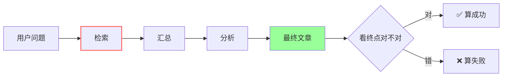

# 92% 是假的——读 chouheiwa《我给知墨助手第一版评测的反思》

!!! quote "原文出处"
    **来源**：知乎《[如何评测 AI Agent 的好坏](https://www.zhihu.com/question/1982512240482619481/answer/2042309491417503394)》— chouheiwa 的回答
    **读于**：2026-05-25
    **作者背景**：chouheiwa，南开软件，~10 年开发经验，长期写 Claude Code 源码拆解专栏。这是他「Agent 评测系列」的第二篇，姊妹篇是 [《Agent 最大的瓶颈是可靠性》](agent-reliability-bottleneck.md)（同一作者的宏观判断）。

> 一句话定位：**评测自己第一版打出 92% 成功率，作者只信了十分钟——把中间步骤纳进来重测掉到六十几。这篇讲他从「只看终点」到「照亮中间过程」再到「搭窄裁判」的全流程踩坑实录，终点是一套能读数的可靠性仪表盘。**

---

## 🎯 这篇为什么值得沉淀

上一篇《Agent 最大的瓶颈是可靠性》是宏观判断——告诉你「卡在哪」。这一篇是**实操续集**——告诉你「具体怎么动手量」。两篇放一起读才完整：

- 上一篇：**为什么** Agent 不可靠（错误复利数学 + 单步三杀手 + 长征九个九）
- 这一篇：**怎么** 把可靠性从一种感觉变成一套能读数的指标

更稀缺的是这篇没有装"一切都搞定了"。作者明确写了**自己在哪步、卡在哪**：

| 阶段 | 状态 |
|---|---|
| Trace 搭建（Langfuse） | ✅ 已做完 |
| 失败案例标注（手标 28+ 条） | ✅ 已做完 |
| LLM-as-a-judge 窄裁判 | 🚧 正在调，第一版裁判一致率没满意 |
| 成本指标（单次成功成本） | 📋 已规划，未轮到 |
| 线上 A/B + 留存 | 📋 已规划，未轮到 |
| pass^8 一致性 | 📋 上线前必跑 |

这种诚实的进度比任何"完美方法论"都有用。

---

## 🧩 它本质上是什么？

!!! tip "核心判断"
    **这是一篇「评测方法论的诚实进度报告」——不是教你怎么搭完美评测，而是把评测这件事拆成 6 步，把每一步的坑（trace 不能省、裁判 80% 不可迁移、标准漂移、单次成功成本、A/B 才是终判、pass^8 上线门槛）讲透，并且诚实交代自己只走到第 2 步。**

它跟市面上「Agent 评测最佳实践」类文章的不同：

- 不是论文综述拼贴，而是**从一个具体踩坑（92% 是假的）出发**反推方法论
- 不假装方法已成熟，**明确标注 trace 完了、裁判在调、其余规划中**
- 每个坑都给了**论文/数据出处**，但保持工程师视角不学院化
- 顺序是从**真实失败 → 标准漂移 → 窄裁判**，不是从"设计大而全评分卡"开始

---

## 📐 核心机制 1：为什么「92% 是假的」——评测错位

作者第一版评测脚本只问一个问题：**助手最后吐出的那段文字对不对？**

跑出 92%。但把中间步骤纳进来重测，**同一批任务掉到六十几**。

问题在于：**终点对了≠中间没错**。

- 中间步步都对 → 终点对 → 真稳，能上线
- 中间错三步又被后面蒙回来 → 终点也对 → **不稳，迟早炸**

这两种情况在「终点对不对」这把尺子下完全没区别。Latitude 2026 的数字坐实了这件事：**只看最终答案的评测，会比看完整轨迹多放过 20% 到 40% 的失败案例**。

---

## 📐 核心机制 2：六步路线图

作者把评测这件事拆成 6 步，每一步都标了状态和坑：

-   :material-eye:{ .lg .middle } **① Trace 把中间过程照亮**

    ---

    选 Langfuse（自托管免费、兼容 OpenTelemetry）。**手动翻 28+ 条挂掉的交互**就能聚类出最高频失败：检索引用了不存在的文档 ID，后面汇总分析全建在错料上。

-   :material-account-edit:{ .lg .middle } **② 手动标失败 = 错误分析**

    ---

    Hamel Husain 的核心建议：**亲手（不是让 AI 替你）标几十条真实交互**，把失败聚类，最上面那三类基本能解释你 70%+ 的问题。Anthropic 的指南也是这条："从小处起，从真实失败起"，20-50 条就够。

-   :material-gavel:{ .lg .middle } **③ LLM-as-a-judge 窄裁判** 🚧

    ---

    **不要做大而全的 1-5 分评分卡**——拆成一个个二元的、窄的裁判，每个只判一种失败模式（"文档 ID 在库里存在吗"用代码就能判）。每个裁判要拿手标例子校准，**裁判本身要进版本管理**。

-   :material-currency-usd:{ .lg .middle } **④ 单次成功成本**

    ---

    Anthropic 的发现：**光是 token 用量本身就能解释 80% 的性能差异**。准确率 95% 单次花五毛 vs 80% 单次花五分——后者可能更值。每条 trace 必须带 token / 延迟 / 工具调用次数。

-   :material-ab-testing:{ .lg .middle } **⑤ 线上 A/B + 留存**

    ---

    METR RCT：开发者**自评快了 20%，实测慢了 19%**。自我感觉是不可信的代理指标。离线评测做完必须接线上验证。

-   :material-rocket-launch:{ .lg .middle } **⑥ pass^8 上线门槛**

    ---

    上线前每个核心任务**连跑 8 次**。Sierra 的数据：最强 GPT-4o function-calling agent pass^1 > 60%，pass^8 < 25%。BFCL v3 多轮榜单领头 GLM-4.5 也才 76.7%——**模型自己都没做稳的环节，必须用 pass^8 死死盯着**。

---

## 📐 核心机制 3：LLM-as-a-judge 的四个深坑

这一段是全文最值钱的部分。作者把"用 LLM 当裁判"的几个看似温和的细节全部敲实了。

**坑 1：80% 一致率不可迁移**

MT-Bench 那个 GPT-4 vs 人类 80% 一致率，**离开开放对话场景就塌了**：

| 场景 | LLM-人类一致率 | 人类专家彼此一致率 |
|---|---|---|
| MT-Bench 开放对话 | **80%** | ~80% |
| 营养学专业判断 | **68%** | 72-75% |
| 心理健康专业判断 | **64%** | 72-75% |

判一篇调研稿好不好就是专业判断，所以 80% **从一开始就不能照搬**。

**坑 2-4：三个论文实锤的偏好**

- **位置偏好** — 同样两个答案换前后顺序，代码评判准确率能晃 10%+
- **啰嗦偏好** — 答案长就给高分（跟内容好不好无关）
- **自我偏好** — GPT-4 系统性偏爱自己的输出。**要害**：知墨助手稿子是大模型写的，再用同一家模型当裁判 = 自己批自己的卷，分数天然偏高。**裁判必须换不同厂商**。

**坑 5：标准漂移（最阴的一坑）**

Shankar 的论文起的名字。原话：

> It is impossible to completely determine evaluation criteria prior to human judging of LLM outputs.
> 想在动手看输出之前就把评判标准定全，这做不到。

> chouheiwa：「这句话治好了我的一个执念。我之前总想先写一份完美的评分标准再开始测，结果迟迟动不了手。其实顺序是反的：**先看一批真实的失败案例，标准是在看的过程里长出来的**。」

---

## 💸 成本：那两个烧钱事故

文章在"未轮到、但已规划"那段顺手摆出两个真实事故，分量都很重：

**事故 1：4.7 万美元的 agent 死循环**

核心教训：**告警没用，因为告警是在钱花出去之后才响的**。真正的预算必须在**下一次 API 调用之前**就把执行掐断。

**事故 2：Augment 的 200× token 速率冲击**

一个 API 格式变了 → agent 疯狂重试 → token 速率冲到平时 200 倍 → 40 分钟烧 50 美元才被熔断拦下。

> 操作启示：**硬性预算熔断 + 重试上限**比任何告警都重要，它得在调用前生效，不是事后报警。

好消息是 token 大多冗余可压。Augment 拆 SWE-bench 的 token 构成发现，**工具返回结果里近一半删掉完全不影响性能**——Claude Code 的 context engineering 就是干这个的。

---

## 📋 操作清单：今天就能用的 6 条

读完按作者的进度顺序提炼出可以立即落地的 6 条：

1. **先搭 trace 再做任何评测改进** — Langfuse 自托管免费，兼容 OTel。没 trace = 闭眼飞行
2. **手标 20-50 条真实失败** — 不是让 AI 标，是你亲手标。聚类出最上面三类失败，这是 70% 问题的来源
3. **裁判要窄、要二元、要换厂商** — 别做大而全 1-5 分卡；能用代码判的别用裁判（如"文档 ID 是否真实存在"）；裁判模型必须跟被测模型不同厂商
4. **每个裁判用手标样本校准** — 一致率不达标就不能信。裁判本身进版本管理
5. **trace 必须带 token / 延迟 / 工具调用次数** — 别只看准确率，盯**单次成功成本**
6. **核心任务上线前连跑 8 次** — pass^1 漂亮没用，pass^8 站不上 80% 不能上生产

---

## 💭 我的判断

**最受用的两个洞察**：

第一，"先看输出再定标准"的反直觉顺序。我自己写 fact_store benchmark 时也犯过想"先写完美评分标准"的毛病——结果是评分标准和真实失败模式根本对不上号。**应该是先跑一批样本看失败聚类，标准在过程里长出来**。

第二，"裁判换厂商"这条很重要。我之前给 fact_store 做实验也用过 Claude 当裁判去评 Claude 的输出，自我偏好的污染当时没意识到。下次这种实验**必须用 Gemini 或开源模型当裁判**，或者至少跨家做三角验证。

**几个我会立即用上的具体动作**：

- Hermes 自身的工具调用日志（特别是 cron job 多步 pipeline）应该集中到 Langfuse 类工具——目前散在各个 log 文件里，事后追因很难
- 我现有的几篇 benchmark 文章（[fact-store-benchmark-report](../tech/fact-store-benchmark-report.md)）都只看了准确率/召回率，**单次成功成本完全没记**。下次重跑必须加这一栏
- 跑评测的时候默认连跑 8 次而不是 1 次。pass^8 视角应该常态化

**关于 chouheiwa 这个写作系列**：把宏观判断（上一篇）+ 实操进度（这一篇）+ 后续会补的裁判复盘（下一篇）做成连续记录，是值得参考的写作模式——比那种"一次性把方法论讲完"的文章诚实得多，也更有跟读价值。

**留下的疑问**：

- TRACE 论文「证据库」思路具体怎么实现？尤其是没唯一标准轨迹的场景下，证据库是怎么建立、怎么计算召回的？这块作者没展开，值得我去翻原文
- 窄裁判一致率上不去的具体表现是什么？是 prompt 没写对、还是手标本身不一致？作者在调但没给细节，下一篇应该会讲

---

## 📚 延伸阅读

- 上一篇宏观判断：[AI Agent 最大的瓶颈是可靠性](agent-reliability-bottleneck.md) — 同一作者，错误复利数学和单步三杀手
- 我的 benchmark 实操：[Fact Store Benchmark Report](../tech/fact-store-benchmark-report.md) — 同样栽在"先要不要定完美评分标准"上
- 我的修正反思：[数据驱动的认知修正](../thoughts/data-driven-correction.md) — 跟"92% 是假的"有同源结构

*一句话收尾：评测就是给可靠性装一套能读数的仪表盘，仪表盘没装好之前，所有优化都是闭着眼开飞机。*

---

## 📄 原文全文（存档）

!!! abstract "原文信息"
    **作者**：chouheiwa（南开大学软件，~10 年开发经验）
    **来源**：[知乎 — 如何评测 AI Agent 的好坏？](https://www.zhihu.com/question/1982512240482619481/answer/2042309491417503394)
    **采集**：2026-05-25 由用户从 Mac 浏览器复制粘贴（服务器侧抓取仍被知乎风控 40362 阻断）

> 著作权归作者所有。商业转载请联系作者获得授权，非商业转载请注明出处。

---

# 我给「知墨」助手写的第一版评测，跑出 92% 成功率，我信了十分钟，然后发现这个数字是假的

这事我卡了好几天。脚本本身没毛病，问题出在我量的东西上。我让评测脚本只看一件事：助手最后吐出来的那段文字对不对。可助手要拿到那段文字，中间得调好几次工具，搜文档、读笔记、拼上下文。我只盯着终点，中间那一长串动作里塞了多少错的、绕的、纯靠运气蒙对的，我一无所知。把中间过程也纳进来重新量，同一批任务，成功率直接掉到六十几。

那几天我一直在跟这个 92% 较劲，越较劲越觉得不对，最后憋出了一篇《Agent 目前最大的瓶颈是什么》，结论是可靠性，技术、工程、商业三层卡的都是它。那篇是我钻牛角尖钻出来的一个宏观判断。但说实话，宏观判断解决不了我手头的活。我真正想长期做的，是怎么把一个 agent 的好坏可靠地量出来这件事，知墨助手只是我拿来练手的第一个真实战场。这篇就讲讲我在这条路上走到哪了，trace 搭完了，裁判正在做，还远没到终点。如果你也准备自己做个 agent 又怕踩坑，量化这一关，大概率会比你想的难。

## 先说清楚我到底卡在哪

为什么 agent 比单次问答难量，根上是一个我在上一篇里掰过的算术：多步任务的整体成功率，等于每一步成功率连乘。

P_成功 = p_单步^n

单步 95% 听着不差吧？走 10 步剩 0.95^10 ≈ 0.60，走 20 步剩 0.95^20 ≈ 0.36。链条越长塌得越快，这事跟某个模型行不行没关系，是结构本身决定的（完整推导和 RL 里的指数累积证明在上一篇，这里不重复）。

我卡住的点，正是这条曲线对评测的杀伤。这条曲线意味着：你测错地方，整件事就白测了。我那个 92%，量的是终点那段文字对不对，可真正吃掉成功率的是中间那 N 步里随便哪一步的偏差。终点对了，可能是中间步步都对，也可能是错了三步又被后面蒙回来。这两种情况在「终点对不对」这把尺子下完全没区别，但前者能上线，后者迟早炸。

知墨助手干的是个典型长程任务：先从网上抓一批相关记录，汇总，再结合用户的调研问题分析、总结，最后产出文章。我能衡量的只有最后那篇文章，可文章好坏中间隔着检索、汇总、分析好几道工序，每道都可能悄悄出问题。检索漏了关键料、汇总丢了信息、分析理偏了问题，这些我在开发时几乎看不见。等发现产出不达标想回头查是哪环坏的，才发现无从查起，手里只有一个结果，中间全是黑盒。卡了好几天我才回过味来：我一直拿终稿质量当唯一验收标准，可一个长程 agent 真正的风险，恰恰藏在那些我看不见的中间步骤里。

## 第一步我已经做完了：先把中间过程照亮

想明白这个，第一件事就清楚了，得先让中间过程能被看见。这就是 trace，把 agent 每一次调用、每一步工具、每一段中间产出都记下来，能回放。

我现在已经把这套搭起来了。选的是 Langfuse，自托管免费，兼容 OpenTelemetry，对我这种一个人折腾的场景够用。搭完最直接的变化是，知墨助手再挂，我不用对着一个烂结果干瞪眼了，能一层层翻进去看它到底在哪一步走偏的。没 trace 的时候我根本分不清助手是真退步了还是这次随机抽风，国内有篇专栏把这个状态叫「盲飞」，挺准。这件事的价值，Latitude 2026 那份分析有个数字能说明：**只看最终答案的评测，会比看完整轨迹多放过 20% 到 40% 的失败案例**。那多放过的部分，过去对我就是纯黑盒，现在至少能看见了。

trace 一上，我立刻捞到一条之前完全摸不着的线索。我顺手把最近挂掉的交互翻出来看，标到第 28 条左右就发现规律了：知墨助手挂得最多的根本跟回答质量无关，是它在检索那一步经常引用一个不存在的文档 ID，后面汇总、分析全建在这个错料上，最后吐出一篇读着通顺、方向早歪了的稿。这正好是上一篇讲的错误复利在我项目里的现场版，一步检索的偏差，被后面每一步当成既定事实接着错。没有 trace，这个根因我可能还得再瞎猜几天。

Anthropic 在 2026 年初那篇《Demystifying Evals for AI Agents》里这条说得最实在：**从小处起，从真实失败起**。别先去搜一个高大上的公开基准，从你自己产品里真实挂掉的 20 到 50 个案例开始就行，因为早期改动效果都很大，小样本就够看出问题。我手动翻 trace 标失败的过程，本质就是 Hamel Husain 说的那个错误分析，最高杠杆的一步。你亲手（不是让 AI 替你）标几十条真实交互，把失败聚类，最上面那三类基本能解释你 70% 以上的问题。

可看得见失败，只是第一步。失败有了，谁来批量地、一致地判定「这条算不算失败」？我现在正卡在这一关。

## 第二步我正在做：搭 LLM 裁判，但坑比想象的多

trace 帮我把失败案例攒起来了，可几百条轨迹靠我一条条人眼看，根本扛不住。所以下一步几乎是必然的：找个更强的模型当裁判，让它替我批量打分。这套叫 LLM-as-a-judge，是现在最流行的省力办法。我这几天就在啃它，查得越多越发现，这玩意儿坑不比 agent 本身少。

它流行的底气来自 2023 年那篇 MT-Bench 论文，GPT-4 当裁判和人类评委的一致率原话是：

> GPT-4 judge match human evaluations at an agreement rate exceeding 80%, achieving the same level of human-human agreement.
> GPT-4 裁判和人类评委的一致率超过 80%，跟人类评委彼此之间的一致率是一个水平。

这个 80% 后来变成了全行业到处部署 LLM 裁判的通行证。我一开始也觉得，那照着抄不就行了。问题是，**它根本不一定迁移到我的场景**。

2025 年 IUI 那篇论文拿真正的注册营养师和临床心理师当标准答案重新测了一遍。结论是大模型裁判和专家的一致率，在营养学领域只有 68%，心理健康领域只有 64%，比专家之间的一致率（约 72% 到 75%）还低。**题目一旦进了需要专业判断的领域，那个漂亮的 80% 就塌了**。知墨助手判一篇调研稿写得好不好，本身就是个需要专业判断的活，所以那个 80% 我从一开始就不能照搬。

而且这裁判本身一身毛病，每个都有论文实锤：

- **位置偏好**：同样两个答案换个前后顺序，代码评判的准确率能晃 10% 以上
- **啰嗦偏好**：答案写得长它就倾向给高分，跟内容好不好没关系
- **自我偏好**：GPT-4 会系统性地偏爱自己生成的输出

最后这条对我特别要命，知墨助手的稿子本来就是大模型写的，**我要是再拿同一家的模型去当裁判，等于让它给自己批卷，分数天然偏高，自己骗自己**。所以我现在倾向裁判换一个不同厂商的模型来做。

最根上的那个坑，Shankar 那篇《Who Validates the Validators？》起了个名字叫**标准漂移**：你需要标准才能给输出打分，可你往往是打着打着分才慢慢搞清楚自己的标准到底是什么。原话是：

> It is impossible to completely determine evaluation criteria prior to human judging of LLM outputs.
> 想在动手看输出之前就把评判标准定全，这做不到。

这句话治好了我的一个执念。我之前总想先写一份完美的评分标准再开始测，结果迟迟动不了手。**其实顺序是反的：先看一批真实的失败案例，标准是在看的过程里长出来的**。这也解释了为什么前面那步手动标 trace 不能省，它不光是在攒失败案例，也是在帮我把评判标准磨出来。

所以我现在给自己定的裁判搭法是这样的：不上来甩一个「有用性打 1 到 5 分」的大而全裁判。Hamel Husain 那篇 LLM-as-a-judge 完整指南讲得很清楚，**拆成一个个二元的、窄的裁判，每个只判一种失败模式**。比如针对我那个最高频的失败，就单独做一个裁判，只回答一个问题：这次检索引用的文档 ID 在库里真实存在吗。这种问题甚至不用裁判，写段代码查一下就行，又准又省钱。剩下那些代码判不了的，比如「分析有没有理偏用户的调研问题」，才交给窄裁判。而且**每个裁判都得拿几十个我亲手标过的例子去校准，一致率上不去就不能信它。裁判本身要当成代码，进版本管理**。

这一步我还在半路上，第一个窄裁判的 prompt 改了好几版，跟我手标结果的一致率还没调到我满意。而且裁判要评的不只是终稿，还有中间轨迹，这里又冒出个新麻烦：**轨迹没有唯一正确答案**，同一个调研问题先查 A 库再查 B 库、和先 B 后 A，可能都对。TRACE 这篇论文就专门治这个，用「证据库」的思路代替「跟唯一标准轨迹逐字对比」，拿单一标准答案去卡轨迹只会把本来对的 agent 误判成错的。LangChain 和 Langfuse 的实践都把指标收敛成三层，结果层、轨迹层、系统层，我现在的裁判主要在啃前两层。

## 还没轮到、但我已经规划好的几步

裁判这关一旦走通，后面的路其实想清楚了。

**往后第一件要补的是成本。** 我之前给助手做评测，眼里只有「对不对」，从没认真量过「花了多少」，直到有一次我把助手改成多步自主规划，准确率确实上去了，月底一看 token 账单，人傻了。上一篇我引过 Anthropic 那篇多 agent 研究系统的博客，他们的多 agent 方案比单 agent 强 90.2%，代价是 token 烧得是聊天的 15 倍。更关键的是他们发现，**光是 token 用量本身就能解释 80% 的性能差异**。换句话说，很多时候你以为 agent 变聪明了，其实它只是被允许烧更多钱。我的评测要是只记准确率不记 token，根本分不清这次提升是真本事还是纯堆量。所以我打算给每条 trace 都补上总 token、端到端延迟、工具调用次数，每周盯一个组合指标，**单次成功任务的成本**。一个准确率 95% 但每次成功要花五毛钱的助手，可能还不如一个准确率 80% 但每次只花五分钱的。

成本失控还有更吓人的版本。有人复盘过一次 4.7 万美元的 agent 死循环，核心教训是**告警没用，因为告警是在钱花出去之后才响的，真正的预算必须在下一次 API 调用之前就把执行掐断**。Augment 复盘的另一次事故更直接，一个 API 格式变了触发 agent 疯狂重试，token 速率冲到平时的 200 倍，40 分钟烧了 50 美元才被熔断拦下。所以这条线我还想顺手把硬性的预算熔断和重试上限做进去。好在 token 这东西大多是冗余的，Augment 拆 SWE-bench 的 token 构成发现，工具返回结果里有近一半删掉完全不影响性能，Claude Code 的上下文压缩就是干这个的。

**再往后是线上行为数据。** 离线评测做得再漂亮，也得线上验。METR 在 2025 年那个随机对照实验给我提了个醒：16 个资深开发者用 AI 编码，开工前预期快 24%，干完自评快了 20%，**实际一量慢了 19%**。自我感觉是不可信的代理指标。所以等裁判和成本都跑顺，我得接上 A/B 和留存，看用户用了助手之后任务到底有没有更快完成、出错率有没有降，而不是问他「你觉得好用吗」。

**最后那步是 pass^8 一致性测试。** 上一篇我讲过 tau-bench 的 pass^k，同一个任务连跑 k 次每次都对的概率，Sierra 团队的数据是最强的函数调用 agent pass^1 过六成，pass^8 掉到 25% 以下。落到我这就一句话：**上线前核心任务别只跑一遍，每个连跑 8 次，pass^1 再漂亮，只要 pass^8 站不上去，这功能就还没到能上生产的程度**。工具调用这关尤其硬，伯克利的函数调用榜单 BFCL v3 到现在没有一个模型在完整多轮上过 80%，领头的 GLM-4.5 也就 76.7%，连模型自己都没做稳的环节，我更得用 pass^8 死死盯着。

## 写在半路上

这篇没有一个漂亮的收尾，因为我自己也还在半路。trace 搭完了，裁判正在调，成本、线上、pass^8 都还在我的待办列表里躺着。我把这个方向当成要长期做下去的事，知墨助手是第一块试验田，后面应该还会有别的。

但走到这儿，有件事我比几天前想得清楚多了。上一篇我说 Agent 真正的瓶颈是可靠性。这几天搭评测的过程让我意识到，**可靠性这东西光靠嘴喊没用，得有一套量得出来的东西托着**。你没有 trace、没有校准过的裁判、没有单次成功成本，你连「这版比上版可靠了没有」都答不上来，谈何提升可靠性。所谓评测，说白了就是给可靠性装一套能读数的仪表盘，仪表盘没装好之前，你对着 agent 做的所有优化，都是闭着眼开飞机。

回到开头那个 92%。**这数字本身没毛病，毛病在我一开始就问错了方向**。我当时只关心助手最后那句话对不对，可真正该较劲的，是它走到那句话的一路上，每一步我敢不敢信。还有个心态我这几天也摆正了，斯坦福 HAI 的 2026 AI Index 里有个细节我一直记着，Gemini 能拿 IMO 数学金牌，读模拟时钟却只对 50.1%，**模型能力是一块一块跳着长的**，所以别拿任何一个公开榜单的高分替你的场景下结论，连 OpenAI 自己都在 2025 年底停掉了 SWE-bench Verified 的汇报，它在你那个具体任务上行不行，只有你自己那套从真实失败长出来的评测能回答。这几天我做的全部事情，其实就是在把「敢不敢信」这件事，从一种感觉，一点点变成一个能读数的东西。这条路我才走了三分之一，但至少，我不再是闭着眼了。下一篇，大概就是裁判这关啃完之后的复盘。
