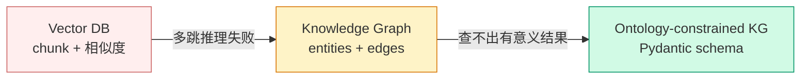

# Agent 记忆的真问题不是容量，是 schema

!!! quote "原文出处"
    **来源**：Akshay Pachaar 推文 — 《Pydantic fixed my Agent's Memory》
    **链接**：[x.com/akshay_pachaar/status/2058976178908885210](https://x.com/akshay_pachaar/status/2058976178908885210)
    **读于**：2026-05-27
    作者是 Lightning AI 的开发者关系，长期写 ML Eng 实操内容；这条是 Zep 的软广，但论点本身值得拆开看。

> 一句话定位：**Agent 记不住事 ≠ 容量不够，是没人告诉它的脑子该按什么 schema 组织——这件事 FastAPI 用 Pydantic 解过一次，function calling 又解过一次，agent memory 是第三次。**

---

## 🎯 它解决什么问题

「我的 agent 记得一切，却理解不了任何东西。」

这是 Akshay 开篇那句最扎人的描述。当下做 agent 的人都遇到过：你给 agent 接了 vector DB，把所有对话/工单/客户档案都丢进去；过了一周 agent 真的能"想起"用户上周说过什么话——但你一旦问"哪些**企业级**客户有未结的 **sev-1** 工单"，它就崩了。

数据全在，连接也在，**就是不可查询**。

这不是 RAG 不够好，也不是 context window 不够大。是**底层组织方式**不对。Akshay 给出的演进链条很清楚：vector DB → 自由生长的知识图谱 → 带 schema 约束的知识图谱。每一跳都不是发明新东西，而是把一个老问题（数据库 schema）重新搬到 agent 上。

---

## 🧩 它本质上是什么？

!!! tip "核心判断"
    **这不是「agent memory 的全新范式」，是把 schema-first 思维第三次套到 LLM 工程里。FastAPI 用 Pydantic 治住 HTTP 层的混乱，function calling 用 JSON Schema 治住工具调用的混乱，现在轮到知识图谱抽取层。**

LLM 工程的演化里有一个反复出现的模式：**默认让 LLM 自由发挥，撞墙后给它加 schema 约束**。

| 层 | "自由发挥"阶段 | "schema 约束"后的样子 |
|---|---|---|
| HTTP API | 让 LLM 直接拼 JSON 字符串返回 | FastAPI + Pydantic response model |
| 工具调用 | prompt 里写"请输出 JSON" | function calling + JSON Schema |
| 长期记忆 | 让 LLM 自己决定抽哪些 entity / 用什么 relationship label | Ontology + EntityModel/EdgeModel |

每一层的故事都一样：**没约束时 LLM 会给你一坨「能跑但不可用」的东西**。HTTP 层是字段名一会儿 `userId` 一会儿 `user_id`；工具层是参数顺序乱、漏字段；记忆层是所有客户都被分类成 `Object`、所有关系都叫 `RELATES_TO`。

---

## 🏗️ 核心机制 / 演进路径



### 第一跳：为什么 vector DB 不够

经典例子（原推文给的）：

- **事实 1**：Alice manages Project Atlas
- **事实 2**：Project Atlas runs on PostgreSQL
- **事实 3**：The PostgreSQL cluster went down Tuesday

查询「**Alice 的项目周二受影响了吗？**」需要把这 3 条串起来。但 vector search 会怎么做？它会用 embedding 找跟 query 最相似的 chunk——事实 1 和 事实 3 都直接命中关键词（Alice / Tuesday），事实 2 **既不含 Alice 也不含 Tuesday**，相似度排序根本进不了 top-k。

**桥梁事实丢了，多跳推理就死了。** 这不是给 vector DB 加更多数据能解决的问题，是检索模型本身的维度坍塌。

### 第二跳：知识图谱的"半解法"

把事实拆成 `(节点, 边, 节点)` 三元组——`Alice -[manages]-> Project Atlas -[runs_on]-> PostgreSQL`——遍历就行了。这一跳确实把多跳推理打通了。

但 Akshay 戳破的是下一层问题：**抽取阶段是黑箱**。

大多数图记忆框架的工作流是这样的：

1. **Ingest**：原始数据进来（对话、文档、JSON）
2. **Extract**：让 LLM 读原文，自己决定抽什么实体、什么关系、什么属性 ← **决定一切的步骤**
3. **Store**：实体变节点，关系变边，落库
4. **Retrieve**：查询时遍历图
5. **Deliver**：相关事实拼成 context 注入 prompt

这套 pipeline 里 **第 2 步是关键**。但你对它**零控制**：你扔进去 50 条客服对话，LLM 会给你抽出来 200 个 `Topic` 节点和一堆 `RELATES_TO` 边。**数据在，但不可分类、不可过滤、不可按业务维度查询。**

### 第三跳：用 Pydantic 把 schema 钉死

Akshay 给的解法（Zep 的实现）就是把 FastAPI 里那套熟手熟脚的玩法搬过来：

```python
from zep_cloud.external_clients.ontology import EntityModel, EntityText
from pydantic import Field

class Project(EntityModel):
    """
    Represents a specific software project, application,
    or codebase that the user is building or contributing to.
    """
    project_status: EntityText = Field(
        description="Current status: active, completed, paused, or archived.",
    )
    project_type: EntityText = Field(
        description="Type of project: web app, mobile app, API, CLI tool, etc.",
    )
```

关系（边）也用同一套：

```python
class WorksOn(EdgeModel):
    """The user is currently working on, building, or contributing to a project."""
    role: EntityText = Field(
        description="User's role: lead developer, contributor, maintainer, etc.",
    )
```

最后用 `EntityEdgeSourceTarget` 钉死「谁能连谁」：

```python
client.graph.set_ontology(
    entities={"Project": Project, "Technology": Technology},
    edges={
        "WORKS_ON": (
            WorksOn,
            [EntityEdgeSourceTarget(source="User", target="Project")],
        ),
        "USES_TECHNOLOGY": (
            UsesTechnology,
            [EntityEdgeSourceTarget(source="User", target="Technology")],
        ),
    },
)
```

**这就是 ontology——你的 agent 大脑的 schema。**

注意一个工程上的关键细节：**docstring 和 field description 不是装饰，是给抽取模型的训练信号**。`"Current status: active, completed, paused, or archived."` 这种枚举式描述比 `"项目状态"` 准确得多——前者直接给了 LLM 抽取时的合法值集合。

写好 docstring 这件事，从写文档变成了**写抽取规则**。

---

## ⚠️ 难点 / 局限

这种解法有几个推文里没说但工程上躲不掉的问题：

1. **Schema 设计本身就是新负担**。原本 LLM 帮你"自动整理"的活儿，现在你得自己想清楚业务里有哪些实体、哪些关系。**这不是技术债转移，是你被迫先做产品思考再做技术实现**——好的一面：这个设计也是你产品 PRD 该有的。坏的一面：很多团队跳过这步，以为 LLM 能替你做。

2. **Schema 演化成本高**。你今天定义了 `Project` 有 `project_status: EntityText`，明天发现还需要 `priority`、`team_size`——加字段简单，但**已经抽过的旧数据没有这些字段**。要不要重抽？重抽意味着重花 LLM token，且老对话现在重读可能已经抽不出当时那种"语境"。这是任何 schema 系统都有的演化问题，但 agent memory 比传统 DB 更敏感（因为底层数据是非结构文本）。

3. **抽取模型仍然会犯错**。Schema 把"自由度"砍下去了，但没消除幻觉。LLM 仍然会把一个客服工单的"投诉品类"误标成"产品名"。Schema 让错误**可观测**了（你能 query 出来"哪些 Project 没有 status"），但不让错误消失。

4. **多租户 / 多领域场景下 schema 不通用**。客服场景的 ontology（Customer/Ticket/Severity）跟代码助手的 ontology（Project/Technology/Repo）完全不同。**没有"通用 ontology"——每个产品都得自己设计**。这给开源 agent memory 框架的"开箱即用"叙事画了天花板。

---

## 🎯 什么场景适合 / 不适合

### ✅ 适合

- **多跳查询多于点查的场景**：客服（客户→工单→产品→工程师）、CRM、项目管理类 agent
- **业务实体类型有限且稳定**：你的领域本来就有清晰的"客户"「订单」「工单」概念
- **查询是结构化的**：用户问的是「**A 类**对象 + **B 条件**」，不是开放式探索
- **数据量大到 vector DB 上下文塞不下**：图遍历 + ontology 过滤比"塞 50 条 chunk"高效多了

### ❌ 不太适合

- **闲聊型 agent**：用户每天问的话题完全不同，没有稳定 entity，硬上 schema 是开发负担
- **强探索型查询**：用户的问题本身就是开放式的，不知道想查什么——这种场景 vector search 的"模糊匹配"反而是优势
- **小规模 demo / 早期验证**：还没有产品方向就花 1 周设计 ontology，是过度工程
- **数据高度非结构化的领域**（如纯创作记忆、长篇小说协作）：硬塞 entity 模型反而损失语义

---

## 🤔 我的几点判断

!!! abstract "TL;DR"
    1. **「Schema-first 思维」是 LLM 工程过去 3 年最被低估的范式**。从 HTTP → 工具调用 → 记忆，每一层撞墙的方式都一样，解法也一样。下一层会是什么？我赌是**多 agent 协作的"消息 schema"**——agent 之间互发的消息现在仍然是自由文本。
    2. **Akshay 这条推文最有价值的不是"用 Zep"，是把 ontology 这个老词重新搬到 LLM 语境**。Ontology 在传统知识工程里被用滥了（Protégé 那一代工具栈学习曲线极陡），现在用 Pydantic class 重新表达，门槛一下降到 web 开发者都能写。**这是一次成功的概念再包装。**
    3. **如果让我自己做：我不会一上来就引入 Zep 这种 SaaS**。先用 SQLite + 一个小 Python 脚本（带 Pydantic 模型 + 一个 LLM 抽取函数）做最小验证，跑通业务后再考虑要不要换 Zep 这种带温度变化、双向边、时间窗口的更重的栈。**Zep 卖的是"做对了所有边角"，但很多场景的边角根本不需要做对**。
    4. **观察一个小信号**：原推文最后给了 Zep 的 5 步抽取 pipeline（实体抽取 → 实体消歧 → 事实抽取 → 事实消解 → 时间抽取），其中**事实消解（处理矛盾、保留历史）**和**时间抽取（每条边带有效期窗口）**是 vanilla 知识图谱很少做的——这才是 Zep 真正吃掉一份市场的差异点，**ontology 只是入场券**。

这条推文表面在卖 Zep，但**真正传达的工程论点是普适的**：你的 agent 不缺脑子，缺的是有人帮它的脑子定 schema。

## 🔗 延伸阅读

- [原推文](https://x.com/akshay_pachaar/status/2058976178908885210) —— Akshay 的完整论述，含代码片段
- [Zep 官网](https://www.getzep.com/) —— Akshay 推文里的目标产品；YC W24，定位"Agent Context Layer"
- [Hermes 自家的 memory stack](../tech/hermes-memory-stack.md) —— 我对 Hermes 内置 memory 模块的观察，跟本文形成互补：Hermes 走的是"用户偏好 + 环境事实"的轻量路径，跟 Zep 的图谱路径定位完全不同
- [Karpathy 的 LLM Knowledge Bases 观点](https://x.com/karpathy/status/1907433010574131293) —— 4 月那条 59K 赞的推文，认为**显式知识库**优于"AI 隐式记忆"。本文讲的 ontology 路线跟 Karpathy 的"显式优于隐式"是同一阵营

---

*这篇是 garden 里第一篇正经讨论 agent memory 范式的文章。如果之后 Pydantic-based ontology 真的成为下一代标配，回头看这条推文会是个不错的"早期信号"标记点。*
