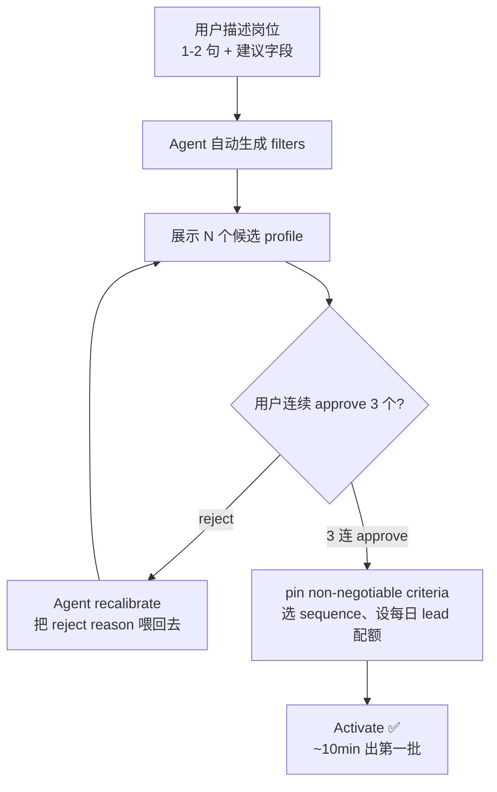

# Juicebox 的 Agent 编排——一个把"招聘"做成 Vertical Agent 的工程范式

!!! quote "原文出处"
    **来源**：Juicebox 官方博客（juicebox.ai/blog）+ 文档站（docs.juicebox.work）+ AWS Big Data Blog + PostHog Customer Story
    **读于**：2026-05-18
    **作者上下文**：Juicebox 是一家 YC S22 出身的 AI 招聘平台，2026-03 刚拿了 DST 领投的 $80M Series B，估值 $850M。CTO Ishan Gupta 自己写过 AWS 的架构博客。客户里有 Perplexity、Cursor、Ramp、Quora。

> 一句话定位：**Juicebox 把"AI 招聘"做成了一个 6 状态的 sourcing agent，编排逻辑非常 RecSys 而非 LangGraph——核心是"3-approval 冷启动 → 持续投递 → 反馈触发 recalibrate"的 HITL 循环，刻意不做 multi-agent 通信。**

---

## 🎯 它解决什么问题

招聘里"找候选人"这件事，过去十年的工具栈都是被动的：LinkedIn Recruiter / Greenhouse / Lever 给你 search box，你自己写 boolean query，自己翻页，自己发邮件。结果是招一个高级岗位，recruiter 平均要在 LinkedIn 上看 200+ 个 profile，发 50+ 封冷邮件，转化率被磨到很低。

更关键的痛点不在"搜不出来"，而在"持续性"——岗位开 30 天，市面上每天都有新人 update profile / 跳槽 / 被 layoff，但 recruiter 不可能每天把同一个 query 重跑一遍。

Juicebox 的判断是：**这不是搜索问题，是 worker pool 问题**。每个岗位应该对应一个 24/7 跑着的 agent，自己 search、自己 screen、自己发件、根据反馈自己校准——recruiter 只在"reviewer"位置上做判断，不再做执行。

这个产品形态的有意思之处不在 LLM 用得多花哨，而在**它把 agent 当 systemd unit 在管**——有状态机、有 seat 配额、有 timeout、有 recovery，不是 chat session。

---

## 🧩 它本质上是什么？

!!! tip "核心判断"
    **Juicebox Agent ≠ 通用 reasoning agent = 一个带状态机、HITL bootstrap 协议、和 per-agent calibration state 的窄域 vertical worker。**

它和市面上大家在讨论的 "agent" 不是同一种东西：

- 不是 ReAct loop——任务流是固定的 `search → screen → outreach` 三段式，没有动态决定下一步调哪个工具的环节
- 不是 multi-agent collaboration——每个 agent 独立 worker，没有 agent-to-agent 通信
- 不是 fine-tuned model——"real-time learning" 实际是 per-agent 的 prompt/criteria/ranker state 在线更新
- 不是 chat session——它有持久化生命周期，可以 pause、recalibrate、transfer ownership

更准确的类比：**它是把推荐系统的"日活召回 + 实时反馈重排"包了一层 LLM 皮**，外面套了 6 状态的 lifecycle 管理。

---

## 🏗️ 核心机制：6 状态机 + 3-Approval 冷启动

整个编排的骨架是状态机。官方文档里明确列了 6 种状态：

| 状态 | 含义 | 占 seat? |
|---|---|---|
| **Configuring** | 配置/校准中，未开跑 | ❌ |
| **Active** | 正在 sourcing 或发件 | ✅ |
| **Paused** | 手动暂停 / 4 天没人审 leads 自动暂停 | ✅ |
| **Out of Leads** | 候选池跑完了 | ✅ |
| **Failed** | 报错，需要从 Mission Control 退役 | ✅ |
| **Stopped** | 关闭，释放 seat | ❌ |

几个工程信号特别重要：

- **4 天 inactivity 自动 pause**——后端有 watcher 监控用户审 leads 的活跃度，避免 agent 空跑浪费配额。这意味着 Juicebox 把"用户参与度"当成 agent 的健康信号在监控
- **"Out of Leads" 是单独状态而非 stopped**——候选池有限，agent 会触底，触底后**主动发邮件提醒用户 recalibrate**。这是产品对"agent 不能假装永动"的诚实
- **Recalibrate 时 outstanding leads 会丢、shortlist 保留**——状态切换有副作用语义，说明底层有 sourcing 任务队列，recalibrate 会清队列但保留产出

### Bootstrap：3-Approval 冷启动协议

最有意思的设计是**agent 不能直接开跑**，必须通过一道"对齐校准"：

工程上这是个**主动学习 / preference elicitation 的硬阈值**：用 `3-in-a-row` 阻断"用户随手点 approve"的噪声。每次 reject 必须填理由，理由进 agent 的 calibration context。

这个协议解决的是 LLM agent 的一个根本问题——**用户描述的需求和 agent 理解的需求之间的 gap，不能靠"问几句"对齐**。3 个连续成功是个低成本但强力的对齐信号。

---

## 🔄 反馈循环：从批量再训练到实时校准

Agent 1.0 时代用户反馈是"等批量再训练"——你 reject 了几个，得等下次更新才生效。Agent 2.0（2025-09）把这条链路压成了**实时**：

- 每个 reject 带 reason → 立刻调整搜索策略和排序
- Approve / shortlist / sequence 全是隐式 reward
- "Real-time learning" 替代了批量再训练

这里有一个工程线索值得注意：CTO 在 PostHog 的 customer story 里直接说他们用 **PostHog × Langfuse 整合监控 LLM chain 各阶段延迟**。意味着每个 agent 的"决策链"是一串可被 trace 的 LLM 调用，而非黑盒推理——这反过来也是为什么 reject reason 可以"实时"生效：能看到链路就能改链路。

我的猜测是：底层不是在 fine-tune 模型，而是**per-agent 维护一份 calibration state**（pinned criteria + reject 理由库 + 用户隐式偏好），每次推理时把这份 state 注入到 ranking prompt 里。这套做法的优点是状态轻、部署快、可解释；缺点是 state 没法跨 agent 共享，每个 agent 都得自己冷启动。

---

## 🧱 Multi-Agent：刻意保持简单

Juicebox 的"multi-agent"和当下最热闹的 multi-agent collaboration 完全不是一回事。它的 multi-agent 是**配额维度**，不是协作维度：

- N 个独立 worker，按 role/function/market 切分
- 每个 agent 独立 search、独立校准、独立 outreach mailbox
- **没有 agent-to-agent 通信**——共享 layer 是 Mission Control 仪表盘 + ATS 数据
- 可以 transfer ownership（员工离职时把 agent 的整个配置过户给接手人，不用重建）

为什么不做协作？我认为这是产品判断而非工程能力问题——招聘场景里 agent 之间没什么真正需要交换的信息，强行做 multi-agent communication 反而会引入"哪个 agent 决定 final ranking"之类的不必要复杂度。

把 agent 当 k8s pod 而不是 actor，是这个产品最克制的一处。

---

## 🛠️ 与 Autopilot 的关系（容易混）

Juicebox 的两个核心功能——Agent 和 Autopilot——名字常一起出现，但工程含义不同：

|  | **Autopilot** (V3, 2025-10) | **Agent** (2.0, 2025-09) |
|---|---|---|
| 定位 | **同步**搜索增强 | **异步**长期 worker |
| 触发 | 用户主动跑 search | 一次配置后持续跑 |
| 输出 | 当场看到 ranked profiles + criteria 解释 | 每天 X 个 leads 进 inbox / sequence |
| 共享 | 共用同一 ranking criteria 框架 | Agent 的审阅 UX 反向移植到 Autopilot |

可以理解为：**Autopilot = sync 模式的同一引擎，Agent = async 模式 + 状态机 + 持续触发**。

这种"同步 / 异步双形态共享底层 ranking"的设计很值得借鉴——很多 vertical agent 产品的 sync 和 async 模式是两套独立工程，Juicebox 把它们做成了同一个引擎的两种调用方式。

---

## 🔌 Action Surface：Agent 能做什么

从博客和文档里能拼出来 agent 的工具调用面：

- **Search** — 800M profile 的 OpenSearch BM25 + k-NN 混合检索（CTO 在 AWS Big Data Blog 里有详细披露）
- **Email send** — 直连用户的 Gmail/Outlook mailbox，多 sender sequences、自动 reply drafting
- **ATS read/write** — 41 个 ATS（Ashby、Lever、Greenhouse）+ 21 个 CRM；可 `Only show ATS candidates` / `Exclude ATS candidates` / 自动 export
- **LinkedIn 任务** — 在 sequence 里加 LinkedIn touchpoint，连接请求活动可在平台内 log
- **Note 自动生成** — Approve lead 时自动生成 shortlist note（rating + criteria + reasoning）
- **Network Sourcing**（2026-04 新增）— 把团队成员的 LinkedIn connections 灌进图，把"陌生 lead"重写成"经 X 引荐的 lead"

注意这套工具调用面**没有"open browser"或"general code execution"**——刻意限定在招聘场景下的几个动词上。这又是一个 vertical agent 的特征：**工具集越窄，可靠性越高**。

---

## ⚠️ 难点 / 局限

Juicebox 这套范式的代价不是没有：

1. **强依赖用户活跃度**——4 天没人审 leads 就 auto-pause，这套设计假设了 recruiter 每天会上来。如果客户买了 agent 但实际没在用，agent 就是 paused 状态躺着。这在企业销售里可能是个问题——seat 卖出去了但价值没传递。
2. **冷启动有 friction**——3-approval 协议是好设计，但意味着新建 agent 不是"60 秒上线"。客户成功部门在 onboard 时一定要陪跑这一步，不然客户配了一半就放弃。
3. **per-agent state 不共享**——同一公司开了 30 个 agent，每个 agent 都得自己学一遍"我们公司喜欢什么样的人"。这是技术权衡（state 简单）但产品上是浪费。
4. **没有 reasoning agent 的弹性**——如果 recruiter 的需求是"这个岗位还没想好，先看看市场上有什么人"——这种探索性需求不太适合 Juicebox 的 worker 范式，更适合 Autopilot 的 sync 模式。
5. **"Failed" 状态语义模糊**——文档只说"报错从 Mission Control 退役"，但没说哪些是可恢复错误、哪些是数据源问题、哪些是 LLM 调用失败。这在 SLA 里是个隐患。

---

## 🎯 什么场景适合 / 不适合

### ✅ 适合

- **重复性、长期性的招聘岗位**——文档里点名："Find Technical Recruiters in the Bay Area"、"Find Account Executives in NYC" 这种 evergreen role
- **市场扫描 / 竞争情报**——"Find VPs at competitor X"、"Find SWEs who just went through layoff"
- **ATS rediscovery**——把过去面过但没招的银牌候选人重新激活
- **BD / 高定向 prospect list**——招聘 agent 框架其实可以跨界用到销售 lead gen

### ❌ 不太适合

- **一次性、独特的高管搜索**——3-approval 都对齐不到，agent 还没学会就招完了
- **需要复杂判断的 senior 岗位**——agent 能筛"有 X 年经验"但筛不出"文化契合"
- **ATS 数据脏的公司**——Network Sourcing 和 Internal Talent Rediscovery 都依赖 ATS 数据质量
- **不愿意每天审 leads 的 recruiter**——4 天 auto-pause 会反复触发

---

## 🤔 我的几点判断

!!! abstract "TL;DR"
    1. **3-approval 冷启动是被低估的好设计**——这套 preference elicitation 协议可借鉴到任何"长期 worker agent"，比让用户写"system prompt" 友好得多。
    2. **把 LLM agent 当 k8s pod 来管是对的**——状态机 + seat 配额 + 自动 timeout，比 chat session 范式更适合企业落地。
    3. **"Real-time learning" 大概率是 prompt-level 而非 weight-level**——用 per-agent calibration state 注入 ranking prompt，可解释、可回滚、可冷启动。
    4. **刻意不做 multi-agent collaboration 是产品上的克制**——很多场景里 agent 之间不需要通信，强行做协作只是给自己挖坑。
    5. **Autopilot + Agent 双形态共享底层是聪明的**——sync / async 不应该是两套工程。

如果让我用这套范式去做别的 vertical agent 产品（比如销售、合规、客服）——我会复制 4 个核心设计：
- 6 状态机 + seat 配额
- 3-approval 冷启动协议
- 4 天 inactivity auto-pause 作为活跃度信号
- Mission Control 仪表盘作为唯一的 multi-agent 共享面

不会复制的：
- 实时校准——这套对反馈密度要求高，很多场景拿不到这么多隐式信号
- per-agent 独立 mailbox——出站邮件场景才需要

---

## 🔗 延伸阅读

- [Juicebox Agents 2.0 公告](https://juicebox.ai/blog/agent-2-0) —— 最权威的产品视角
- [Agent 文档（含状态机）](https://docs.juicebox.work/juicebox-agents) —— 6 状态 + lifecycle 的完整描述
- [CTO Ishan 在 AWS Big Data Blog 的架构文](https://aws.amazon.com/blogs/big-data/juicebox-recruits-amazon-opensearch-service-for-improved-talent-search) —— OpenSearch + BM25 + k-NN + HNSW + PQ 的细节
- [PostHog Customer Story](https://posthog.com/customers/juicebox) —— LLM trace + Langfuse 集成的工程视角
- [Autopilot V3 公告](https://juicebox.ai/blog/autopilotv3-agentupdates) —— 同步形态怎么和 agent 互补
- [Network Sourcing](https://juicebox.ai/blog/introducing-network-sourcing) —— 2026-04 的 graph-augmented sourcing
- [Internal Talent Rediscovery](https://juicebox.ai/blog/internal-talent-rediscovery) —— Agent + ATS 的反向用法

---

*这是我读完 Juicebox 全部公开技术披露后的第一手判断——在一个所有人都在卷"通用 agent"的时刻，看一个把"窄域 + 状态机 + HITL"做到极致的产品反而很有启发。*
