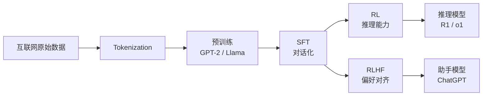

# Karpathy 的 3.5 小时 LLM 全栈课 —— 一张完整训练链概念地图

!!! quote "原文出处"
    **来源**：微信公众号《井底之硅》—— 《Karpathy 3.5 小时免费「LLM 全栈课」再登 X 热榜，640 万播放、11 万点赞，从 tokenization 一路讲到 RLHF》
    **首发**：2026-05-25
    **原文链接**：<https://mp.weixin.qq.com/s/QTY_X4y0W_1UG8HUM5xPoQ>
    **课程本体**：<https://www.youtube.com/watch?v=7xTGNNLPyMI>
    **读于**：2026-05-27

> 一句话定位：**它不是教你"怎么用 LLM"，是教你"LLM 是怎么被造出来的"——一张从互联网原始数据到 RLHF 对齐的完整概念地图，3.5 小时一遍走完。**

---

## 🎯 它解决什么问题

2024-2026 这两年学 AI 的人，市面上的课和教程基本都聚焦在**应用层**：prompt engineering、agent workflow、RAG、MCP、function calling……一层一层叠 abstraction，但底下那台「LLM」本身像个黑盒。

具体的痛点是：

- 你能写出 agent，但说不清楚为什么 GPT-4 偶尔在简单算术上犯傻（**tokenization 决定的**）
- 你知道有 hallucination，但说不清楚它是从训练流程的哪一步漏出来的（**SFT 阶段的知识 vs 工作记忆混淆**）
- 你听说过 RLHF，但说不清楚 DeepSeek-R1 的 RL 训练和 RLHF 是不是一回事（**不是，前者是 RL on reasoning，后者是 alignment**）
- 你用 ChatGPT 用了两年，但如果有人问"那个'记忆'到底是怎么实现的"，你只能含糊其辞

Karpathy 这门课的位置就在这里——**不教你写代码，只让你建立一张完整训练链的概念地图**：数据从哪儿来 → token 怎么切 → 网络在做什么 → 推理怎么跑 → 微调改了什么 → 幻觉为什么出现 → RL 在哪里发挥作用 → RLHF 让模型变得"可对话"是怎么做到的。

---

## 🗺️ 课程内容速览

3.5 小时按训练链时序排：

**预训练（Pretraining）**

- 00:01 — 互联网作为预训练数据源
- 00:08 — Tokenization
- 00:14 — 神经网络的输入输出
- 00:20 — 神经网络内部结构
- 00:31 — GPT-2 训练 + 推理
- 00:43 — Llama 3.1 基础模型推理

**监督微调（SFT）**

- 01:21 — 幻觉、工具使用、知识 vs 工作记忆

**强化学习（RL）**

- 02:15 — RL 基础
- 02:28 — DeepSeek-R1
- 02:42 — AlphaGo
- 02:48 — RLHF
- 03:22 — 总结

每个环节都是一个**真实工程问题**——不是抽象理论，是 OpenAI / Anthropic / DeepSeek / Meta 这些公司每天在干的事。

---

## 💡 为什么这门课值得反复出圈

公众号原文给的解释是"免费、稀缺、第一性原理"——这没错，但我觉得还有一层：**Karpathy 教学的核心 DNA 是"从零构建"**。

CS231n 是从 numpy 写 conv 开始的。minGPT 是用 < 300 行 Python 把 Transformer 全跑通。nanoGPT 是给你一个能在单 GPU 上跑通 GPT-2 训练的最小代码。Zero to Hero 系列是从 micrograd 一路讲到 reproducing GPT-2。

但《Deep Dive into LLMs》走的是不一样的路子——**它不要求你写代码**，但保留了"从零构建"的视角：每个环节都问"这一步具体在干什么、为什么必须这样、如果不这样会怎样"。

这就是为什么它在评论区反复被叫做 **"first principles"** —— 不是因为讲得多深，而是因为讲的每件事都被拆到了"最小可理解的模块"。

---

## 🤔 我的判断：什么人该看，什么人别看

**该看的人：**

- 写 agent / RAG / 应用层项目超过 6 个月，对底层一直含糊的人——这是一次"还债"的机会
- 准备转 LLM infra / 模型训练方向的人——这是面试/选 paper 的最低先验
- 学了一堆框架和 prompt trick，但说不清楚 base model 和 instruct model 区别的人

**别看的人（至少现在别看）：**

- 完全没碰过 ML 基础（线性代数 / 反向传播 / 梯度下降都没接触过）的人——课程标的是 general audience，但 Class Central 把它打成 **Advanced**，意思是"通俗化讲解技术内容"，不是"零基础入门"
- 想学怎么调 GPT 的人——这门课不教调用，教制造
- 时间紧只想拿 demo 上线的人——这门课不会让你下周代码能跑得更顺

**怎么看效率最高（我的建议）：**

1. **不要 1.0x 顺看**——这是 Karpathy 自己的语速 + 内容密度，1.5x 是更舒服的速度
2. **配 Class Central 章节索引**（公众号原文里有），按章节跳着看你最不熟的部分
3. **看完每个大块（pretraining / SFT / RL）后停一下**，自己用一句话复述这一块在做什么——能复述出来才算听进去了
4. **遇到 tokenization / RLHF 这种"听过但说不清"的环节**，重看 2 遍，配 minBPE / nanoGPT 的代码看实现细节

---

## 🔄 它在 Karpathy 教学体系里的位置

Karpathy 的免费内容是有清晰分轨的：

| 轨道 | 代表作 | 受众 |
|---|---|---|
| **通识轨**（这门课） | 《Deep Dive into LLMs like ChatGPT》 | 想理解 LLM 是怎么工作的，不要求写代码 |
| **技术轨** | Zero to Hero 系列 / nanoGPT / minGPT / minBPE | 要从零写 Transformer / tokenizer / GPT 训练 |

**正确的学习路径**是：先看通识轨建立地图，再按地图找技术轨的具体代码项目深挖。如果你直接从 nanoGPT 开始，会有大量"为什么这样设计"的问题没有上下文；如果只看通识轨不动手，又只是"知道但不会"。

---

## 📊 社区反应作为间接验证

公众号原文给的数据点（采集时）：

- YouTube 播放 **640 万**，点赞 **11.4 万**
- 原始 X 帖（Karpathy 自发，2025-02）浏览 **237 万**，点赞 **2 万+**
- Hacker News 有两轮高热度讨论：原始视频帖 **582 points**，TL;DR 总结帖 **380+ points**
- 一年多以后（2026-05）再次被翻出来推到 X 热榜

**社区用脚投票**——这种"放出来一年还在被推荐"的内容，在快速迭代的 AI 领域是稀缺的信号。同期发布的 95% 的内容半年内就过期了。

---

## ⚠️ 也要冷静看

公众号原文里那句 *"Karpathy 本可以为这门课收 2000 美元"* 是 X 博主 AilaunchX 的主观吹捧，不是 Karpathy 自己的说法。"the most comprehensive LLM education that exists anywhere at any price" 也是同一来源的推荐评语。这些都是营销话术，**不要被它绑架**。

实际上：

- 这门课**不是工程课**，不带作业、不带项目、不带评分。看完不会让你"会训练 LLM"
- 主题跨度大，**任何一个环节深挖都需要再额外几十小时**——这门课更像是"让你知道哪里值得深挖"
- 2025-02 的视频，DeepSeek-R1 部分是当时最新的，但**当下 2026-05 看，R1 之后的 RL 进展（v3 / v3.1 / 各种 GRPO 变种）已经不在课里了**——课的"时效价值"主要在前 2.5 小时（pretraining + SFT + 通用 RL 框架），后 1 小时的具体案例已经有点旧

---

## 📌 我接下来会怎么用它

写完这篇笔记后，我自己的计划：

1. **先 1.5x 看一遍**整个 3.5 小时，作为概念地图基线
2. **回头精看 tokenization + hallucination + RLHF** 这三段——是我做 agent 工程时最常踩到、又一直没搞清楚的环节
3. **把 minBPE 跑一遍**——课里讲到 BPE 时配代码看
4. **后面遇到 base model vs instruct model / 推理模型 vs 助手模型 / RL on reasoning vs RLHF 这种概念**，回到对应章节回看

如果你也准备啃这门课，我们可以**之后专门开一篇笔记**，对比 Karpathy 讲的 RLHF 和 DeepSeek-R1 公开的 GRPO 训练流程之间的对应关系——那是这门课最容易"看完就忘"的部分。

---

## 🔗 延伸阅读

- 课程本体：<https://www.youtube.com/watch?v=7xTGNNLPyMI>
- Karpathy 个人课程页：<https://karpathy.ai/>（含技术轨 / 通识轨划分）
- Zero to Hero 系列起点：<https://www.youtube.com/playlist?list=PLAqhIrjkxbuWI23v9cThsA9GvCAUhRvKZ>
- nanoGPT 项目：<https://github.com/karpathy/nanoGPT>
- minBPE（tokenizer 实现）：<https://github.com/karpathy/minbpe>
- 《井底之硅》公众号导读原文：<https://mp.weixin.qq.com/s/QTY_X4y0W_1UG8HUM5xPoQ>

---

*免费的 3.5 小时换来一张完整地图——这是 2026 年 AI 学习路径里 ROI 最高的一笔投资之一。*
