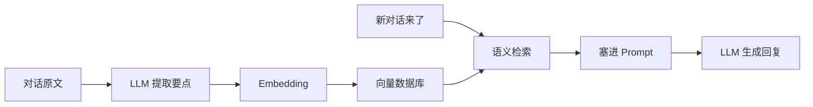

# Mem0 研究备忘

!!! quote "原文出处"
    **来源**：公众号「深度烘焙 · Bold Roast」 — 《Mem0 研究备忘》
    **读于**：2026-05-14
    **原作者**根据 Mem0 的 18 篇官方文档 + 源码做的系统综述。

> 一句话定位：**Mem0 是给 AI Agent 装"长期记忆"的中间件 —— 本质是一个垂直化的 RAG 框架包装器。**

---

## 🎯 它解决什么问题

ChatGPT 这类 LLM 的天花板之一是**没有长期记忆**：每次对话都从零开始，记不住你昨天说过的偏好、上周做过的事、上个月的对话上下文。

Mem0 要做的就是把"记忆"抽象成一层独立的中间件，让 Agent 可以：

- 📥 **写入** —— 自动从对话里提取值得记住的信息
- 🔍 **检索** —— 下次对话时把相关记忆调回来塞进 Prompt
- 🗑️ **更新/淘汰** —— 信息过期了能修正、能删除

---

## 🧩 它本质上是什么？

::: tip 核心判断
**Mem0 ≠ 全新的记忆架构 = 一个垂直在"对话场景"上的 RAG 包装器。**
:::

底层用的还是 RAG 那一套：

**它的"价值"在于把对话场景的 RAG 流程做成开箱即用**，而不是发明了新算法。理解这一点很关键 —— 不要被它官方宣传的"AI 记忆层"唬住。

---

## 🏗️ 两种部署模式

| 维度 | Mem0 Platform（云服务） | Mem0 OSS（开源版） |
|---|---|---|
| **部署** | 云端，注册即用 | 自己部署 |
| **存储** | 他们托管 | 自己接 Qdrant / Chroma / Pinecone 等 |
| **隐私** | 数据上传到他们服务器 | 自己控制 |
| **成本** | 按量付费 | 服务器/向量库成本自理 |
| **扩展性** | 受限于他们的 API | 可改源码、加自定义逻辑 |

::: warning 选型建议
- 个人 / Demo：直接用 Platform，省心
- 生产 / 涉密：必须 OSS，且要做大量改造（详见后文）
:::

---

## 🔄 核心管道

### 写入管道（Add Pipeline）

当一段新对话进来时：

1. **提取**：LLM 调用一次，从原文里抽取 N 条候选记忆（事实、偏好、决策…）
2. **判定**：跟现有记忆库比对 —— 这条是新的？是旧记忆的更新？还是冲突？
3. **写入**：根据判定结果做 ADD / UPDATE / DELETE

### 检索管道（Search Pipeline）

新一轮对话来时：

1. **生成 query**：从用户消息生成检索 query
2. **向量检索**：从向量库捞 Top-K 相关记忆
3. **塞 Prompt**：把检索到的记忆作为 system / context 加进去

::: note V3 版本的关键变化
2026 年 V3 版本抛弃了"复杂的 ADD/UPDATE/DELETE 决策树"，改成**纯增量提取 + MD5 哈希去重**。简化了不少，但牺牲了一些"主动更新旧记忆"的能力。
:::

---

## 🧱 四层记忆模型

Mem0 的一大亮点是把记忆按"作用域"分了四层：

| 层级 | 范围 | 例子 | 生命周期 |
|---|---|---|---|
| **Conversation** | 单次对话 | "用户刚说他叫张三" | 对话结束就清掉 |
| **Session** | 单个会话 | "用户这次咨询的是退款" | 几小时 ~ 几天 |
| **User** | 单个用户 | "用户喜欢吃辣" | 永久（除非删除） |
| **Org / Agent** | 整个组织 | "公司的产品价格表" | 跨用户共享 |

::: tip 这是真有用的设计
四层不是 Mem0 独家，但它**做成了开箱即用的 API**。比起从头自己设计记忆层级，省了不少思考成本。
:::

---

## ⚠️ 两个核心难题（也是没解决好的地方）

### 1. **"什么值得记？"是个老大难**

Mem0 默认靠 LLM 自己判断哪些信息值得记 —— 但**LLM 经常记错重点**：

- 把临时的玩笑话记成"用户偏好"
- 漏记真正重要的决策
- 把过时信息当成新事实

实际生产中，**记忆的"召回率"和"精确率"都需要大量调优**，不是装上就完事。

### 2. **检索时的语义鸿沟**

向量检索的老问题在记忆场景被放大：

- 用户问"我上次提到那个项目还要做吗？" —— 怎么把"那个项目"关联到具体记忆？
- 同一件事用不同说法描述，向量距离可能很远
- 时间维度（"上周"、"上个月"）向量库不天然支持

这两个问题不是 Mem0 独有，是**所有"对话长记忆"系统的共同瓶颈**。

---

## 🎯 什么场景适合用 / 不适合用

### ✅ 适合用

- **个性化对话助手**：需要记住用户偏好、历史交互
- **客服机器人**：跨会话保留客户信息（订单、投诉历史）
- **个人 AI 伙伴**：长期陪伴类产品（Replika、Character.ai 这类）
- **快速 demo 和原型**：想验证"加上记忆能不能提升体验"，几行代码就能跑

### ❌ 不太适合

- **需要严格事实准确性的场景**（医疗、法律、金融）—— LLM 提取的记忆有幻觉风险
- **结构化数据为主的场景** —— 直接用关系数据库比向量库更靠谱
- **高频写入 / 海量数据** —— Mem0 的写入管道每条都要 LLM 调用，成本和延迟双重压力
- **需要复杂时序推理** —— 当前向量检索弱时序

---

## 🤔 我的几点判断

!!! abstract "TL;DR"
    1. **Mem0 是好工具，但不是银弹** —— 它是 RAG 在对话场景的一个不错的封装，不是新范式
    2. **四层记忆模型值得借鉴** —— 即使不用 Mem0，自己设计记忆系统也可以参考这个分层
    3. **生产环境至少要做三件事**：换成 OSS + 调 LLM 提取 prompt + 加业务规则兜底（比如"金额相关的必须人工确认"）
    4. **2026 年初的进展**：Agentic RAG、Memory + Knowledge Graph 等方向都在抢 Mem0 的地盘，长期看 Mem0 不一定能站稳

## 🔗 延伸阅读

- [Mem0 GitHub](https://github.com/mem0ai/mem0) —— 53k+ Star，活跃开发中
- [Mem0 论文](https://arxiv.org/abs/2504.19413) —— "Mem0: Building Production-Ready AI Agents with Scalable Long-Term Memory"
- [Agentic RAG 概念](https://www.anthropic.com/news/contextual-retrieval) —— 比 Mem0 更通用的方向
- [Letta（前 MemGPT）](https://github.com/letta-ai/letta) —— 另一种记忆架构思路，从操作系统视角设计

---

*这是这个数字花园里的第一篇沉淀文章。如果你看到这里 —— 谢谢你 🌱*
