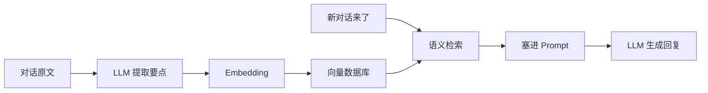

# Mem0 研究备忘

!!! quote "原文出处"
    **来源**：公众号「深度烘焙 · Bold Roast」 — 《Mem0 研究备忘》
    **读于**：2026-05-14
    **原作者**根据 Mem0 的 18 篇官方文档 + 源码做的系统综述。

> 一句话定位：**Mem0 是给 AI Agent 装"长期记忆"的中间件 —— 本质是一个垂直化的 RAG 框架包装器。**

---

## 🎯 它解决什么问题

ChatGPT 这类 LLM 的天花板之一是**没有长期记忆**：每次对话都从零开始，记不住你昨天说过的偏好、上周做过的事、上个月的对话上下文。

Mem0 要做的就是把"记忆"抽象成一层独立的中间件，让 Agent 可以：

- 📥 **写入** —— 自动从对话里提取值得记住的信息
- 🔍 **检索** —— 下次对话时把相关记忆调回来塞进 Prompt
- 🗑️ **更新/淘汰** —— 信息过期了能修正、能删除

---

## 🧩 它本质上是什么？

::: tip 核心判断
**Mem0 ≠ 全新的记忆架构 = 一个垂直在"对话场景"上的 RAG 包装器。**
:::

底层用的还是 RAG 那一套：



**它的"价值"在于把对话场景的 RAG 流程做成开箱即用**，而不是发明了新算法。理解这一点很关键 —— 不要被它官方宣传的"AI 记忆层"唬住。

---

## 🏗️ 两种部署模式

| 维度 | Mem0 Platform（云服务） | Mem0 OSS（开源版） |
|---|---|---|
| **部署** | 云端，注册即用 | 自己部署 |
| **存储** | 他们托管 | 自己接 Qdrant / Chroma / Pinecone 等 |
| **隐私** | 数据上传到他们服务器 | 自己控制 |
| **成本** | 按量付费 | 服务器/向量库成本自理 |
| **扩展性** | 受限于他们的 API | 可改源码、加自定义逻辑 |

::: warning 选型建议
- 个人 / Demo：直接用 Platform，省心
- 生产 / 涉密：必须 OSS，且要做大量改造（详见后文）
:::

---

## 🔄 核心管道

### 写入管道（Add Pipeline）

当一段新对话进来时：

1. **提取**：LLM 调用一次，从原文里抽取 N 条候选记忆（事实、偏好、决策…）
2. **判定**：跟现有记忆库比对 —— 这条是新的？是旧记忆的更新？还是冲突？
3. **写入**：根据判定结果做 ADD / UPDATE / DELETE

### 检索管道（Search Pipeline）

新一轮对话来时：

1. **生成 query**：从用户消息生成检索 query
2. **向量检索**：从向量库捞 Top-K 相关记忆
3. **塞 Prompt**：把检索到的记忆作为 system / context 加进去

::: note V3 版本的关键变化
2026 年 V3 版本抛弃了"复杂的 ADD/UPDATE/DELETE 决策树"，改成**纯增量提取 + MD5 哈希去重**。简化了不少，但牺牲了一些"主动更新旧记忆"的能力。
:::

---

## 🧱 四层记忆模型

Mem0 的一大亮点是把记忆按"作用域"分了四层：

| 层级 | 范围 | 例子 | 生命周期 |
|---|---|---|---|
| **Conversation** | 单次对话 | "用户刚说他叫张三" | 对话结束就清掉 |
| **Session** | 单个会话 | "用户这次咨询的是退款" | 几小时 ~ 几天 |
| **User** | 单个用户 | "用户喜欢吃辣" | 永久（除非删除） |
| **Org / Agent** | 整个组织 | "公司的产品价格表" | 跨用户共享 |

::: tip 这是真有用的设计
四层不是 Mem0 独家，但它**做成了开箱即用的 API**。比起从头自己设计记忆层级，省了不少思考成本。
:::

---

## ⚠️ 两个核心难题（也是没解决好的地方）

### 1. **"什么值得记？"是个老大难**

Mem0 默认靠 LLM 自己判断哪些信息值得记 —— 但**LLM 经常记错重点**：

- 把临时的玩笑话记成"用户偏好"
- 漏记真正重要的决策
- 把过时信息当成新事实

实际生产中，**记忆的"召回率"和"精确率"都需要大量调优**，不是装上就完事。

### 2. **检索时的语义鸿沟**

向量检索的老问题在记忆场景被放大：

- 用户问"我上次提到那个项目还要做吗？" —— 怎么把"那个项目"关联到具体记忆？
- 同一件事用不同说法描述，向量距离可能很远
- 时间维度（"上周"、"上个月"）向量库不天然支持

这两个问题不是 Mem0 独有，是**所有"对话长记忆"系统的共同瓶颈**。

---

## 🎯 什么场景适合用 / 不适合用

### ✅ 适合用

- **个性化对话助手**：需要记住用户偏好、历史交互
- **客服机器人**：跨会话保留客户信息（订单、投诉历史）
- **个人 AI 伙伴**：长期陪伴类产品（Replika、Character.ai 这类）
- **快速 demo 和原型**：想验证"加上记忆能不能提升体验"，几行代码就能跑

### ❌ 不太适合

- **需要严格事实准确性的场景**（医疗、法律、金融）—— LLM 提取的记忆有幻觉风险
- **结构化数据为主的场景** —— 直接用关系数据库比向量库更靠谱
- **高频写入 / 海量数据** —— Mem0 的写入管道每条都要 LLM 调用，成本和延迟双重压力
- **需要复杂时序推理** —— 当前向量检索弱时序

---

## 🤔 我的几点判断

!!! abstract "TL;DR"
    1. **Mem0 是好工具，但不是银弹** —— 它是 RAG 在对话场景的一个不错的封装，不是新范式
    2. **四层记忆模型值得借鉴** —— 即使不用 Mem0，自己设计记忆系统也可以参考这个分层
    3. **生产环境至少要做三件事**：换成 OSS + 调 LLM 提取 prompt + 加业务规则兜底（比如"金额相关的必须人工确认"）
    4. **2026 年初的进展**：Agentic RAG、Memory + Knowledge Graph 等方向都在抢 Mem0 的地盘，长期看 Mem0 不一定能站稳

## 🔗 延伸阅读

- [Mem0 GitHub](https://github.com/mem0ai/mem0) —— 53k+ Star，活跃开发中
- [Mem0 论文](https://arxiv.org/abs/2504.19413) —— "Mem0: Building Production-Ready AI Agents with Scalable Long-Term Memory"
- [Agentic RAG 概念](https://www.anthropic.com/news/contextual-retrieval) —— 比 Mem0 更通用的方向
- [Letta（前 MemGPT）](https://github.com/letta-ai/letta) —— 另一种记忆架构思路，从操作系统视角设计

---

*这是这个数字花园里的第一篇沉淀文章。如果你看到这里 —— 谢谢你 🌱*

---

## 📄 原文全文

> 本节为转载存档，便于离线和后续翻阅。  
> **原文作者**：深度烘焙（公众号 Bold Roast）  
> **原文链接**：<https://mp.weixin.qq.com/s/lvrzWA23dr0fgTpGTHVUkA>  
> **完成时间**：2026 年 4 月

本文基于 Mem0 官方文档（18 篇）的系统研读，梳理其核心设计、技术本质和实践难点，为团队评估 "AI 记忆 " 方案提供决策参考。

---

### 一、Mem0 是什么

#### 定位

Mem0 是一个面向 AI Agent 记忆场景的垂直 RAG（Retrieval-Augmented Generation，检索增强生成）封装。它将 " 让 AI 跨会话记住用户信息 " 这件事，从散装零件打包成了开箱即用的 SDK/API。

其核心管线本质上是标准的 RAG 模式：

```
用户对话 → 清洗/提取 → 存入向量库 → 语义检索 → 拼进 Prompt → 生成回答
```

技术上没有新发明。 Mem0 的价值不在底层技术创新，而在工程封装和场景抽象——把 " 给 AI 加记忆 " 所需的提取、去重、分层、检索、合规删除等环节整合为一套统一接口。

#### 产品矩阵

Mem0 提供两种部署形态，面向不同阶段的团队：

| 维度 | Platform（托管版） | OSS（开源自建版） |
| --- | --- | --- |
| 部署方式 | 云端 API，5 分钟接入 | 自建基础设施，完全掌控 |
| Dashboard | 有，可视化管理记忆 | 无，依赖 CLI / 日志 |
| Graph Memory | 按请求开关 | 需自行配置图数据库 |
| 批量操作 | 支持（≤1000 条/次） | 需自行编写脚本 |
| 合规场景 | 依赖 Mem0 的数据策略 | 数据完全自主可控 |

需注意：两个版本的 API 路径不同（Platform 用`/v1/`前缀，OSS 不用），且 TypeScript SDK 在功能覆盖上明显弱于 Python——Update、Delete 等操作在 JS 端尚未支持。

---

### 二、核心设计拆解

#### 写入管线（Add）

当开发者调用`add()`时，Mem0 内部执行以下管线：

```
对话输入  ↓① LLM 提取事实（custom_fact_extraction_prompt）  → 输出 {"facts": ["fact1", "fact2", ...]}  ↓② LLM 冲突解决（custom_update_memory_prompt）  → 将新事实与已有记忆对比  → 对每条记忆做出决策：ADD / UPDATE / DELETE / NONE  ↓③ 生成 Embedding（向量化表示）  ↓④ 写入 Vector Store + 可选写入 Graph Store
```

关键设计决策：

- 整个提取和冲突解决过程由 LLM 驱动，不是代码规则。开发者通过编写 Prompt 和 Few-shot 示例（少样本示例，给 LLM 提供正反例来引导其行为）来控制提取行为。
- `infer`参数是核心开关：`infer=True`（默认）走完整管线；`infer=False`跳过 LLM 提取和冲突解决，直接存储原始内容。两种模式不可混用同一事实，否则会产生重复。
- 每次 add 至少触发 3 次 LLM 调用（提取 + 冲突解决 + Embedding），若开启 Graph Memory 还要额外调用一次实体关系提取。写入是整个系统中成本最高的操作。
- 触发时机由开发者决定。Mem0 不会自动监听对话并决定何时存储，开发者需要自行判断并主动调用`add()`。例外是 Proxy 模式和 MCP（Model Context Protocol，模型上下文协议）模式，可实现自动化写入。

#### 检索管线（Search）

当开发者调用`search()`时，执行以下管线：

```
自然语言 Query  ↓① Query Processing（内置，不可配置，黑盒）  → 对 query 做清洗和增强  ↓② Vector Search（向量相似度搜索）  → Embedding 后做 Cosine Similarity（余弦相似度）匹配  ↓③ Metadata Filtering（结构化条件过滤）  → 支持 AND / OR / NOT 逻辑组合  → 按 user_id、日期、分类等字段硬筛  ↓④ Reranker（重排序，可选）  → 专门的模型对候选结果二次打分  ↓⑤ Graph Enrichment（图谱补充，可选）  → 从图数据库查询关联实体，附加到结果中  ↓返回 {results[], relations[]}
```

关键设计决策：

- Query Processing 是黑盒。文档声明 Mem0 会对 query 做 "clean and enrich"，但具体逻辑未公开，开发者无法配置或干预。
- Reranker 和 Graph 是独立的增强层，可按请求级别通过`rerank=True`和`enable_graph=True`开关，不启用时延迟最低。
- Graph 不参与排序。它只在返回结果中附加`relations`数组提供关联上下文，不会改变向量搜索的排序结果。
- 不同向量数据库对 Filter 操作符的支持程度不同（如 Qdrant 全量支持，Chroma 仅支持基础比较），且不支持的操作符会被静默忽略而非报错，这是一个隐患。

#### 记忆分层模型

Mem0 将记忆分为四层，对应不同的生命周期和使用场景：

| 层级 | 生命周期 | 作用域标识 | 典型场景 |
| --- | --- | --- | --- |
| Conversation | 单次响应 | 当前 turn | 工具调用中间态、链式推理过程 |
| Session | 分钟~小时 | `session_id` | 多步骤流程（Onboarding、Debug） |
| User | 周~永久 | `user_id` | 个性化偏好、账户状态 |
| Org | 全局配置 | 跨 agent/团队 | 共享 FAQ、产品目录、策略 |

流转机制为 Capture → Promote → Retrieve：消息先进入 Conversation 层，根据`user_id`/`session_id`等标识自动提升到更持久的层，查询时跨层合并，优先级为 User > Session > History。

#### 设计哲学总结

Mem0 的整体设计哲学可以概括为：智能集中在读写两端，存储层是确定性工程。

| 环节 | 驱动方式 | 智能程度 |
| --- | --- | --- |
| 写入（提取 + 冲突解决） | LLM + Prompt | 高，但不确定 |
| 存储（向量库 + 图数据库） | 代码逻辑 | 确定性 |
| 检索（语义搜索 + 过滤 + 重排） | Embedding + Reranker | 高，但有天花板 |
| 更新 / 删除 | 手动指定 memory_id | 低，传统 CRUD |

---

### 三、做好 AI 记忆的核心难点

Mem0 作为封装框架降低了工程成本，但 "AI 记忆 " 这个问题本身的核心难点，不会因为用了什么框架而消失。

#### 难点一：写入—什么值得记

" 什么信息值得存入长期记忆 " 没有标准答案，且高度依赖业务场景。

几个典型的模糊边界：

- " 我不喜欢辣 " → 值得记（长期偏好）
- " 帮我查一下天气 " → 不值得记（一次性请求）
- " 我下周要去东京 " → 要记，但有时效性，过期后应失效
- " 我老婆也不吃辣 " → 要记，但涉及关系推理（家庭偏好）

Mem0 用 LLM + Custom Prompt 做 " 软判断 "：通过自然语言指令和 Few-shot 示例引导 LLM 提取特定类型的事实。这种方式灵活但有代价：

- 不确定性：同样的输入，LLM 可能偶尔给出不同的提取结果
- 不可审计：没有明确的规则链路，出问题时只能看结果对不对，不知道 " 为什么这次没提取到 "
- 依赖 Prompt 质量：Prompt 写得不好，提取质量就差，且没有编译器帮你检查

如果需要确定性更高的方案，需要在 Mem0 外层包一层代码逻辑做预过滤，或使用`infer=False`完全由业务代码决定存储内容。实际落地中，大概率需要**" 软判断 + 硬规则 " 混合**，而这个混合比例没有通用最优解，需要逐场景调试。

#### 难点二：检索—语义鸿沟

用户说的话和存储的记忆之间，经常存在语义上的间接关联，而非直接的文本相似。

典型场景：

```
已存记忆: "用户对坚果过敏"用户新输入: "推荐一款蛋糕"
```

理想情况下系统应召回 " 坚果过敏 "，因为很多蛋糕含坚果成分。但从 Embedding 相似度看，" 蛋糕 " 和 " 坚果过敏 " 的向量距离可能并不近——它们之间的关联是常识推理，不是语义相似。

这是纯向量搜索的结构性天花板：它能找到 " 说法不同但意思相近 " 的内容，但找不到 " 表面不相关但逻辑上应该关联 " 的内容。

Mem0 提供的补偿手段：

- Reranker：用更强的模型对候选结果二次打分，减少误召回，但无法召回初始 Vector Search 就漏掉的内容
- Graph Memory：通过显式的实体 - 关系图谱弥补 Embedding 捕捉不到的间接关联，但需要额外维护图数据库，且依赖 LLM 提取关系的准确性

这些是补偿手段而非根治方案。

#### 本质瓶颈

两个难点的本质是同一个问题：LLM 的理解能力是整个系统的天花板。

| 环节 | 依赖 LLM 做什么 | 失败模式 |
| --- | --- | --- |
| 写入 | 判断 " 值不值得记 " | 该记的没记，不该记的存了一堆 |
| 检索 | 通过 Embedding 匹配相关性 | 表面相似的召回了，真正需要的漏掉了 |

因此，做好 AI 记忆不是一次性的工程任务，而是需要持续运营的系统：

1. 提取 Prompt 需要持续迭代：基于实际对话数据不断优化提取规则，覆盖新出现的边界情况
2. 检索质量需要评估体系：能衡量 " 该召回的是否召回了（Recall）、不该召回的是否过滤了（Precision）"，然后用数据驱动调优 Reranker、Filter、Graph 的组合策略

---

### 四、适用性建议

#### 适合使用 Mem0 的场景

- 快速验证阶段：想用最低成本测试 " 加记忆是否对产品体验有效 "
- 团队无 RAG 经验：不想从零搭建向量库 + 提取逻辑 + 去重策略
- 多用户隔离是刚需：`user_id`/`session_id`/`agent_id`内置，省去多租户（Multi-tenancy，多个用户共享系统但数据隔离的架构）设计
- 合规删除是硬要求：`delete_all(user_id=…)`一行代码满足 GDPR（General Data Protection Regulation，欧盟通用数据保护条例）/ CCPA（California Consumer Privacy Act，加州消费者隐私法案）

#### 不适合使用 Mem0 的场景

- 对确定性要求极高：核心链路依赖 LLM 软判断，无法保证每次提取和召回结果一致
- 需要深度定制提取逻辑：虽然支持 Custom Prompt，但 Query Processing 等环节仍为黑盒，无法完全掌控
- 已有成熟 RAG 基础设施：Mem0 的封装层反而成为额外抽象，增加调试复杂度

#### 如果选择自建

核心投入应聚焦在两件事上，而不是纠结选什么向量库或框架：

1. 定义并迭代提取规则：明确你的业务场景下 " 什么值得记 "，用 Prompt + 代码规则混合覆盖，持续用真实对话数据验证和优化
2. 建立检索质量评估体系：构建测试集，量化 Recall 和 Precision，用数据驱动 Reranker、Filter、Graph 等组件的选型和调参

---

备忘完成时间：2026 年 4 月数据来源：Mem0 官方文档（18 篇），含 Overview、Quickstart、Memory Types、CRUD Operations、Graph Memory、Metadata Filtering、Reranker Search、Async Memory、Multimodal Support、Custom Prompts、REST API、OpenAI Compatibility、LLM Configurations
