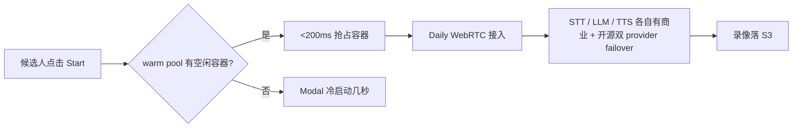

# Mercor 不是招聘公司——它在做 AI 经济的人类知识基础设施

!!! quote "原文出处"
    **来源**：Mercor 官方博客（mercor.com/blog）+ TechCrunch / CNBC / Forbes / TIME 报道 + APEX 系列技术报告（arXiv）+ Mercor Engineering 系列（Monty / Contracts / Payments）
    **读于**：2026-06-08
    **作者上下文**：Mercor 由三个 21 岁 Thiel Fellow 在 2023 年创立（CEO Brendan Foody、CTO Adarsh Hiremath、COO Surya Midha）。2025-02 拿了 Felicis 领投的 $100M Series B（$2B 估值）；2025-10 拿了同一领投的 $350M Series C（$10B 估值，5x Series B）。2026 年从 $0 到 $500M ARR 用了 17 个月，跨过 $1B annualized run rate，每天向全球 30,000+ 周活承包人支付超过 $200 万。Forbes AI 50 连续两年上榜，被 Mag 7 里 6 家使用。

> 一句话定位：**外界把 Mercor 看成"AI 版 LinkedIn Recruiter"，但它真正的产品是一条把人类专业知识结构化成 RLHF / 后训练数据的流水线——招聘只是这条流水线的入口。它是 AI labs 的 Uber，不是企业的 Greenhouse。**

---

## 🎯 它解决什么问题

过去两年所有人都在惊叹模型能力的飞跃，但有一个反差很少被点破：**模型变强了，企业的工作流根本没动**。Foundation model 像一群顶尖大学新人——智商够，但你扔进一家公司，没人 onboard、不懂工具、不懂"在我们这家公司什么叫做得好"，他们就是废的。

Mercor 的判断是：要把模型从"benchmark 高分"推到"在企业里干活"，差的不是 GPU，是**用人类专家的判断把模型训进每一个 vertical 工作流**——律师怎么 redline 合同、银行 analyst 怎么搭模型、医生怎么读片、咨询顾问怎么写 deck。

而这件事的瓶颈不是算法，是**找到对的人、把他们的知识结构化、按需调度**。当前所有 AI labs 都把"环境构建"（building task environments that mimic real professional contexts）的预算 10x：

- 单家 lab 一年在人类专家数据上花 **$1B+**
- 美国就有 **800+ 种职业**，每种又有几十种核心工作流，乘起来是天文数字
- 没有一家 AI lab 想从 0 自建几百万人的专家网络——operationally 太复杂，时间也来不及

这是一个非常古典的"卖铲子"位置：**当下游 6 家 Mag 7 都在烧钱挖金矿，谁能稳定供应铲子谁就赚最多**。Mercor 占住的就是这个位置——它不是给企业做招聘工具，而是给 AI labs 做"专家即数据"的供应链。

招聘只是入口。前端是 AI 面试 + 简历过滤 + 候选人匹配，看起来像招聘平台；但 Mercor 的真实收入结构里**绝大部分来自 AI labs 的小时费**，把医生、律师、PhD、银行家放到 lab 的训练 / RLHF / eval 任务里，按 trajectory 计费。

---

## 🧩 它本质上是什么？

!!! tip "核心判断"
    **Mercor ≠ AI 招聘平台 = 一个把"人类专业知识"做成可调度资源池的 vertical 数据基础设施。它在 AI 供应链上的位置类似于 AWS 在云计算供应链上的位置——往上走它做评测（APEX）反向定义模型能力，往下走它在做 enterprise agent 部署的 last mile。**

它和市面上 Juicebox / Eightfold / HireVue 这些"AI 招聘"产品不是一个赛道：

| 比较维度 | 传统 AI 招聘（Juicebox / HireVue） | Mercor |
|---|---|---|
| 客户 | 企业 HR / Recruiter | **AI labs**（占大头）+ 企业 |
| 价值主张 | 帮企业招到人 | 把专家"按任务"租给 lab 做训练数据 |
| 收入模型 | SaaS 订阅 / 招聘成功费 | **小时费**（按 expert × 时长计费） |
| 候选池形态 | 企业自己的 ATS pool | **400 万 vetted 专家 + 190 万 referral**，全球分布 |
| 真正的产品 | search + outreach + ATS | **Monty（AI 面试）+ APEX（评测）+ 数据 / 后训练流水线** |
| 一年估值 | $250M（Juicebox Series A 时） | **$10B**（Mercor Series C，相同时间维度） |

更准确的类比有两个：

1. **它是 Uber for experts**——把"知识工作"切成可调度的 task，和 driver/host 不同的是，Mercor 的供给侧是医生、律师、PhD，不是司机。两边都是双边市场，都是按使用量计费，都靠 vetting + matching 维持质量
2. **它是 Scale AI 的下一代**——Scale 把"标注"做成了独角兽，Mercor 把"专家级标注 + 评估 + RLHF 反馈"做成了 Mag 7 都在用的供应链。区别在于：Scale 主要做视觉 / 自动驾驶 / 通用 NLP 标注，Mercor 主要做 **vertical 知识工作的轨迹级数据**（医学、法律、金融、咨询的 long-horizon trajectory）

---

## 🤖 Monty：每天 1 万场 15 分钟 AI 面试是怎么撑起来的

如果说 Mercor 是 AI 数据供应链的"漏斗"，**Monty 就是这个漏斗的入口阀门**。它是一个语音 AI 面试官，每 9 秒就有一个人开始一场面试，每场 15 分钟，每天 ~10,000 场，覆盖几百个职业类别。

工程上他们公开拆了三个核心问题：**会话存活、对话节奏、面试匹配**。

### 1. 会话存活：warm pool + 多 provider failover



几个关键工程信号：

- **每场面试一个独立 Modal 容器**——隔离故障域，单容器崩只影响 1 场。2025 年从每周几百场扩到每天 1 万场，**hosting 没改**，改的是冷启动策略
- **warm pool 双层**：Modal 在 compute 层面预热 ~30 个容器；后台 cron 每 5 分钟保 ~10 个**完全初始化好**（Daily room URL 在 Redis 里），抢占在 200ms 以下
- **配额按小时拟合**：太少冷启动漏到峰值用户，太多浪费。他们按小时跟踪 demand 提前 scale。典型一天峰值 200 容器（中午）、低谷 80（凌晨）
- **Blue-green 跨周部署**：任何 prompt / config 改动 blue-green rollout 一整周，**坏 prompt 不会一次毁 1000 场面试**——这个是企业级数据供应必须的，candidate 没有第二次机会

### 2. 对话节奏：700ms 的"自然感"

人觉得"自然"的对话回复延迟在 ~800ms。Monty 的语音 pipeline 跑在 Pipecat（Daily 开源的 voice AI 框架）上，端到端 streaming：

| 阶段 | P50 延迟 | 怎么做的 |
|---|---|---|
| STT（语音识别） | 0ms 增量 | continuous stream，不计入 turn-taking |
| Turn detection（结束话语判断） | ~150ms | smart-turn-v3 ONNX 跑在 Modal |
| LLM first token | ~350ms | streaming generation |
| TTS first audio | ~200ms | LLM 第一句话出来就开始合成 |
| **总和（候选静默 → Monty 第一声）** | **~700ms** | |

但这只是算术中位数。生产里他们设的"判定结束"阈值是 **900ms**——经过对完成率和体验自评的 A/B 调出来：

- **120ms 下限**：句中停顿不触发（candidate 还在想词）
- **1.6s 上限**：硬 fallback，避免无限等
- **VAD（Voice Activity Detection）特殊处理**：对 "yes" / "uh-huh" 这类 400ms 以内的短回答，加 400ms aggregation timeout 兜底——VAD 信号太短不发 silence trigger，Monty 会等死
- **回声分类器**：Monty 自己 TTS 的声音从候选人麦克风漏回来被 STT 转写，用一个 LLM 分类器识别"候选人在重复 Monty 的话"，这一轮直接丢弃

这套调参逻辑非常值得 vertical agent 借鉴——**latency 不是越低越好，而是越接近人类社交节奏越好**。把"听起来像人"做成可量化目标，比 raw RAG 优化值得多。

### 3. 给每个候选人对的面试：clustering 而非 per-job 配置

最反直觉的产品设计：Mercor 不为每个 job listing 配一套面试题。他们最初这么做了，**不 scale**——几百种岗位维护几百套配置极贵，"backend engineer" 和 "platform engineer" 这种近邻细微差别根本不值得分开。

他们的做法是按"实际测什么技能"聚类：

- **Domain Expert**：单一一套面试覆盖医学、经济学、历史、法学、软件架构……几乎所有知识领域。占总会话量的 **70%+**
- **Code Assessment**：所有编程岗位
- **Language Assessment**：语言能力测评
- **三类合起来覆盖 90% 的会话量**

候选人考一次 Domain Expert 就 qualify 同一 cluster 下所有岗位，不需要重考。**今天 Mercor 上一半以上的 offer 是主动发的——候选人没投那个职位，只是某段时间考过一次面试**。

### 工程一句话总结

Monty 不是"用 GPT 做面试"——是把每场对话当成 SaaS 服务的一笔交易在管：状态机、warm pool、跨 provider failover、blue-green 部署、A/B 调参、聚类降配置。这是**把 LLM 当 fintech 在管**的范式。

---

## 📊 APEX 评测体系：Mercor 反向参与了"模型能力"的定义

大多数 AI labs 的供应商只是"被使用"——给数据，模型公司用，模型公司打榜，供应商在场外鼓掌。Mercor 做了一件更聪明的事：**它自己出了一套 benchmark 体系，让模型公司在它定义的尺子上打榜**。

这套体系叫 APEX（AI Productivity Index），目前公开三套：

| Benchmark | 测什么 | 顶部得分（截至 2026-06） |
|---|---|---|
| **APEX-SWE**（与 Cognition 合作） | 真实软件工程：integration + observability，不是写函数 | GPT-5.3 Codex (High) **41.5% Pass@1**；Opus 4.6 (High) 40.5% |
| **APEX-Agents** | 投行 / 咨询 / 公司法律的 long-horizon, cross-app trajectory | Applied Compute: Small（GLM-4.7 后训练）公司法律第一 |
| **APEX v1**（AI Productivity Index） | 知识工作综合 | leaderboard 持续滚动 |
| **ACE**（AI Consumer Index） | 消费场景 | 评估在端用户场景的 productivity gain |

为什么这套尺子重要？因为传统 benchmark 几乎已经 **饱和或被污染**：

- HumanEval：GPT-4 两年从 67% → 90%，没区分度了
- SWE-bench Verified：Opus 系列稳定 75%+；OpenAI 自己宣布部分子集**已被污染**——模型仅凭 task ID 就能复现 patch
- 真实开发者只有 **16% 的时间在写代码**（IDC 数据），其它 84% 是 CI/CD、监控、部署、debug——传统 SWE benchmark 完全没覆盖

APEX-SWE 用了 Mercor 平台上的真实 SWE 制作 task：

- **Integration tasks**：在跨 cloud primitives + 业务应用 + IaC 服务的环境里搭端到端系统（每个任务自带 ephemeral PostgreSQL + Plane + LocalStack/EspoCRM/MailHog/Mattermost/Medusa/Zammad 中的几个）
- **Observability tasks**：用 Loki/Promtail/Grafana 拼出来的容器化环境，调试生产 fail，要从 500-1000 行正常日志里挑出 10-20 行 bug 信号（来源是有 350+ stars 的 GitHub 仓库的真实 Issue-PR 对）
- 完整 200 个任务**藏在 leaderboard 后面**，open-source dev set 是 50 个公开（Hugging Face / GitHub）

这种"自己出题给 lab 打榜"的策略给 Mercor 三层杠杆：

1. **PR 杠杆**：模型公司想让自己上榜，必须用 Mercor 平台的专家做训练数据——天然广告
2. **数据杠杆**：题目是 Mercor 平台的专家做的，**做完的高质量 trajectory 就是后训练数据**——出题即数据
3. **认知杠杆**：当 lab 内部都在追 APEX 分数时，"什么叫做有用的 agent"的定义权部分流回 Mercor

这是非常聪明的"评测平台 + 数据平台"双轮联动。你可以把它对照看 Hugging Face——HF 用 leaderboard 把社区聚拢，但它不卖数据；Mercor 用 leaderboard 把 lab 聚拢，并直接卖产生数据的劳动力。

---

## 🔁 数据飞轮：1000 个专家任务把开源模型推上榜首

最有说服力的一篇是 2026-01 / 2026-02 那两篇 Applied Compute 合作博客。它把"高质量专家数据 → 模型表现"的因果做到了**线性可见**：

```mermaid
flowchart LR
    A[GLM 4.6/4.7<br/>开源 baseline] --> B[Mercor 专家做的<br/>~1000-2000 个任务]
    B --> C[Applied Compute<br/>long-horizon RL 后训练]
    C --> D[Pass@1 翻倍<br/>Mean score 翻倍<br/>Corporate law 三倍]
    D --> E[Applied Compute: Small<br/>登顶 APEX-Agents 公司法律榜]
```

具体数字：

- **874 个 dev task**（专家做的，非 APEX-Agents benchmark），单 epoch 训练，无 SFT warmup，无任何过滤——Pass@1 / mean score 双双接近翻倍，公司法律 Pass@1 **三倍**
- 扩到 **2000 task** 后，post-trained 模型在 APEX-Agents 公司法律榜单上**直接超过 frontier 模型**（注意 GLM-4.7 是 355B MoE / 32B active 的开源模型，对手是 Opus 4.6 / Gemini 3.1 Pro / GPT-5.4 这些商业大模型）
- 经济性更狠：GLM-4.7 serving 成本 $0.50/M input tokens，**Opus 4.6 比它贵 20 倍，GPT-5.2 Pro 贵 40 倍**——同样任务上单位 token 成本砍了一个数量级
- HLE / GPQA 通用 benchmark **没有下降**——专家数据没让模型"窄化"

行为变化更值得看：

| 指标 | GLM-4.7（baseline） | Applied Compute: Small（后训练） |
|---|---|---|
| 平均步数 / trajectory | 72 步（长尾到 150+） | **43 步**（分布紧） |
| 平均 token / trajectory | ~500K | **~2M**（接近 frontier） |
| code execution 使用率 | 19% | **98%** |
| 文件系统检索 | 时常失败 | 96% 命中 |
| PDF 读取 | 罕见 | 84% |
| 最终输出长度 | 631 tokens | 1956 tokens |

模型不是变得啰嗦，是**学会了"在企业环境里要先把文件读全"这件事**——doom-loop（反复尝试错误工具调用）减少，工具使用模式向 frontier 模型收敛。

> **核心结论：在 low-data regime 下，主要风险不是模型欠训练，是专家精力浪费在错的任务上。RL trajectory 级别的可观测性把每一次训练 run 变成一次高信噪比的测量——几百个例子（不是几万个）就足以驱动真实增益。**

这个结论对所有要做 vertical 后训练的团队都很关键：**别再砸钱做 100 万条低质量数据，砸钱给 1000 个对的专家做 trajectory 级标注收益更大**。

Mercor 把这个 thesis 公开发出来等于自我宣传：以后每家 lab 想 vertical 后训练，第一反应都会是"找 Mercor 借专家网络"。

---

## 🏗️ 反规模工程：从 $2M/月到 $2M/天，系统怎么不被压垮

Mercor 工程团队公开发了两篇相当硬核的 retrospective：**Contracts 服务一周重写**（2025-07，称作"John Wick"）和 **Payments 系统从 $2M/月到 $2M/天的演化**（2026-06）。两篇放在一起读特别有信息量——它们是两个不同维度的"反规模工程"。

### Contracts：一周重写整个服务

2025 年 7 月底背景：

- 之前系统按 ~3000 active contracts/月 调优，20-50 并发，单操作 100 秒级
- 8 月开始 contract 量陡升，**3 个月内总操作量 25x**
- Ops 改 offer 等 5 分钟前端 timeout，不知道有没有成功，retry，partial update 堆积
- 大部分操作是同步调用 2-9 reliability 的外部 vendor，没有 retry / circuit breaker / fallback

VPE 把工程师拉进来：**一周重写整个 Contracts 服务，零生产 regression**。结果是新系统比老的能力强 **10,000x**，可靠性提高 **75x**。

工程上五个原则值得抄：

1. **Analyze first, code second**——前两天写 0 行产品代码。把所有主要 endpoint 的共同 pattern 抽出来，把每个外部依赖宕机时的行为都过一遍
2. **三层架构（API → validation → database）**：核心读写 O(1)；所有 side effect 异步走统一 execution framework
3. **EventExecution 基类**：每个异步 handler 继承一个基类，只有两个方法
   - `should_execute()` —— 幂等检查住在这里。retry / 重复事件 / webhook 重发都先撞这个，干净 skip
   - `execute()` —— 业务逻辑，返回 typed result（ok/fail/skip）+ 可选 retry
4. **Observability by default**：因为所有 handler 都继承同一个基类，每个操作的 outcome / timing / retry history **结构性自动上报**——handler 作者一行不写。第一天系统上线就有完整 dashboard
5. **Boring by design**：DB schema 冻结、frontend API contract 冻结。**只动 application layer**——把变动范围卡死，整类 risk 直接消失。文件 200 行上限、低圈复杂度、扁平 call stack——可读 = 可维护

### Payments：immutable ledger + 两阶段提交 + 阈值审批

Payments 这套问题不一样——**正确性不是"99.99%"是"100%"**。一个 Atlanta 的工程师靠周三付款付房租，巴西的承包人不知道为什么钱没到账，错一笔就是真实生计问题。

他们公开总结了五条工程教训：

1. **Ledger 是 first-class primitive，不是副产物**——从 mutable monolithic 改成 **immutable append-only ledger + canonical state machine**（accrued → approved → payable → paid → reversed）。任何时间点的 state 都可读、可对账。这是 ERP 集成、收入确认、Series C 级别审计的地基
2. **手工流程是 risk surface，不是 tech debt**——Weekly payout dispatch 从"一个工程师 5 分钟跑完的脚本"演化成"几小时的 manual SQL + 跨 provider 余额对账 + 群签字仪式"，每周吃掉 10+ 工程师小时。**正确性完全依赖跑这个脚本的人是谁**——这是任何 marketplace 在 hyper-growth 阶段都会遇到的陷阱
3. **自动化要求 canonical data**——upstream 数据不可靠时，自动化只是放大错误。manual 流程跑在脏数据上一周错几条，自动化跑在脏数据上一天错几千条。所以他们把**"task complete"做成跨平台必须遵守的 deterministic trigger**
4. **Observability 投入早期复利**——预测付款 + Earnings dashboard 是平台第三热门页面，"我钱到哪了"工单显著下降。普通用户只在没钱到账时关心 payments，所以 trust 是 payments 系统真正的 KPI
5. **Controls 是承重墙不是合规打钩**——agentic 自动化把 human-in-loop 的"看着数字觉得不对"那个 catch 移除了，必须用 **two-phase commit + 审计先于钱动 + 阈值审批路由** 在结构上替换。**架构上让"没经过阈值检查的 payment 无法发出"，比训纪律可靠**

更狠的目标：

- Payout failure rate **< 0.01%**
- 95%+ payout 在 SLA 内执行
- 最终是**完全无人 weekly payout dispatch**

把整套 payments / contracts 当成"agent 化运行的财务后台"在建——这是 Mercor 整体 thesis 的内部投影：**他们对外卖 agent 的训练数据，对内把自己公司也按 agent-first 在重做**。

---

## ⚠️ 难点与局限

Mercor 的范式不是没代价：

1. **极强地依赖 frontier lab 资本支出周期**——大头收入来自 6 家 Mag 7 的人类专家数据预算。一旦 AI capex 周期收缩（哪怕只是从 10x 增长降到 2x），Mercor 的增速会立刻失速。**它本质上是 AI bubble 的二阶导杠杆**
2. **专家网络的"质"很难规模化**——前 4M 专家可能容易，下一阶段要找的是顶级律师（partner 级）、顶级医生（专科 attending）、顶级金融分析师，这些人时间贵、产出不可预测、对 task UX 挑剔
3. **数据合规和隐私的雷**——医疗、法律、金融训练数据涉及大量 sensitive context，HIPAA / 律师工作产品特权 / SEC material non-public information 都是地雷区。Mercor 现在估值 $10B，下一轮 due diligence 必然深查这一层
4. **AI labs 自建专家网络的诱惑长期存在**——Scale AI 已经被 Meta 50% 入股 + 14B 估值打了个样。任一家 frontier lab 都可能决定"我自己建"，把 Mercor 降级成备份供应商。Mercor 的护城河是 **operational complexity + 专家信任**，不是技术壁垒
5. **APEX leaderboard 的中立性会被质疑**——一个供应商出题给买家打榜，benchmark gameability 是迟早的话题。如果哪家 lab 抓到 APEX 题目和 Mercor 训练数据有 contamination，整个体系的可信度会被反噬
6. **Monty 的天花板是"15 分钟能问出多少"**——AI 面试对软件工程师之类有客观标准的岗位还行，对真正高阶判断（合伙人级 lawyer、senior consultant、研究型 PhD）的区分度会很快饱和。Domain Expert 单一 assessment 覆盖 70%+ 也意味着区分维度不够丰富

---

## 🎯 什么场景适合复制 Mercor 的范式 / 什么不适合

### ✅ 适合借鉴

- **任何要构建"专家任务市场"的 vertical**——医疗 RLHF、法律评测数据、金融 expert eval。Mercor 的 Monty + 聚类配置 + 主动 offer 模型可以原样搬
- **2B Vertical SaaS 想转型卖"agent 数据"**——已经有 expert pool 的公司（Toptal、Upwork、SpecialistsClub）有结构性机会跟随
- **任何要建 long-horizon trajectory 数据流水线的团队**——Mercor 公开的 1000 task → 双倍表现的工程链路（trajectory observability、per-run high-signal 测量、targeted ablation）可以直接抄

### ❌ 不太适合

- **通用知识标注（事实检查、文本分类）**——已经被 Scale / Surge / Labelbox / 各种众包平台填满，进去价格战
- **没有"专家可识别"信号的领域**——Mercor 的护城河之一是 vetting（AI 面试 + 平台表现历史）。如果你的领域专家很难定义"对错"，模型很难从数据里学
- **侧重"低成本人力"而非"专家时薪"的市场**——Mercor 的 take rate 模式建立在专家 $80-180/hr 上，往低端打会被 Upwork / Fiverr 卷死
- **不愿意 own 评测体系的玩家**——只做数据不做评测，长期没定价权

---

## 🤔 我的几点判断

!!! abstract "TL;DR"
    1. **"AI 招聘"是入口产品，"frontier model 数据供应链"才是真正的生意**——Mercor 的 ARR 从招聘费起步但绝大头来自 lab 的 expert hours。看待 Mercor 必须把这个表里不一拎清楚，否则估值结构理解偏差很大。
    2. **APEX 评测体系是这家公司 IPO 前最大的隐性资产**——它给 Mercor 一个非数据 / 非招聘的认知制高点。"benchmark + 平台"双轮联动是 Hugging Face 之后 AI infra 公司的下一个标配剧本。
    3. **1000 个专家任务双倍模型表现是 vertical post-training 的强信号**——这条经验对所有想做"行业大模型"的团队都该印在墙上。砸量不如砸质，trajectory 级标注是杠杆。
    4. **Monty 是"vertical voice agent"的工程范本**——warm pool + 多 provider failover + blue-green 部署 + 聚类降配置，这套打法很多 voice agent 团队还没学到。把面试当 SaaS 服务管，不是当聊天 demo 管。
    5. **Contracts/Payments 重写公开博客是招聘 brand**——把"反规模工程"的具体挑战写成长文，比 90% 招聘广告管用。这是工程文化外溢成招聘武器的样板。
    6. **它的最大风险不在技术，在 capex 周期**——一旦 AI 训练投入增速从 10x 下来，Mercor 的"增长引擎"会显著降档。$10B 估值定价了"未来 5 年 AI capex 持续指数增长"，这是个比技术风险更难对冲的宏观敞口。

如果让我用 Mercor 这套范式去做别的 vertical 数据基础设施（比如机器人专家数据、生物医药专家评测），我会复制 4 个核心设计：

- **AI 面试入口**——把 vetting 自动化，把"看简历"换成"15 分钟 trajectory"
- **聚类降配置**——别为每种 task 配一套面试 / 训练 prompt
- **Trajectory 级 observability + 高信噪比测量**——少量高质数据 + 强观测，比海量数据 + 弱观测更划算
- **自家评测榜单**——把"有用的 agent 长什么样"的定义权握在自己手里

不会盲目复制的：

- **400 万专家网络**——Mercor 起家在通用职业大盘，新 vertical 没有这个起点
- **Two-sided marketplace 模式**——很多 vertical 数据基础设施其实是单边（你只有买家或只有卖家），别强行做双边

---

## 🔗 延伸阅读

- [Organizing human intelligence to power the AI economy](https://www.mercor.com/blog/organizing-human-intelligence-to-power-the-ai-economy/) —— Mercor 自己的 thesis 文，最权威的"我们到底在做什么"
- [Engineering Monty: Scaling an AI Interviewer](https://www.mercor.com/blog/monty-engineering-deep-dive/) —— 每天 1 万场 AI 面试的工程拆解
- [Introducing APEX-SWE](https://www.mercor.com/blog/introducing-apex-swe/) —— 与 Cognition 合作的真实 SWE benchmark
- [Expert data drives model performance](https://www.mercor.com/blog/expert-data-drives-model-performance/) —— 1000 task 翻倍模型表现的实证
- [Scaling Data leads to SOTA Legal Performance](https://www.mercor.com/blog/scaling-data-apex-agents/) —— 2000 task 后训练 GLM-4.7 登顶法律榜
- [When you go from $2M a month to $2M a day](https://www.mercor.com/blog/when-you-go-from-2-million-a-month-to-2-million-a-day/) —— Payments 系统反规模工程
- [When volume grew 10x in a month](https://www.mercor.com/blog/when-volume-grew-10x-in-a-month-and-we-had-one-week-to-fix-it/) —— Contracts 一周重写（"John Wick"）
- [APEX-Agents leaderboard](https://www.mercor.com/apex/apex-agents-leaderboard/) / [APEX-SWE leaderboard](https://www.mercor.com/apex/apex-swe-leaderboard/) —— 实时榜单
- [Mercor on Hugging Face](https://huggingface.co/mercor) —— 公开数据集（APEX-Agents / APEX-SWE dev set）
- [Archipelago（Mercor 评测基础设施）](https://github.com/Mercor-Intelligence/archipelago) —— 开源 eval 框架
- 媒体：[CNBC Series C 报道](https://www.cnbc.com/2025/10/27/ai-hiring-startup-mercor-funding.html)、[Forbes "AI's next job: Recruiting people to train more AI"](https://www.forbes.com/sites/richardnieva/2025/09/03/ais-next-job-recruiting-people-to-train-more-ai/)、[TIME "AI is learning to do the jobs of doctors, lawyers, and consultants"](https://time.com/7322386/ai-mercor-professional-tasks-data-annotation/)

### 在本花园内的相关文章

- [Juicebox 的 Agent 编排](juicebox-agent-orchestration.md) —— 同样是"把垂直领域做成 agent 工厂"的 vertical agent，对照看可以理解 Juicebox（窄域 6 状态机）vs Mercor（数据基础设施 + 评测）这两种 vertical 路径的差异

---

*Mercor 在 AI 这一波里站到了一个其实很古典的位置——卖铲子的人。但它聪明的地方在于把"铲子"做成了三层：一层是招聘流量、一层是评测话语权、一层是真正的训练数据。三层互相加固。如果说 Scale AI 上一代赢在视觉标注的工业化，Mercor 这一代赌的就是 vertical 知识工作的 trajectory 化——而它正在赢。*
