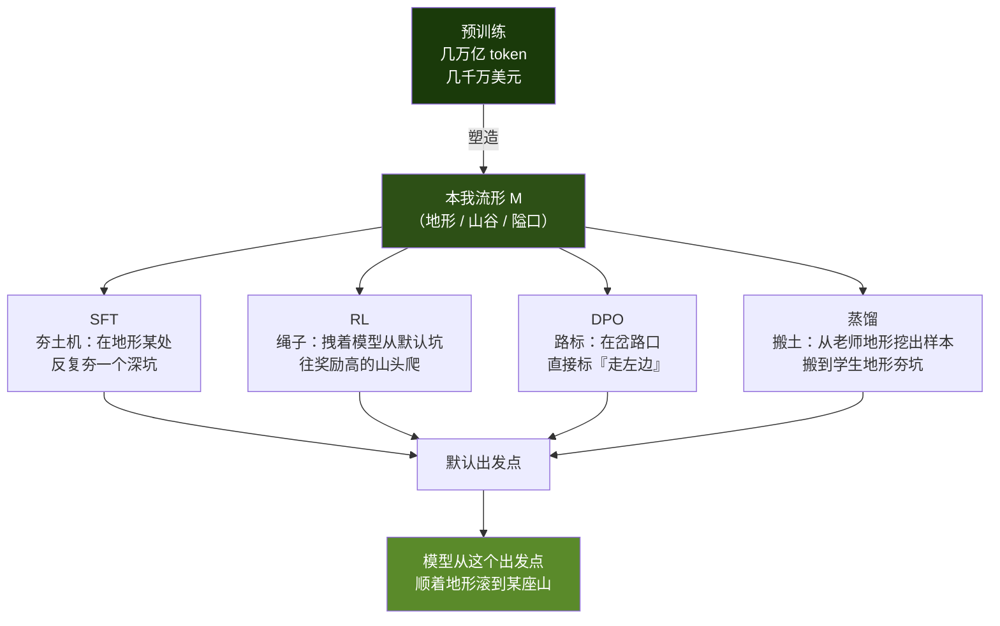

# 后训练动了模型哪根筋？—— 用「本我流形」一个比喻把 SFT/RL/DPO/蒸馏 串成同一件事

!!! quote "原文出处"
    **来源**：公众号《靳岩岩的 AI 学习笔记 × Claude 的吐槽》—《【后训练】SFT、RL、DPO、蒸馏…这些花活儿，到底动了模型哪根筋？》
    **作者 / 公众号**：靳岩岩
    **发布日期**：2026-06-07
    **读于**：2026-06-08
    **原文链接**：[mp.weixin.qq.com/s/kMwrIfhIfPlOHqeeUhuwow](https://mp.weixin.qq.com/s/kMwrIfhIfPlOHqeeUhuwow)

> 一句话定位：**预训练造地形，后训练动土——SFT/RL/DPO/蒸馏全是在同一片本我流形上重新分配概率，谁也造不出一座新山。**

---

## 🎯 这篇为什么值得收藏

后训练相关的内容，garden 里已经有几篇了——[《SFT 数据筛选系统》](../interview/sft-data-quality-system.md)、[《GRPO 数据复用 SFT 的三重约束》](../interview/grpo-sft-data-reuse.md) 都是从面试题切入讲**单点机制**：怎么挑数据、怎么算奖励、为什么会先降后升。

但读那些文章的时候，我心里始终缺一张「全图」：**SFT、RL、DPO、蒸馏到底有什么关系？为什么它们经常一起出现？为什么谁都说自己重要？**

这篇文章给了一个我读过的所有后训练科普里**最干净**的统一框架——不是把四个名词并列罗列再各讲一遍，而是用一个比喻把它们**全部坍缩成同一件事**：

!!! tip "核心比喻"
    **预训练 = 造地形。后训练 = 动土。**
    
    SFT 是夯土机（在地形上夯出一个深坑当默认出发点），RL 是绳子（拽着模型往奖励高的山头爬），DPO 是路标（直接告诉模型在岔路口选哪边），蒸馏是把别人地形上挖出来的样本搬到自己地形上夯。
    
    **没有任何一种后训练能造出地形上本来不存在的山。**

读完之后我对后训练的认知是降维的——以前是四个独立 buckets，现在是同一个 bucket 里四种工具。

---

## 🧩 它解决什么认知混淆？

先把作者真正在解决的问题摆出来——这不是一篇技术综述，是一篇**反直觉认知文**。它要拆掉的是这样一组常见误解：

=== "误解 1"
    **「SFT 是和预训练完全不同的训练方法。」**
    
    错。SFT 和预训练用的是**完全相同的损失函数**——给前文、预测下一个 token、算交叉熵。一字不差。区别只在喂的数据。

=== "误解 2"
    **「DPO 是更高级的、不需要 RL 的对齐方法。」**
    
    错。DPO 在做的事和 RL 在做的事**结构上是一样的**：都在改路标、都在重新分配概率。DPO 只是把「先训奖励模型 + 在线 RL」折叠成了离线一步——是工程上的简化，不是机制上的革命。

=== "误解 3"
    **「蒸馏是从大模型『学到能力』。」**
    
    错。学生模型蒸馏不出自己地形上没有的能力。蒸馏的本质是**把老师在他自己地形上挖出来的高质量样本，搬到学生的地形上当 SFT 数据**。如果学生的预训练没在某个领域留下「山」，蒸馏只会学出一个表面像、内里空的壳。

这些误解非常常见，因为大部分后训练文章都在讲**操作流程**（怎么训、用什么数据、调哪些超参），很少有人讲**机制本质**。这篇用一个比喻把四个机制都拉到同一个解释层。

---

## 🏗️ 核心框架：本我流形 M 上的「动土」



整个框架就是这张图。下面我把每把铲子拆开来讲——但记住，**它们做的事在数学上都是「在地形上重新分配概率」**，区别只在用什么信号、改哪个区域、改多深。


---

## 1️⃣ SFT 动了什么？—— 夯土机 { #sft }

### 反直觉点 #1：SFT 和预训练用的是同一个损失函数

很多人以为 SFT 是「监督学习」，预训练是「自监督学习」，是两种不同的方法。**不是。**

```
对每个位置 t：
    loss += -log P(正确的下一个 token | 前面的 token)
```

预训练和 SFT，这个公式**一字不差**。区别只在喂的数据：

| | 数据特征 | 梯度方向 | 地形效果 |
|---|---|---|---|
| **预训练** | 整个互联网，杂、乱、什么方向都有 | 东一榔头西一棒子，互相抵消 | 「均匀地」塑造整片地形 |
| **SFT** | 「问题 + 标准答案」高度同质 | 所有梯度拧成一股绳，往一个点上猛怼 | **在地形某处反复夯一个深坑** |

### 反直觉点 #2：SFT 真正夯进去的是「壳」，不是「内容」

每条 SFT 样本除了内容（这道题那道题），还有一个完全不变的**结构外壳**：「用户问一句、助手答一句」。这个壳每条样本都在重复，**梯度劲儿使得最足的地方就是这个壳**。

翻译成地形语言：

!!! warning "灾难性遗忘的真正原因"
    SFT 不是「教模型新知识」——它是**把模型的默认出发点从开阔山地，硬生生压进一个又窄又深的标准答案坑**。
    
    模型从此默认蹲在这个坑里。如果数据方向太单一、坑壁太陡，原来山地里那些「会写诗、会聊天、会扯淡」的能力依然存在（地形没变），但模型**默认走不出那个坑去用了**——这就是灾难性遗忘的真实样貌。

### 我的批注：为什么 SFT 是「最容易做坏的一步」

读到这里我突然理解了 [《SFT 数据筛选系统》](../interview/sft-data-quality-system.md) 那篇里反复强调「数据多样性 > 数据量」的真正原因：

- 如果你的 SFT 数据全是同一个领域、同一种回答风格——你就是在地形上**夯一个又深又窄的坑**。坑越深，模型越走不出去；坑越窄，模型在其它领域越像变傻了。
- 如果你的 SFT 数据覆盖广、风格多——你夯的是一个**浅而宽的盆地**。模型有默认出发点（被对齐了），但出了盆地还能走到别处去。

这也解释了为什么大厂 SFT 数据动辄混合 50+ 任务、20+ 风格——**不是为了教更多知识，是为了不把坑夯得太陡**。

---

## 2️⃣ RL 动了什么？—— 绳子 { #rl }

RL（包括 PPO、GRPO、DPO 之前的「在线 RL」）的核心动作是：

1. 让 SFT 之后的模型采样一堆回答（从夯出来的坑里出发，沿地形随机滚）
2. 用奖励模型给每个回答打分
3. 把高分回答的概率往上抬，低分回答的概率往下压

翻译成地形语言：

!!! tip "RL 的本质：拽绳子"
    SFT 把模型固定在一个坑里。RL 是**栓一根绳子在模型身上，朝奖励高的山头方向拽**。绳子有限的力气，能把模型从坑里拽出去一点点，让它倾向于走向奖励高的那座山。

但这里有个关键约束——**绳子拽不动地形上没有的山**：

- 如果模型的预训练地形里压根没有「数学推理」这座山，RL 拽再用力也只是在平地上打转。
- 如果模型已经会一点数学（地形上有座小丘），RL 能把这座小丘的访问概率拉高。
- 如果模型本来就会数学（地形上有座大山），RL 让它更**默认走过去**。

这也是为什么 [GRPO 数据复用 SFT 的三重约束](../interview/grpo-sft-data-reuse.md) 那篇强调「难度居中」——题目太难（模型走不到），绳子拽空；题目太简单（模型已经稳定走到），绳子没拽点。

### 反直觉点：RLHF 的「H」其实是在改路标，不是改地形

很多人以为 RLHF 是「让人类教 AI 价值观」——好像人类把某种新东西「灌输」进了模型。**不是。**

人类反馈做的事，是在**已有地形上选定哪条路是「人类喜欢」的**。模型本来就能写出「友好的回答」和「冷冰冰的回答」（地形上两条路都存在），RLHF 只是把人类喜欢那条路的奖励调高，让模型默认走过去。

> **价值观从来不是被灌输进模型的——是从模型已有的地形里被选出来的。**

---

## 3️⃣ DPO 动了什么？—— 路标 { #dpo }

DPO（Direct Preference Optimization, 2023）解决的是 RL 实际操作的工程痛点：

- RL 需要先训一个奖励模型，再在线采样、打分、更新
- 奖励模型本身可能学歪（reward hacking）
- 在线采样很贵

DPO 的洞察：**既然偏好对（chosen, rejected）已经表达了「这条路比那条路好」的信息，能不能跳过奖励模型，直接用一个损失函数把这个偏好编码进模型？**

数学上可以——DPO 把「训奖励模型 + 在线 RL」**折叠成一个离线偏好损失**。损失函数大致是：

```
L_DPO = -log σ(β · [log P(chosen) - log P(rejected) - reference 项])
```

翻译成地形语言：

!!! abstract "DPO 的本质"
    在地形的每个岔路口，**直接立个路标说「走左边」**。
    
    模型不需要先看奖励、再决定——路标就在那里。

### DPO vs RL：是简化，不是革命

| | RL（PPO） | DPO |
|---|---|---|
| **信号来源** | 奖励模型打分 | 偏好对（chosen vs rejected） |
| **采样** | 在线（每步现采样） | 离线（用预先标好的对） |
| **训练复杂度** | 高（奖励模型 + 价值网络 + actor） | 低（只训 actor） |
| **本质动作** | 拽绳子往奖励高方向走 | 在岔路口立路标 |

**两者改的都是同一个东西——在地形上重新分配概率。** DPO 只是把过程从「在线拽绳子」简化成「离线立路标」。所以你看 Llama 3 的训练流程：迭代式 SFT + 拒绝采样 + DPO（**把 PPO 完全去掉了**），不是因为 PPO 错了，是因为 DPO 在工程上更省事，效果在大多数场景下相当。

---

## 4️⃣ 蒸馏动了什么？—— 换谁拿铲子 { #distillation }

蒸馏（distillation）是最容易被神化的一步。市面上很多博客把蒸馏写成「学生模型从老师那里学到了能力」——好像知识能像液体一样从老师身上倒到学生身上。

**不是。** 蒸馏在做的事，本质上还是 **SFT**——只不过 SFT 数据是从老师采样出来的：

```
1. 老师模型（强大）在某个领域采样大量「问题 + 答案」
2. 学生模型（小）在这些样本上做 SFT
```

翻译成地形语言：

!!! note "蒸馏的本质：搬土"
    老师模型在他自己的地形上挖出来一堆「这条路怎么走」的样本。
    
    蒸馏就是**把这些样本搬到学生的地形上，对学生做 SFT**——夯出和老师类似的默认走法。

### 蒸馏的边界：地形里没有的山，蒸不出来

DeepSeek-R1 把推理能力蒸馏进 Qwen / Llama 系列小模型——这件事之所以**能成立**，是因为 Qwen / Llama 的预训练地形里本来就有「能做数学」的山（只是默认走不到）。蒸馏做的是把 R1 走通的那条路在小模型地形上夯出来。

但反过来：

- 如果你想把一个「图像生成」蒸馏给一个**纯文本预训练**的模型——做不到。地形里没那座山。
- 如果你想把一个「中文推理」蒸馏给一个**英文为主**预训练的模型——效果会大打折扣。中文的山只有一小撮。

> **蒸馏不是魔法，是「让学生默认走老师走过的路」——前提是学生的地形里这条路存在。**


---

## 🗺️ 四把铲子的对照表

把上面四节做一张总表——这是文章读完最该带走的东西：

| | 信号 | 改谁的概率 | 地形比喻 | 工程复杂度 | 局限 |
|---|---|---|---|---|---|
| **SFT** | 标准答案的交叉熵 | 把默认出发点压到一个坑里 | 夯土机 | 低（同预训练） | 数据太单一 → 坑太陡 → 灾难性遗忘 |
| **RL（PPO 等）** | 奖励模型打分 | 把奖励高的路概率拉高 | 绳子 | 高（多个网络在线交互） | 奖励模型学歪 → reward hacking |
| **DPO** | 偏好对（chosen vs rejected） | 在岔路口直接立路标 | 路标 | 中（离线、单网络） | 偏好对的标注质量决定一切 |
| **蒸馏** | 老师采样的输出 | 把学生默认压到「像老师那样」的坑 | 搬土 + 夯坑 | 中（采样老师 + SFT） | 学生地形里没山 → 学不到 |

---

## ⚠️ 这个比喻的边界（作者承认的局限）

任何比喻都有撑不住的地方。文章里没明说，但我读完觉得需要标出来：

1. **「地形完全不变」是简化。** 实际上 SFT/RL 都会**轻微地**修改预训练学到的特征——尤其是高强度 SFT，会让一些罕见词的表征坍缩。比喻说「不造新山」是对的，但「坑壁的塑料感」会反过来腐蚀坑外的小丘。
2. **大规模 RL（DeepSeek-R1 那种纯 RL）可能在边界上挑战这个框架。** R1 没做 SFT，直接 RL，居然涌现出了链式思考——是 RL 在已有地形上发现了新路径，还是 RL 真的雕了新地形？文章倾向前者，但学界还在争论。
3. **持续预训练（continued pretraining）** 是这个框架的灰色地带——它用预训练的方法在新数据上跑，**可以小幅改造地形**。这不是后训练，但常被混在一起讨论。

---

## 🤔 我的几点判断

!!! abstract "TL;DR"
    1. **这个比喻的最大价值不是教你 SFT/RL/DPO 怎么用，是给你一把「祛魅尺子」——下次有人吹某个新方法「让模型涌现了新能力」，你心里有底：能力都是预训练给的，他们改的只是默认走法。**
    2. **SFT 的灾难性遗忘从「夯坑太陡」这个角度看，瞬间清晰。** 数据多样性的工程意义不是「让模型学更多」，是「不要把坑夯得又深又窄」。
    3. **DPO 替代 PPO 不是因为 PPO 错——是工程经济性的胜利。** 同样改路标，DPO 离线一遍跑完就行，PPO 要在线维护一堆网络。在大多数场景这种简化是无损的。
    4. **蒸馏的祛魅最值钱。** 「DeepSeek-R1 蒸馏到 Qwen」这件事被很多人讲成「能力转移」，作者点穿了——是 R1 在 Qwen 已有地形上挖出了一条好路，搬过来夯坑。学生地形里没的山，蒸馏不出来。

### 我会怎么用这个框架

- **看到任何一篇后训练论文**——先问三个问题：用什么信号？改哪个区域的概率？地形里这座山存不存在？这三问能筛掉 80% 的「新方法只是旧方法的换皮」。
- **设计 SFT 数据集**——脑子里默念「我在夯多深的坑、多宽的盆地」，而不是「我在加多少知识」。多样性配比是核心，量是次要。
- **评估蒸馏效果**——先确认学生预训练数据覆盖了目标领域。如果学生地形里那座山很小，再多老师样本也只是夯出一个空壳坑。

---

## 🔗 延伸阅读

### Garden 内同向阅读

- [《SFT 数据筛选系统》](../interview/sft-data-quality-system.md) ——「数据多样性 > 数据量」的工程化，正好对应本文「SFT 是夯坑、坑别夯太陡」
- [《GRPO 数据复用 SFT 的三重约束》](../interview/grpo-sft-data-reuse.md) —— RL 数据「难度居中」的本质，对应本文「绳子拽不动地形上没有的山」
- [《Karpathy LLM Deep Dive》](karpathy-llm-deep-dive.md) —— 训练阶段的全景图（pretrain → SFT → RL），可以和本文「同一片地形上动土」互相印证
- [《Agent 评估与可观测性》](agent-evaluation-tracing.md) —— 后训练完了之后怎么知道改对了，关心地形改动的可观测性

### 论文锚点（按文章末尾「参考资料」整理）

**偏好优化（DPO 系，改路标）**

- [DPO: Your Language Model is Secretly a Reward Model](https://arxiv.org/abs/2305.18290) —— 把「训奖励模型 + 在线 RL」折叠成一个离线偏好损失（Stanford, 2023）
- [ORPO: Monolithic Preference Optimization without Reference Model](https://arxiv.org/abs/2403.07691) —— SFT 和偏好对齐合并成一步（KAIST, 2024）

**阶段重构 / 迭代（改流程）**

- [BRIDGE: Cooperative SFT and RL](https://arxiv.org/abs/2509.06948) —— SFT/RL 交替双层优化
- [Self-Rewarding Language Models](https://arxiv.org/abs/2401.10020) —— 模型自己当裁判造偏好对再 DPO（Meta, 2024）
- [Llama 2: Open Foundation and Fine-Tuned Chat Models](https://arxiv.org/abs/2307.09288) —— 拒绝采样 + PPO
- [Llama 3 Herd of Models](https://arxiv.org/abs/2407.21783) —— 迭代式 SFT + 拒绝采样 + DPO（**去掉了 PPO**）

**自对齐 / 蒸馏（换谁拿铲子）**

- [Constitutional AI](https://arxiv.org/abs/2212.08073) —— 用「宪法」原则让模型自我批评改写，AI 反馈代替人类标注（Anthropic, 2022）
- [DeepSeek-R1](https://arxiv.org/abs/2501.12948) —— 把推理能力蒸馏进 Qwen / Llama 小模型
- [Stanford Alpaca](https://crfm.stanford.edu/2023/03/13/alpaca.html) —— 蒸馏 text-davinci-003 输出做 SFT，蒸馏的开山祖师爷之一

---

*这是 garden 里第一篇出自《靳岩岩的 AI 学习笔记》的文章——这个公众号定位很特别：「学习笔记 × Claude 的吐槽」，意味着每一篇都是作者+Claude 共同打磨的产物，比纯人工写作多一层「概念被反复推敲」的痕迹。本文用一个比喻把后训练四件套坍缩到同一个机制层，是我读过的所有同主题文章里最干净的——值得作为后训练入门的「第一张地图」。*

*预训练造地形，后训练动土。能力都是地形给的，能改的只是默认走哪条路。*
