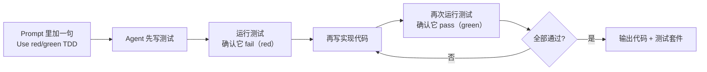

# Red/green TDD —— Simon Willison 给 coding agent 的最短咒语

!!! quote "原文出处"
    **来源**：simonwillison.net — 《Red/green TDD》（Agentic Engineering Patterns 第二章）
    **作者**：Simon Willison（Django 联合创始人，独立 LLM 观察者）
    **首发**：2026-02-23 · 最后更新 2026-02-28
    **链接**：<https://simonwillison.net/guides/agentic-engineering-patterns/red-green-tdd/>
    **读于**：2026-05-26

> 一句话定位：**"Use red/green TDD" 是 prompt 工程里少见的"一句顶五句"——五个英文字母塞进 prompt，等价于一段几十词的测试驱动开发说明，模型已经全都听得懂。**

---

## 🎯 它解决什么问题

让 coding agent 自己写代码、自己跑、自己迭代，是 2025 年下半年到 2026 年最大的工程范式变化。但这个范式有两个老毛病一直甩不掉：

1. **写出来的代码根本不工作**——模型自信地输出一段看起来对的代码，但跑都没跑过。
2. **写了一堆没人用的代码**——"以防万一"加一堆边界处理、辅助函数、抽象层，最后实际调用路径根本走不到。

Simon 这一章给的解法不是新工具不是新框架，而是 **prompt 里多塞五个字**：`Use red/green TDD`。这五个字让 agent 自动进入 test-first 流程：先写测试 → 跑测试看它失败（red）→ 写实现 → 跑测试看它通过（green）。

问题随之被两边夹住：
- **测试先写**，意味着代码必须正好够用来让测试通过——天然抑制冗余。
- **必须先看到 red**，意味着测试不会是"写了等于没写"的占位符——它必须真能 fail 才证明它在测真东西。

---

## 🧩 它本质上是什么？

!!! tip "核心判断"
    **Red/green TDD ≠ 新方法论 = 老 TDD 的 prompt 速记符。它的真正贡献不是"教 agent 做 TDD"，而是发现"模型已经被 TDD 文献喂饱了，给个暗号就行"。**

这是一个非常小但很有信号的观察：**好的 LLM 已经知道 red/green TDD 是什么**。你不需要写一段「先写测试、跑、确认它失败、再写实现、再跑、确认通过」的长篇大论 prompt——这些训练数据里全是。你只需要一个能稳定触发这条知识链的关键词。

类比：你跟一个有经验的工程师说「上 TDD」，他不需要你把 Kent Beck 的红绿循环复述一遍。`Use red/green TDD` 之于 coding agent 是同一种关系——把过去**人类工程文化里默认的协议术语**直接移植成 prompt 词汇。

这也解释了为什么 Simon 没把这章写长：核心信息真的就这五个字。剩下的篇幅是在论证「你为什么应该信这五个字真的够」。

---

## 🏗️ 核心机制：一个 prompt 触发的内部循环



Simon 给的实际示例：

```text
Build a Python function to extract headers from a markdown string.
Use red/green TDD.
First run the tests.
```

短到刺眼。但这一句话里其实压了**三层指令**：

1. `red/green TDD` —— 把 agent 切入测试先行模式
2. `First run the tests` —— 强制 red 阶段的存在感（防止 agent 跳过"看到失败"这一步）
3. 任务描述本身（提取 markdown headers）

`First run the tests` 是另一章的标题，意思是哪怕你以为代码写好了，**先跑一次再说**——很多 agent 会跳过 red 阶段直接交付，这一句把它拉回来。

---

## ⚠️ 难点 / 局限

1. **依赖测试可执行的环境。** 如果 agent 跑在没有 sandbox 的 chat-only 模式（比如 ChatGPT 普通对话），它没法真的执行测试，red/green 就退化成"模型自己脑补测试结果"——这就完全失效了。**Claude Code、Codex CLI、Cursor agent 这种能 spawn shell 的环境**才是它的真正归宿。

2. **测试质量依赖任务边界。** 对纯函数（"提取 markdown headers"）效果绝佳；对涉及大量副作用、外部 API、UI 渲染的任务，agent 自己写的测试可能只覆盖 happy path。这里 TDD 的传统局限同样适用，prompt 缩写解决不了。

3. **"模型懂这个词"是经验断言不是保证。** Simon 说"every good model understands red/green TDD"，但对小模型、垂直微调模型、非英文中心训练的模型不一定成立。**部署到生产 prompt 前最好对你用的具体模型先验证一下**——给一个 toy 任务看它会不会真的先写测试再实现。

4. **它是 prompt 速记不是流程保证。** Agent 仍然可能在压力下跳步——比如上下文紧的时候直接给实现不写测试，或者写完测试不跑就声称通过。`First run the tests` 的存在本身说明了这个偷懒倾向是真实存在的。

---

## 🎯 什么场景适合 / 不适合

### ✅ 适合

- **写纯函数 / 工具函数**——输入输出明确，测试天然能写。
- **修 bug**——经典 TDD 流程：先写一个能复现 bug 的失败测试，再修代码让它通过，自带回归保护。
- **用 Claude Code / Codex / Cursor agent 做迭代式编码**——这些环境能真跑测试。
- **重构**——有现成测试套件做绿灯，重构时实时知道有没有改坏。

### ❌ 不太适合

- **chat-only 没法执行代码的环境**——red 阶段无法验证，只是表演。
- **探索性编程 / 一次性脚本**——还没想清楚要什么的时候先写测试反而是束缚。
- **UI / 视觉相关任务**——测试本身比业务代码更难写。
- **集成密集的代码**（连一堆外部服务）——agent 自己 mock 出来的测试经常假绿。

---

## 🤔 我的几点判断

!!! abstract "TL;DR"
    1. **这是 2026 年最划算的 5 个字 prompt**——零成本、随手加、对纯函数任务效果立竿见影。
    2. **它的真正信号不是"agent 会 TDD 了"，而是"prompt 工程正在变成协议词典"**——人类工程界几十年沉淀的术语正在被 LLM 当 API 调用。
    3. **如果让我用，我会把它默认放进 Claude Code 的 system prompt 里**，遇到纯函数任务自动触发；遇到 UI / 集成任务再显式关掉。

### 1. 它真正改变的是 prompt 的"信息密度"

过去你以为给 agent 写 prompt 是在写"自然语言指令"。这一章揭穿的是：好的 prompt 本质是**激活模型已有知识的关键词**。模型读过整个软件工程文献的训练数据，里面有 Kent Beck 的 TDD、Martin Fowler 的重构、Gang of Four 的设计模式——你不需要复述，只需要点名。

这意味着真正高效的 agent prompt 库未来会长得像**协议术语词典**：`red/green TDD`、`type-first design`、`A/B test this prompt`、`refactor in tiny steps`、`spike then stabilize`……每一个词都是一段被压缩到极致的工程哲学。

### 2. 跟 "First run the tests" 配套使用才完整

Simon 把这两章拆开是有意的。`Use red/green TDD` 让 agent 想做对的事，`First run the tests` 让 agent **真的**做对的事。第二个动词比第一个动词重要——很多模型（尤其是 reasoning 模型）会在思考阶段说服自己"代码看起来没问题，不用跑了"，这是最常见的 silent failure 模式。

**给 coding agent 写 prompt 的元规则：所有可以验证的步骤都要显式要求验证。** Agent 不会主动验证，因为对它来说"看起来对"和"经过验证对"在 token 经济上没区别。

### 3. 跟 Hermes 里的 TDD skill 是同向加强

我自己用的 `test-driven-development` skill 写得比 Simon 这章长得多——里面强调 RED-GREEN-REFACTOR 三阶段、什么时候允许 skip TDD、怎么让 sub-agent 也遵守。Simon 这章给的更多是**入口提示词**，我那个是**完整流程库**。两者并行不冲突：prompt 里写 `Use red/green TDD` 触发 agent 的内部模式，skill 里写完整 SOP 兜住边界情况。

### 4. 五字真言的代价：它太短，所以不严密

`Use red/green TDD` 漏掉了一些重要细节：哪些代码不该写测试（一次性 throwaway 实验脚本就不该上 TDD）、测试写完应不应该 commit 一次（很多人会忘）、refactor 阶段怎么处理（red/green 是俩阶段，TDD 严格说三阶段）。Simon 把这些放进了别的章节，整个 *Agentic Engineering Patterns* 系列才是完整答案。**单看这五个字是危险的——它好用恰恰因为它简略，但简略不等于完备。**

---

## 🔗 延伸阅读

- [Agentic Engineering Patterns（系列首页）](https://simonwillison.net/guides/agentic-engineering-patterns/) —— Simon 把它打包成"指南"格式而不是单篇博客的尝试，本身值得读。
- [Writing code is cheap now](https://simonwillison.net/guides/agentic-engineering-patterns/code-is-cheap/) —— 系列第一章，解释为什么 agentic engineering 会逼出新的开发哲学。
- [发布公告博文](https://simonwillison.net/2026/Feb/23/agentic-engineering-patterns/) —— Simon 解释为什么开这个系列、为什么用"指南"而不是博客形式发布。
- 我自己的 TDD skill —— `test-driven-development`（在 Hermes 里），更长、更可执行的 SOP 版本。

---

*这是 garden 里第一篇专门讲 agent prompt 工程的笔记。Simon 这种"五字真言"风格如果被验证有效，下一步该收一批同类速记符做成对照表。*
