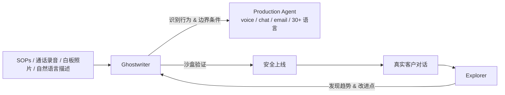

# Sierra · Agents as a Service —— Web App 是马车，Agent 才是汽车

!!! quote "原文出处"
    **来源**：Sierra Blog — 《[Agents as a Service](https://sierra.ai/blog/agents-as-a-service)》
    **作者**：Bret Taylor & Clay Bavor（Sierra 联创，前 Salesforce co-CEO / Twitter chairman / Google VP）
    **读于**：2026-05-29 ｜**原文发布**：2026-03-25

> 一句话定位：**Sierra 把自己变成了 headless infra，让一个叫 Ghostwriter 的 agent 接管 web 控制台——他们在赌"web app 形态本身要死"。**

---

## 🎯 它在说什么

这篇 Bret Taylor 写的发布稿三个月酝酿，体量不大但密度极高。三件事：

1. **Sierra 在 Fortune 50 里拿下了 40%**，已经是客服 agent 这个赛道的事实领导者（客户名单：ADT、Chime、Cigna、Nordstrom、Nubank、Ramp、Rocket Mortgage、SiriusXM、Wayfair）
2. **他们看到 Codex 和 Claude Code 之后**——三个月前——决定把整个产品**重做一遍**
3. **重做的方向不是"加 AI 功能"，而是"把整个 web 控制台砍掉"**，让一个 agent 接管所有原本要点击/拖拽/填表的工作

第三点是这篇文章的真实重量。

---

## 🧩 它本质上是什么？

!!! tip "核心判断"
    **这不是产品发布，是 SaaS 形态级别的押注。Sierra 在自己产品上做的事情，等于宣告"未来所有 SaaS 都会经历这次 headless 化"——他们想做这次转型的第一个范本。**

把它放进框架看：

| 时代 | 交互范式 | 代表 |
|---|---|---|
| **PC** | Code（写代码） | IDE、SQL 客户端 |
| **SaaS** | No-code（点鼠标） | Salesforce、HubSpot、Sierra v1 |
| **Agent** | No-clicks（说想要什么） | Ghostwriter、Claude Code、Codex |

Bret 的论点："软件可以构建并使用软件之后，UI 还有存在的必要吗？" ——他答**不必要**。

人才需要"简洁干净的界面"，**计算机不需要**。计算机要的是直接访问底层数据和动作。所以 web app 那套菜单/表单/表格，从这个角度看就是**马车**——基于"操作者是人"这个已经不成立的假设造出来的形态。

---

## 🏗️ 核心机制：Ghostwriter + Explorer + Agent Harness

三个组件：

### 1. Ghostwriter —— 建 agent 的 agent

输入可以是 SOP 文档、客服通话录音、白板照片、流程文档、音频，**或者就是一段自然语言**。它负责：识别关键行为 → 找出边界 case → 生成跨语音/聊天/邮件/30+ 语言的生产级 agent，**自带护栏**。

这是"从 0 到 1"的部分。

### 2. Explorer —— 像 ChatGPT Deep Research，但研究的是**你的客户对话**

这是"从 1 到 N"的部分——也是 Bret 自己说的"做 agent 真正难的地方"。它不研究互联网，研究你历史的真实客户交互，找趋势、识别需要改进的地方。

### 3. Agent Harness —— 让上面两个能跑起来的脚手架

包括：工具集、记忆、清晰的动作空间、规划与推理能力，**外加沙盒环境**。Sierra 把自己整个平台 **headless 化**——意思是 Ghostwriter 不通过 web UI 操作，而是直接调用底层 API，跟人当年用 web 控制台时一样能做所有事，但快得多。

最后这一步是隐藏的核心工程量。**他们不是给老产品套个 chatbot，是把整个产品的"人面"砍掉、暴露 agent 面**。

---

## ⚙️ Agent 装配线：闭环才是真正的护城河

Bret 用了一个比喻——"agent assembly line"：

1. Ghostwriter 分析真实交互
2. 识别改进机会
3. 沙盒验证
4. 准备人工评审
5. 上线 → 回到 1

这个闭环跑起来之后，**agent 自己越来越好**。这是 Sierra 押注的复利曲线：客户量大 → 对话数据多 → Explorer 识别改进多 → Ghostwriter 自动迭代 → agent 更好 → 客户更愿意用 → 数据更多。

这是个**先发优势会指数化**的护城河——比传统 SaaS"功能多一点"那种线性优势更陡。

---

## ⚠️ 我看到的难点 / 局限

文章是发布稿，没讲坏话。但下面这些问题它绕开了：

### 1. "no-click"对终端用户是真的，对运营方未必

宣传话术说"prompts, not clicks"。但 Sierra 的客户是**企业**——他们仍然需要**审计、合规、A/B 测试、回归测试**。Bret 说的"prepares them for review"——*for review* 三个字是关键。**人工评审环节没法砍**，特别是金融/医疗（Cigna、Chime、Rocket Mortgage 都在）。所以更准确的描述是"low-clicks for builders + no-clicks for end users"。

### 2. headless 改造对老 SaaS 是地狱级工程

Sierra 自己重写一遍可以——他们才 3 年。**Salesforce、Workday、SAP 这些 30 年代码的 SaaS**，把所有功能都暴露成 agent-callable API，每条都得过 RBAC、审计、事务边界——这事干 3 年都未必干得完。所以 Bret 的话**对 Sierra 自己成立**，对其他 SaaS 是个**长期方向不是短期路径**。

### 3. "Explorer 像 Deep Research"——但客户对话数据**不能像互联网那样自由 sample**

通话/聊天数据是 PII 重灾区。每次 Explorer 取样都得过隐私合规。这个限制比 Bret 说的更紧。

### 4. 30 + 语言 + 多模态 + voice + 沙盒——这背后的成本

每个生产 agent 跑 voice + 跨语言 + 沙盒模拟，**单位经济性能不能撑住** Sierra 这种已经年化几亿美金 ARR 的盘子，文章没说。客户那么多 Fortune 50，估计能撑住，但中尾部市场未必。

---

## 🎯 什么场景适合 / 不适合

### ✅ 这个范式真正成立的场景

- **客户支持**——任务边界清晰、有大量历史对话作训练材料、错了能道歉重来
- **流程自动化**——SOP 文档化程度高的领域（运营、HR onboarding、合规审查）
- **新建 SaaS（greenfield）**——一开始就 headless 设计的产品，不用改造老代码

### ❌ 这个范式短期不太成立的

- **创意工具**（Figma、Notion 编辑视图）——人就是想"看到"和"调整"，no-clicks 反而是负价值
- **重审计/合规链路**（医疗诊断、法务、税务）——"agent 直接做"很难拿到合规批准
- **数据分析探索**——用户**就是要通过点击发现 unknown unknowns**，prompt 描述不出来"我想看的东西"

---

## 🤔 我的几点判断

!!! abstract "TL;DR"
    1. **Bret Taylor 是这个范式最有资格喊的人**——做过 Salesforce co-CEO，知道 SaaS UI 形态的天花板在哪
    2. **"web app 是马车"** 这个比喻 5 年后回看会比现在响亮很多。**短期感觉激进，长期方向极其稳**
    3. **Ghostwriter 真正难的不是功能，是"agent 装配线"那个反馈闭环**——这才是 Sierra 在卷的护城河
    4. **如果你在做 agent 产品，立刻问自己：我有没有"Explorer 等价物"？没有的话 1 年后追不上有这个的对手**
    5. **如果你在做 SaaS：headless 化你的产品**。先不上 agent，先让自己的产品**能被 agent 调用**。这个改造比加 AI 功能重要 10 倍

### 我会怎么用这个思路

**不会用 Sierra**（我没那么大客服场景），但**会借用三层结构**：

- **Ghostwriter 层**：把"建 agent"本身做成 agent 的工作。我现在在 Hermes 里加 skill 还是手写——这本身可以 agent 化（让 agent 看我历史会话识别复用模式 → 自动建议 skill）
- **Explorer 层**：让 agent 持续读自己历史 sessions 找改进——这个我已经有 `session_search` 但**没有 Explorer 那种主动模式**，是空白
- **Agent Harness 层**：Hermes 已经有 skill + cron + tool 框架，**沙盒部分可以更完整**——目前 cron 跑出问题影响不大，但如果上生产链路必须有 sandbox

---

## 🔗 延伸阅读

- [Sierra 官网](https://sierra.ai/) —— 看产品形态本身比看 blog 更有信息
- [Bret Taylor 在 a16z 的访谈（agent infra）](https://a16z.com/podcast/bret-taylor-sierra/) —— 更细节的 agent harness 工程
- [Ghostwriter 演示视频](https://sierra.ai/blog/agents-as-a-service)（原文嵌入） —— 看上传 SOP → 生成 agent 实际效果
- [我读过的相关文章](agent-reliability-bottleneck.md) —— "agent 真正难的是从 1 到 N" 这个论点的另一篇佐证
- [Agent 评估与追踪](agent-evaluation-tracing.md) —— Explorer 那种主动改进闭环需要的可观测性基础

---

*这是 garden 里的第 9 篇读文沉淀。Bret Taylor 文章读完三遍才动笔——他写得克制，但每段都是赌注。*
