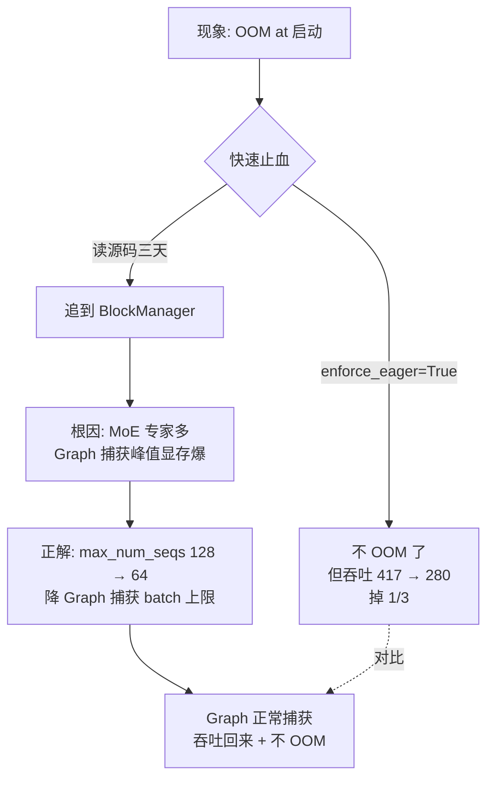
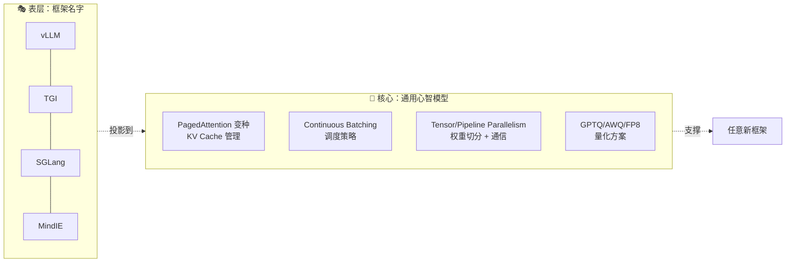

# 为什么 vLLM 值得一行一行扒 —— 推理引擎源码精读专栏开篇

!!! quote "原文出处"
    **来源**：知乎专栏《手把手教你改 vLLM 源码》第 1 篇
    **标题**：《为什么 vLLM 值得你花时间一行一行扒（手把手教你改 vLLM 源码①）》
    **首发**：2026-06-09 编辑于江苏
    **原文链接**：<https://zhuanlan.zhihu.com/p/2047757570044121241>
    **读于**：2026-06-09

> 一句话定位：**这不是又一篇 vLLM 教程。这是一个工程师把"三天追 OOM 日志"的经历提炼成 25 篇专栏的开篇——用一个真实事故论证：在生产环境跑 LLM 推理，会用 ≠ 懂，不读源码就是蒙着眼开高速。**

---

## 🎯 这篇为什么值得收藏

这是 garden 里**第一篇**关于 LLM 推理引擎源码的文章——之前 [Karpathy 那篇全栈课笔记](karpathy-llm-deep-dive.md) 把**训练链**讲清楚了（数据 → token → 预训练 → SFT → RL → RLHF），但**推理链**还是个黑洞。这篇正好补上：从一个 OOM 事故切入，把"为什么生产环境必须读 vLLM 源码"这个问题讲透。

更重要的是，作者一开始就把整个 25 篇专栏的**目录树**摆出来了。这意味着即使你后续不一定每篇都跟，光看这个目录就能知道：**一个完整的推理引擎，要解决哪 7 个核心问题**。这本身就是一张「推理引擎心智地图」。

> 注：这是 garden 第一篇收录该作者的文章。作者签名江苏（双卡 4090 + 海光 CPU 跑生产推理半年），技术调性偏「踩坑实录派」——开篇就甩 enforce_eager 三天追日志的真实事故，不掉书袋。后续如果该专栏其它篇被收录，可以纵向连成「vLLM 源码精读系列」。

---

## 🔥 那个三天追 OOM 日志的真实故事

文章一开头就是个钩子级别的开场：

> 双卡 4090 部署 Qwen3-30B-A3B（MoE，3B 激活），FP8 量化，TP=2。启动半小时，OOM。
>
> 日志里有一行：`CUDA graph capture failed, falling back to eager mode`。
>
> 加了 `enforce_eager=True` 不 OOM 了，但吞吐从 417 tok/s 掉到 280 tok/s，掉了 1/3。

然后作者花了三天，**从 `gpu_model_runner.py` → `EngineCore` → `Scheduler` → `BlockManager` 一路追**，最后搞明白：

**MoE 模型专家数量太多 → CUDA Graph 捕获时显存峰值比稳态运行高几个 GB → 直接撑爆。**

最妙的是**正确的解法不是关 CUDA Graph**——那是用性能换稳定，掉 1/3 吞吐。

正确解法是：把 `max_num_seqs` 从 128 改成 64，**让 Graph 捕获时的 batch size 上限降下来**，峰值显存就够了，Graph 正常捕获，吞吐回来了。



### 🧠 我的批注

这个案例**本身就是整篇文章的论点**——"会用 vs 懂"的差距不是 5%，是**1/3 的吞吐 + 三天的时间**。

把它再抽象一层：**调参三件套对应三个层次**——

| 层次 | 调参依据 | 实际效果 |
|---|---|---|
| L0 会用 | 出问题就关功能（`enforce_eager=True`） | 不报错了，但代价不可见 |
| L1 懂参数 | 看文档说明改值（`max_num_seqs=64`） | 治标不治本，下次同样症状还得猜 |
| L2 懂源码 | 知道 Graph 捕获 / KV Cache / Block 分配的因果链 | **能预判改完哪些指标会变，并解释为什么** |

绝大多数生产事故里，调参的人停在 L0 或 L1。但**只有 L2 才能在凌晨两点告警时给老板一个有把握的回答**——这是作者后面那句"排障快十倍"的真实含义。

---

## 🌐 vLLM 在推理赛道的位置

作者用一张表把推理引擎生态说清楚了：

| 框架 | 特点 | 适用场景 |
|---|---|---|
| **TensorRT-LLM** | NVIDIA 亲儿子，性能顶尖 | 硬件固定、不改代码的私有部署 |
| **TGI** | HuggingFace 出品，简单 | 快速原型、轻量部署 |
| **SGLang** | 学术味重，新特性多 | 研究实验、新算法验证 |
| **llama.cpp / Ollama** | 本地轻量，消费级显卡 | 个人用户、边缘设备 |
| **vLLM** | 功能全、更新快、扛得住 | **企业生产** |

vLLM 81.7k star，能成为企业级事实标准的核心就一点：**能扛事**。

100+ 模型开箱即用、四种量化方案（GPTQ / AWQ / FP8 / Marlin）、OpenAI 兼容 API、跑半年里 GPU 故障三次 + 断电两次 + NCCL 版本打架若干次都扛住了。

### 🧠 我的批注

这张表回答的不是"该选哪个框架"，而是**"为什么读源码值得读 vLLM 而不是其它"**——

- 读 TensorRT-LLM？闭源大头都在 CUDA kernel，读不了
- 读 TGI？太薄，没有调度引擎那一层
- 读 SGLang？新特性多但稳定性反而是变量，源码也在剧烈重构
- 读 llama.cpp？另一种范式（C++ + 本地优先），心智模型不通用

**vLLM 是唯一一个"开源 + 完整 + 稳定 + 在生产被千万人验证过"的样本**——读它一份，等于把推理引擎这个领域的"工程学共识"全吃下来。

---

## 💡 这篇文章最有杠杆的论点：建立心智模型 ≠ 学某个框架

作者讲了一句很有分量的话：

> **吃透 vLLM，脑子里就有了一张推理引擎的通用地图。**

vLLM 的核心设计——

- PagedAttention 管理 KV Cache
- Scheduler 做请求调度
- Continuous Batching 提高 GPU 利用率
- Tensor Parallelism 切权重

——**都不是 vLLM 独家**。TGI、TensorRT-LLM、SGLang、国产 MindIE 全都这么干。大家都在解决同样三个问题：**显存不够、GPU 不能闲、延迟和吞吐要平衡**，方案大同小异。

作者自己亲历过：**从 vLLM 切到另一个框架，从读文档到跑通生产环境，两天**。不是因为他聪明，是 vLLM 源码已经帮他建立了心智模型——**换框架就是换层壳，里面的东西见过**。



### 🧠 我的批注

这是这篇文章里**最值得带走**的一条认知。它和 [Karpathy 那篇训练链全景](karpathy-llm-deep-dive.md) 的核心论点是同构的：**学具体工具不如学领域共识**——

| 维度 | Karpathy 训练课的对应物 | 本文 vLLM 课的对应物 |
|---|---|---|
| 学一个具体的 | GPT-2 训练脚本 | vLLM 源码 |
| 收获的通用能力 | 看任何新模型 paper 都能定位它在训练链的哪一步 | 看任何新推理框架都能定位它在「KV Cache + 调度 + 并行」哪一层做了手脚 |
| 作用半径 | 训练 / 微调 / 评估 | 部署 / 调优 / 排障 |

**这两篇加在一起，相当于把"LLM 工程"的两个半张地图凑齐了**——训练侧 + 推理侧。garden 里如果只能保留两篇 LLM 基础课，就这两篇。

---

## 🗺️ 25 篇专栏的目录全图

作者已经把整个专栏 25 篇的目录摆出来了——这本身就是一张**推理引擎学习路径图**：

| 部分 | 篇目 | 核心模块 |
|---|---|---|
| **全景地图** | 1-4 | 整体架构、代码位置、请求生命周期 |
| **PagedAttention** | 5-9 | KV Cache 管理、Block 分配、Prefix Caching、Swap 机制、CUDA Kernel |
| **调度引擎** | 10-13 | Scheduler 策略、Continuous Batching、V1 引擎进程拆分 |
| **量化实战** | 14-16 | GPTQ/AWQ/FP8 原理、Marlin Kernel、踩坑记录 |
| **分布式推理** | 17-19 | Tensor/Pipeline/Expert Parallelism、自定义 AllReduce |
| **模型加载** | 20-22 | ModelRegistry、Weight Loader、多模态链路 |
| **API 与生态** | 23-25 | OpenAI 兼容 API、LoRA/Speculative Decoding、生产部署 |

每篇结构是固定的：**实际问题/踩坑经历 → 带着问题读源码 → 模块在架构中的位置**。

### 🧠 我的批注

光看这个目录就能学到东西——

- **PagedAttention 单独占 5 篇（5-9）**：说明 KV Cache 管理是 vLLM 的"杀手锏"，也是和 TGI 等竞品最大的差异点。值得重点跟
- **量化只占 3 篇**：因为 GPTQ/AWQ/FP8 算法本身比代码难，源码反而是次要的。第 16 篇"踩坑记录"才是真正有价值的部分
- **API 与生态放最后（23-25）**：作者很清醒——OpenAI 兼容 API 是工程包装，PagedAttention 才是引擎核心。**先读核心再读外壳**

学习路径建议：**1-4（地图）→ 10-13（调度）→ 5-9（KV Cache）**——先建立全景，再看调度（因为调度逻辑相对独立），最后啃 PagedAttention 这块硬骨头。量化和分布式按需读。

---

## ⚙️ 环境准备 —— 一些值得注意的细节

文章给了完整的安装步骤，几个关键点值得抄走：

### 1. 锁定版本

```bash
git checkout v0.21.0
```

vLLM 迭代极快，**不锁版本读源码会被新 commit 反复打脸**。专栏作者用 v0.21.0，跟着读时也用同一版本。

### 2. 国内镜像

```bash
# Gitee 镜像加速 git clone
git clone https://gitee.com/mirrors/vllm/

# 清华 PyPI 镜像
pip install -e . -v -i https://pypi.tuna.tsinghua.edu.cn/simple --default-timeout=300

# cutlass 编译时如果卡住
git clone https://gitee.com/git_mirror/cutlass /opt/vllm/.deps/cutlass-src
FETCHCONTENT_SOURCE_DIR_CUTLASS=/opt/vllm/.deps/cutlass-src pip install -e . ...
```

### 3. 读源码不一定要装

> 我很多时候直接在 GitHub 网页看，搜索框比什么都好使。

这个建议**反 hardcore 直觉但很实用**——光读不跑也能学，跳转和搜索 GitHub 都给做了。**只有要改代码或者想加日志验证流程时才需要本地装**。

### 4. V1 vs V0

> 看启动日志，出现 `EngineCore` 和 `MultiprocExecutor` 就是 V1。

V1 在 2024 年底成默认引擎。**专栏基于 V1 架构**——网上很多老博客还在讲 V0 的 `LLMEngine`，看了反而误导。

---

## 📐 vLLM 核心目录速记

记住这 6 个就够了——

```
vllm/
├── entrypoints/       # API 入口，HTTP 服务器
├── v1/                # V1 引擎（调度+执行）⭐ 核心
├── model_executor/    # 模型执行、加载、量化
├── distributed/       # 分布式，TP/PP 通信
├── attention/         # Attention 后端
└── csrc/              # C++ 和 CUDA kernel
```

最大单文件：`gpu_model_runner.py`，**七千多行**。整个项目约 16 万行 Python。

### 🧠 我的批注

七千行的 `gpu_model_runner.py` 是个信号——**这一个文件浓缩了 vLLM 的"灵魂"**：模型怎么前向、KV Cache 怎么读写、CUDA Graph 怎么捕获、采样怎么做……都在这里。

如果时间紧到只能读一个文件，就读 `gpu_model_runner.py`。专栏第 1-4 篇大概率会反复回到这个文件。

---

## 🎬 我的判断

这是一篇**值得追完**的专栏开篇。三个理由：

1. **目录有诚意**：作者一开始就把 25 篇全摆出来，且分组合理（不是边写边凑）。说明已经有完整心智模型，不是水文
2. **故事有杀伤力**：enforce_eager 三天追日志那个案例，是教学型作者最好的开场——**用真实代价证明读源码值钱**
3. **生态判断清醒**：那张五框架对照表说明作者真的在生产环境里横向比较过，不是读了几篇博客就来开课

值得警惕的点：

- **作者声称"半年生产 vLLM"+ "Qwen3.6-35B-A3B"+ "Qwen3.5-397B"**，这些模型名在 2026-06 时点对得上（Qwen3.5 已开源），但 35B 这个具体型号没在公开 release 里见过——可能是预发布或作者笔误。**信源略需保留**，但这不影响他对 vLLM 源码本身的判断
- **专栏每天更一篇**——容易开高走低。建议追到第 10 篇看质量是否稳定，再决定要不要订阅付费部分（前 3-5 篇预告是免费）

如果你做的事符合下面任何一条，建议跟：

- 在企业部署 LLM 推理服务（不是 toy demo）
- 想从"调 API 的人"升级成"懂底层的人"
- 准备转岗 LLM Infra / 推理优化工程师
- 准备面试 LLM 系统岗（PagedAttention / Continuous Batching 是高频面试题）

---

## 🔗 延伸阅读

- [Karpathy 的 3.5 小时 LLM 全栈课 —— 训练链概念地图](karpathy-llm-deep-dive.md) —— 训练侧的同构对照物，和本文一起把 LLM 工程的两个半张地图凑齐
- [Agent 服务可靠性瓶颈 —— 不在模型在工程](agent-reliability-bottleneck.md) —— 同样是"会用 ≠ 懂"的论证模式，但作用域是 Agent 而不是推理引擎
- [Hermes 架构概览](../tech/hermes-architecture.md) —— 我们自己的 Agent 系统怎么调用推理后端，可以对照看 vLLM 这种 OpenAI 兼容 API 在调用方是什么形态
- 原专栏后续篇目（待跟）：第 2 篇《五层架构一张图，看懂代码在哪》——把 16 万行代码拆成五层

---

*会用是 L0，懂参数是 L1，懂源码是 L2。生产环境的代价都摊在 L0 和 L1 上——只是平时不显，凌晨两点显。*
