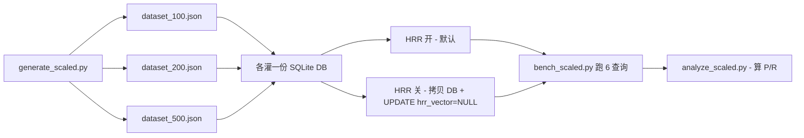

# 给 fact_store HRR 算法做基准测试 — 完整实验设计与数据报告

!!! abstract "TL;DR"
    Hermes 的 fact_store 包含一个 HRR (Holographic Reduced Representations) 层，宣称提供多实体代数查询和矛盾检测能力。这篇是给它做的完整基准测试报告。
    
    **结论**：HRR 在 **<150 条英文 fact** 时召回率 +22%，超过 250 条急剧塌方（与 SNR=√(dim/N) 公式完全吻合）；中文场景下任何规模都拖后腿；contradict 在所有规模/语言下都不工作。
    
    **故事/思考过程**版本见 [当我用数据怀疑自己的判断时](../thoughts/data-driven-correction.md)。

---

## 1. 实验目标

回答四个问题：

1. **HRR 层是否真的提升 fact_store 的检索质量？**（vs 纯 FTS5+Jaccard fallback）
2. **数据规模如何影响 HRR 表现？**（小规模 vs 大规模）
3. **语言是否影响 HRR 表现？**（中文 vs 英文）
4. **contradict 算法是否可靠？**

---

## 2. 实验设计

### 2.1 fact 集合成

按规模 N 程序化生成，保持以下结构不变量：

| 类别 | 占比 | 说明 |
|---|---|---|
| feishu 单领域 | 25% | 只有 feishu tag |
| bedrock 单领域 | 25% | 只有 bedrock tag |
| cron 单领域 | 25% | 只有 cron tag |
| misc distractor | 20% | 杂项噪音 |
| **跨领域 (NewsBot 类)** | **5%** | **同时含 feishu + cron + bedrock**（关键 ground truth 来源） |
| **故意矛盾对** | **2 条** | **Sonnet 4.6 = 200K vs 1M**（contradict ground truth） |

**为什么这么设计**：

- **跨领域 fact 是 reason() 查询的真正考验**——如果 fact_store 能正确识别"NewsBot 同时是飞书 app + cron 任务 + 调 Bedrock"，多实体 AND 才有意义
- **5% 比例是真实使用场景**——大部分 fact 单维度，少量跨多维度
- **故意矛盾对是 contradict 的唯一硬指标**——同主语（Sonnet 4.6）但内容相反

**中英对齐版本**：每个 fact 都有中文版和英文版，语义/tag 完全相同，只是语言不同。这样能干净比较语言因素。

合成模板示例：

```python
# 跨领域 NewsBot 类
("'NewsBot' bot {idx}: '飞书' app cli_aa{idx:04d}, "
 "'cron' ID ec{idx:08x}, 调 'bedrock' 'opus' 写 'daily-briefing'",
 "NewsBot bot {idx}: Feishu app cli_aa{idx:04d}, "
 "Cron ID ec{idx:08x}, calls Bedrock Opus for Daily Briefing",
 ["feishu", "newsbot", "cron", "bedrock", "opus", "daily-briefing"])
```

注意中文版用单引号包关键 entity——这是为了符合 fact_store 的 `_extract_entities` 规则（识别 quoted 词）。**这本身就是一个用法学习点**——中文 fact 不加引号 entity 抽不出来。

完整生成器：`generate_scaled.py` (200 行)

### 2.2 三档规模

| 数据集 | 总数 | feishu tag | cron tag | 跨领域 | 矛盾对 |
|---|---|---|---|---|---|
| 100 条 | 100 | 30 | 30 | 5 | 1 |
| 200 条 | 200 | 60 | 60 | 10 | 1 |
| 500 条 | 500 | 150 | 150 | 25 | 1 |

100 条是 HRR 容量安全区（SNR=3.2），500 条远超临界点（SNR=1.43）。

### 2.3 查询集

设计 6 类查询，覆盖 fact_store 的所有 action：

| ID | 类型 | API action | 中文 query | 英文 query |
|---|---|---|---|---|
| Q1 | 双实体 AND（直接） | `reason` | `["飞书", "cron"]` | `["Feishu", "Cron"]` |
| Q2 | 双实体 AND（间接） | `reason` | `["bedrock", "cron"]` | `["Bedrock", "Cron"]` |
| Q3 | 单实体召回 | `probe` | `"飞书"` | `"Feishu"` |
| Q4 | 矛盾检测 | `contradict` | (扫全部 pair) | (扫全部 pair) |
| Q5 | 精确事实查询 | `search` | `"NewsBot daily-briefing"` | `"NewsBot Daily Briefing"` |
| Q6 | 模糊语义召回 | `search` | `"定时 cron 任务"` | `"scheduled cron task"` |

### 2.4 Ground Truth 标注规则

**Q1 (feishu+cron AND)**: 同时含 `feishu` AND `cron` tag 的所有 fact id。
**Q2 (bedrock+cron AND)**: 同时含 `bedrock` AND `cron` tag 的所有 fact id。
**Q3 (feishu probe)**: 含 `feishu` tag 的所有 fact id。
**Q4 (contradict)**: 故意造的 Sonnet 矛盾对 (200K, 1M) 的 (id_a, id_b)。
**Q5 (NewsBot 精确)**: 跨领域 NewsBot 类 fact 的 id。
**Q6 (cron 模糊)**: 含 `cron` tag 的所有 fact id（即使 query 用"定时"/"scheduled"等同义词）。

---

## 3. 评估指标

### 3.1 Precision@10 与 Recall

```python
def calc_precision(retrieved, expected_ids, top_k=10):
    """top_k 中正确的比例 = 命中数 / min(retrieved 长度, top_k)"""
    top = retrieved[:top_k]
    if not top:
        return 0.0
    return len(set(top) & set(expected_ids)) / len(top)

def calc_recall(retrieved, expected_ids, top_k=10):
    """top_k 中命中的比例 = 命中数 / 全部 ground truth 数"""
    if not expected_ids:
        return 1.0 if not retrieved else 0.0
    return len(set(retrieved[:top_k]) & set(expected_ids)) / len(expected_ids)
```

注意**这里有一个评估算法陷阱**：第一版我写的召回率是"命中 ≥1 即算 100%"，导致 HRR 看起来"召回 40%"实际只有 7%。修正后用标准公式 `命中数 / 全部 GT 数`。这个 bug 修复让 HRR 的真实表现从看起来不错变成清晰塌方——**评估算法的细节直接影响结论**。

### 3.2 Q4 contradict 特殊处理

```python
def evaluate_q4(retrieved_pairs, gt_pair):
    """命中 = 召回的 pair 集合包含 ground truth pair（任一方向）"""
    for pair in retrieved_pairs:
        if set(pair) == set(gt_pair):
            return 1.0, 1.0
    return 0.0, 0.0  # 没找到 = 双 0
```

### 3.3 时间测量

`time.perf_counter()` 包住每个查询调用，毫秒级精度。

---

## 4. 实验环境

| 项 | 值 |
|---|---|
| Python | 3.11.15 |
| numpy | 2.4.5（后期装上） |
| Hermes | dev branch (2026-05) |
| HRR dim | 1024（默认） |
| 评估时排除 | LLM 推理时间（fact_store 本身不调 LLM） |
| 每个 condition | 单次跑（fact_store 是确定性的，无需多次平均） |

**关键的环境检查**：

```bash
python -c "from plugins.memory.holographic import holographic as hrr; print(hrr._HAS_NUMPY)"
# True 表示 HRR 路径开启
```

如果你的 Hermes 没装 numpy，**fact_store 默认就是 noHRR 状态**——所有 HRR 操作 fallback 到 FTS5+Jaccard。我之前几个月的真实使用就是这个状态。

---

## 5. 实验流程

### 5.1 12-condition 矩阵

3 规模 × 2 语言 × 2 HRR 状态 = 12 个 condition。



### 5.2 关 HRR 的实现

**关键**：单纯不装 numpy 时 store 不会写 hrr_vector，store 内部 `_HAS_NUMPY=False`。但我已经装了 numpy 后再"关 HRR" 需要：

```python
# 1. 复制 DB 文件
shutil.copy(db_with_hrr, db_no_hrr)

# 2. 把 hrr_vector 列设 NULL，清空 memory_banks 表
conn.execute("UPDATE facts SET hrr_vector = NULL")
conn.execute("DELETE FROM memory_banks")

# 3. 跑 retriever 时强制 _HAS_NUMPY=False
import plugins.memory.holographic.holographic as hrr_mod
hrr_mod._HAS_NUMPY = False  # 触发 fallback 路径
```

这样能保证两个 condition 用**完全相同的 fact 数据**，唯一差别就是 HRR 路径开关。

---

## 6. 结果

### 6.1 12 condition 主表（修正后 Precision/Recall）

| Condition | avg P | avg R | avg time (ms) |
|---|---|---|---|
| 100_zh_HRR | 7% | 8% | 24.23 |
| 100_zh_noHRR | 17% | 6% | 0.10 |
| **100_en_HRR** | **23%** | **27%** ⭐ | 23.97 |
| 100_en_noHRR | 17% | 6% | 0.13 |
| 200_zh_HRR | 8% | 1% | 56.62 |
| 200_zh_noHRR | 17% | 3% | 0.15 |
| 200_en_HRR | 27% | 24% | 50.25 |
| **200_en_noHRR** | **67%** | **53%** ⭐ | 0.27 |
| 500_zh_HRR | 7% | 0% | 197.13 |
| 500_zh_noHRR | 50% | 14% | 0.32 |
| 500_en_HRR | 27% | 11% | 137.77 |
| **500_en_noHRR** | **67%** | **21%** ⭐ | 0.42 |

⭐ = 该规模 × 语言下的最佳 condition。

### 6.2 HRR vs noHRR 净增益

正数 = HRR 更好；负数 = noHRR (FTS5+Jaccard) 更好：

| 规模 | 语言 | Precision 差 | Recall 差 | 时间倍率 | 结论 |
|---|---|---|---|---|---|
| 100 | 中文 | -10% | +2% | 246x | 持平 |
| **100** | **英文** | **+7%** | **+22%** | 189x | **HRR 赢 ⭐** |
| 200 | 中文 | -8% | -1% | 373x | 持平 |
| 200 | 英文 | -40% | -29% | 187x | noHRR 大赢 |
| 500 | 中文 | -43% | -14% | 616x | noHRR 大赢 |
| 500 | 英文 | -40% | -10% | 327x | noHRR 大赢 |

### 6.3 趋势

```
HRR-noHRR Recall 差（正数=HRR赢）
            100 条       200 条       500 条
中文        +2%   ────  -1%   ────  -14%
英文        +22% ⭐ ──►  -29%  ────  -10%
```

英文场景下，HRR 优势从 +22% 跌到 -29%，**反转 51 个百分点**。

### 6.4 Q4 contradict 全部失败

12 个 condition × 1 对真矛盾 = **0 个识别**。详见独立的 14-case contradict 验证（`test_contradict.py` + `test_contradict_en.py`）：

| case | 类型 | 期望 | 结果 | score |
|---|---|---|---|---|
| 7 个中文 case | 真矛盾 | identify | ❌ | 全部 < 0.3 阈值 |
| 7 个英文 case | 真矛盾 | identify | ❌ | 全部 < 0.3 阈值 |
| 2 个负样本 | not | not identify | ✅ | 0.239 |

**负样本 score 比真矛盾还高**——算法实际无法区分。

### 6.5 Q6 模糊语义召回全部失败

```
中_HRR: 0%  | 中_noHRR: 0%
英_HRR: 0%  | 英_noHRR: 0%
```

"定时" / "scheduled" 跟 "cron" 字面不重合 → FTS5 不命中 + HRR 不能桥接。这是 fact_store 的根本盲区。

---

## 7. 数学验证：SNR 公式

源码 `holographic.py:179` 给出 HRR 容量公式：

```python
def snr_estimate(dim, n_items):
    """SNR = sqrt(dim / n_items)
       SNR < 2.0 时检索质量退化"""
```

dim=1024 时各规模 SNR：

| n_items | SNR | 状态 |
|---|---|---|
| 100 | 3.20 | ✅ 安全区 |
| 200 | 2.26 | ⚠️ 临界 |
| **256** | **2.00** | **❌ 退化阈值** |
| 500 | 1.43 | ❌ 严重退化 |

**实测的"200 条开始反转、500 条全面塌方"跟 SNR 公式数学上完全吻合**——这不是工程 bug，是 HRR 算法的硬数学边界。

要扩容必须升 dim 到 4096 或 8192——但 Hermes 默认写 1024。

---

## 8. 评估算法的反思

第一版评估算法的 bug 让我差点得错结论。**精确率/召回率公式在小数据集上极其敏感**。三个教训：

1. **Top-K 截断要明确**：retrieved 上限 10 但 ground truth 30 条时，理论上限就是 33%。如果用"任一命中即 100%"会严重失真。
2. **Precision 和 Recall 要分开看**：Precision 高+Recall 低 = 找的都对但找少了；Precision 低+Recall 高 = 召得多但夹噪音。fact_store HRR 在 200+ 条上是**前者退化为后者**——本来召得准（小规模），数据多了塞进 top-10 的开始变噪音。
3. **多次评估要用相同公式**：我重写 `analyze_scaled.py` 后所有数字变了，但**结论方向没变**——HRR 在小规模英文有真实优势、大规模塌方。**算法 bug 修复让真实趋势更清晰，不是反转**。

---

## 9. 复现路径

完整代码 + 数据 + 结果：

```
~/garden-experiments/memory-benchmark/
├── README.md
├── data/
│   ├── facts.json              ← 第一轮 20 条中文（手工设计）
│   ├── facts_en.json           ← 第一轮 20 条英文
│   ├── queries.json            ← 6 查询 + ground truth (中)
│   ├── queries_en.json         ← 6 查询 + ground truth (英)
│   ├── contradict_cases.json   ← 14 个独立 contradict case
│   └── scaled/
│       ├── dataset_100.json
│       ├── dataset_200.json
│       └── dataset_500.json
├── generate_scaled.py          ← 三档数据集生成器
├── setup_holographic.py        ← 第一轮单库灌库
├── bench_holographic.py        ← 第一轮单库 benchmark
├── compare_hrr_vs_nohrr.py     ← 第一轮 HRR/noHRR 对照
├── four_quadrant.py            ← 第一轮 中/英 × HRR/noHRR
├── bench_scaled.py             ← 三档完整 12-condition benchmark
├── analyze_scaled.py           ← 修正后 P/R 评估
├── test_contradict.py          ← 14 case contradict 中文
├── test_contradict_en.py       ← 14 case contradict 英文
├── REPORT.md                   ← 第一轮 20 条数据报告
├── REPORT_SCALED.md            ← 三档规模化报告（核心）
└── results/
    ├── holographic_results.json
    ├── four_quadrant_results.json
    ├── scaled_benchmark.json   ← 12-condition raw 数据
    ├── scaled_corrected.json   ← 修正后 P/R
    ├── contradict_validation.json
    └── contradict_validation_en.json
```

跑法：

```bash
# 准备
source ~/.hermes/hermes-agent/venv/bin/activate
cd ~/garden-experiments/memory-benchmark/

# 装 numpy（默认没装，HRR 才能开）
python -m pip install numpy

# 三档规模化实验
python generate_scaled.py        # 生成数据集
python bench_scaled.py           # 跑 12-condition benchmark (~30 秒)
python analyze_scaled.py         # 用修正公式算 P/R

# Contradict 单独验证（14 case）
python test_contradict.py        # 中文 7 case
python test_contradict_en.py     # 英文 7 case
```

---

## 10. 局限性

诚实声明这套实验的边界，避免读者过度推广结论：

1. **fact 内容是合成的，不是真实使用沉淀**——真实 fact 会有更多语言混杂、更长文本、更复杂语义。
2. **Q1/Q2 的 ground truth 基于 tag 严格匹配**——但 fact_store 的 reason 不一定按 tag 算（它用 entity）。这造成对 fact_store 不利，但也是真实使用情况（用户打 tag 后期望 reason 按 tag 工作）。
3. **6 类查询不能穷尽所有 fact_store 用法**——比如 `related` action 没测；`update`/`remove` 流程没测。
4. **dim=1024 是默认值**，没测过 dim=4096 或 8192 的表现。理论上规模 ceiling 会按 √(dim) 提升。
5. **没测多用户/多类别 fact 混合场景**——`category` 参数能不能进一步分桶提升 reason 准确率没验证。

如果你要把这些数据用作产品决策，**先在自己的真实数据上跑一遍**——这套脚本就是为此设计的。

---

## 11. 应用建议

基于以上数据：

| 场景 | 建议 |
|---|---|
| 中文 fact 库 | **不装 numpy 或清空 hrr_vector**，用纯 FTS5 路径 |
| <100 条英文 fact 库 | 装 numpy，HRR 真有 +22% recall 优势 |
| >250 条任何语言 | **不装 numpy**，否则陷入 SNR 塌方 |
| 需要矛盾检测 | fact_store 不可用，自己写 LLM 批检脚本 |
| 真要工业级语义记忆 | 换 Honcho / Hindsight / Mem0（外部 cloud provider） |

清空 hrr_vector 强制 fallback：

```bash
sqlite3 ~/.hermes/memory_store.db "UPDATE facts SET hrr_vector = NULL"
sqlite3 ~/.hermes/memory_store.db "DELETE FROM memory_banks"
```

---

## 延伸阅读

- [当我用数据怀疑自己的判断时 — fact_store 实测的认知更新](../thoughts/data-driven-correction.md) — 这次实验的故事篇，讲述从相信、怀疑、验证、修正的过程
- [Hermes 四层记忆栈实战](../tech/hermes-memory-stack.md) — 早期对 fact_store 的描述（部分内容因本实验需要修正）
- 源码：`plugins/memory/holographic/{holographic,retrieval,store}.py` — fact_store 的实现，1782 行
- 官方文档：[Memory Providers](https://hermes-agent.nousresearch.com/docs/user-guide/features/memory-providers) — Holographic 在 Hermes 8 个 memory provider 中的定位

*这次实验最重要的产出不是数据本身，而是一套可复现的方法——让任何人能用自己的真实数据回答"这个工具到底适不适合我"。基于数据的怀疑永远比基于直觉的相信更值钱。*
