# 🏛️ Hermes Agent 架构图解

Hermes 不是一个聊天框， 
它是一个有<b>持久记忆</b>、跨平台触手、可定时跑、能<b>自学技能</b>的"AI 个人秘书"—— 
而它整个人就活在 <code style="background: rgba(255,255,255,0.2); padding: 2px 8px; border-radius: 4px; color: #fff;">~/.hermes/</code> 这一个目录里。

  

6

核心层

  

~50

Skills

  

2K

字符 MEMORY

  

15

子目录

  

∞

可搜索 sessions

!!! abstract "为什么写这篇"
    用了 Hermes 一段时间后，我意识到它和 ChatGPT 那种"打开网页问几句"的工具是完全不同的物种——它有**持久记忆**、有**自动化定时任务**、能**调真实工具**（看我电脑、跑命令、调浏览器）、还会**自己积累技能**。我想搞清楚它每次回答我之前都"看到了什么"、"做了什么"，于是把整个 `~/.hermes/` 目录拆开分析了一遍，得到这篇图解。

---

## 📦 整体鸟瞰图

整个 Hermes 在我机器上就活在 `~/.hermes/` 这一个目录里，按职责拆成 **6 大类**——先用一张组件墙看清边界：

-   :material-cog-outline:{ .lg .middle } __配置层__

    ---

    `config.yaml` 决定模型/Provider/工具开关；`.env` 装秘钥。**两文件强分离**——一份能 git，一份永远私密。

    [:octicons-arrow-right-24: 跳到配置层](#1-hermes)

-   :material-brain:{ .lg .middle } __记忆层__

    ---

    `memories/MEMORY.md` 每 turn 全量注入 system prompt；`sessions/*.jsonl` 是可搜索的"长期外存"。

    [:octicons-arrow-right-24: 跳到记忆层](#2)

-   :material-tools:{ .lg .middle } __能力层__

    ---

    Skills = 程序性记忆。**用的时候按需加载，用完发现坑就自己 patch SKILL.md**——会越用越懂你。

    [:octicons-arrow-right-24: 跳到能力层](#3-skills)

-   :material-key-variant:{ .lg .middle } __凭据层__

    ---

    `cookies/{x,xiaohongshu}.json` chmod 600。绕开 OAuth 直接用浏览器登录态调真实平台。

    [:octicons-arrow-right-24: 跳到凭据层](#4-cookie)

-   :material-clock-outline:{ .lg .middle } __自动化层__

    ---

    `cron/jobs.json` + Gateway。每天 21:00 EDT 自动抓 Karpathy 推文整理日报推到飞书。

    [:octicons-arrow-right-24: 跳到自动化层](#5-cron)

-   :material-folder-multiple-outline:{ .lg .middle } __运行时层__

    ---

    `logs/` + `cache/`。所有 LLM 调用、tool call、错误堆栈都落盘——可 grep、可 git diff。

下面这张图把上面 6 块的协作关系和数据流画出来：

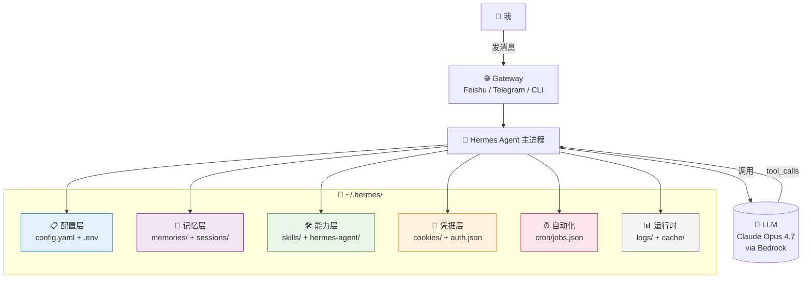

每次你给 Hermes 发一条消息，它都要"经过"上面这些层——**配置告诉它你是谁、用哪个 LLM；记忆告诉它你的习惯和过去聊过什么；能力告诉它能做什么；凭据让它能调你授权过的服务**。

---

## 🧬 一次对话的生命周期

先看一次对话从你发消息到看到回复，**Hermes 内部到底发生了什么**：

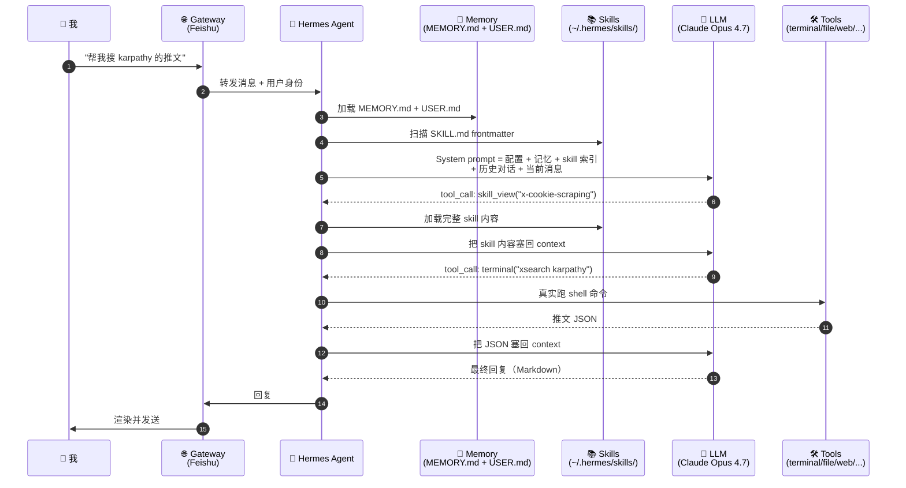

!!! tip "关键洞察"
    **每次对话开始时，整个 `MEMORY.md` 和 `USER.md` 文件都被原文塞进 LLM 的 system prompt**——这就是为什么记忆容量很小（2K-2.2K 字符上限）但效果显著：它不是"我去查记忆"，而是 LLM 每次都"已经知道了"。所以记忆里写的东西要**精炼、稳定、跨会话有用**。

---

## 1️⃣ 配置层 —— Hermes 的"身份证"

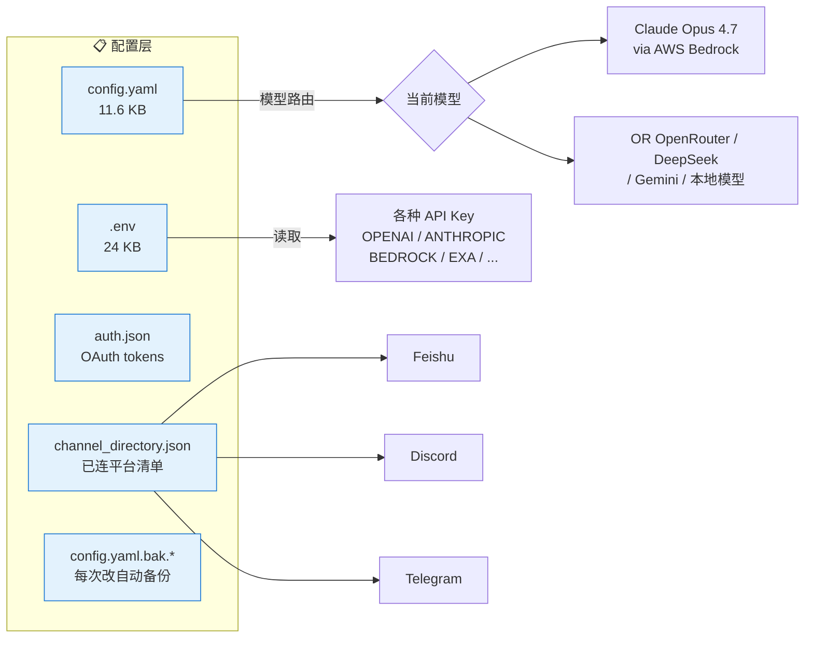

| 文件 | 是什么 | 改它要重启吗 |
|---|---|---|
| `config.yaml` | 主配置（模型、provider、工具、技能、压缩阈值） | 大部分要 `/reset` 或重启 |
| `.env` | 所有 API Key 和 secret | `/reload` 或重启 |
| `auth.json` | OAuth token（飞书 access_token 等） | 自动刷新 |
| `channel_directory.json` | 已连接的聊天平台清单 | gateway 重启 |
| `config.yaml.bak.*` | 每次改 config 都自动备份一份 | 用于回滚 |

!!! tip "配置和秘密分两个文件"
    是为了你能随便 `git push` config.yaml 同步设置，但 `.env` 永远在 `.gitignore` 里。

---

## 2️⃣ 记忆层 —— 跨会话的"共同体记忆"

这是 Hermes 和"普通 LLM 聊天"最大的区别。每次对话**都不是从零开始的**：

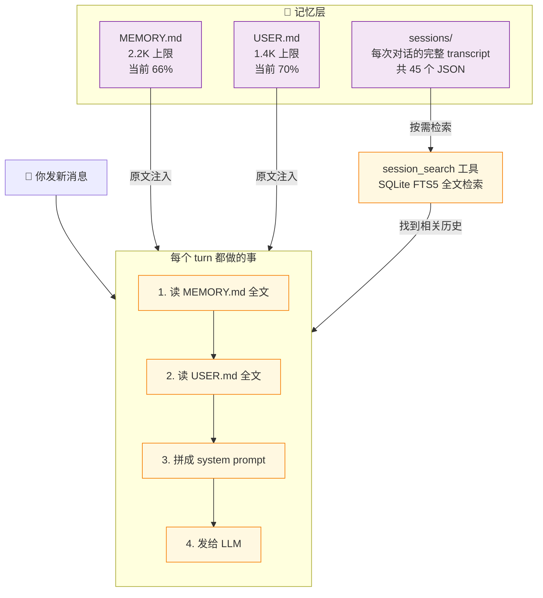

### 两类记忆，分工明确

| 文件 | 内容 | 例子 |
|---|---|---|
| **MEMORY.md** | Hermes 自己的工作笔记 | 「主机是无图形界面 Linux」「web 抓取栈用 Exa + Jina」「cookie 都在 ~/.hermes/cookies/」 |
| **USER.md** | 关于用户（我）的画像 | 「飞书移动端不渲染 Markdown 表格」「中文交流」「讨厌方案对比让你选」 |

### 容量设计的取舍

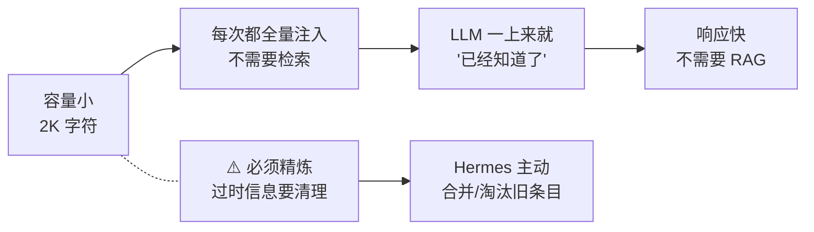

记忆容量小是**有意为之**——这样可以保证整段塞进每次的 system prompt，LLM 不需要"决定要不要查记忆"，记忆**永远是激活的**。代价是必须保持精简，所以我（Hermes）会主动建议合并冗余条目。

### Sessions 是"长期外存"

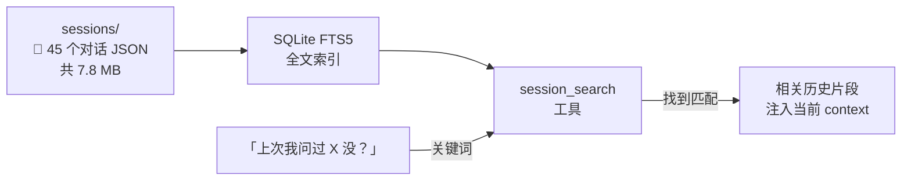

记忆是"现在还要用的事实"，sessions 是"以前聊过的所有内容"。当我说「上次咱们怎么解决 Y 的来着？」，Hermes 会调用 `session_search` 工具，从 SQLite 里全文检索，把找到的片段注入到当前对话的 context 里。

---

## 3️⃣ 能力层 —— Skills 系统（自学的"程序性记忆"）

如果说记忆是"陈述性知识"（事实），**Skills 就是"程序性知识"（怎么做某事）**。这是 Hermes 最有意思的部分：

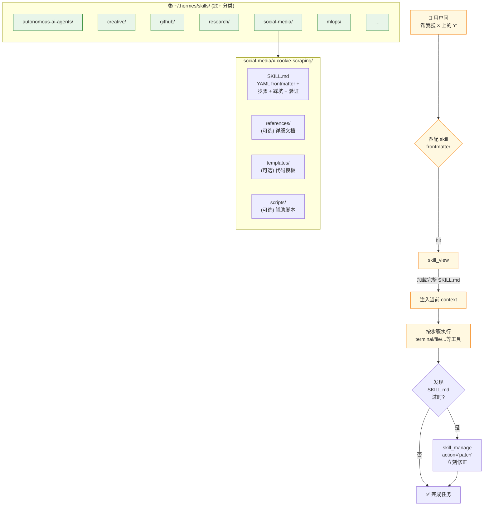

### Skills 的关键创新：**自我维护**

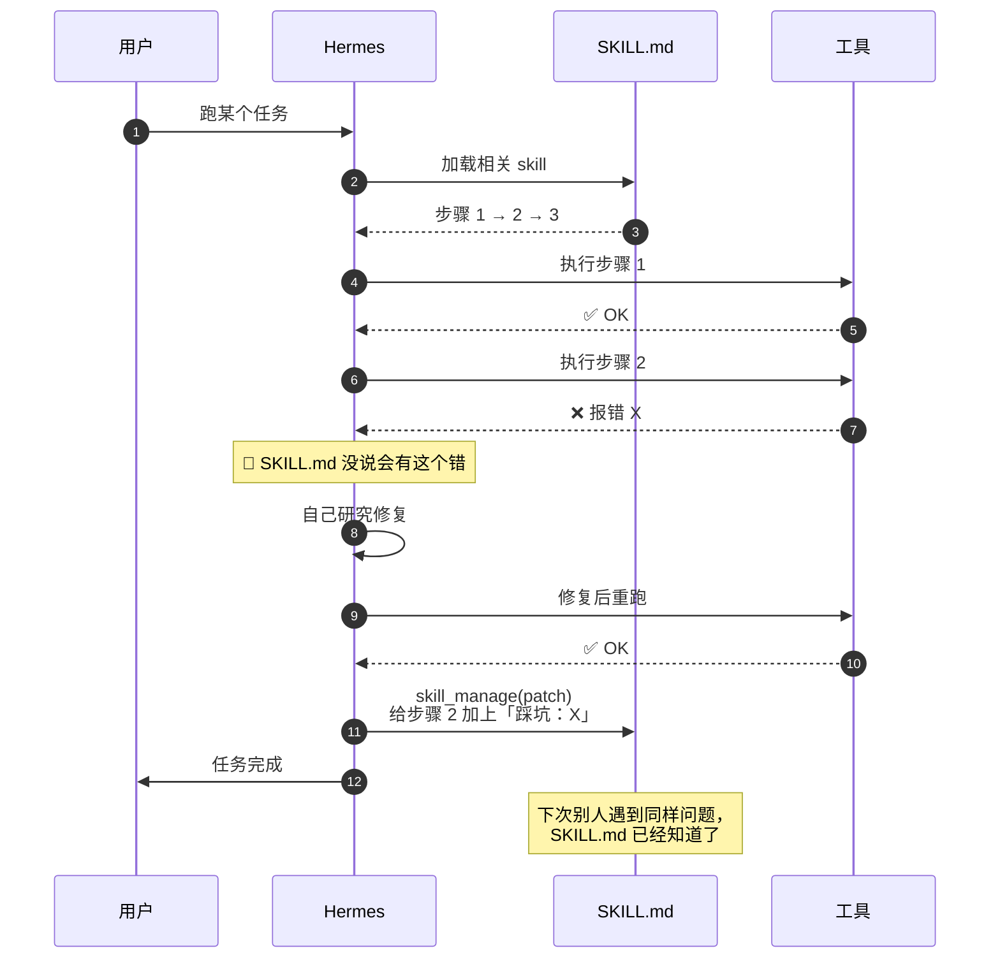

这就是为什么 Hermes 是 "self-improving"——**它每次踩坑都会修订 skill，让下次的自己（或别人）少走弯路**。

### Skills vs Memory 的边界

| | Memory | Skills |
|---|---|---|
| 内容类型 | 事实陈述 | 操作步骤 |
| 容量 | 受限（2K） | 不限 |
| 加载 | **每次自动注入** | **按需加载**（match 时） |
| 例子 | "用户用中文" | "怎么用 cookie 抓 X 的推文" |

---

## 4️⃣ 凭据层 —— Cookie 抓取栈（最近搭的）

最近我让 Hermes 能去 X、小红书帮我搜内容，整套机制就活在凭据层：

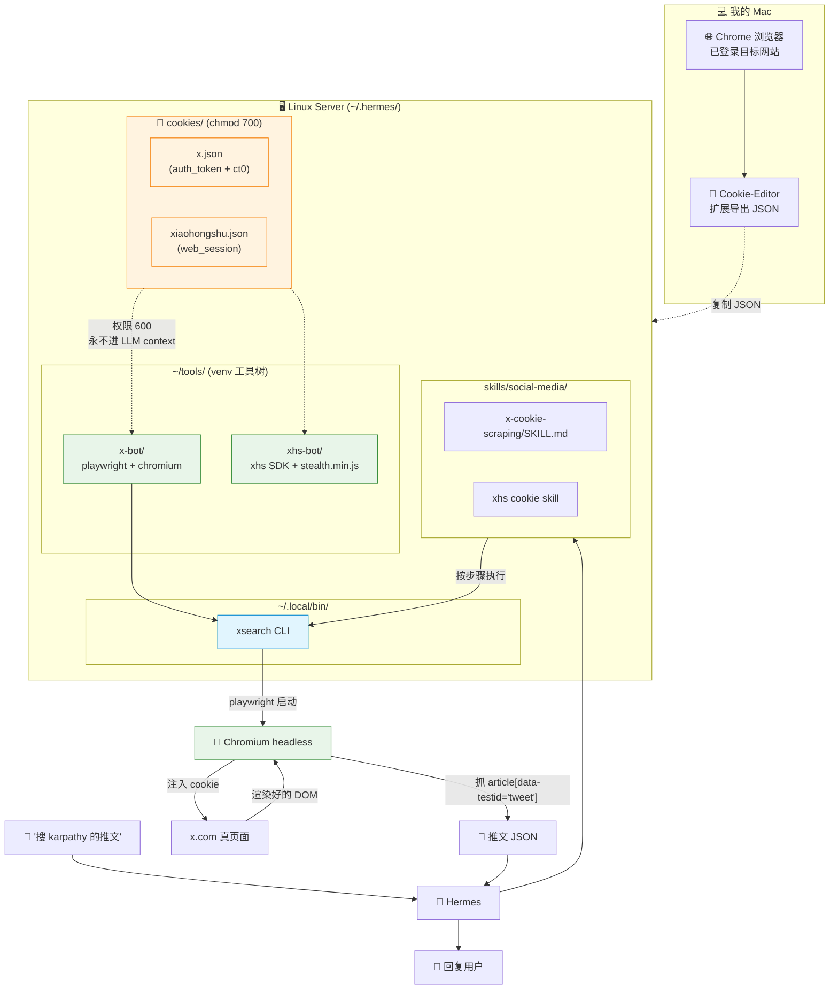

### 为什么用 Cookie 而不是 API？

!!! tip "取舍"
    - **官方 API**（X API v2 / xurl）：稳，但要付费 + 注册 OAuth。
    - **Cookie + Playwright**：免费，立等可用，但 cookie 1-3 个月过期一次。

我的判断：如果只是日常给我抓信息，cookie 这条路**性价比更高**——失效时重导一次就行。重要的是 cookie 文件**永远不进 LLM 的 context**（Hermes 的 skill 里明确禁止读 cookie 内容回流），LLM 只知道"调 xsearch CLI"，cookie 在 OS 层面被它的工具脚本读取。

### 几个踩过的坑（已写进 skill）

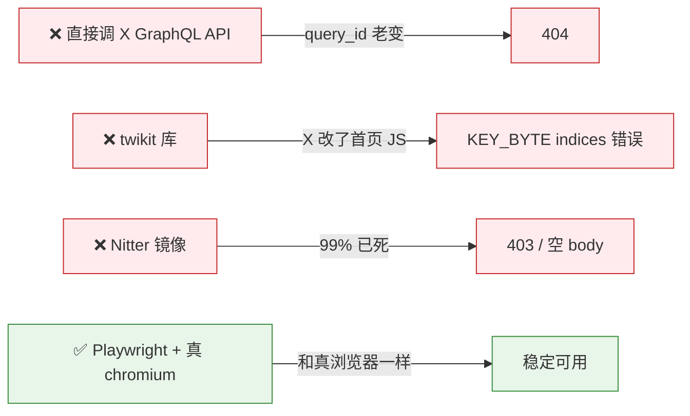

---

## 5️⃣ 自动化层 —— Cron 定时任务

我每天 9:00（北京）会收到一份 AI/Agent 行业简报，整个流程是这样的：

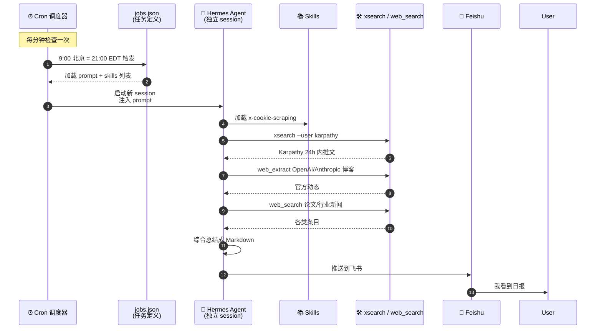

### Cron 任务的关键设计

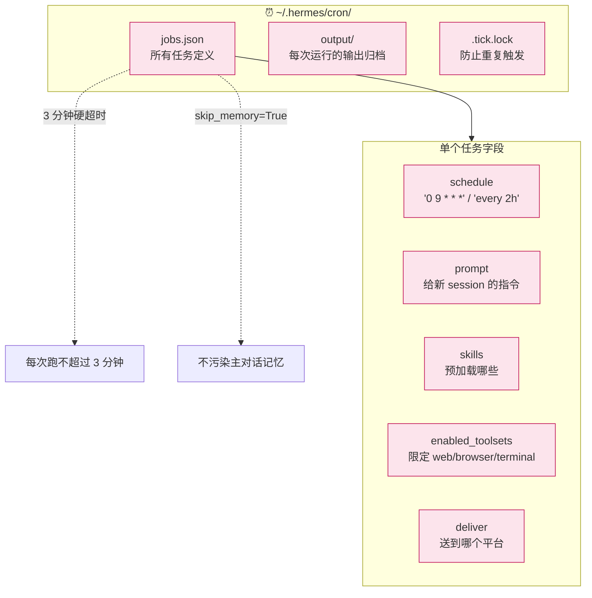

!!! tip "Cron 任务的隔离性"
    Cron 任务和你的主聊天是**完全隔离的**——它跑在独立 session 里，看不到你正在聊的东西，也不会把它的工作记忆写到主 MEMORY.md（因为 `skip_memory=True`）。这避免了"日报跑了一次就把一堆抓取细节塞进我的长期记忆"的污染。

---

## 6️⃣ 把所有层串起来 —— 一张总览图

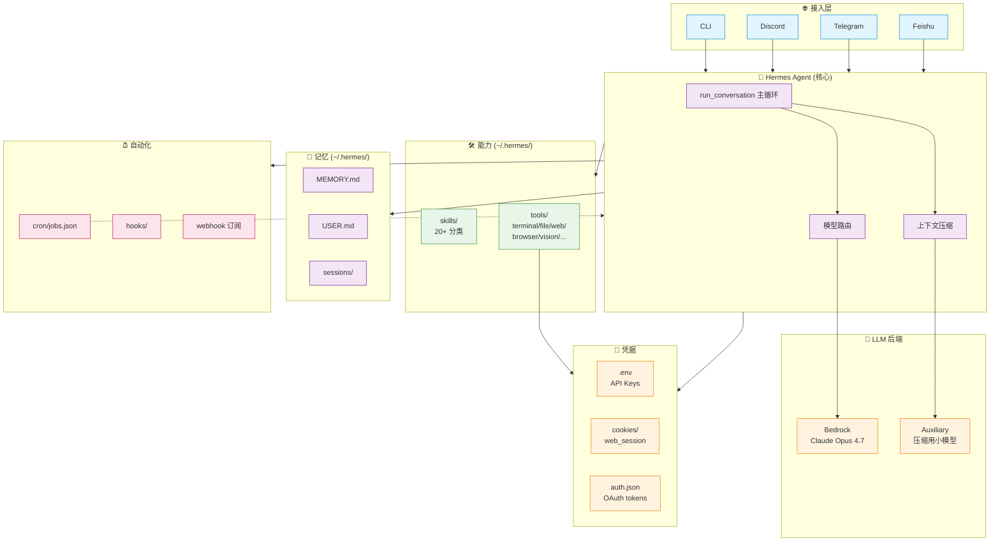

---

## 🤔 我的几点判断

!!! abstract "TL;DR"
1. **Hermes 不是"一个聊天机器人"，是一个有持久状态的"AI OS"**——文件系统就是它的世界。
2. **记忆 + 技能 + 工具的三层分离**很巧妙：事实级注入、操作级按需加载、能力级随时调用。
3. **本地化是核心优势**——所有数据在我自己电脑上，不依赖云端 RAG 服务，隐私和速度都有保障。

### 和 ChatGPT / Claude 网页版的本质区别

:material-rocket-launch: **Hermes Agent**
{ .center }

- ✅ **MEMORY.md 跨会话**：上次说过的事下次还记得
- ✅ **真 shell + 真浏览器**：能 git push、能登小红书
- ✅ **Skills 系统**：程序性知识可沉淀
- ✅ **cron + gateway**：定时主动推消息
- ✅ **多平台触手**：飞书 / TG / Discord / 邮件
- ✅ **数据归属本地**：`~/.hermes/` 全在我电脑上
- ✅ **切换 LLM 一行配置**：Opus / GPT-5 / 自部署都行

:material-web: **ChatGPT / Claude Web**
{ .center }

- ❌ 每次新对话从零开始
- 🟡 部分（Code Interpreter，沙箱有限制）
- ❌ 没有自定义"程序性知识"沉淀
- ❌ 永远是"我问它答"，不会主动找我
- ❌ 只在网页 / App 内
- 🟡 云端，受厂商 ToS 约束
- ❌ 锁定厂商

### 这套架构最让我觉得"做对了"的地方

1. **文件系统作为状态存储**。一切都是 Markdown / JSON / SQLite，可以 grep、可以 git diff、可以 backup——比"云端不可见的记忆服务"可控得多。
2. **Skills 的自我维护机制**。这不是简单的 RAG，而是"边用边修教程"——每次踩坑都让下一次更顺利。
3. **配置和秘密强分离**。`config.yaml` 可同步、`.env` 永远私密——这种"工程性的克制"在 AI 工具里很少见。
4. **Cron + Skills + Cookies 组合的可扩展性**。我搭 X 抓取栈花了 1 个晚上，下一个平台（知乎/微博/B站）只需要复用同样的模式。

### 不太满意的地方

1. **单 turn 输出 token 上限太低**——遇到长内容（比如这篇文章）容易被截断，需要主动拆段写。已经把 `model.max_tokens` 调到了 32K。
2. **MEMORY.md 容量受限**——2K 字符跨多个领域用很容易撑爆，必须经常合并精炼。某种程度上这逼迫记忆质量，但也确实是约束。
3. **Cookie 失效需要手动重导**——目前没有自动检测 + 提醒的机制（虽然脚本里加了 expiry warning）。

---

## 🔗 延伸阅读

- [Hermes Agent 官网](https://hermes-agent.nousresearch.com/) —— 文档和 quick start
- [Hermes GitHub 仓库](https://github.com/NousResearch/hermes-agent) —— 源代码
- [Anthropic: Building Agents with Claude](https://www.anthropic.com/engineering/building-effective-agents) —— Agent 设计的官方思考
- [Cognition: Don't Build Multi-Agents](https://cognition.ai/blog/dont-build-multi-agents) —— 关于 agent 架构取舍的另一种声音
- [Karpathy: LLM as OS](https://x.com/karpathy/status/1707437820045062561) —— "把 LLM 当成新一代操作系统"的视角，与 Hermes 的"AI OS"定位一脉相承

---

*这是 Garden 里的第 2 篇正式文章，也是把"我用的工具"系统性拆解的第一次尝试。如果对你也有帮助，欢迎转发；如果你有更好的 Agent 架构思路，欢迎来 GitHub 讨论。*

