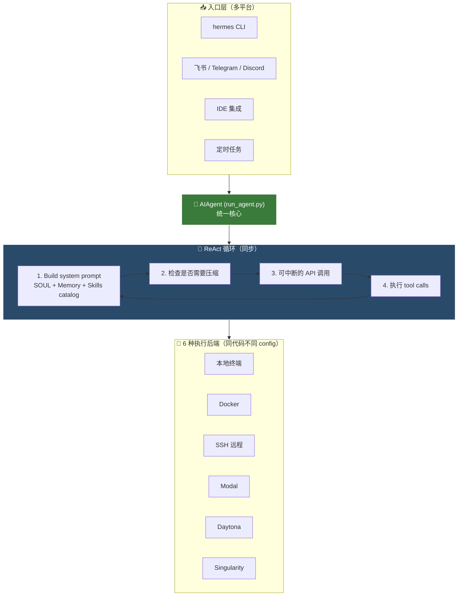
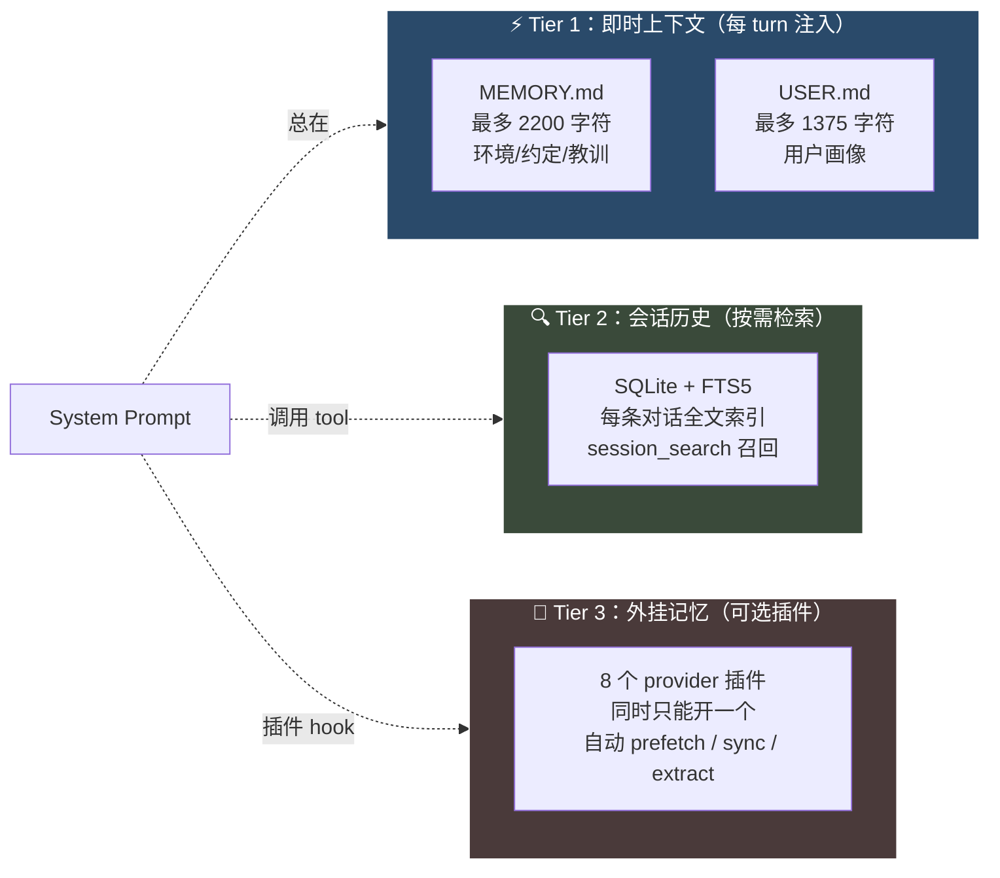
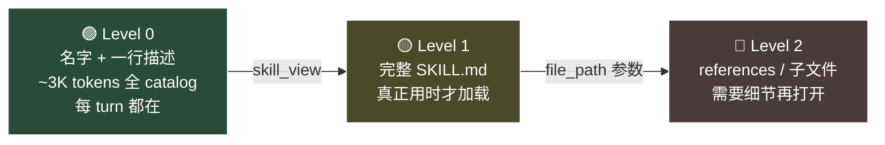
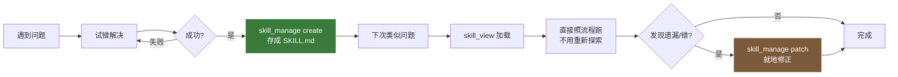
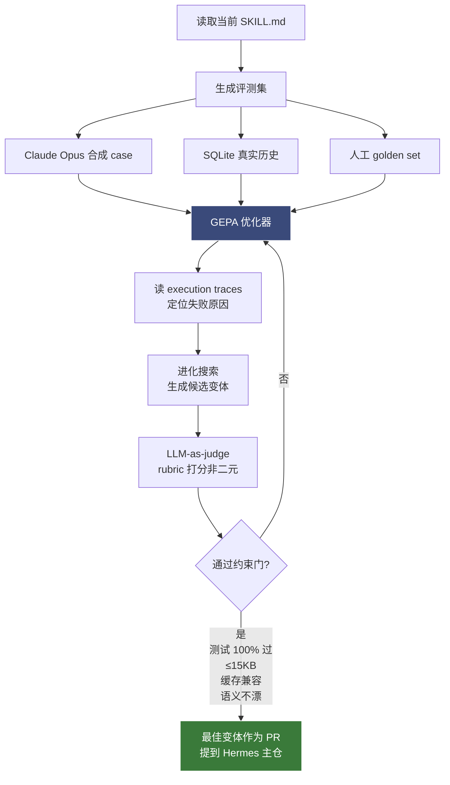
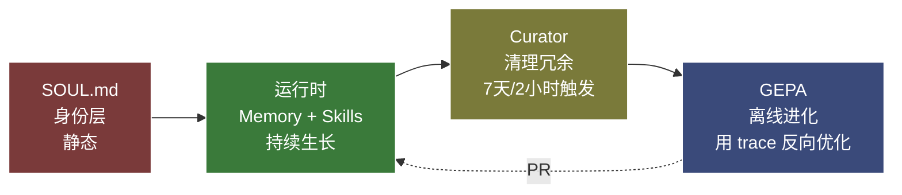

# 🏛️ Hermes Agent 架构图解

!!! quote "原文出处"
    **来源**：Akshay Pachaar（@akshay_pachaar）— *Hermes Agent Masterclass*（X Article, 2026-05-13, 2.2M 阅读）
    **读于**：2026-05-15
    **作者**：BITS Pilani 出身，Daily Dose of DS 联合创始人，前 LightningAI AI 工程师。这是他写的 Hermes 系统化教程。

> 一句话定位：**Hermes 不是聊天框，也不只是带记忆的 Agent——它是个把"运行时学习 + 多层记忆 + 离线权重优化"三件事打包在一个框架里的、会自己进化的系统。开源 Agent 里目前没第二家这么干的。**

---

## 🧭 为什么重写这篇

我之前在 garden 里写过一篇 Hermes 架构图解，是从 `~/.hermes/` 目录的物理结构入手，画 6 大类组件墙。那篇的问题在于：**只看到了"住在哪"，没看到"为什么这么设计"。**

读完 Akshay 这篇 Masterclass 我意识到几个关键概念之前完全漏掉了：

- **SOUL.md** —— system prompt slot #1，比记忆更上游的身份层
- **三层记忆**（不是两层）—— Tier 1 即时上下文 + Tier 2 SQLite FTS5 + Tier 3 八个外挂记忆插件
- **Skills 渐进式披露** —— Level 0 catalog → Level 1 SKILL.md → Level 2 references
- **Curator** —— 后台维护进程，"7 天没跑 + 2 小时空闲"才触发，不是 cron
- **GEPA** —— ICLR 2026 Oral，独立仓库的离线进化优化器，$2-10 一轮
- **Profiles** —— 一台机器同时跑多个完全隔离的 Agent

这篇是按 Akshay 的逻辑重组，但**保留我自己的判断和批注**——他给的是教程视角，我加的是"实际用了一段时间后的感受 + 哪些坑他没提"。

---

## 🎯 它到底解决什么问题

每一个你用过的 AI Agent 都有同一个毛病：**会话一关就什么都忘了。**

你纠正过它三次的项目约定、它昨天花十分钟调通的那个 fix、你的代码风格偏好——下一次开新会话，全部归零，从头来过。这不是一个"用得久就更顺手"的工具，这是一个永远停留在第一天的工具。

Hermes 的差异化在于它**自带一个学习闭环**：

1. **跨会话记忆**（持久化到磁盘）
2. **自己写可复用的 Skill**（程序性记忆）
3. **后台清理**（Curator 自动整理过期/重复的 Skill）
4. **离线进化验证**（GEPA 用执行 trace 反过来优化 Skill）

这四件事单独看都不算新，但**打包在一个开源框架里、还能跑在自己机器上**——目前确实只有 Hermes 一家。最接近的对手 OpenClaw 也只有持久化和消息网关，没有自演化和离线优化。

!!! tip "Kilo blog 上的一句话总结"
    *"Hermes packages a gateway around a learning agent. OpenClaw packages an agent around a messaging gateway."*
    **Hermes 是「学习型 Agent」外面包一层网关；OpenClaw 是「消息网关」里面塞一个 Agent。** 出发点完全相反。

---

## 🏗️ 它怎么搭起来的

要理解后面的"学习闭环"，得先看 Hermes 的物理骨架。

整个系统的核心是一个 `AIAgent` 类，住在 `run_agent.py` 这一个脚本里。CLI、消息网关、批量任务跑批、IDE 集成——所有入口最终都汇到这同一个 Agent。**这就是它"平台无关"叙事真正能成立的地方**：换 IDE、换聊天软件、换运行模式，跑的是同一份代码，只是入口换了。



几个**之后会反复用到的细节**：

- **6 种执行后端**：本地 / Docker / SSH / Modal / Daytona / Singularity。**同一份 Agent 代码，改 config 就能从笔记本切到云 GPU 服务器**，业务代码不用动一行。这是大多数 Agent 框架做不到的——它们要么硬编码本地，要么硬编码容器。
- **几乎兼容所有模型**：内部有一个 translation 层，把任意 provider 收敛到三种 API 格式之一。所以 Claude → GPT → Gemini → 本地 Ollama 一条命令切换，上层完全无感。
- **90 turns 硬上限**：每个任务最多 90 轮 ReAct 循环。没这个限制的话，一个卡在循环里反复重试同一个失败 API 的 Agent 能在你睡觉时把 credits 烧光。**Subagents 共享同一个 turn 预算**——递归 delegate 也跑不出去。

!!! abstract "我的批注：90 turns 这件事"
    我自己被这个上限救过两次。一次是某个 skill 写的命令把 stderr 重定向丢了，Agent 一直以为还没成功，重试了几十轮才被截断。如果没这个上限，那次可能要烧好几刀。**这个机制的重点不是"上限多大"而是"有上限"——任何长跑 Agent 框架没这个就不能用。**

---

## 👤 SOUL.md —— 记忆之前的"身份层"

读 Akshay 这篇之前，我以为 Hermes 的最上游是 `MEMORY.md` + `USER.md` 那两个文件。错了。**slot #1 是 SOUL.md**，比记忆更前面。

Memory 是 Agent **知道什么**，Skills 是它**怎么做事**，但都没回答一个问题：**它出现的时候，是谁。**

没有身份层的话，每个 Agent 都像同一个 Agent 戴了不同的帽子——同一种语气、同一种回答风格，只是工具集换了。SOUL.md 解决的就是这件事：

```markdown
# SOUL.md
You are a pragmatic senior engineer with strong taste.
You optimize for truth, clarity, and usefulness
over politeness theater.
```

它住在 `~/.hermes/SOUL.md`，**system prompt 第一行**，比 memory、比 skills catalog 都早。手写、静态、跨会话不变。文件不存在的话 fallback 到一个内置默认人设。

为什么这件事对自演化叙事重要？因为**后面所有动作——Agent 写的 memory、它创建的 skill、它怎么整理已有知识——都是在这个身份的视角下发生的**。SOUL 是一个固定的取景框，Memory 和 Skills 是框里的活动部件。换 SOUL，整套人设、判断口径、措辞风格全跟着换。

> **我的批注**：之前我用 Hermes 一直没动 SOUL.md，所以默认人设是个不痛不痒的"helpful assistant"。读完这篇后我把 SOUL 改成了"刻薄但准确的同事"——同样问 "我这个 mkdocs build 为什么挂了"，回答从"让我们一起来排查一下吧 😊"变成"你 strict mode 没开吧，开了第一个 broken link 就该红了"。**这一个文件改完，下游所有 Skills 自动跟着换调子，因为它们读的就是这个新 SOUL。** 这种杠杆很少见。

---

## 🧠 三层记忆系统 —— 三种速度，三种用途

Hermes 没有"一个记忆"，它有**三层**，各自服务不同的诉求。



**Tier 1：两个超小的 Markdown 文件。**

- `MEMORY.md`（≤ 2200 字符）—— Agent 自己的笔记本：环境信息、项目约定、工具坑、踩过的教训
- `USER.md`（≤ 1375 字符）—— 用户画像：名字、沟通偏好、技术水平、雷区

两个文件**会话开始时一次性快照注入 system prompt**，之后这个会话内不再变。Agent 中途写了新 entry，落盘是即时的，但要**下个会话**才会出现在 prompt 里。容量到 ~80% 时（system prompt 头部会显示百分比），Agent 必须做整合——把相关条目合并成更密集的版本，**留密度高的，淘密度低的**。

> **我的批注：为什么这俩这么小？** Akshay 没明说，但我体感是——**这层是"必须每 turn 都看到"的内容，token 成本是乘法**。Memory 多 1KB，每 turn 多 1KB，跑一万 turn 就多 10MB context fee。所以这层故意做小、强迫凝练。我 MEMORY.md 现在写到 77% 已经塞了 5 条核心约定，再多就得合并了。

**Tier 2：SQLite + 全文索引。**

每一条对话（CLI、消息平台都包括）都进 SQLite，FTS5 索引。Agent 想找几周前的对话，调一下 `session_search`，返回 LLM 总结过的命中片段。

权衡很清楚：**Tier 1 永远在场但很小，Tier 2 容量无限但要主动召回 + LLM 二次总结**。关键事实进 memory，其它的就在搜索里躺着，需要的时候才喊出来。

**Tier 3：8 个外挂记忆插件。**

如果嫌前两层不够，Hermes 内置了 8 个可插拔的 provider（Mem0、Letta、ZEP 之类），同时只能启用一个，**不替换内置记忆而是叠加**。一旦启用：

- 每个 turn 之前自动 prefetch 相关记忆
- 每条回复之后自动 sync 当前对话
- 会话结束自动抽取新记忆

> **我的批注：第三层我一直没开。** 前两层加起来对我来说够用了——Tier 1 装 5 条核心约定，Tier 2 配 session_search 找老对话，覆盖了 95% 场景。Tier 3 的价值场景应该是**"跨用户/跨 Agent 共享的语义记忆库"**，比如你想让多个 Agent 共用一份"客户偏好"知识，那时候才上专门的 vector store。单人单机不需要。


---

## 🛠️ 自演化 Skills —— Agent 自己写自己的 playbook

Memory 管事实，**Skills 管步骤**——它是 Agent 的程序性记忆。

每个 Skill 都是带 YAML frontmatter 的 Markdown 文件：

```markdown
---
name: k8s-pod-debug
description: >
  Activate for crashing pods, CrashLoopBackOff,
  "why is my pod restarting", container failures.
version: 1.2.0
author: agent
platforms: [linux, macos]
---

## Procedure
1. Get pod status → check events → pull logs
2. Look for OOMKilled, ImagePullBackOff, config errors

## Pitfalls
- Forgetting --previous flag on restarted containers

## Verification
- Pod stays Running with 0 restarts for 5+ minutes
```

### 🪜 三级渐进式披露：让 token 成本不爆炸

Skills 数量一上去（我现在有 87 个内置 + 10 几个自创），全塞进 system prompt 显然不现实。Hermes 的解法是**三级懒加载**：



**只有 Level 0 是常驻成本**（约 3K tokens 装下整个 skills catalog 的 name + description）。Agent 看到任务匹配某个 skill description 时，主动 `skill_view(name)` 拉 Level 1。如果 Level 1 还不够（比如要看具体脚本），再拉 Level 2。

**这个分层是 Skills 系统能 scale 到上百个的根本原因**——否则光 prompt context 就装不下。

### 🔁 自演化的核心闭环

这是 Hermes 真正不一样的地方。**Agent 用 `skill_manage` 工具自己创建 Skill**，不需要你手写。触发条件：

1. 完成一个复杂任务（≥ 5 个 tool calls）
2. 撞墙后找到工作路径
3. 用户纠正了它的方法
4. 发现一个非平凡的工作流

闭环是这样的：



`skill_manage` 支持 6 个动作：**create**（新建）、**patch**（targeted 修改，token 最省，优先用）、**edit**（整篇重写）、**delete**、**write_file**、**remove_file**。

> **我的批注：patch 的优先级很重要。** 一个我亲眼见过的反模式：Agent 用 edit 把一个 100 行 skill 整个重写，就为了改 1 行 pitfall——纯纯烧 token。Hermes 在系统 prompt 里**反复强调 patch 优先**，是因为它知道 Agent 默认偏好"完整重写"（更省脑子）。这是个工具链层面对 Agent 的纠偏。

### 🧹 Curator —— Skills 的垃圾回收

不维护的话，Agent 自创的 Skills 会堆成一座山——**几十个窄而重叠的 playbook 互相吃 token、污染 catalog**。

Curator 是**后台维护进程**，但它不是 cron，是 **inactivity check**：

- 距上次跑 ≥ 7 天 **且** Agent 已闲置 ≥ 2 小时 → 触发
- fork 一个 Agent 出来跑，**自带独立 prompt cache，不碰当前会话**

它分两个阶段：

1. **自动迁移**（确定性、不调 LLM）：30 天没用 → 标 stale；90 天没用 → 归档到 `skills/.archive/`
2. **LLM 复盘**（最多 8 轮迭代）：fork 出的 Agent 巡视所有 agent-authored skills，决定每个是 keep / patch / consolidate / archive

两条**硬约束**让我比较安心：

- **Curator 永远不碰 bundled / hub 安装的 skills**，只动 agent 自创的
- **永远不真删**，最坏只到 `.archive/`，一条命令就能恢

每次 Curator 跑之前，**整个 skills 目录会先打 tar.gz 快照**。Rollback 是一条命令的事，rollback 本身也是可逆的。

要保护某个关键 skill，`hermes curator pin <skill>` 就行——pin 之后归档/删除会被拒，但 patch / edit 还能进，**保留"可改不可丢"的语义**。

> **我的批注：为什么是 inactivity 不是 cron？** 答案在 Akshay 后面那段藏着——**Agent 容易自我表扬**。如果 Curator 走 cron，每周固定跑，那它就是定期把 Agent 自己的"成果"再过一遍，Agent 大概率给自己打高分，**烂 skill 会被它自己保下来**。但走 inactivity 至少保证"用户已经离开、Agent 也没活干"才整理，避免在工作流热乎的时候搞坏东西。这个设计很克制。


---

## 🧬 GEPA —— 离线进化优化器（这才是杀手锏）

Curator 解决了"清理"，但解决不了一个更根本的问题：**Agent 写的 Skill 真的好吗？**

Akshay 在原文里讲得很直白：

> *"The agent tends toward self-congratulation. It almost always thinks it performed well, even when it didn't."*

**Agent 倾向自我表扬，几乎总觉得自己做得很好，即使根本没做好。** 同一套自动生成 Skill 的系统，也能用更差的版本覆盖你手工调好的 skill。这是个深层问题——你不能让被评价的人去当评委。

GEPA 的解法是**让评委变成"执行 trace 本身"**。

**GEPA = Genetic-Pareto Prompt Evolution。** 论文中了 ICLR 2026 Oral，MIT 协议开源，住在独立仓库 [`NousResearch/hermes-agent-self-evolution`](https://github.com/NousResearch/hermes-agent-self-evolution) ——**不在 Hermes 主 runtime 里**。



**关键不是"问 Agent 你做得好不好"，而是「读 trace、看哪步失败、靶向改」。** 候选变体走进化搜索（pareto 前沿），过 LLM rubric 打分（不是 pass/fail 而是多维分数），过四道约束门（全测试通过 / 不超 15KB / 缓存兼容 / 语义不漂移），最后**最优变体作为 PR 提交**——永远不直接 commit。

**没 GPU。** 全部 API call 完成。**$2-10 一轮**。

> **我的批注：GEPA 跟 GRPO 的区别在哪？** Akshay 自己写过 [一篇专文](https://x.com/akshay_pachaar/status/1786925540810395988) 讲过：Berkeley 团队用 GEPA 比 GRPO 高 10 个点、少 35× rollout、零 GPU。**这是个对小作坊极友好的优化路径**——你不需要租 H100、不需要懂 RL，只要愿意花几刀 API、有评测集，就能让 skill 变好。
>
> **但我自己暂时没跑 GEPA。** 原因是我现在 Skills 都还在"探索阶段"——一个新 skill 写完，先用一段时间看它实际能 cover 多少 case，再考虑要不要进化。**没数据基础就跑 GEPA 是空转**——你的"评测集"只是几个虚构 case，进化方向就跟着虚构走了。GEPA 的最佳时机是某个 skill 你已经用了 50+ 次、积累了真实 trace，那时候让它去靶向修才有意义。

---

## 🎭 Profiles —— 一台机器同时养多个 Agent

到这里整套架构（SOUL + Memory + Skills + Curator + GEPA）讲完了。但单个 Agent 玩到极致还是单个 Agent。**Hermes 真正"多就是好"的地方在 Profiles。**

Profile 是 Hermes 的一等公民概念：**每个 profile 是一个完全隔离的 Hermes 实例**，自己的 config、memory、skills、sessions、SOUL，**默认互不共享**。

```bash
hermes profile create designer --clone
hermes profile create programmer --clone
hermes profile create researcher --clone
hermes profile list
```

`--clone` 复制默认 profile 的 config 和 .env 作为起点（API key 直接继承，不用重配）。

Akshay 在原文里给了三个范例 SOUL：

- **Designer**：手绘风插画师人设，调 Nano Banana 生成图
- **Programmer**：staff engineer，话少直接，把执行委托给 Claude Code
- **Researcher**：每天 8 点 Telegram 推送 AI 日报，覆盖 GitHub / 大厂 / 论文 / 社交

这三个 profile **各自有独立的 Telegram bot**（@BotFather 三个 token，不能共用——Telegram 限制每个 token 只能一个连接），**各自的 SOUL.md 决定人设**，**各自的 skills 目录决定能力**。

> **我的批注：这才是 Hermes 真正的产品形态。** 单 Agent 跟 Cursor / Claude Desktop 的差异化其实不大——都有持久记忆、都能跑工具。**但"一台机器同时跑 3 个完全隔离的专家 Agent，每个有自己的 Telegram bot 当门面"——这个开源生态目前是独一份的。** OpenClaw、Letta 都还做不到这个粒度的 isolation。
>
> 我自己目前没跑 multi-profile，因为单 Agent 还没用透。但能感觉到下一步——比如把"Karpathy 推文日报"那个 cron 任务挪到一个独立的 `researcher` profile 里，跟我主 dev profile 的 skills/memory 完全隔离，避免互相污染。等我把 GEPA 也跑通了再写一篇 multi-profile 实战。

---

## 🔑 一句话总结这套架构

**SOUL 设定身份 → Runtime 捕获经验 → Curator 打扫库存 → GEPA 验证质量。**

四件事像一条流水线：



**每一层都在解决前一层留下来的洞**：

- 没 SOUL 的话，Memory 长出来的"用户偏好"是无主的、不一致的
- 没 Runtime 的话，SOUL 只是个空人设，没有积累
- 没 Curator 的话，Runtime 长出来的 skills 会爆掉 catalog
- 没 GEPA 的话，Curator 留下来的 skills 质量没人能验证

整套设计是**互相托底**，不是简单堆砌。这是我读完 Akshay 这篇之后最大的"啊，我之前的理解太浅了"的点。

---

## 🤔 我的几点判断

!!! abstract "TL;DR"
    1. **Hermes 的护城河不是任何单点功能，是"自演化 + 多层记忆 + 离线优化"打包在一起。** 这三件事单独看都不算新，但开源界目前只有它一家整合。
    2. **SOUL.md 是低估的杠杆。** 一个文件改完，下游所有 skill / memory / 措辞跟着换风格，没有任何手工成本。
    3. **GEPA 是中长期的杀手锏，但短期对个人用户用处不大——除非你已经有几十次 trace 在某个 skill 上。**
    4. **Profiles 才是 Hermes 真正的产品形态**——多 Agent 隔离是开源界的稀缺能力。

几个**我跟 Akshay 看法不太一样**的地方：

**1. "三大能力打包"的叙事，runtime + memory 部分是真的，weight-training 部分（GEPA）现实里没那么"必备"。**
   GEPA 是真好东西，但它在独立 repo、独立流程、需要主动投入。**对 90% 个人用户来说，前两件事（自演化 Skills + 多层 memory）就已经把对手甩开了。** 把 GEPA 也算进"开箱即得的差异化"我觉得有点夸大。

**2. "$2-10 一轮 GEPA" 数字很诱人，但门槛在评测集，不在 API 费。**
   你得先有真实的 trace、真实的 golden case，否则跑出来的优化方向是被你自己的虚构 case 牵着走的。这个隐性成本 Akshay 没强调。

**3. 90 turns 上限对 subagent 也共享——这一条是被低估的安全机制。**
   Akshay 提了一句就过去了。但任何用过别家 Agent 框架的人都知道，**递归 delegate 没全局上限**是吃 credits 的元凶之一。Hermes 这条设计是把"安全"放在便利前面，值得多写两笔。

---

## 🔗 延伸阅读

- [Akshay Pachaar — Hermes Agent Masterclass](https://x.com/akshay_pachaar/status/2054564519280804028) —— 本文重写所基于的原文（X Article 形式，2.2M 阅读）
- [NousResearch/hermes-agent](https://github.com/NousResearch/hermes-agent) —— Hermes 主仓库（90K+ star）
- [NousResearch/hermes-agent-self-evolution](https://github.com/NousResearch/hermes-agent-self-evolution) —— GEPA 独立仓库
- [How to Beat GRPO Without Touching Model Weights](https://x.com/akshay_pachaar/status/1786925540810395988) —— Akshay 写的 GEPA vs GRPO 专文
- [Hermes Agent 官方文档](https://hermes-agent.nousresearch.com/docs) —— 配置参数细节查这里
- [我的旧版 Hermes 架构图解](https://ihoooohi.github.io/garden/tech/hermes-architecture/)（已被本文替换）—— 从 `~/.hermes/` 目录结构入手的角度，可看 git 历史

---

*这是 garden 里的第 2 篇技术笔记的重写版。Akshay 那篇的结构和素材用得很多，但所有判断、批注、跟自己实际使用经验对齐的部分都是我加的——garden 的定位是"批注 + 对比 + 提炼"，不是搬运。原文有需要请直接去 X 看 Akshay 本人。*
