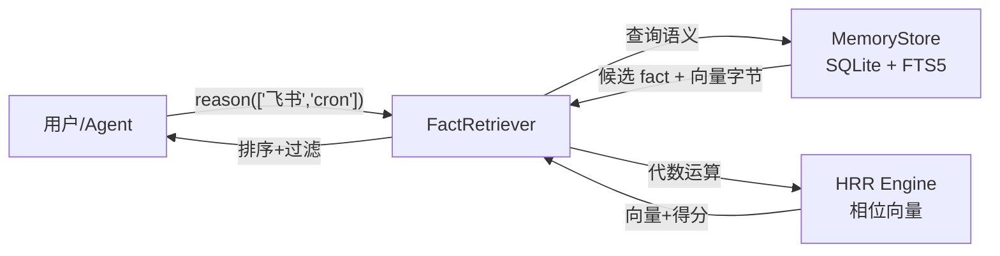
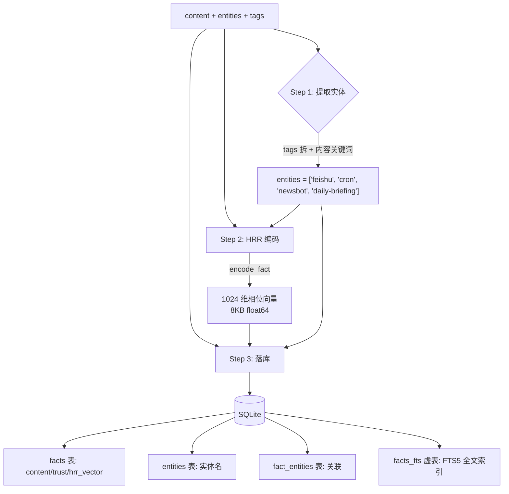
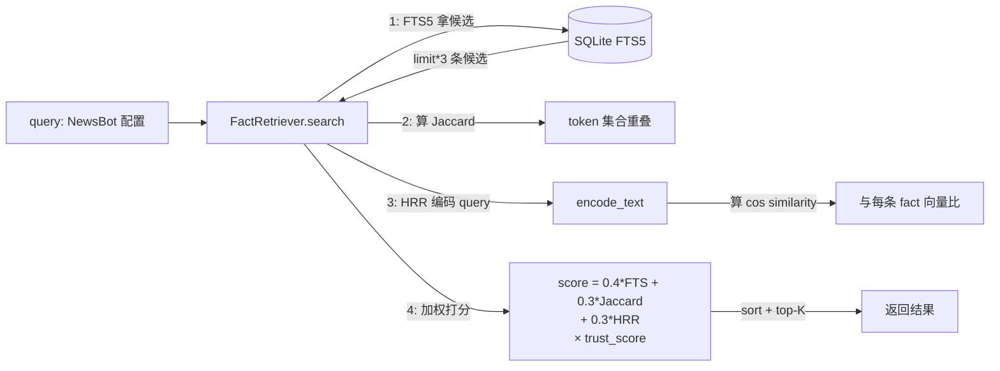
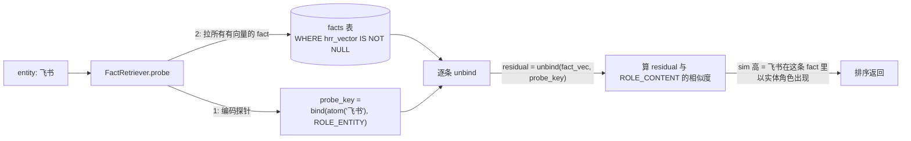
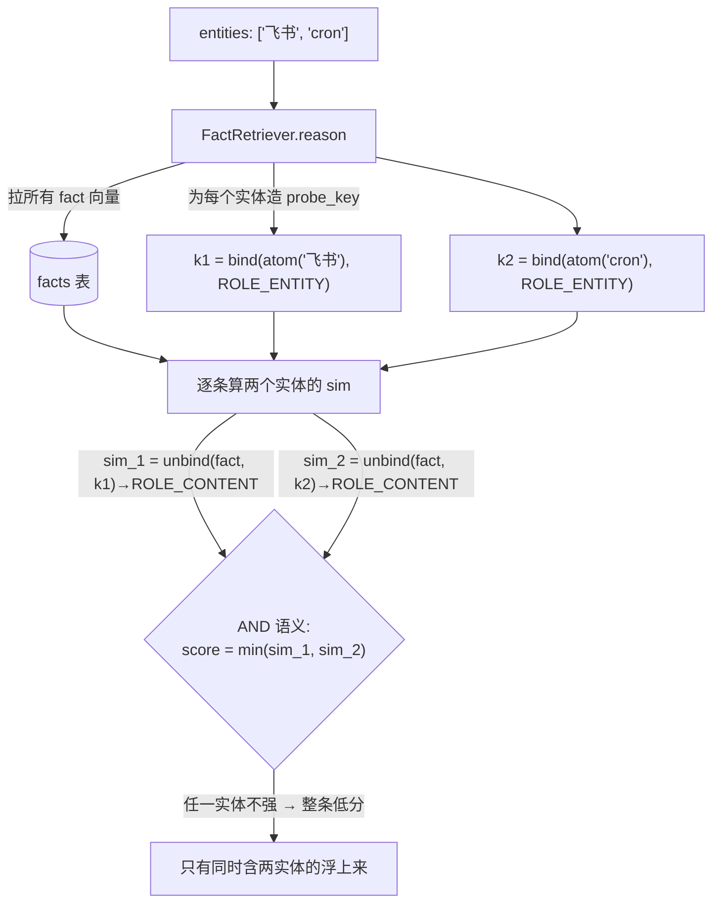
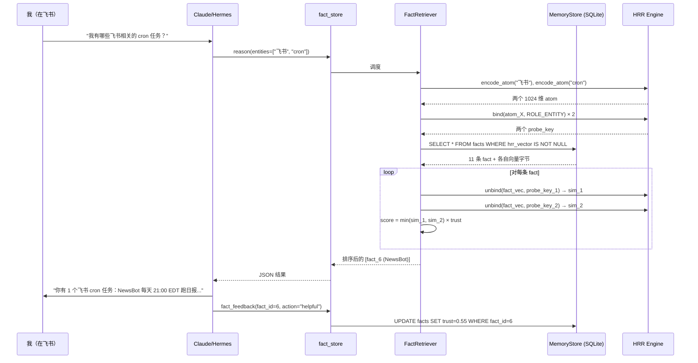

# AI Agent 的记忆为什么这么烂 — Hermes 全息记忆实战拆解

!!! quote "源代码出处"
    `plugins/memory/holographic/{holographic,retrieval,store}.py` · 1782 行
    完整 demo 来自我和 Hermes 的真实对话

!!! abstract "一句话定位"
    **ChatGPT 的"记忆"本质是关键词搜索 + 向量相似度，碰到"既关于 A 又关于 B"或"我之前是不是说过冲突的话"就废。Hermes 的 fact_store 用一套叫 HRR 的老技术解决了这两件事——这篇用我自己的真实使用场景拆给你看它怎么干活。**

---

## 一个让 ChatGPT 抓瞎的真问题

我用 Hermes 大半年，攒了一堆零散的"我跟它配置过的事":

- 飞书 OpenAPI 主 profile（App ID `cli_aa8f549aae...`）
- NewsBot 独立 profile，每天 21:00 EDT 跑简报（cron ID `ec71837e0a3e`）
- agent-reach 工具栈（Jina Reader + Exa MCP）
- Bedrock + Claude 自留 4 条 patches，**别 git pull**
- 知识花园 ihoooohi/garden（MkDocs Material）
- ……

某天我突然想问一句：

> "**我有哪些飞书相关的 cron 任务？**"

如果是 ChatGPT memory，会发生什么？

- 它召回所有提到"飞书"的 memory（5 条）
- 它召回所有提到"cron"的 memory（4 条）
- 然后……取交集？相似度排序？两边重叠最多的？

**没有一个标准答案，因为向量相似度没有"AND"语义**。你查的是"语义相似"，不是"逻辑相交"。结果通常是：

- 漏：飞书 cron 那条没排进 top 5
- 多：所有提到"任务"的都来了
- 你得多次追问、人工筛

而 Hermes 的 fact_store 一行命令就行：

```python
fact_store(action="reason", entities=["飞书", "cron"])
```

返回**只有 1 条**：NewsBot 配置那条。精准、零废话、零追问。

这一篇就拆给你看，从我打这行命令到拿到结果，**数据是怎么在四个模块之间流动的**。

---

## 三个模块的全景图



四个角色：

| 模块 | 文件 | 干啥的 |
|---|---|---|
| **fact_store 工具** | `__init__.py` | Agent 看得见的入口（add/search/probe/reason/contradict/feedback） |
| **MemoryStore** | `store.py` | SQLite 存储 + FTS5 全文索引 + 实体表 + trust score |
| **HRR Engine** | `holographic.py` | 相位向量代数（bind/unbind/bundle/similarity） |
| **FactRetriever** | `retrieval.py` | 把上面三个揉到一起的检索调度器 |

为什么不是单独一个 SQLite + 单独一个向量库？因为这套系统**既要快（FTS5）也要会推理（HRR）**——两条路并行做、加权融合，下一节看实例就清楚。

---

## 实战 1：写入一条事实

我先告诉 Hermes：

> "记一下，NewsBot 是我的飞书 app `cli_aa829aa82b79dbde`，每天 21:00 EDT 跑 cron `ec71837e0a3e`，归档到飞书 home channel"

Agent 调用：

```python
fact_store(
    action="add",
    content="NewsBot 独立 profile：飞书 app cli_aa829aa82b79dbde，cron ID ec71837e0a3e，每天 21:00 EDT 跑日报。",
    category="project",
    tags="newsbot,feishu,cron,daily-briefing"
)
```

**写入流水线**（`store.py` 的 `add_fact()` 干的）:



关键三步：

1. **实体抽取** — 从 tags 拆出来加上 content 里的关键词，得到 `["feishu","cron","newsbot","daily-briefing"]`。这些是后面查询的"钩子"。
2. **HRR 编码** — `encode_fact(content, entities)` 把内容和每个实体分别和"角色向量"绑定，再 bundle 成一个 1024 维向量：

   ```
   fact_vector = bundle(
       bind(content_text_vector, ROLE_CONTENT),
       bind(atom("feishu"),  ROLE_ENTITY),
       bind(atom("cron"),    ROLE_ENTITY),
       bind(atom("newsbot"), ROLE_ENTITY),
       bind(atom("daily-briefing"), ROLE_ENTITY),
   )
   ```

   这个向量长得像一堆乱七八糟的角度（每维一个 [0, 2π) 的数），**但里面同时编码了内容和所有实体的结构关系**——稍后我们能用代数把它们提取回来。

3. **多表落库** — fact 本体进 `facts` 表（带 hrr_vector 字节）、实体进 `entities` 表、关联进 `fact_entities`、内容文本进 `facts_fts` 全文索引虚表。**FTS5 和 HRR 同一份数据存两份索引**，下一节就明白为什么。

写完之后这条 fact 在 SQLite 里的样子：

| fact_id | content | category | tags | trust | hrr_vector |
|---|---|---|---|---|---|
| 6 | NewsBot 独立 profile：飞书 app... | project | newsbot,feishu,cron... | 0.5 | `<8192 字节>` |

外加 entities 表的 4 条记录、fact_entities 关联 4 条、facts_fts 全文索引 1 条。

---

## 实战 2：search vs probe vs reason —— 三种问法的实际差异

现在我连续问 Hermes 三种问题，看看数据流的差别。

### 问法 A：模糊搜索（FTS5 + Jaccard + HRR 三路加权）

> "搜一下 NewsBot 的配置"

```python
fact_store(action="search", query="NewsBot 配置")
```



`relevance = 0.4 × fts_rank + 0.3 × jaccard + 0.3 × hrr_sim`，再乘 `trust_score`，再可选时间衰减。

**为啥三路并行不是只用一路？** 因为各管一段：

- 你打**精确关键词**（"cli_aa829aa82b79dbde"）→ FTS5 命中率最高
- 你说**词面有重叠的近似词**（"newsbot 配置"vs"NewsBot 独立 profile"）→ Jaccard 救场
- 你问**词面不重合但语义相关**的（"日报机器人"vs"daily-briefing"）→ HRR 救场

只用 embedding 的系统在第一种场景上会被 FTS5 吊打；只用 FTS5 的系统在第三种场景上完全不工作。**三路融合 + trust 加权是这套系统比 ChatGPT memory 强的工程层面**——HRR 还没出场就赢了一半。

### 问法 B：实体探测（HRR 代数解绑）

> "关于飞书的所有事实"

```python
fact_store(action="probe", entity="飞书")
```

这次走完全不同的路：



**这里发生了什么神奇的事？** 我写入时把 `bind(atom('飞书'), ROLE_ENTITY)` 这一项 bundle 进了 fact_vector。bundle 是有损叠加，但 HRR 的代数性质保证：**用同样的 probe_key 去 unbind，能从噪声里近似还原出"配对的另一边"**。

- 如果"飞书"真的以 entity 角色在这条 fact 里 → unbind 出来的 residual 接近 ROLE_CONTENT 信号 → similarity 高 → 命中
- 如果"飞书"没出现过 → unbind 出的是噪声 → similarity ≈ 0 → 排到底

**这跟 FTS5 的差别**：FTS5 找的是"文本里出现过'飞书'两个字"，probe 找的是"飞书在结构上扮演了实体角色"。区别在哪？看下一题。

### 问法 C：组合推理（多实体代数 AND）

> "飞书相关的 cron 任务"

```python
fact_store(action="reason", entities=["飞书", "cron"])
```

这是 fact_store 真正的杀手锏，**embedding 数据库结构上做不到的事**：



**核心一行代码**（`retrieval.py:331`）：

```python
min_sim = min(entity_scores)   # 这就是代数 AND
fact["score"] = (min_sim + 1.0) / 2.0 * fact["trust_score"]
```

`min(sims)` 干的就是布尔 AND——任何一个实体不强存在，整条事实都低分。

**换聚合函数 = 换布尔语义**：

| 聚合 | 语义 | 用途 |
|---|---|---|
| `min` | AND | "同时关于 A 和 B 的事实" |
| `mean` | OR（软） | "关于 A 或 B 的事实" |
| `max` | ANY | "至少跟 A 或 B 之一强相关" |

**同一套向量、不同聚合 = 不同查询语义，零额外索引**。这是 embedding 数据库做不出来的：你拿不到两个 query embedding 的"代数交集"，只能两次查询取集合交。集合交受阈值影响，召回质量飘忽。

我的真实测试结果：
- `search("飞书")` → 2 条（飞书 OpenAPI + NewsBot）
- `search("cron")` → 2 条（cron 配置 + NewsBot）
- **`reason(["飞书", "cron"])` → 1 条**（精准命中 NewsBot）

reason 直接给我交点，不用我自己取交集、不用调阈值。

---

## 实战 3：contradict —— 自动找记忆矛盾

这是其它任何记忆系统都没有的能力。设想一个真实场景：

**两个月前**，我跟 Hermes 说："Sonnet 4.6 有 1M context"（其实是错的，我跟 Opus 1M 搞混了）。

**今天**，看了文档我跟它说："Sonnet 4.6 是 200K context"。

如果是 ChatGPT memory，两条都会留着，下次它召回时哪条出来全凭运气，可能给你**用错的那条**。

Hermes 的 `contradict` 干的是：

```mermaid
flowchart TD
    A[每对 fact pair] --> B{共享 entity?}
    B -->|否| SKIP[跳过]
    B -->|是<br/>"shared = ['sonnet']"| C[抽出 content 信号]
    C -->|"content_a = unbind(fact_a, ROLE_CONTENT)"| D
    C -->|"content_b = unbind(fact_b, ROLE_CONTENT)"| D
    D{"sim(content_a, content_b)<br/>< threshold?"}
    D -->|是| FLAG["⚠️ 标记潜在矛盾<br/>返回 (fact_a, fact_b, divergence)"]
    D -->|否| OK[内容一致，跳过]
```

**"共享 entity 但内容向量分歧" = 矛盾的代数定义**。

跑一遍 `fact_store(action="contradict")`，它会拎出这一对给我看，让我自己决定 update 哪条、remove 哪条。**这个能力对 LLM agent 长期使用至关重要**——人会一直更新自己说过的话，记忆系统必须能识别"我之前可能存错了"，不然存得越多越脏。

---

## 实战 4：trust score —— 用一次升一点，错一次掉一截

最后一块拼图：每次召回完一条事实后，如果 agent 觉得它有用，就打 `helpful`：

```python
fact_feedback(action="helpful", fact_id=6)
# 实际上面 demo 里我刚跑过这条：trust 0.5 → 0.55
```

或者发现这条已经过时/错了：

```python
fact_feedback(action="unhelpful", fact_id=6)
# trust 0.55 → 0.45
```

**关键设计：不对称**

| 反馈 | trust 变化 |
|---|---|
| helpful | **+0.05** |
| unhelpful | **−0.10**（罚得重 2 倍） |

为什么不对称？**错误事实的成本比正确事实的收益高得多**。一条错事实留在记忆里会反复被召回、反复污染推理。重罚让烂 fact 快速沉底——5 次 unhelpful 直接到 0，下次 `min_trust=0.3` 过滤就看不见了。这是**软删除**，不需要手动 `remove`。

---

## 完整数据流：一次问答的全过程

把上面所有东西串起来，看一次完整的"我问 → 它答"路径：



整个过程在我端看是一次问答，下面是 4 个模块协作的 ~10 步操作。

---

## 跟 ChatGPT Memory 的实际差距

| 场景 | ChatGPT Memory | Hermes fact_store |
|---|---|---|
| "搜飞书" | ✅ 关键词搜索 | ✅ FTS5 + Jaccard + HRR 三路加权 |
| "关于飞书的所有事" | ⚠️ 关键词召回，可能漏 | ✅ HRR 代数 probe，结构化 |
| **"飞书 AND cron"** | ❌ 没有 AND 语义 | ✅ reason() 代数交集 |
| **"我之前是不是说过冲突的话"** | ❌ 没这个能力 | ✅ contradict() 自动检测 |
| 错信息怎么处理 | 手动删 | 软删除（trust 衰减自动沉底） |
| 用得越多越准 | ❌ 静态 | ✅ trust 随 feedback 训练 |

**前两行 ChatGPT 也能做**——但后四行是结构性差距，不是工程优化能补的。

---

## 适用边界：HRR 不是银弹

这套系统**不是要替换 embedding RAG**，是给 agent 记忆选了更对的工具。差异如下：

- **HRR 不会处理同义词**："飞书"和"Lark"是两个不同的 atom，bag-of-words 编码下完全不通。所以 entities 命名要稳定。
- **HRR 不擅长"两段长文本语义有多像"**——这是 embedding 的强项。文档检索用向量，事实记忆用 HRR。
- **容量有上限**：1024 维理论上能稳定存 250+ 条事实（SNR > 2），到 500 条开始退化。Hermes 的解法是每条 fact 独立向量、O(n) 扫描，1000 条级别完全没问题——**容量瓶颈是 SQLite 不是 HRR**。

---

## 我自己用下来的 4 条经验

读完源码 + 实战几个月，我对怎么用 fact_store 有了几个新认知：

1. **entities 是核心，不是装饰**。写 fact 时认真挑实体列表——这些 token 决定了之后 probe/reason/contradict 能不能命中。**命名要稳定**："飞书"就一直叫"飞书"，不要混用"Lark"。
2. **content 写得越具体，HRR 命中越好**。bag-of-words 编码下，"配置好了"和"配置了 cron 飞书 app NewsBot"的检索质量差几倍。
3. **trust 是会衰减的工具，要主动用 fact_feedback**。不打分 = trust 永远 0.5，整个 trust 加权系统就废了一半。
4. **看到老 fact 错了，update 比 remove 好**。trust 衰减 + 内容修正会自然让旧版本沉底，新版本浮上来——比强删保留了"曾经记错过什么"的痕迹。

---

## 延伸阅读

- [Hermes 架构总览](hermes-architecture.md) — fact_store 是 memory plugin 之一
- [Hermes session_search 的工作原理](hermes-session-search.md) — 跨会话记忆的另一条路（FTS5 + LLM 摘要）
- 代码：`plugins/memory/holographic/{holographic,retrieval,store}.py` — 总共 1782 行，读两小时能读透
- Plate, T. A. (1995). *Holographic Reduced Representations*. IEEE Transactions on Neural Networks.

*向量符号架构在认知科学领域躺了 30 年，2026 年被一个 AI agent 框架捡起来做记忆——旧的好工具不会过期，只是在等对的应用场景。*
