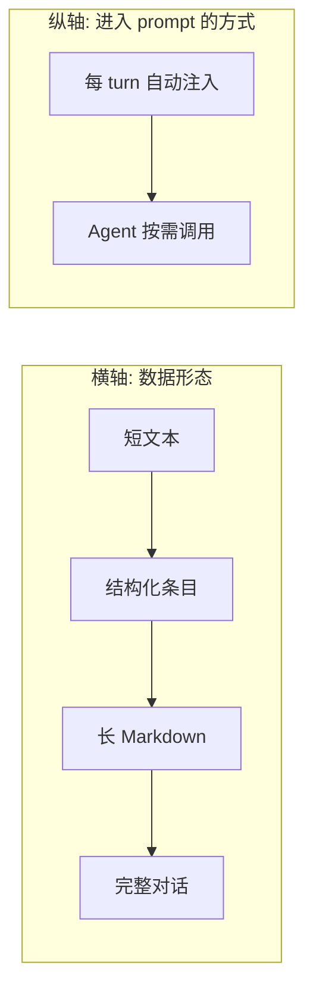
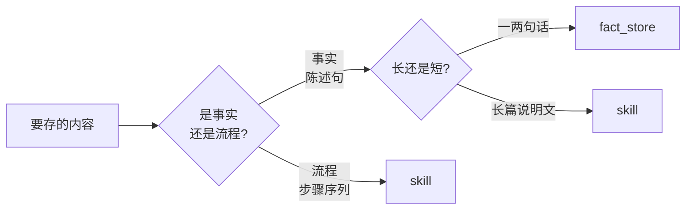
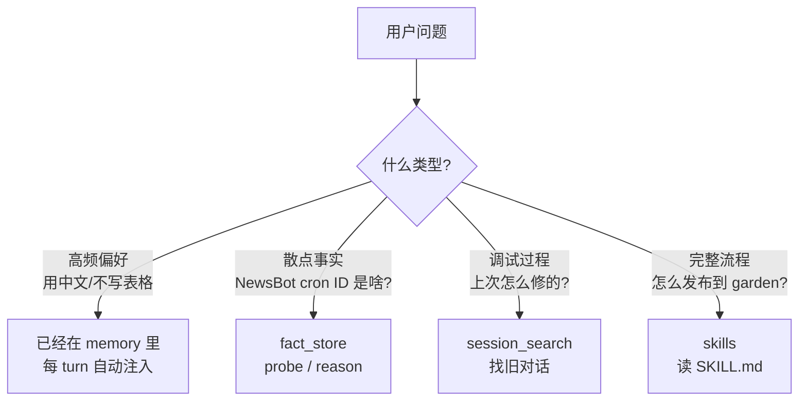

# AI Agent 的记忆，不是只有 ChatGPT 那一种 — Hermes 四层记忆栈实战

!!! abstract "这篇要回答什么"
    用了 Hermes 大半年，我一直以为它的"记忆"就是 ChatGPT 那种 memory——你说"记一下"它存一条文本，下次召回。
    最近我才搞明白：**Hermes 实际上有四种不同的记忆机制，各自解决不同的问题**。这篇拆给你看，每种适合什么场景、为什么不能用一种代替全部。
    没有数学，没有论文，只有"我该用哪个工具"。

---

## 起点：一个让 ChatGPT 抓瞎的问题

我用 Hermes 大半年，攒了一堆零散的"我跟它配过的事"：

- 飞书 OpenAPI 主 profile（App ID 和 19 个 mcp 工具）
- NewsBot 独立 profile，每天 21:00 EDT 跑简报
- agent-reach 工具栈（Jina + Exa）
- Bedrock + Claude 自留的 4 条 patches，**别 git pull**
- 知识花园（你正在看的这个）
- ……

某天我突然想问一句：

> "**我有哪些飞书相关的 cron 任务？**"

如果是 ChatGPT memory 这种纯文本记忆，它会怎么处理？

- 召回所有提到"飞书"的 → 5 条
- 召回所有提到"cron"的 → 4 条
- 然后……取交集？相似度排序？两边重叠最多的？

**没有标准答案，因为关键词检索没有"AND"语义**。结果通常是漏召回（飞书 cron 那条没排进 top）或者多召回（所有提到"任务"的都来了），你要多次追问、人工筛。

而 Hermes 一行命令：

```python
fact_store(action="reason", entities=["飞书", "cron"])
```

返回**只有 1 条**——NewsBot 配置那条。零废话、零追问。

但更有意思的是另一面：**Hermes 不只有这一个记忆工具，它有四个**。每个解决不同问题。这才是我写这篇的真正动机——很多人（包括我自己）只会用其中一个，把其它三个的活也往里塞，然后觉得"AI 记忆还是不行"。

---

## Hermes 的四种记忆，分别是什么

直接列：

| 工具 | 形态 | 工作方式 | 数据来源 |
|---|---|---|---|
| **memory** | 短文本（~2KB 上限） | 每个 turn 自动塞进 system prompt | 你说"记住" 或 agent 主动 |
| **fact_store** | 结构化事实条目 | Agent 主动调 `fact_store(...)` 召回 | 你说"记一下：X" 或 agent 主动 |
| **session_search** | 完整对话原文 | Agent 主动调 `session_search(query)` | 全自动，每个 turn 都存 |
| **skills** | Markdown 文件 | Agent 看目录后 `skill_view(name)` | 手动写、手动维护 |

四种的根本差别在两个维度：



- **memory**：短文本 + 自动注入 → 高频用、永远要看见的
- **fact_store**：结构化 + 按需 → 散点事实、要组合查询的
- **session_search**：对话原文 + 按需 → 你忘了的细节、过程
- **skills**：长 Markdown + 按需 → 流程、教程、复杂操作

下面挨个拆它们各自的**真实使用场景**和**为什么换一个就不行**。

---

## memory：你最高频的那几条偏好

memory 是你打开 Hermes 看到的"用户档案"那块。它的工作原理特别简单粗暴——**每条文本，每个 turn 都塞进 system prompt**。

它现在装的内容（节选我自己的）：

```
用户用中文交流，默认用中文回复。
飞书 adapter 碰到 markdown 表格会强制降级成 text，所以飞书回复绝不写表格。
用户讨厌"方案对比让你选"的回复模式。
```

这些为什么放 memory 而不放别的地方？因为**它们必须每次都看到，错一次就翻车**。

- 我用中文，agent 回英文 → 翻车
- 我在飞书，agent 写表格 → 排版废
- 我让它干活，它给我列三个方案让我选 → 我说"你给我搞晕了"

所以这些**绝不能依赖"agent 主动想起来去查"**，必须自动注入。

但代价：**容量硬上限 ~2200 字符**，我现在用了 49%。再多就要挤掉别的，每个 turn 模型还得读一遍——**塞进 prompt 的东西多了，注意力被稀释，简单任务都会变笨**。

所以 memory 适合：**高频、关键、错一次就翻车的偏好**。不适合：**具体配置、ID、命令、代码**——那些应该下沉。

---

## fact_store：散点事实 + 组合查询

如果 memory 装不下"NewsBot 的 cron ID 是 ec71837e..."、"Bedrock 4 条 patches 文件名"、"agent-reach 工具路径"这类东西，它们去哪？

去 fact_store。

**写入**：

```python
fact_store(
    action="add",
    content="NewsBot 独立 profile：飞书 app cli_aa829aa82b79dbde，cron ID ec71837e0a3e，每天 21:00 EDT 跑日报。",
    tags="newsbot,feishu,cron,daily-briefing"
)
```

存进 SQLite + 一份 1024 维向量索引。**不会进 prompt**，每个 turn 模型完全不知道这条存在。

**召回**：agent 主动调用，三种问法各有适用场景：

```python
# A. 模糊关键词搜
fact_store(action="search", query="NewsBot 配置")

# B. 单实体探测
fact_store(action="probe", entity="飞书")
# → 所有提到"飞书"的事实

# C. 多实体组合（杀手锏）
fact_store(action="reason", entities=["飞书", "cron"])
# → 同时关于飞书和 cron 的事实，AND 语义
```

**为什么这件事 memory 干不了？**

memory 是字符串塞 prompt，没有任何"查询语义"——你不可能跟 memory 说"找同时含飞书和 cron 的条目"，因为它不是个能被查询的东西，它就是 prompt 的一部分。

**为什么这件事 ChatGPT memory 也干不了？**

ChatGPT 的 memory 本质就是关键词召回 + 语义相似度。**没有"AND"操作**——你只能两次单独查询然后人工取交集，相似度阈值还难调。

fact_store 的设计就是为了这种**散点事实需要按多维度组合检索**的场景。比如我可能想问：

- "Bedrock 相关的所有 patches" → `probe(entity="bedrock")`
- "飞书 + bitable 的配置" → `reason(["飞书", "bitable"])`
- "我之前是不是存过冲突的说法" → `contradict()` 自动找

最后这个 `contradict` 是**别的记忆系统都没有的能力**——找出"共享主语但内容矛盾"的事实对。比如我两个月前不小心存了"Sonnet 4.6 是 1M context"（其实错了），今天又存了"Sonnet 4.6 是 200K"。`contradict()` 直接拎出这一对让我决定删哪个——人会一直更新自己说过的话，记忆系统必须能识别"我之前可能存错了"。

所以 fact_store 适合：**多、散、需要交叉查询、可能会有矛盾**的事实。

---

## 小例子：用网店订单理解"多维 tag"

刚才"飞书 + cron"那个例子可能还有点抽象。换一个更日常的：

假设你有个小网店，记了三条订单笔记：

- **笔记 1**：张三，买了 iPhone，杭州发货
- **笔记 2**：李四，买了 MacBook，杭州发货
- **笔记 3**：张三，买了 iPad，北京发货

某天你问："**张三在杭州买过什么？**"——正确答案只有一条：笔记 1。

**Markdown 方案怎么搞？**

按"地区"分类存：

```
~/orders/
  杭州.md     ← 笔记 1 + 笔记 2
  北京.md     ← 笔记 3
```

agent 看到"杭州" → 打开 `杭州.md` → grep "张三" → 找到笔记 1 ✅。这次 OK。

但如果下次你问"**张三总共买过什么**"——agent 要打开**所有地区文件**全扫一遍。文件多了就废。

如果你按客户分类（`张三.md`、`李四.md`），那"杭州买过什么"又要扫所有客户文件。

**根本困境**：markdown 的"文件夹"是**单维度**的——你只能选一个维度分类。

**fact_store 怎么搞？**

每条笔记同时打多个 tag：

```
笔记 1 → tags: [张三, iPhone, 杭州]
笔记 2 → tags: [李四, MacBook, 杭州]
笔记 3 → tags: [张三, iPad, 北京]
```

不需要选维度，每条笔记同时挂在客户、商品、地区三个维度下。

- 问"张三 + 杭州" → `reason(["张三", "杭州"])` → 笔记 1
- 问"张三全部" → `probe("张三")` → 笔记 1 + 笔记 3
- 问"杭州全部" → `probe("杭州")` → 笔记 1 + 笔记 2

**同一份数据，怎么查都不用重新整理**。

一句话：

> Markdown 是**抽屉柜**——一个抽屉只能按一种方式分类，换分类标准就要重新整理。
> Holographic 是**数据库**——每条数据同时被多种标签索引，怎么查都不用重新整理。

---

## session_search：你忘了的事它都还在

但还有一类问题前两个都解决不了：

> "上次我们调 cron 卡住了怎么解决的来着？"

我没主动写过这条 fact——当时在调试过程中，**结论还没沉淀就结束了**。memory 里也没有，fact_store 里没有。怎么办？

session_search。

它的工作方式：**自动捕获每一个 turn 的对话**（不需要你做任何事），存进 FTS5 全文索引。需要时：

```python
session_search(query="cron 调试 卡住")
# → 找到匹配的旧 session → LLM 现场读完整对话 → 摘要返回
```

**它和 fact_store 的核心差别**：

| | fact_store | session_search |
|---|---|---|
| 数据形态 | 结论已经被你提炼成一句话 | 完整对话原文，过程+试错+结论混在一起 |
| 写入 | 手动（你说"记一下"） | 全自动 |
| 查询成本 | 纯 SQL + numpy，0 LLM | 每次召回要跑 LLM 摘要，慢且贵 |
| 颗粒度 | 一条事实 | 一整段对话 |

举个具体对比：

> 我问："Bedrock 那 4 条自留 patches 是哪几条？"
>
> - **fact_store** 路径：`probe("bedrock")` → 0.1 秒拿到事实 #8 "① Bearer token ② Opus 1M ③ read_timeout ④ prompt cache"
> - **session_search** 路径：搜"bedrock patches" → 找到 2026-05 配置会话 → LLM 读上千行对话 → 摘要返回。**慢、贵，可能漏细节**。

这种问题 fact_store 完胜——因为我**已经显式提炼过结论**了。

但反过来：

> 我问："我们当时怎么发现 prompt cache 没生效的？"
>
> - **fact_store** 路径：没存过这个调试过程，只存了"修好了"。返回空。
> - **session_search** 路径：找到那次会话 → 读完整调试过程 → 告诉你"先看了 cache_R 全是 0，然后 grep bedrock_adapter 发现..."

**session_search 的强项就是"你忘了的过程它都还在"**——你不可能预先把每个调试过程都提炼成 fact 写进去，但 session_search 自动给你兜底。

适合：**回顾过程、找历史调试痕迹、"我们之前是不是聊过 X"** 这类查询。

---

## skills：流程性知识

最后一类。如果有个东西特别复杂，比如：

- 怎么发布一篇文章到 garden（创建文件、写 frontmatter、build、push、等部署）
- 怎么调试 cron 任务（看 log、查 schedule、手动触发、检查输出）
- 怎么用 agent-reach 工具栈（Jina vs Exa 的取舍、Reddit 必须走 old.reddit.com）

**这些是"流程"，不是"事实"**。一个事实是一句话，一个流程是几千字的步骤、命令、代码块、踩坑列表。

塞进 fact_store？content 字段写不下，结构化也不合适。
塞进 memory？2KB 容量秒爆。
塞进 session_search？没人专门为流程留下一段对话。

skills 就是为这种场景设计的。它的形态是 **`~/.hermes/skills/<name>/SKILL.md`**——纯 markdown 文件，**完全和 Claude Code 的 memory.md + 散落 .md 模式一样**。

实际工作方式：

1. Agent 启动时看到 skills 列表（每个 skill 一行简介）—— 像看目录
2. 判断当前任务跟哪个 skill 匹配 → `skill_view(name="personal-knowledge-site")` → 读完整 markdown
3. 按 skill 里的步骤干活

skills 的优点：**人能直接看、直接编辑**，每条 skill 几千字带章节、代码、pitfalls 列表都没问题。

而这正是 fact_store 干不了的——**fact_store 的 content 字段就一句话，写不下流程**。

---

## 关键问题：那为什么不全用 markdown 就好了？

这是聊到这里你最该问的问题。**Claude Code 那套"大 memory.md + 散落 .md"既然能 work，为什么 Hermes 还要搞个 fact_store？**

答案是：**两种数据结构擅长的查询模式不一样**。

**Markdown 目录方案的死穴：只能按目录树找东西**

假设我把所有事实都写成 markdown：

```
~/notes/
  feishu.md          # 飞书相关一切
  bedrock.md         # Bedrock 相关一切
  cron-tasks.md      # 所有 cron 任务
  agent-reach.md
  garden.md
```

我问"飞书相关的 cron"会发生什么？

- agent 看 index：嗯，有 feishu.md 也有 cron-tasks.md
- 怎么找交集？要么读两个文件全文 → 用 token 多、慢；要么 grep "飞书" 在 cron-tasks.md 里 → 糙，可能漏（NewsBot 那条可能写的是"Lark"或"daily-briefing"）

**根本问题**：人维护的目录是**单维度**的。你可以按"飞书"分一类，按"cron"分一类，**但你不能把每条事实同时挂到 N 个分类下还保持目录干净**。Notion 数据库能做多 tag，但那已经是 SQL 表了，不是 markdown 目录了。

**fact_store 的解法**：每条事实附带 `entities = [飞书, cron, NewsBot]`（多重归类天然成立），查询时**算法即时**算多维交集。`reason(["飞书", "cron"])` 直接给你交点，不依赖人类预先想好"飞书+cron 交叉索引"。

**找矛盾就更别提了**。`contradict()` 自动跑一遍所有事实对，找"共享 entity 但内容分歧"的。如果是 markdown 方案，要 agent 把所有 .md 全读完再判断——基本不可能。

**核心区别一句话**：

> Markdown 方案是**用人脑当查询引擎**——你预先想好怎么分类、怎么交叉索引。
> fact_store 是**用算法当查询引擎**——你只管打 tag，组合查询算法即时算。

什么时候人脑当查询引擎够用？**事实少（< 50 条）、分类清晰、不太需要交叉**的时候。
什么时候要算法接管？**事实多（数百条）、tag 重叠多、要 AND/OR 组合、要找矛盾**的时候。

---

## 实战对比：飞书 + cron 的真实搜索过程

为了让上面的抽象判断落地，我把"我有哪些飞书相关的 cron"这个真实问题，两种方案各自完整跑一遍。

我跟 Hermes 真的存过这三条（散落在不同次对话里）：

- **#3** 飞书 OpenAPI 主 profile，App ID `cli_aa8f549...`
- **#5** Hermes cron 配置：HERMES_CRON_TIMEOUT=1800，重启 scheduler 生效
- **#6** NewsBot 独立 profile，飞书 app `cli_aa829aa...`，cron ID `ec71837e0a3e`，每天 21:00 EDT 跑日报

我问："**我有哪些飞书相关的 cron 任务？**"

正确答案只有 **#6**——它是飞书 app + cron 任务的交集；#3 是飞书但不是 cron 任务；#5 是 cron 但跟飞书无关。

### Markdown 方案

**怎么存**：按"系统组件"分文件：

```
~/notes/
  feishu.md    ← #3 + #6（NewsBot 也算飞书 app）
  cron.md      ← #5
```

注意 **#6 只能放在一个文件里**——你选了 `feishu.md`（也可以选 `cron.md`，但只能选一个）。

**怎么搜**：

1. agent 看到"飞书 + cron" → 读 `feishu.md` 全文
2. grep "cron" → 找到 #6（"每天 21:00 EDT 跑 cron"）✅
3. 顺手也读 `cron.md` 全文
4. grep "飞书" → #5 没出现"飞书"两个字 → 不命中
5. 返回：#6 ✅

**这次找对了**。但有几个隐患：

- 如果当初 #6 被分到 `cron.md`（毕竟它本质是个 cron 任务），那读 `feishu.md` grep "cron" 直接 0 命中——**全漏**
- 每次问"飞书 + X"或"cron + X"，agent 都得**全文读两个文件**，X 是 timeout、bedrock、bitable 都得这么干
- #6 同时属于"飞书"和"cron"两个分类，**markdown 强迫你二选一**

### Holographic 方案

**怎么存**：每条 fact 同时打多个 tag：

```
#3 → tags: [feishu, openapi, mcp]
#5 → tags: [hermes, cron, config]
#6 → tags: [newsbot, feishu, cron, daily-briefing]   ← 同时挂在飞书和 cron 下
```

**怎么搜**：

```python
fact_store(reason, entities=["飞书", "cron"])
```

算法逐条检查：

| fact | 飞书 ✓ | cron ✓ | min（取 AND） |
|---|---|---|---|
| #3 | ✅ | ❌ | 低 |
| #5 | ❌ | ✅ | 低 |
| #6 | ✅ | ✅ | **高** |

返回 #6，**唯一的精确交集**。

下次问"所有飞书相关"？`probe("飞书")` 返回 #3 + #6。
下次问"所有 cron 相关"？`probe("cron")` 返回 #5 + #6。
**同一份数据，零成本换维度**。

---

## Markdown 方案的三个代价

实际上 markdown 方案不是"做不到"——以现在大模型的智力，它**通常也能搞定**，但代价是：

**1. 搜索速度慢**

Holographic 一次 SQL + numpy 矢量化扫描，毫秒级。

Markdown 要 `read_file` 多个文件 + grep + agent 推理"还要不要读其它文件"——多次 IO + 多次 LLM judgment，秒级起。差异 100 倍以上。

**2. Token 消耗大**

Holographic 输出就是几条 fact 的简短结论，几百字。

Markdown 读全文找答案，几千上万 token 进 agent 上下文。**而且这些 token 大部分是噪音**——你查"飞书+cron"，但 `feishu.md` 里 90% 内容跟 cron 无关，模型还得自己过滤。**既花钱又稀释模型注意力**。

**3. 强依赖模型智力，结果不稳定**

这是最关键的一点。Markdown 方案能不能找全，**取决于这次 agent 的判断质量**：

- 它会不会想到"NewsBot 也算飞书相关"去读 `newsbot.md`？
- 它会不会想到"日报"是 cron 同义词去 grep？
- 它读了 200 行的 `feishu.md`，会不会漏掉藏在中间的关键句？

**同一个问题，今天问跟明天问可能拿到不同结果**——因为模型每次推理路径不一样。强模型通常能找全，弱模型/新对话/上下文不足的时候经常漏。

Holographic 是**结构化算法保证**——entity 打了就是打了，`reason()` 一定扫到。**结果可重现，跟模型智力无关**。

### 一张表

| 维度 | Markdown | Holographic |
|---|---|---|
| 搜索速度 | 秒级（多次 IO + 推理） | 毫秒级 |
| Token 成本 | 高（读全文一堆噪音） | 低（直接给结论） |
| 结果稳定性 | 看模型当下发挥 | 算法保证 |

**深层意义**：

> 模型再聪明，每次都得读一堆文件付 token、推理"还要不要读"付时间、推理失误时漏召回。
>
> Holographic 把"哪些 entity 关联"这件事**预先固化进数据结构**——查询时不用模型现场推理，直接代数算出来。
>
> 这是 AI agent 工程的根本设计哲学：**能用算法解决的不要靠模型推理**。模型推理贵、慢、不稳定；算法快、便宜、可重现。

---

## 写入和读取的时机：什么时候发生？

到这里你可能会问：fact_store 这一切到底**什么时候触发**？谁决定该存？谁决定该查？

直接答：**写入和读取都靠"显式触发"——但触发方不同**。

### 写入：靠人或 agent 主动调用

fact_store **没有任何自动写入机制**。三种触发场景：

1. **你直接说"记一下"** → agent 立刻 `add` 一条
2. **agent 主动判断"这条值得存"**（学到稳定事实/偏好/配置时主动 `add`）
3. **完成复杂任务后 agent 提议"要不要记下来"**

关键：**写漏了 → 永远查不到**。这跟 session_search 反过来——session_search 全自动捕获每个 turn，fact_store 只存被显式提炼的结论。

### 读取：每 turn agent 自己判断要不要查

fact_store **完全不进 prompt**——你写进去的所有 fact，agent 平时是看不见的，每个 turn 看到的只有"fact_store 这个工具的说明"。

每次你发消息，agent 心里判断：

- 你提到具体名词，它不确定细节 → 调 `probe` 或 `search`
- 你问组合关系（"X 相关的 Y"） → 调 `reason`
- 你说"记得我之前说过..." → 先 `search` 一下
- 你纠正 agent → 顺手 `contradict` 看是不是有矛盾的旧 fact
- 闲聊或 memory 已覆盖的偏好 → 不查

### 写读不对称：这是个反直觉的设计

| | memory | fact_store | session_search |
|---|---|---|---|
| **写入** | 自动 + 主动 | **靠主动判断** | 全自动 |
| **读取** | **全自动**每 turn 注入 | **靠主动判断** | 靠主动判断 |

fact_store **写读两端都靠主动判断**——这是把双刃剑：

- **好处**：低污染，不会每 turn 把所有 fact 塞进 prompt 浪费 token
- **坏处**：强依赖判断质量，写漏读漏都没保险

session_search 之所以重要，就是因为它**写入是自动的**，给 fact_store 留了最后一道安全网——fact_store 没存的事它至少在对话原文里还在。

---

## fact_store 和 skills 的边界：会冲突吗？

到这里你可能也想问：fact_store 和 skills 看起来都是"长期知识"，分界线在哪？会不会重复？

直接答：**会有灰色地带，但冲突区其实很窄**。核心分界：



**典型不冲突的例子**：

| 内容 | 工具 | 为什么 |
|---|---|---|
| "NewsBot cron ID 是 ec71837e" | fact_store | 一句话事实 |
| "飞书主 profile App ID 是 cli_xxx" | fact_store | 一句话配置 |
| "怎么发布文章到 garden" | skill | 几千字流程 |
| "怎么调试 cron 卡住" | skill | 多步骤诊断 |

**判断公式**：

> 如果这条信息**单独一句话能说清且会被独立查询** → fact_store
>
> 如果这条信息**是一个 procedure，步骤之间有依赖** → skill
>
> 如果两者都需要 → **存两份各管一段**（短摘要 fact + 详细流程 skill），不算冗余

**真正的冲突**就两种：

- **把短事实写成 skill** → 每次取个 ID 都要 `skill_view` 加载几 KB markdown，杀鸡用牛刀
- **把流程砍成多条 fact** → 步骤间的顺序关系丢了，fact_store 没有"step 1 → step 2"的结构

---

## 实际工作流：四个工具怎么协作

回到我自己的实际使用，四个工具是这么分工的：



**沉淀的方向**（信息从哪来去哪）：

```mermaid
flowchart LR
    A[每次对话] -->|自动| S[session_search<br/>cold storage]
    S -->|聊到关键结论时<br/>显式说"记一下"| F[fact_store<br/>结构化事实]
    F -.->|某条变成"每次都要看到"<br/>的高频偏好| M[memory<br/>hot cache]
    A -->|完成复杂任务后<br/>显式抽象| SK[skills<br/>流程教程]
```

实际操作：
1. **过程中** → session_search 自动记录一切，0 成本
2. **沟通到关键结论时** → "记一下：NewsBot cron ID 是 ec71837e..." → 升到 fact_store
3. **完成复杂流程时** → "把这个流程沉淀成 skill" → 升到 skills
4. **某条 fact 变成每次都得看见的偏好** → 升到 memory（从 L2 cache 升 L1）

我之前帮自己做的"memory 瘦身"，就是把"NewsBot 完整配置"这种**低频但具体**的内容**从 memory 下沉到 fact_store**——memory 里只留"NewsBot 详情见 fact_store"这种短指针，把容量留给真正高频的偏好（中文回复、飞书表格规则、不喜欢方案对比）。

---

## 我自己用下来的 4 条经验

1. **不要把所有东西都往 memory 里塞**。容量爆了反而稀释注意力，agent 在简单任务上变笨。memory 只放"必须每次看见"的高频偏好。
2. **遇到散点事实就用 fact_store**。NewsBot ID、Bedrock patch 文件名、agent-reach 工具路径——这些都 `fact_store add`，命名 entity 时**保持一致**（永远叫"飞书"，不要混"Lark"，不然算两个 atom 查不到）。
3. **复杂流程一律沉淀成 skill**。一次性教学的内容写成 SKILL.md，下次 agent 自动找到、自动按步骤干活，不用每次重新教。
4. **session_search 是兜底**——当 fact_store 和 skills 都没命中时，它能帮你"翻日记"。所以**不要为了节约空间删旧 session**，那是你最后的安全网。

---

## 一句话总结

ChatGPT 那种"一个大文本块叫 memory"的做法，本质上是**单一数据结构试图解决所有记忆问题**——结果哪种都不擅长。

Claude Code 那种"大 index + 散落 .md"是**两层数据结构**——hot prompt + cold markdown，已经比 ChatGPT 进了一步，但**所有查询逻辑还是依赖人脑预先组织目录**。

Hermes 这套是**四种数据结构 × 各自的最优查询算法**：
- 高频偏好 → 短文本 + 自动注入（**memory**）
- 散点事实 → 结构化 + 多维代数查询（**fact_store**）
- 历史对话 → FTS5 + LLM 摘要（**session_search**）
- 流程教程 → Markdown + 按需加载（**skills**）

每种数据结构由对应的算法负责自己擅长的查询模式，**人脑只负责决定"这条信息属于哪一层"**。

---

## 延伸阅读

- [Hermes 架构总览](hermes-architecture.md) — 四个记忆机制各属于不同的子系统
- [Hermes session_search 的工作原理](hermes-session-search.md) — FTS5 + LLM 摘要的工程细节
- 代码：`plugins/memory/holographic/{holographic,retrieval,store}.py` — fact_store 的 1782 行实现，对算法感兴趣的可以读

*工具不是越多越好，而是每个工具有它最适合的使用场景。AI 记忆这件事，核心不是"用什么算法"，是"分层设计"——把不同类型的记忆放进不同结构里，再让算法做它擅长的事。*
