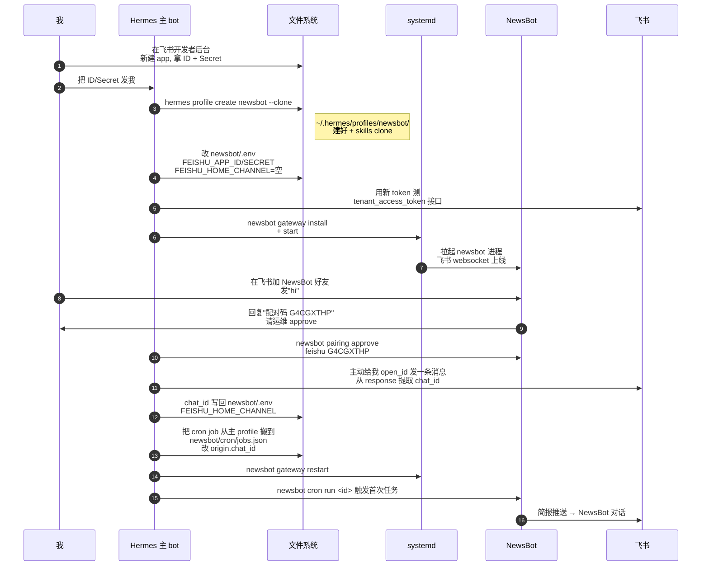

# 🤖🤖 两个 Hermes 同居一台机

!!! quote "本文动机"
    我之前在 garden 写过两篇 Hermes：[架构图解](hermes-architecture.md) 讲整体设计，[团队部署推演](hermes-team-deployment.md) 讲多用户场景。这一篇补中间那块——**单用户但多个 Agent 身份**。起因很简单：我想让每天的 AI 简报推送看起来不是从 Hermes 主 bot 发的，而是有个专门的 NewsBot 在干这事。问 Hermes 自己怎么搞，它推荐了 profile 模式，半小时落地。这是事后的拆解笔记。

> **一句话定位：** Hermes profile 不是"装第二个 Hermes"，而是 **共享一份代码 + 隔离配置/身份/cron** 的轻量分身。理解清楚共享边界，才知道什么时候该用 profile、什么时候该装第二份。

---

## 🧭 从一个具体需求开始

我有一个 cron job 每天 21:00 跑——生成《每日 AI / Agent 行业新闻汇总》推到飞书。问题是：消息是从 **Hermes 主 bot** 发的，跟我日常聊天那个对话混在一起。每天定点跳出一坨简报，体验很奇怪——明明是订阅，却长得像 Hermes 主动 push。

理想状态：

- 主 Hermes 还是那个聊天 + 干活的 bot
- 简报由一个**独立身份的 NewsBot** 推送，是另一个飞书对话
- 两者**不互相影响**——NewsBot 卡了不能影响主对话

最直觉的解法是再装一个 Hermes。但 Hermes 文档里有个东西叫 **profile**，说就是干这个的。

---

## 🎯 Profile 到底是什么

Profile 就是 Hermes 提供的**轻量分身机制**：

- **同一份代码**（`~/.hermes/hermes-agent/`，同一个 venv）
- **同一份系统 binary**（`hermes` CLI）
- **不同的配置目录**（`~/.hermes/profiles/<name>/`）
- **不同的身份**（不同 SOUL.md、可以不同 LLM provider、不同 .env）

关键命令就一行：

```bash
hermes profile create newsbot --clone
```

`--clone` 表示从当前 active profile 复制 `config.yaml` / `.env` / `SOUL.md` / `skills/`。意思是 newsbot **继承了我主 Hermes 的所有 API key**——Bedrock、Jina、Exa、xsearch cookie 全都跟着过去，不用重配。

它还顺便干了三件事：

1. 在 `~/.local/bin/` 装一个 wrapper 脚本叫 `newsbot`，跑 `newsbot xxx` 等价于 `hermes --profile newsbot xxx`
2. clone skills 目录（让 newsbot 也认识 cookie-authed-social-platforms 这种 skill）
3. 更新 `hermes profile list` 让你能看到两个 profile 并存

---

## 🏗️ 共享边界——哪些是共用的，哪些是隔离的

这是 profile 和"装第二份 Hermes"的核心区别。先看一张图：

```mermaid
flowchart TB
    subgraph 共享["🟦 全机共享层（一份）"]
        direction LR
        Code["~/.hermes/hermes-agent/<br/>代码 + venv"]
        Bin["~/.local/bin/hermes<br/>CLI binary"]
        Cookies["~/.hermes/cookies/<br/>X / 知乎 / 小红书 cookie"]
        ToolsDir["~/tools/<br/>xsearch / xhs-bot 等独立 CLI"]
        GH["~/.config/gh/<br/>GitHub CLI 鉴权"]
    end

    subgraph default["🟢 default profile"]
        direction TB
        D1["~/.hermes/.env<br/>主 .env"]
        D2["~/.hermes/SOUL.md<br/>主身份"]
        D3["~/.hermes/skills/<br/>主 skill 库"]
        D4["~/.hermes/sessions/<br/>主会话历史"]
        D5["~/.hermes/cron/<br/>主 cron 任务"]
        D6["~/.hermes/state.db<br/>主 memory DB"]
    end

    subgraph newsbot["🟡 newsbot profile"]
        direction TB
        N1["~/.hermes/profiles/newsbot/.env"]
        N2["~/.hermes/profiles/newsbot/SOUL.md"]
        N3["~/.hermes/profiles/newsbot/skills/"]
        N4["~/.hermes/profiles/newsbot/sessions/"]
        N5["~/.hermes/profiles/newsbot/cron/"]
        N6["~/.hermes/profiles/newsbot/state.db"]
    end

    subgraph systemd["🔧 systemd user 服务"]
        direction LR
        S1["hermes-gateway.service<br/>主 gateway 进程"]
        S2["hermes-gateway-newsbot.service<br/>newsbot gateway 进程"]
    end

    Code --> default
    Code --> newsbot
    default -.runs in.-> S1
    newsbot -.runs in.-> S2

    style 共享 fill:#e3f2fd
    style default fill:#e8f5e9
    style newsbot fill:#fff8e1
    style systemd fill:#f3e5f5
```

**共享层**：

- **代码 + venv**：升级一次 (`hermes update`) 两个 profile 一起更新
- **API key 池**：Bedrock token、Jina key、Exa key 都从克隆来的 .env 继承
- **登录态/cookie**：`~/.hermes/cookies/` 全机共享，一个 profile 用 xsearch 抓数据另一个也能用
- **GitHub gh CLI 鉴权**：`~/.config/gh/hosts.yml` 是机器全局——这意味着 newsbot 也能 push 到我的 ihoooohi 账号下（**这是个值得注意的点，后面会展开**）

**隔离层**：

- **配置 (.env)**：同一份模板克隆来的，但 newsbot 的 `.env` 单独可改——比如我把 `FEISHU_APP_ID/SECRET` 换成新申请的 NewsBot 飞书 app
- **身份 (SOUL.md)**：可以给 newsbot 写个完全不同的人格设定
- **会话/记忆/cron**：完全独立目录，互不可见
- **gateway 进程**：每个 profile 一个独立的 systemd user unit，独立 PID

我的批注：**这套设计的精妙在于"基础设施共享 + 业务隔离"**。装第二份 Hermes 你会得到两份代码、两个 venv、两份所有 ML 库（每份 ~2GB）。Profile 模式完全避免了这个开销，又保留了你最在乎的那条隔离——**newsbot 跑挂了不会拖累主 bot**。

---

## 🛠️ NewsBot 实战流水线

下面是从「我有一对新飞书 app credentials」到「NewsBot 推送上线」的完整 6 步：



这里头有几步特别值得挑出来讲。

### Step 1：克隆继承的边界很细

`hermes profile create newsbot --clone` 把以下内容从主 profile 复制到 newsbot 目录：

| 项目 | 是否克隆 | 备注 |
|---|---|---|
| `config.yaml` | ✅ | 模型/provider 全套 |
| `.env` | ✅ | API keys、所有飞书/Bedrock 配置 |
| `SOUL.md` | ✅ | 主身份描述（你可以马上改它给 newsbot 一个独立人格） |
| `skills/` | ✅ | 全部 skill |
| `MEMORY.md` / `USER.md` | ❌ | **没复制**——记忆是新的 |
| `sessions/` | ❌ | 干净的新会话历史 |
| `state.db` | ❌ | 新建空数据库 |
| `cron/jobs.json` | ❌ | 没有任何任务，要自己加或迁过来 |

**这正是你想要的边界**：业务相关的（API key、知道怎么干活的 skill）继承下来；身份相关的（记忆、历史）从零开始。

如果想全量复制（比如你要给同一个人格做个开发版用来测试新功能），改用 `--clone-all`。

### Step 2：飞书 chat_id 不能克隆，必须重抓

主 profile 的 `.env` 里有这行：

```
FEISHU_HOME_CHANNEL=oc_e6fd5cbaef5c85dbca39aa89ee68cc33
```

这是**主 Hermes bot 跟我的单聊 chat_id**。如果不清空让 newsbot 继承，结果就是 NewsBot 用新 app 的 token 去请求一个属于旧 app 的对话——必然权限拒绝。

正确流程是先把 `FEISHU_HOME_CHANNEL` 留空，等 NewsBot 跟我建立飞书单聊后，**用新 app token 给我的 open_id 发一条主动消息**，飞书 API 的响应里会包含 `chat_id`：

```json
{
  "code": 0,
  "data": {
    "chat_id": "oc_75c9af3585c121e32cf0e99472951e4a",
    "message_id": "om_xxx",
    "msg_type": "text"
  }
}
```

把这个 chat_id 写回 `newsbot/.env` 的 `FEISHU_HOME_CHANNEL`，重启 gateway。这一步是**机器人发现自己住在哪里**的过程。

我的批注：飞书 OpenAPI 这个设计挺反直觉——单聊 chat_id 不能从 app 视角"列出来"（`im/v1/chats` 只返回群聊），必须靠"先发一条消息触发 chat_id 显形"。如果你直接用别的 bot 的 chat_id 试，response 会客客气气告诉你 `permission denied`，但不会告诉你正确的 chat_id 是什么。这是双 bot 部署里最容易卡住的一步。

### Step 3：cron 任务的归属

Hermes 的 cron 是**按 profile 隔离**的——每个 profile 自己的 `cron/jobs.json`，自己的 scheduler tick 队列，自己的输出目录。

我原本那个简报 cron 在 `~/.hermes/cron/jobs.json`（主 profile）。要让它归 NewsBot，搬过去就行：

```bash
# 1. 拷贝 jobs.json 到 newsbot 目录
cp ~/.hermes/cron/jobs.json ~/.hermes/profiles/newsbot/cron/jobs.json

# 2. 改 origin.chat_id 指向 NewsBot 的对话
#    这是 cron 任务"deliver=origin"时回写的目标 chat_id
#    继承自主 bot 的会发到旧对话，必须改

# 3. 从主 profile 删掉这条
echo '{"jobs": [], "updated_at": "2026-05-16T00:00:00"}' > ~/.hermes/cron/jobs.json
```

**坑点**：`cron run <id>` 命令是改"下次 tick 立即触发"，下次 scheduler tick（默认 60s）就会拉起任务。看起来"没反应"很可能只是没到 tick——等等再看 `journalctl --user -u hermes-gateway-newsbot --since "2 min ago"` 就能看到子进程在跑。

### Step 4：systemd unit 是双份的

每个 profile 有自己独立的 systemd user service：

```bash
$ systemctl --user list-units --type=service | grep hermes
hermes-gateway.service          loaded active running Hermes Agent Gateway
hermes-gateway-newsbot.service  loaded active running Hermes Agent Gateway
```

两个 unit 都跑同一个 python 命令，区别只是 `--profile newsbot`。这意味着：

- 单独启停 newsbot：`newsbot gateway restart` 不影响主 bot
- 看 newsbot 日志：`journalctl --user -u hermes-gateway-newsbot -f`
- 主 bot 出问题崩溃，systemd 单独重启它，newsbot 完全无感

`hermes gateway list` 能一眼看到全部 profile 状态：

```
Gateways:
  ✓ default (current)        — PID 1191992
  ✓ newsbot                  — PID 1227290
```

---

## 💰 内存账：两个 Hermes 真实开销

这是**最容易被忽略但最重要**的一个数字。Hermes 单 profile 启动时就要拉一个 lark-mcp（Node.js MCP server，用于飞书 OpenAPI），加上 Python 主进程本身：

| 进程 | 内存 (RSS) |
|---|---|
| 主 hermes gateway (Python) | ~290 MB |
| 主 lark-mcp (Node) | ~40 MB |
| newsbot gateway (Python) | ~262 MB |
| newsbot lark-mcp (Node) | ~360 MB（启动峰值，会回落） |
| **小计** | **~950 MB** |

我那台 VPS 总共 3.6 GB，光两个 Hermes gateway 就吃掉 26%。再加上 cron 触发时会 spawn 子进程跑 agent + agent-browser（每个 150-300 MB），高峰期能到 1.5 GB。

**判断标准**：

- 如果你的机器 ≥ 8 GB，双 profile 完全没压力
- 如果是 ≤ 4 GB 的 VPS，**先把不需要的进程清干净**再上双 profile（我做这次 NewsBot 部署的同时顺手干掉了一个吃 506 MB 的 OpenClaw 守护进程，不然真扛不住）
- 别忘记 cron 触发会临时加 500 MB——预留这个 headroom

---

## ⚖️ 什么时候该装第二份 Hermes 而不是用 profile

Profile 不是万能的。下面是**应该走"装第二份独立 Hermes"路线**的场景：

<div class="grid" markdown>

**👍 用 profile 就好**

- 同一个用户、同一台机
- 同一组 API key 池（共享 Bedrock token / Jina / Exa）
- 只是换个 bot 身份做特定推送/任务
- 想要 0 额外维护成本（升级一次两个一起升）
- 想要快速可逆（删 profile 一行命令）

**🛑 该装独立 Hermes**

- 给别人用（账户隔离，避免他看到你的 memory/sessions）
- 测不稳定的 dev 版本（不想污染主环境）
- 不同业务要完全不同的 LLM 池（一个走 Bedrock 一个走 OpenRouter）
- 网络隔离需求（不同 profile 走不同 outbound IP）
- 资源隔离需求（一个 profile 跑离线训练吃满 CPU 不能影响另一个）

</div>

---

## 🪤 几个值得记住的坑

### 共享 GitHub 鉴权可能"超预期"

`~/.config/gh/hosts.yml` 是机器全局的，**两个 profile 共享同一个 gh 登录态**。意味着 newsbot 跑代码的子进程也能用 `git push` 推到我的 GitHub 账号——好处是不用配两次 token，坏处是**所有 profile 都拥有了你 gh CLI 全部 scope 的权限**（我那个 token 是 `admin:org + repo + workflow + delete_repo` 全套）。

如果让一个 profile 干潜在风险的活（比如跑陌生人写的 cron 任务），考虑**给它单独配个限定 scope 的 PAT**写到自己的 `.env`，并把全局 `~/.gitconfig` 的 credential helper 改掉。

### .env clone 不是符号链接

`hermes profile create --clone` 是真复制，不是 symlink。**主 profile 改 .env 不会同步到 newsbot**——下一次给主 bot 加新 API key 时记得也手动同步过去（或者直接 `cp ~/.hermes/.env ~/.hermes/profiles/newsbot/.env` 全量覆盖再补改 NewsBot 专属字段）。

### activate session 不会热加载配置

`hermes config set` 改的配置**对当前活着的对话不生效**——我已经在跟 Hermes 聊的那个 session 里改了配置，必须新开会话才能用上新值。同理改 newsbot/.env 之后必须 `newsbot gateway restart`。

### Cron 触发逻辑别误读

`newsbot cron run <id>` 不是立即触发，是**标记为"下次 scheduler tick 时跑"**。tick 间隔默认 60 秒。如果你看到命令返回 `Next run: 04:37:37` 然后立刻去查 cron list 显示 `Next run: 21:00:00`，**这正是预期**——已经触发并跑完了，next_run 字段恢复正常调度时间。看 journalctl 确认子进程拉起来了才算真跑了。

---

## 🔭 我的整体判断

Profile 这套设计在我看来是**"团队版 Hermes" 的第一步**。看 [团队部署推演](hermes-team-deployment.md) 那篇分析，要把 Hermes 真正搬给团队还要换 SQLite → Postgres、加身份系统、加任务调度器。但 profile 已经实现了**"一台机器多身份"**这个最基础的多租户原语——

- 配置/记忆/cron 隔离的目录约定
- gateway 服务的 systemd 多实例
- CLI wrapper 让每个 profile 像独立工具

你完全可以把它当成 Hermes 的"轻量级 multi-tenant"。我现在用的就是：default 是日常聊天/写代码助手，newsbot 是简报机器人。理论上还能再加 reviewbot（专门帮忙 review PR）、kanbanbot（管 todo）等等，每一个都是几十秒就能造出来的"小分身"。

唯一需要警惕的是**内存** —— 每多一个 profile 多吃 600-700 MB（含 lark-mcp）。在 4 GB 小机器上跑 3 个 profile 会很挣扎。

---

## 🔗 延伸阅读

- [Hermes 架构图解 —— 一个会自己进化的 AI 助手](hermes-architecture.md) —— 整体架构（SOUL / 三层记忆 / Skills / Curator / GEPA / Profiles）
- [如果 Hermes 给团队用——从 SQLite 到 Postgres 的架构推演](hermes-team-deployment.md) —— 单机 → 多用户的架构升级路径
- [session_search 双线机制](hermes-session-search.md) —— 跨会话记忆的存储与检索

---

*多 profile 不是分布式系统的复杂——它是 Unix 哲学的胜利：用文件系统约定 + systemd unit 复用，把"多身份"做成了一个 30 秒命令。*
