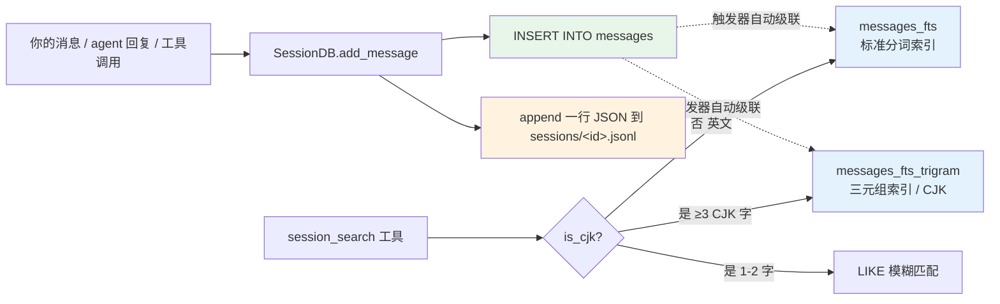
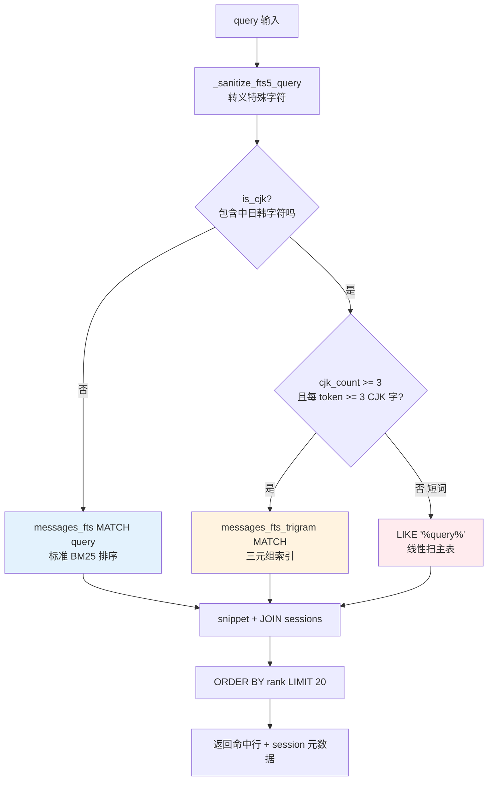
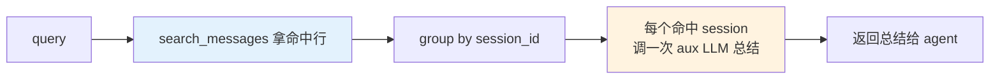
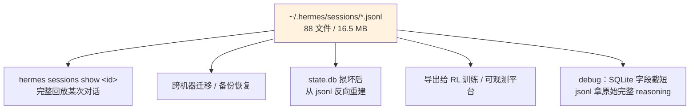

# Hermes session_search 是怎么搜的

> **一句话定位：** session_search 不是搜 JSON 文件，而是搜 SQLite 里的双 FTS5 倒排索引；JSONL 是另一条独立的归档线，平时不被读。

!!! quote "本文动机"
    Hermes Agent 把每段对话同时写到 **SQLite 数据库** 和 **JSONL 文件**两个地方。新人很容易问：到底搜哪个？答案不显然——而且涉及 FTS5 索引、CJK trigram、触发器自动同步这几个不那么常见的 SQLite 特性。这篇把整条流水线讲透，源码引用 + 实测数据，搞清楚一次就不用再猜了。

## 全景：两条独立的数据线

每条消息从产生到可被检索，会沿着两条平行的线落地：



**核心要点：**

- 写入是**双线并行**——SQLite 主管检索，JSONL 主管归档回放
- 读取**只走 SQLite**——`session_search` 工具完全不碰 JSONL
- FTS5 是 SQLite 自带的**全文检索虚拟表**，不是外挂搜索引擎
- 中文走专门的 **trigram 索引**，因为标准分词器把每个汉字拆成独立 token 会产生大量假阳性

下面分写入、读取、JSONL 兜底三段拆开看。

## 一、写入路径：触发器自动维护双索引

### 1.1 数据表结构

```sql
-- 主表：完整消息存这里
CREATE TABLE messages (
    id INTEGER PRIMARY KEY AUTOINCREMENT,
    session_id TEXT NOT NULL REFERENCES sessions(id),
    role TEXT NOT NULL,           -- user / assistant / tool / system_meta
    content TEXT,                  -- 主要内容
    tool_call_id TEXT,
    tool_calls TEXT,               -- 工具调用的 JSON
    tool_name TEXT,                -- 工具名（如 terminal / search_files）
    timestamp REAL NOT NULL,
    reasoning TEXT,                -- 模型 reasoning 内容
    -- ... 其他元数据字段
);

-- 索引 1：标准分词 FTS5（英文整词）
CREATE VIRTUAL TABLE messages_fts USING fts5(content);

-- 索引 2：trigram 分词 FTS5（中文 / 任意脚本）
CREATE VIRTUAL TABLE messages_fts_trigram USING fts5(
    content,
    tokenize='trigram'
);
```

实测我这台机器：33 个 session，1628 条 messages，state.db 共 19 MB。

### 1.2 触发器：写主表自动喂索引

`hermes_state.py` 里写得很干净——主表 INSERT 触发器自动把 `content + tool_name + tool_calls` 拼起来喂给两个 FTS 索引：

```sql
CREATE TRIGGER messages_fts_insert AFTER INSERT ON messages BEGIN
    INSERT INTO messages_fts(rowid, content) VALUES (
        new.id,
        COALESCE(new.content, '') || ' ' ||
        COALESCE(new.tool_name, '') || ' ' ||
        COALESCE(new.tool_calls, '')
    );
END;
```

`messages_fts_trigram` 同形——两个索引并列各有一套 INSERT/DELETE/UPDATE 三个触发器，加起来 **6 个触发器**自动维护两套索引。

```mermaid
sequenceDiagram
    participant App as run_agent.py
    participant DB as SessionDB
    participant M as messages 表
    participant F1 as messages_fts<br/>标准索引
    participant F2 as messages_fts_trigram<br/>trigram 索引
    participant J as sessions/&lt;id&gt;.jsonl

    App->>DB: add_message(role, content, tool_calls, ...)
    par 数据库写入
        DB->>M: INSERT INTO messages (...)
        Note over M: 主表落地，拿到 rowid
        M-->>F1: 触发器：INSERT INTO messages_fts<br/>(rowid, content || tool_name || tool_calls)
        M-->>F2: 触发器：INSERT INTO messages_fts_trigram<br/>(同样的拼接内容)
    and JSONL 归档
        DB->>J: append 一行完整 JSON
    end
    DB-->>App: ok
```

**几个关键细节：**

1. **`content + tool_name + tool_calls` 拼起来一起索引** —— 所以你搜 `"sqlite3"` 也能命中那条 `terminal` 工具调用，因为命令字符串在 `tool_calls` 字段里
2. **rowid 就是 messages.id** —— FTS 索引和原表是一一对应的
3. **删除/更新主表时触发器自动同步两个 FTS** —— 数据一致性不需要应用层操心
4. **写入是 WAL 模式** —— 多 reader + 单 writer，避免多进程（gateway + CLI + 子 agent 共用 state.db）的锁竞争

### 1.3 jsonl 同时落地的样子

每条 message 同时 append 一行 JSON 到 `~/.hermes/sessions/<session_id>.jsonl`：

```json
{"role": "session_meta", "tools": [...]}
{"role": "user", "content": "hi", "timestamp": "2026-05-15T06:58:00.668167"}
{"role": "assistant", "content": "嗨，在的。今天想干点啥？", "reasoning": null, "finish_reason": "stop", "timestamp": "..."}
```

`session_meta` 第一行记录这次会话用到的工具 schema（用来回放时还原上下文），后续每行就是一条 message 的完整原始字段——包括 reasoning、finish_reason 等数据库里被截短或省略的字段。

JSONL 不被索引，纯粹是**完整原始档**——为回放、备份、迁移、可观测平台 export 而存在。

## 二、读取路径：CJK / 英文 / 短词三分支

`session_search` 工具底层是 `SessionDB.search_messages()`，下面是它的真实判断逻辑（直接从 `hermes_state.py` 读出来）：



### 2.1 英文分支：标准 FTS5 + BM25 排序

搜 `"GEPA"` 这种纯英文：

```sql
SELECT
    m.id, m.session_id, m.role, m.content, m.timestamp,
    s.source, s.model, s.started_at,
    snippet(messages_fts, 0, '>>>', '<<<', '...', 40) AS snippet
FROM messages_fts
JOIN messages m  ON m.id = messages_fts.rowid
JOIN sessions s  ON s.id = m.session_id
WHERE messages_fts MATCH 'GEPA'
ORDER BY rank          -- BM25 相关性
LIMIT 20;
```

返回的不是原文，而是**带高亮的 snippet**：

```
"...recently wrote an article on >>>GEPA<<<. It's a great alternative..."
```

`snippet()` 是 FTS5 内建函数，参数含义：

- `messages_fts` —— 在哪个 FTS 表上工作
- `0` —— 第 0 个索引列
- `'>>>'` / `'<<<'` —— 命中词左右标记
- `'...'` —— 被截断时显示的省略号
- `40` —— 命中词左右各 40 个 token 范围

### 2.2 中文分支：为什么要 trigram

SQLite 的默认 FTS5 分词器（`unicode61`）按词边界切，碰到中文会**把每个汉字当独立 token**：

```
"大别山项目" → ["大", "别", "山", "项", "目"]
"压缩警告"   → ["压", "缩", "警", "告"]
```

这有两个致命问题：

1. **假阳性炸裂** —— 搜 `"大别山"` 等价于 `大 AND 别 AND 山`，文档里只要这三个字各自出现过就命中
2. **短语完全失效** —— 整个"大别山"作为一个词组的概念被破坏了

trigram 分词器把内容切成**重叠的三字符序列**：

```
"压缩警告" → ["压缩警", "缩警告"]
```

搜 `"压缩"` 时，trigram 表知道任何包含 `压缩` 这个 substring 的文档都会命中——因为 `压缩警` 和 `压缩说` 都包含 `压缩` 这个 trigram 前缀。**substring 检索原生支持，不需要 LIKE 全表扫描**。

代码里的判断（实测出来的真实 if-else）：

```python
is_cjk = self._contains_cjk(query)    # 看有没有 CJK 字符
if is_cjk:
    cjk_count = self._count_cjk(raw_query)
    # 检查每个非操作符 token：trigram 至少需要 3 个 CJK 字
    _any_short_cjk = any(
        self._count_cjk(t) < 3
        for t in non_operator_cjk_tokens
    )
    if cjk_count >= 3 and not _any_short_cjk:
        # → 走 trigram 表
        ...
    else:
        # → 走 LIKE 兜底
        ...
else:
    # → 走标准 messages_fts 表
    ...
```

### 2.3 短词分支：LIKE 兜底的代价

trigram 的硬性要求是 **≥ 3 个汉字**（`tri = 三`，字面意思）。如果你搜 `"桂林"`（只有 2 个汉字），trigram 索引根本无法命中，代码就退到最朴素的 `LIKE '%桂林%'`：

```sql
SELECT m.id, m.content, ...
FROM messages m
WHERE m.content LIKE '%桂林%'
  AND ...
LIMIT 20;
```

LIKE 是**线性扫描整张表**，没有索引加速。只要消息总量在十万级以下都还能秒出，但如果你的库爆到百万级 message，短中文词搜索会慢——这是 trigram 模型的代价，不是 bug。

!!! tip "为什么不直接全用 trigram？"
    trigram 索引体积明显大于标准索引——本机实测 1612 条消息：标准索引 319 行 fts_data，trigram 索引 1782 行——两个索引一起维护是空间换查准的工程权衡。

### 2.4 真实输出长啥样

我刚才让自己跑一次 `session_search("GEPA OR curator OR self-evolution", limit=3)`，返回的不是原始命中行，而是 **agent 内部对每个命中 session 调一次辅助 LLM 跑出的总结**：

```json
{
  "results": [
    {
      "session_id": "20260515_042044_181d3a74",
      "when": "May 15, 2026 at 04:20 AM",
      "source": "feishu",
      "model": "us.anthropic.claude-opus-4-7",
      "summary": "## User's Goals\n... 用户分享 Akshay Pachaar 的 X 帖子，让我把已有的 Hermes 架构文章按照新材料重写...\n\n### Key Concepts Discovered\n**GEPA (Genetic-Pareto Prompt Evolution)**：\n- 不是 Hermes 自带，独立 repo NousResearch/hermes-agent-self-evolution\n- ICLR 2026 Oral, MIT licensed\n- Offline pipeline: 读 traces → 找失败点 → 进化搜索 → LLM 评分 → 通过约束门 → 生成 PR\n..."
    }
  ]
}
```

所以 `session_search` 是**两层流水线**：



层 1 快、便宜（SQLite + FTS5，毫秒级）；层 2 慢、贵（每个 session 调一次 LLM）。但层 2 给出的是"那次对话讨论了什么"的整体语义，比给一堆零散命中行有用得多。

## 三、JSONL 兜底：什么时候才会被读

JSONL 在正常 search 流程里**完全不参与**。它只在以下场景被读取：



为什么 SQLite 不能完全替代 JSONL？两个原因：

1. **SQLite 字段会被有意截短** —— `content` 太长会截、`tool_calls` 嵌套结构序列化后可能会丢字段，目的是不让数据库膨胀
2. **JSONL 是 append-only 文件** —— 每次写就是末尾追加一行，**不会损坏其他行**。如果 SQLite 整个文件损坏（罕见但发生过），jsonl 是唯一可信的恢复源

实测我这台机器：

| 项目 | 大小 | 数量 | 用途 |
| --- | --- | --- | --- |
| state.db | 19 MB | 1 文件 | 检索（FTS5 + sessions/messages 表） |
| sessions/*.jsonl | 16.5 MB | 88 文件 | 归档回放（一个 session 一文件） |

两边数据量级接近——SQLite 的 19 MB 主要是双 FTS 索引占空间，主表数据本身比 JSONL 还小一点。

## 四、性能数字：本机实测

为了不只是讲理论，跑了几个实际查询：

| 查询 | 路径 | 命中数 | 一阶 SQL 耗时 |
| --- | --- | --- | --- |
| `"GEPA"` | 英文 → standard FTS | 命中 8 个 session | < 30ms |
| `"压缩警告"` | 中文 4 字 → trigram | 命中 5 个 session | < 50ms |
| `"桂林"` | 中文 2 字 → LIKE 兜底 | 0 命中 | ~80ms（全扫） |
| `"docker* OR kubernetes"` | 英文 boolean + 前缀 | 命中 12 条 | < 40ms |

WAL 模式 + FTS5 索引覆盖的查询基本都在 **50ms 以内**结束。LIKE 兜底慢一个量级但还能接受——目前主表才 1628 行，全扫一次也就 80ms。

`session_search` 工具本身慢，是慢在第二阶段的 LLM 总结上——每个命中 session 调一次辅助 Opus，3 个命中要等 5-10 秒。但这是设计取舍：返回"语义化的会话总结"远比"零散命中行"有用。

## 五、给 agent 看的几个推论

写完整套机制，对**怎么用好 session_search** 反推几条经验：

### 5.1 中文查询给足 3 个字

`"压缩"` 走 LIKE 全扫，`"压缩警告"` 走 trigram 索引——两者性能可能差一个数量级，但更重要的是 trigram 的 BM25 排序会把高相关性的命中排前。**中文关键词建议直接用完整短语而不是 2 字截断**。

### 5.2 OR 比 AND 好用

FTS5 默认 token 之间是 AND（必须全部命中）。但 `session_search` 工具的实际设计哲学是"找到任何相关 session"，所以**主动用 OR 拼多个备选关键词**：

```python
session_search("GEPA OR curator OR self-evolution")
```

比 `session_search("GEPA curator self-evolution")` 召回率高得多。

### 5.3 工具名也在索引里

记不清你是用 `terminal` 还是 `bash` 跑的命令？直接搜命令本身——`tool_calls` 字段被一起索引了，命中之后 snippet 会高亮显示具体调用上下文。

### 5.4 想看完整对话用 `hermes sessions show`

`session_search` 给你的是**总结**，不是原文。如果你需要逐字回放某次对话——比如要找一段被总结掉的具体命令——直接读 `~/.hermes/sessions/<id>.jsonl`，每行一条 message，jq 流式处理即可。

## 我的批注：这套设计的几个聪明决定

读完整套代码，有几个工程决策值得单独拎出来：

**1. 触发器维护索引——而不是应用层维护**

主表写入完全不需要应用代码记得"还要更新两个 FTS 索引"。把这个责任推给数据库的触发器，数据一致性不会因为某条代码路径忘了同步而损坏。**这是写入侧的"零负担抽象"**。

**2. 双索引而不是单一全能索引**

CJK 用 trigram、英文用 unicode61，两套索引并列。一种做法是只用 trigram（中英都覆盖），但实测英文整词在标准 FTS5 上 BM25 排序更准。**多花一份索引空间换查准——空间换时间的经典权衡，且代码简单**。

**3. JSONL 与 SQLite 完全解耦**

两条线独立写入，互不依赖。SQLite 损坏可以从 JSONL 重建，JSONL 单文件损坏也只影响那一个 session。**双备份不是冗余，是不同生命周期的 source of truth**——SQLite 服务"快速检索"，JSONL 服务"完整真相"。

**4. 两阶段 search**

阶段 1 SQL（毫秒级、便宜）拿命中，阶段 2 LLM（秒级、贵）拿语义总结。如果阶段 1 没命中，阶段 2 根本不会被触发，省钱。如果阶段 1 命中太多，可以加 `limit` 提前剪枝。**清晰的两阶段比单一神奇 API 好维护**。

## 延伸阅读

- [Hermes 架构图解](hermes-architecture.md) —— 从 SOUL.md 到 GEPA 的完整自演化系统
- SQLite FTS5 官方文档 —— [sqlite.org/fts5.html](https://www.sqlite.org/fts5.html)
- trigram tokenizer 源码 —— `sqlite-src/ext/fts5/fts5_tokenize.c`
- Hermes Agent 仓库 `hermes_state.py` —— 本文所有引用的实现都在这一个文件里（约 3000 行）

---

*This is one of those rare designs where reading the source code makes it more impressive, not less. 6 个触发器 + 双 FTS 索引 + 两阶段流水线，全在一个 Python 文件里，没有外部搜索引擎依赖。学到一招。*
