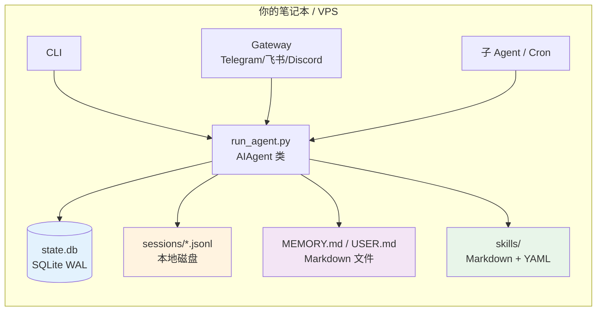
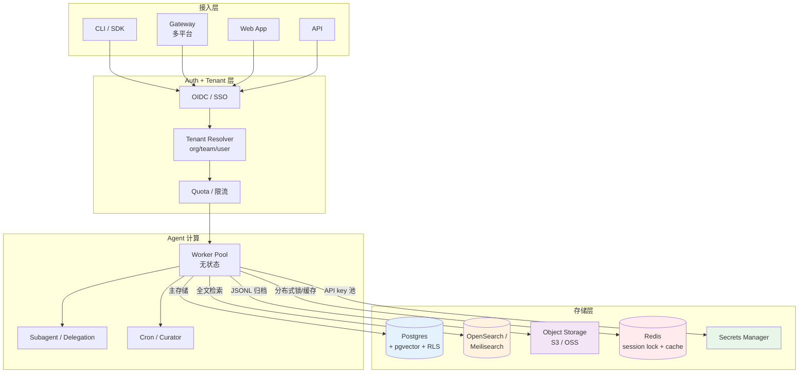
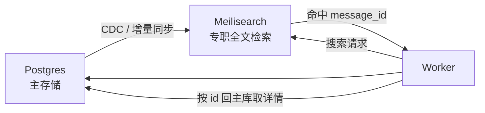
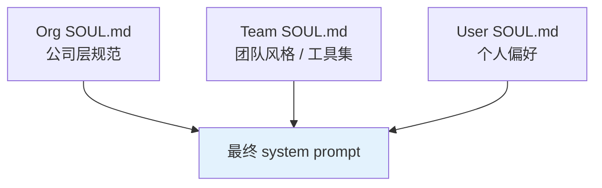
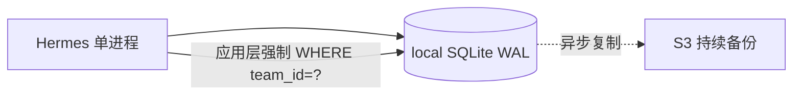

# 如果 Hermes 给团队用——从 SQLite 到 Postgres 的架构推演

> **一句话定位：** Hermes 现在的所有设计都为"每个人在自己机器上跑自己的 agent"优化——一旦扩到团队 / 多租户 / 跨地域，**SQLite + 本地 JSONL + 单进程** 这套地基会立刻撞墙。本文推演要换什么、为什么换、保留什么。

!!! quote "本文动机"
    上一篇 [session_search 双线机制](hermes-session-search.md) 讲清了 Hermes 单机版怎么存数据。今天聊团队场景：把同一个产品搬给 10 人 / 100 人 / 多租户 SaaS 用，架构会怎么变？这不是"加个登录"那么简单——存储引擎、检索后端、归档介质、身份模型几乎都要换。

## 单机版的设计底色

先把现状摆出来，方便对照看。Hermes 当前架构的关键决策几乎全围绕"单机单用户"打转：



**几个关键观察：**

- **所有持久化都在本地文件系统** —— 没有数据库服务、没有对象存储、没有外部缓存
- **进程间通过文件协调** —— gateway / CLI / cron / 子 agent 共用同一个 `state.db`，靠 WAL 模式让多读单写并存
- **身份只有一个"我"** —— `SOUL.md` 单文件、`USER.md` 单 profile、API key 在 `~/.hermes/.env`
- **零运维** —— `pip install + hermes setup` 完事，没数据库要管、没集群要扩

这套设计**对个人用户是绝佳的**：免运维、易备份（一个 `~/.hermes` 目录全包）、离线可用、跨机器迁移就是一次 `rsync`。但每一项**反过来都是团队版的伤口**。

## 团队场景的四面墙

把同一套东西丢给团队，立刻撞四堵墙：

### 墙一：SQLite WAL 的写并发上限

SQLite WAL 模式允许**多个 reader + 一个 writer**并存。这在单机几个本地进程下没问题——gateway 写一条消息只占几毫秒锁，其他 reader 不阻塞。

但团队场景下：

- 10 个工程师同时跟 agent 对话 = 10 路并发写
- 后台 cron 任务定时跑 = 持续抢锁
- Curator pass 在某些时段触发 = 大批量写
- subagent 并行 delegation = 单条任务里就 N 路写

写锁瞬时排队是必然的。SQLite 不是为这种 workload 设计的——`SQLITE_BUSY` 错误开始大面积出现，需要应用层重试 + 退避。Hermes 已经为本地多进程场景做过 WAL 调优（看 `hermes_state.py` 注释），但团队级别**根本不在它的设计目标里**。

### 墙二：跨机器部署的死锁

团队版几乎一定是**多 host 部署**——agent 跑在 k8s pod / 云函数 / 容器实例里，前端跨 region 接入。"几个机器都挂同一个 NFS 上的 sqlite 文件" 听起来能凑合，**实际上不行**：

- SQLite 锁机制依赖 POSIX `fcntl()` —— 在 NFS 上不可靠（不同实现行为不一致），尤其跨 NFS v3/v4 边界
- WAL 文件 + shm 文件**必须**和主 db 文件在同一文件系统 —— NFS 上 shm 行为不正确直接导致数据损坏
- SQLite 官方文档**明确警告**不要把数据库放 NFS

替代方案确实有（Litestream 异步复制、LiteFS 分布式 SQLite、Turso 边缘副本），但都是**只读副本**或异步追赶——**主写节点仍然是单点**，没解决根本问题。

### 墙三：没有真正的权限隔离

现在 `sessions` 表里有个 `user_id` 字段——但这只是**记录字段**，不是**强制约束**。任何能读 `state.db` 的进程能读全部用户的全部对话。

```sql
-- 现状：任何人执行这条都能拿到全库
SELECT * FROM messages WHERE session_id IN (
    SELECT id FROM sessions WHERE user_id = 'someone_else'
);
```

团队场景里这是**合规红线**。不只是"恶意员工"问题——是审计、SOC2、ISO 27001 这些合规框架明确要求"按身份的最小可见原则"。要做到这个，存储层必须支持**行级安全**（Row Level Security），SQLite 没有这个原语。

### 墙四：本地磁盘的容量天花板

`sessions/*.jsonl` 在本地磁盘 append。单机本地：磁盘满了崩。团队级别：

- 100 用户 × 平均每天 5 个 session × 每 session 200 KB = **每天 100 MB 增量**
- 一年 ≈ **36 GB**，五年 ≈ **180 GB**
- 这还不算 attachment（图片、音频、生成的产物）

本地磁盘扩容不可持续；要冷热分层、要按地域就近存储、要审计日志、要数据生命周期策略——这些**对象存储**（S3 / OSS）原生支持，本地文件系统全要自己造。

## 团队版的推论架构

把四堵墙的反命题画出来，大致长这样：



下面分组件拆开看每个换什么、为什么。

## 核心替换 1：SQLite → Postgres

**为什么换：** 真正的多 writer 并发 + 行级安全 + 网络协议天然跨机器。

**搬迁要点：**

- `sessions / messages` 表 schema 几乎可以直接平移（Postgres 有完全兼容的 `TEXT / INTEGER / REAL` 类型）
- 所有外键、索引、CHECK 约束都能保留
- **关键加项**：每张表加 `team_id` 字段 + 启用 RLS

```sql
-- Postgres 版 sessions（增量字段）
ALTER TABLE sessions ADD COLUMN team_id UUID NOT NULL;
ALTER TABLE sessions ADD COLUMN owner_id UUID NOT NULL;
ALTER TABLE messages ADD COLUMN team_id UUID NOT NULL;

-- 启用 RLS：任何 SQL 自动按当前会话身份过滤
ALTER TABLE sessions ENABLE ROW LEVEL SECURITY;
CREATE POLICY tenant_isolation ON sessions
    USING (team_id = current_setting('app.current_team_id')::UUID);

ALTER TABLE messages ENABLE ROW LEVEL SECURITY;
CREATE POLICY tenant_isolation ON messages
    USING (team_id = current_setting('app.current_team_id')::UUID);
```

设置完之后，**任何应用层 SQL 都自动只能看到自己 team 的数据**——哪怕代码忘了写 `WHERE team_id = ?`，数据库也会替你拒绝。这是 SQLite 给不了的安全保证。

**顺带的好处：**

- `pgvector` 扩展可以把 memory embedding 一起进库——MEMORY.md / USER.md 不再是纯文本，可以做语义检索
- `pg_trgm` 扩展提供 trigram 索引（和 SQLite trigram FTS5 思路相同），中文 substring 检索能力没丢
- `pg_stat_statements` 让慢查询、热点表一目了然，可观测性远超 SQLite

## 核心替换 2：FTS5 → 独立检索引擎

**为什么换：** Postgres 自带的 GIN + tsvector 中文支持差（依赖第三方词典插件），且**索引重建会锁主库**。

**两个选择：**

- **OpenSearch / Elasticsearch** —— 重，但成熟。中文分词器（IK / smartcn）成熟，跨索引/跨集群查询能力强
- **Meilisearch** —— 轻，对中文友好（自带 trigram + 词典），易部署，社区版免费



把检索从主库剥离的关键好处：

- **索引重建不阻塞业务** —— 重建 Meilisearch 索引时，主库还在正常写
- **检索容量独立扩展** —— 检索瓶颈出现时只扩检索集群，不扩主库
- **不同租户可以用不同索引策略** —— 比如付费租户用更大的 index、更多分片

## 核心替换 3：本地 JSONL → 对象存储

**为什么换：** 容量、生命周期、跨地域可见性都需要。

**对应方案：**

- **路径方案**：`s3://hermes-archive/{team_id}/{user_id}/{year}/{month}/{session_id}.jsonl`
- **生命周期**：30 天热区 → 90 天温区（Standard-IA）→ 一年冷区（Glacier）
- **加密**：默认 SSE-S3 / SSE-KMS，按租户分密钥
- **写入模式**：保持 append-only，但落盘走 multipart upload（每 N MB 一个 part）

JSONL 在团队版里多承担了一个职责：**审计日志的 source of truth**。任何"我们到底说过什么"的合规追溯，都从对象存储捞，而不是从主库（主库会按数据生命周期策略真删旧数据，对象存储则有 retention lock）。

## 核心替换 4：加 Redis 这一层

单机版完全没用到 Redis——本地进程间协调靠 SQLite 的锁就够了。团队版不行：

- **Session 锁** —— 同一用户的并发对话不能让两个 worker 同时改同一个 session（消息顺序会乱）
- **限流计数器** —— 按 team/user/分钟做 token 桶，Redis 的 `INCR + EXPIRE` 是教科书做法
- **短期 cache** —— 最近的 messages、用户 profile、当前 active subagent 状态
- **Pub/Sub** —— streaming response、跨 worker 的事件广播（subagent 完成通知主 agent）

## 顺带要改的几个设计点

存储换完只是一半，**身份模型 + 多租户配置**这一层也要重塑：

### 多层 SOUL.md / 三层 profile



公司层定合规与禁止行为（"不准向外部 API 泄露 source code"）；团队层定工具栈与术语（"我们用 React + TypeScript，不是 Vue"）；用户层定个人偏好（"我喜欢简洁回复"）。三层组合成最终的 system prompt——比单一 SOUL.md 灵活得多。

### API key 池 + 用量记账

| 维度 | 单机版 | 团队版 |
| --- | --- | --- |
| API key | 用户自己塞 `.env` | Vault 集中管理，按 team/user 分配 |
| 计费 | 用户自付云账单 | 平台代付 + 按 token 内部分账 |
| 限额 | 90 turns 硬上限兜底 | 按 team/月 token 预算 + 软硬限 |
| 审计 | 无 | 每次 API 调用记账：who/when/cost/model |

### 审计日志

`session_search` 在团队版必须从"任意工具调用"变成"可审计动作"：

```json
{
  "event": "session_search",
  "actor_user": "alice@team.com",
  "team_id": "team_abc",
  "query": "deployment",
  "result_session_ids": ["20260515_..."],
  "timestamp": "2026-05-15T10:00:00Z",
  "ip": "..."
}
```

这条日志要落到独立的审计 store（不能跟业务库混），保留期按合规要求设——通常 1-7 年。

## 但是——什么情况下 SQLite 还能撑

不是说团队就一定要 Postgres。**几个场景下 SQLite 还能活**：

- **< 10 人 + 单机部署** —— 一台服务器，没多 host 需求，写并发不高
- **没合规要求** —— 内部工具，不涉及客户数据，审计要求弱
- **接受异步复制做容灾** —— Litestream 把 SQLite 实时增量备份到 S3，挂了从备份恢复

具体凑合方案：



应用层每条 SQL 都强制带 `team_id` 过滤（不能依赖 RLS 因为 SQLite 没有），WAL 模式 + Litestream 做增量备份保住数据安全。这套能撑到 ~50 用户 / 单 host 部署，但**任何一个维度突破都得迁 Postgres**。

## 我的判断

Hermes 现在的设计哲学非常**自洽且明确**——"每个人在自己机器上跑自己的 agent，本地数据本地控制"。这个定位下，所有"为团队设计"的东西都是过度工程：

- 用户自己装 Postgres？运维负担反人类
- 用户自己配 RLS？太复杂
- 用户自己接 S3 / Redis？破坏了"一个目录全包"的简洁

所以 Hermes 团队版**不会是"加几个配置"**，而会是**另一个产品**——共享 Hermes 的 prompt 工程、技能系统、curator/GEPA 这些**与存储无关的核心**，但底座完全重建。

社区已经在动这事——Hermes 的 plugin 系统里有 `memory` plugin（honcho、mem0、supermemory），就是为"把记忆从本地 Markdown 推到外部服务"留的口子。但完整的多租户版本，要么 Nous 自己出云端 SaaS，要么社区 fork 成独立项目。

**对个人用户的启示**：保持现在这套就好。本地 SQLite + JSONL 极快、极简、零运维——你不需要 Postgres，你需要的是**信任自己单机数据已经够 robust**，然后专注用 agent 解决问题，而不是给它做个分布式架构。

## 延伸阅读

- [Hermes 架构图解](hermes-architecture.md) —— 单机版完整架构 + 自演化系统
- [Hermes session_search 双线机制](hermes-session-search.md) —— SQLite + JSONL 的本地存储拆解
- [SQLite 是否适合 Production](https://www.sqlite.org/whentouse.html) —— 官方对单机 vs 多机的明确指引
- [Postgres Row Level Security](https://www.postgresql.org/docs/current/ddl-rowsecurity.html) —— 团队版隔离的标准做法
- [Litestream](https://litestream.io/) —— 让 SQLite 凑合做"准 production"的中间方案

---

*单机简洁与团队规模化是两条并行的设计路径，不是同一条路的两端。把单机版调教好之后，团队版是个完全独立的工程。*
