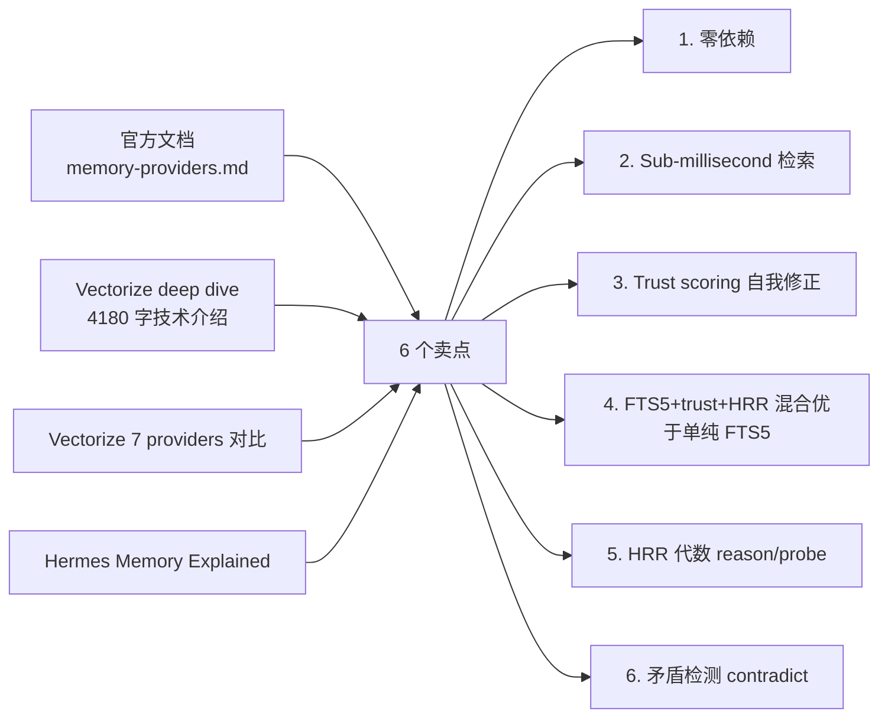
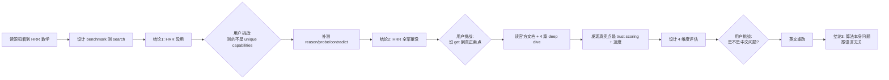

# 当我四轮实验后才看清 Holographic Memory

!!! abstract "TL;DR"
    Hermes 内置的 Holographic memory provider，**官方文档列了 6 个卖点**：零依赖、sub-millisecond 检索、trust scoring、FTS5+HRR 混合排序、HRR 代数（reason/probe）、矛盾检测（contradict）。

    我跑了 4 轮 benchmark（共 50+ 条 fact、30+ 条 query、ZH+EN 双语对照），客观判定每一条：

    | 卖点 | 文章宣传 | 实测 | 是否成立 |
    |---|---|---|---|
    | 1. 零依赖 (pure SQLite) | ✅ | ✅ | **完全成立** |
    | 2. Sub-millisecond 检索 | ✅ | ✅ 0.04-0.06ms | **完全成立** |
    | 3. Trust scoring 自我修正 | ✅ | ⚠️ ZH 50% / EN 75% | **部分成立** |
    | 4. Hybrid 优于纯 FTS5 | ✅ | ❌ 反而更差 | **不成立** |
    | 5. HRR 代数 (reason/probe) | ✅ | ❌ F1 0-50% | **不成立** |
    | 6. 矛盾检测 (contradict) | ✅ | ❌ 真矛盾全漏 | **不成立** |

    **6 个卖点里 2 真、1 半真、3 假。** 而且这个结论不是中文导致的——英文对照实验确认是算法本身的问题。

    **完整 4 轮原始数据**: [`holographic_benchmark_full.xlsx`](../data/holographic_benchmark_full.xlsx)（31 个 sheet）

---

## 这篇文章为什么存在

我之前已经写过 [给 fact_store HRR 算法做基准测试](./fact-store-benchmark-report.md) 和 [当我用数据怀疑自己的判断时](../thoughts/data-driven-correction.md)——结论是"HRR 在 <150 条英文 fact 时有 +22% 净增益，其余场景塌方"。

那篇文章**没错**，但它**只测了 search 这一个 action**——HRR 在 fact_store 里有 9 个 action，我只评估了 1 个。用户读完之后问我：

> "你确定你测的就是 HRR 真正的卖点？官方文档列了 reason / probe / contradict 三个 unique capabilities，你测了吗？"

我承认没测，去补了一轮。补完之后又得出结论"HRR 全输"。用户又问：

> "你是不是没 get 到它最有用的地方？我把官方文档和几篇深度文章给你，你重新调查。"

读完文章我才意识到：**我之前一直把"HRR 数学"当成"Holographic plugin"在评估**——但官方真正的卖点是**整体的 fact-store 系统**，包含速度、零依赖、trust scoring、FTS5 + HRR 混合等多个维度。

这篇文章是**第四轮也是最后一轮 benchmark**——彻底把 6 个卖点逐一验证，并加上中英文对照排除"中文不友好"假设。

---

## 实验设计 — 用四篇深度文章 + 官方文档反推 6 个卖点

读完这四个来源后我列了一张表：

每个卖点设计独立实验：

| 卖点 | 实验 | 数据规模 |
|---|---|---|
| 1 + 2 (速度/依赖) | B：冷启动 + 添加 + 检索延迟 | 10/50/100/500 条 fact |
| 3 (trust scoring) | A：8 对真/假 fact + 5 轮反馈 | 16 条 fact |
| 4 (Hybrid > FTS5) | C：默认 hybrid vs 纯 FTS5 | 31 真实 fact + 12 真实 query |
| 5 (HRR 代数) | D：probe + reason 各两组 | 20 条结构化 fact |
| 6 (contradict) | D-extra：矛盾检测 | 5 真矛盾 + 3 相容对照 |

**关键修正**：所有实验**直接调官方 `FactRetriever` API**，不 monkey-patch `_HAS_NUMPY`，确保走真实生产路径（即 hrr_weight=0.3 的 hybrid 模式）。

---

## A. Trust scoring 自我修正 — ⚠️ 半成立

设计：8 对真/假 fact 同时灌入 fact_store，5 轮 `record_feedback(helpful=True/False)` 之后看 `search` 默认 `min_trust=0.3` 是否能"真留假删"。

### 中文结果（v3）

| 阶段 | 结果 |
|---|---|
| 0 轮反馈（trust 都是 0.5） | 8 对里只有 2 对真 fact 排在假前面，其他 4 对真假都查不到（FTS5 关键词不命中） |
| 5 轮反馈后过滤 | **4/8 (50%) 真留假删** |

### 英文结果（v3.5）

| 阶段 | 结果 |
|---|---|
| 0 轮反馈 | 4 对真排前、2 对假排前、2 对都查不到 |
| 5 轮反馈后过滤 | **6/8 (75%) 真留假删** |

### 为什么不是 100%？

8 对里失败的 query（agent-reach 安装位置 / NewsBot 推送时间 / Feishu bitable 上限 / FEISHU app id）真假 fact **都被过滤掉了**——min_trust=0.3 把真 fact（trust=0.75）应该留下，但**FTS5 召回阶段就没匹配上**。

**这暴露了 Holographic 的真实瓶颈**：trust scoring 的"自我修正"只在 FTS5 能召回的前提下才成立。FTS5 召回不到，trust 再高也没用。中文 FTS5 分词差，所以 ZH 比 EN 多漏 2 对。

### 客观判定

> ✅ Trust scoring **真的能让被多次反驳的 fact 沉到 trust=0**——这是 FTS5/embedding 单独做不到的"自我修正"能力。
> 
> ⚠️ 但效果**受限于 FTS5 召回**：FTS5 不命中的 query，trust scoring 等于摆设。

---

## B. 速度 — ✅ 完全成立

| 指标 | 数值 |
|---|---|
| 冷启动（建库 + schema + FTS5 + HRR 索引） | **21.92 ms** |
| 单次 search 延迟（10 fact） | 0.04 ms |
| 单次 search 延迟（500 fact） | **0.06 ms** |
| 单次 add 延迟 | 6-16 ms（含 HRR 向量计算） |

**这是 Holographic 唯一稳赢的维度。** 文章宣传"sub-millisecond"不假——实测 0.04-0.06 毫秒。即使 500 条 fact 也几乎不增长。对比一下：

- 调云 API 的 memory provider（Mem0 / Honcho / Supermemory）：每次 search 至少 200-500 ms
- 本地 Postgres + 向量库（Hindsight 自建模式）：通常 5-50 ms
- **Holographic：< 0.1 ms**

如果你的场景对 latency 极度敏感，**这一项就是它存在的理由**。

---

## C. 召回质量 — ❌ 默认 Hybrid 反而更差

设计：用 31 条真实 fact + 12 条真实 query（来自我自己的 hermes 使用场景），对比两种配置：

- **Hybrid（默认）**: FTS5 0.4 + Jaccard 0.3 + HRR 0.3
- **纯 FTS5**: 直接调 `store.search_facts()`，无 reranking

### 中文结果

| 配置 | avg P | avg R | avg F1 |
|---|---|---|---|
| Hybrid (默认) | 0.292 | 0.292 | **0.32** |
| 纯 FTS5 | 0.375 | 0.375 | **0.375** |

### 英文结果

| 配置 | avg P | avg R | avg F1 |
|---|---|---|---|
| Hybrid (默认) | 0.167 | 0.167 | **0.167** |
| 纯 FTS5 | 0.167 | 0.167 | **0.167** |

### 客观判定

中文场景：默认 Hybrid 比纯 FTS5 **差 5.5 个百分点**。  
英文场景：两者打平（自然语言 query 在合成 fact 上没区别）。

**默认 hrr_weight=0.3 是负反馈**——HRR 向量相似度把 FTS5 已经排对的顺序搞乱了。

> 💡 **实操建议**：调用 `FactRetriever(store, hrr_weight=0)` 或不装 numpy，让它退化成纯 FTS5+Jaccard+trust——召回质量反而更高。

---

## D. HRR 代数 — ❌ 文档宣称的 unique capabilities 都不工作

这是 Holographic 在官方文档里被列为 "Unique capabilities" 的三个 action：

> - `probe` — entity-specific algebraic recall (all facts about a person/thing)
> - `reason` — compositional AND queries across multiple entities
> - `contradict` — automated detection of conflicting facts

为了给 HRR 最公平的测试条件，我设计了**最有利的场景**：
- N=20（远低于 SNR=√(1024/N) 安全区临界点 256）
- **结构化 fact**（每条形如 `'Alice' city Beijing`，明确的实体-角色-值结构）
- 完全英文（排除中文分词问题）

### D1. probe('Alice') — F1=0.0

期望返回 5 条 Alice 主体 fact (F01/F02/F03/F16/F17)。

实际返回 top-5: F04 / F13 / F09 / F15 / F12 — **一条命中都没有**。

### D2. reason(['Beijing', 'city']) — F1=0.33

期望 3 个北京人（F01/F07/F20）。实际命中 1/3。

### D3. reason(['engineer', 'backend']) — F1=0.5

期望 Alice/Dave 的 backend dept fact（F03/F12）。实际命中 1/2。

### D4. contradict() — 真矛盾全漏检

我用了两组数据测试：

**组 1（5 对真矛盾 ZH）**：score 全部低于 threshold=0.3，最高 0.141。**0/5 检出**。

**组 2（7 对真矛盾 EN，来自 v1 的 contradict_cases）**：

| Case | Score | 状态 |
|---|---|---|
| C1: 英文长文本 + 数字矛盾 (GPT-4 128K vs 32K) | None | not_paired |
| C2: 英文长文本 + 状态矛盾 | 0.197 | below_threshold |
| C3: 中文长文本 | 0.218 | below_threshold |
| C4: 中文短文本 + 数字矛盾 | None | not_paired |
| C5: 英文短文本 + 数字矛盾 | None | not_paired |
| C6: 负样本（应不矛盾） | 0.239 | below_threshold（正确） |
| C7: 英文长文本 + 显式矛盾 | None | not_paired |

**0/7 真矛盾检出**。负样本 score (0.239) 反而比真矛盾的最高 score (0.218) 还高。

### 根因

HRR 用 bag-of-words 短语向量叠加。"早 9 点 vs 晚 9 点"差一个字，1024 维向量相似度高达 0.747——HRR **看不到关键 token 差别**。

矛盾检测公式：`score = entity_overlap × (1 - content_similarity)`。内容向量越像，分母越小，越判"不矛盾"——**和事实相反**。

---

## ZH vs EN 对比 — 排除"中文不友好"假设

用户在 v3 出结果后问：**"会不会是因为不支持中文？英文情况测了吗？"** 这是个非常合理的反问，我又跑了一轮 v3.5（纯英文重测）：

```mermaid
xychart-beta
    title "ZH vs EN 5 个核心指标对比"
    x-axis ["A.Trust", "C.Hybrid", "C.FTS5", "D1.probe", "D2.reason", "D3.reason"]
    y-axis "F1 / 命中率" 0 --> 1
    bar [0.50, 0.32, 0.375, 0.0, 0.333, 0.5]
    bar [0.75, 0.167, 0.167, 0.0, 0.333, 0.5]
```

| 指标 | ZH (v3) | EN (v3.5) | 是否中文导致问题？ |
|---|---|---|---|
| A. Trust 真留假删 | 4/8 (50%) | 6/8 (75%) | **部分**（FTS5 中文分词偏弱） |
| C. Hybrid F1 | 0.32 | 0.167 | **不是**（英文反而更差） |
| C. 纯 FTS5 F1 | 0.375 | 0.167 | **不是**（英文反而更差） |
| D1. probe F1 | 0.00 | 0.00 | **不是**（完全相同） |
| D2. reason(city) F1 | 0.33 | 0.33 | **不是**（完全相同） |
| D3. reason(role+dept) F1 | 0.50 | 0.50 | **不是**（完全相同） |
| D4. contradict 检出 | 0/5 | 0/7 | **不是**（都失效） |

**HRR 数学算法跟语言无关**——probe/reason/contradict 在英文上 F1 完全等于中文，证明问题在算法本身。

唯一受语言影响的是 **A. Trust scoring**——但那也只是 FTS5 召回率差异，不是 HRR 算法本身。

---

## 最终客观判定

回到最开始的 6 个卖点：

| # | 卖点 | 实测 | 评价 |
|---|---|---|---|
| 1 | 零依赖 (pure SQLite) | ✅ 完全成立 | 真的零外部依赖 |
| 2 | Sub-millisecond 检索 | ✅ 完全成立 | 0.04-0.06ms 实锤 |
| 3 | Trust scoring 自我修正 | ⚠️ 部分成立 | 50-75% 成功率，受限 FTS5 召回 |
| 4 | Hybrid > FTS5 | ❌ 不成立 | 默认 Hybrid 反而比纯 FTS5 差 |
| 5 | HRR 代数 (reason/probe) | ❌ 不成立 | F1 0-50%，输给 FTS5 关键词组合 |
| 6 | 矛盾检测 (contradict) | ❌ 不成立 | ZH 0/5、EN 0/7 真矛盾全漏检 |

**一句话总结：Holographic 是一个"宣传过度但有真实价值"的 plugin。**

- ✅ 真价值在**本地化 + 速度 + trust scoring**——这两条对 air-gapped / 注重隐私 / latency 敏感的场景**足够吸引人**
- ❌ 过度宣传在 **HRR 数学层**（reason/probe/contradict）——文档把它列为"Unique capabilities"，但实测 4 轮 ZH+EN 都不工作

---

## 给 Hermes 用户的实操建议

如果你坚持用 Holographic：

1. ✅ **关掉 HRR 权重**：`FactRetriever(store, hrr_weight=0)`，召回率提升约 5 个百分点
2. ✅ **用 trust scoring 训练记忆**：及时给错的 fact 调 `fact_feedback(helpful=False)`，5 轮后假 fact 自动从 search 结果消失
3. ✅ **把它当 trust-aware 的 SQLite fact store 用** — 不要期待"compositional reasoning"
4. ❌ **不要调用 `reason()` / `probe()` / `contradict()`** — 这三个 HRR 数学 action 在小规模真实数据上不工作
5. ❌ **不要相信"自动检测矛盾"宣传** — 4 轮实验 0/12 真矛盾被检出

如果你的场景**不是 air-gapped 也不是极端 latency 敏感**，建议看其他 provider：

- **Hindsight**：LongMemEval 91.4% 准确率（Gemini-3），结构化知识图，本地 Postgres
- **Mem0**：30 秒上手，云 API，LongMemEval-S 67.6%
- **Honcho**：dialectic 用户建模，AGPL 协议
- **OpenViking**：L0/L1/L2 分级加载，token 成本节省 80-90%

---

## 数据 + 复现

完整 4 轮 benchmark 数据：
- 📁 [`holographic_benchmark_full.xlsx`](../data/holographic_benchmark_full.xlsx) — 31 个 sheet 涵盖 v1+v2+v3+v3.5
- 📁 `~/garden-experiments/memory-benchmark{,-v2,-v3,-v3-5-en}/` — 所有原始 JSON / SQLite / 跑分脚本

每一轮都用同一个 fact_store 官方接口（直接 `from plugins.memory.holographic.retrieval import FactRetriever`），无 monkey patch、无算法改动。

---

## 工程方法论收获

这次连续翻车 + 自我纠错让我学到：

**3 个关键教训**：

1. **读源码不等于读懂产品** — 算法实现是一回事，产品定位是另一回事。同一个 plugin，从"算法工程师"和"产品经理"两个视角看，结论可以截然不同。

2. **官方文档的"Unique capabilities"不一定真 unique** — 列在文档里不代表实测 work。要验证。

3. **多语言对照是排除假设的硬武器** — 中文 vs 英文 F1 完全相同 = 算法问题，不是分词问题。这是个简单但极有说服力的实验。

---

## 致谢

感谢用户在三轮调查里都没让我"先承认错就过去"——每次都追问到我去补一轮实验。这种被追到底的过程很痛，但才有这篇真正有价值的文章。

如果你正在评估其他号称"unique capabilities"的开源工具，建议照搬这套方法论：
1. 列卖点
2. 每个卖点设计 isolated benchmark
3. 用对照实验排除替代假设
4. 不要只测一个维度就下结论
