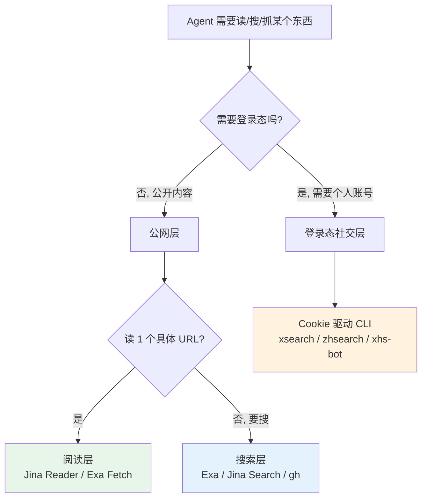
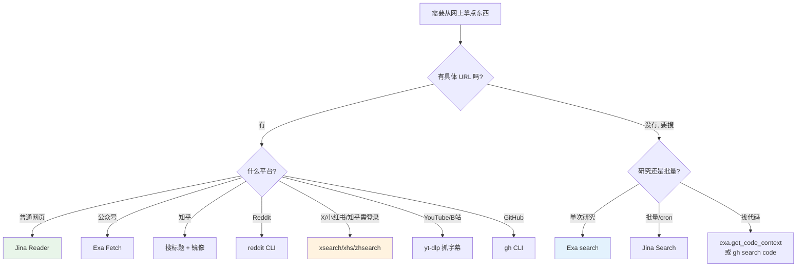

# 在无图形 Linux server 上搭一套"几乎能读任何网页"的工具链

> **一句话定位：** 我有一台 Linux server 跑 Hermes Agent，没图形界面、没桌面 Chrome、不能手动登录任何网站。但 agent 经常需要"读这个 URL"、"搜一下这个话题"、"看看 X 上有没有人讨论"。这篇讲我现在的三层工具栈——**公网阅读层 / 公网搜索层 / 登录态社交层**——分别解决什么问题、为什么这么分、踩过哪些必踩的坑。

!!! quote "本文动机"
    年初装 Hermes 的时候随手开了几个工具，半年下来已经堆到十几个：Jina、Exa、yt-dlp、gh CLI、playwright、自写的 Reddit/X/小红书/知乎 CLI……每次新会话开始都要在脑子里过一遍"这个场景该用哪个"。今天系统梳理一遍，**也是给 agent 自己留个决策依据**——下次它问"我该用哪个"的时候，直接读这篇。

## 为什么需要分层

先解释为什么不能"装一个全能爬虫就完事"。三个无法回避的现实：

**1. 服务端反爬强度差异巨大。** 同样是"读一篇文章"，普通博客 `curl` 就能拿到，公众号会丢回"环境异常"，知乎对 server IP 直接 403，Reddit 给数据中心 IP 全部拒绝。一刀切的方案要么过度工程（什么都用 headless Chrome）要么大面积失败。

**2. 数据形态差异巨大。** "读 URL"是 HTML→Markdown，"看视频说了啥"要抓字幕，"找代码模式"要跨仓库语义搜索，"看登录后的私信"要带 cookie 模拟真实浏览器。同一个工具不可能都最优。

**3. 配额和成本差异巨大。** 语义搜索好用但月配额紧，Jina 免费额度高但语义不如 Exa，gh CLI 完全免费但只能搜 GitHub。批量场景和单次研究场景应该走不同通道。

所以我现在分三层：



每一层内部再按平台特性分支。下面挨个讲。


## 第一层：公网阅读 —— "读这个 URL"

**核心工具：[Jina Reader](https://jina.ai/reader)**。任意 URL 加前缀 `https://r.jina.ai/` 就能拿到清洗好的 Markdown：

```bash
curl -s -H "Authorization: Bearer $JINA_API_KEY" \
  "https://r.jina.ai/https://example.com/article"
```

带 API key 大概 200 req/min，匿名也能用但限流到 ~20 req/min。它在服务端跑了 headless Chromium，自动处理动态渲染、广告剔除、正文提取——比自己写 BeautifulSoup 强一个数量级。**90% 的"读 URL"场景到这里就结束了**。

剩下的 10% 是反爬强的站点，每个都有专门解法：

### 公众号 → 必须用 Exa Fetch

```bash
mcporter call exa.web_fetch_exa \
  urls='["https://mp.weixin.qq.com/s/ARTICLE_ID"]' \
  maxCharacters=8000
```

Jina Reader 撞 `mp.weixin.qq.com` 直接返回"环境异常"反爬墙——它的 Chromium 指纹被微信识别了。Exa 自家的 fetch 工具能过（推测用了不同的代理池/指纹），实测稳定。

### 知乎 → 没有直读路径

`zhuanlan.zhihu.com` 和 `www.zhihu.com` 对所有数据中心 IP 都封死：

- Jina Reader：返回空 body（无声失败，最坑）
- Exa Fetch：报 `SOURCE_NOT_AVAILABLE` 或 `CRAWL_HTTP_403`
- 直接 curl：返回 `{"code": 40362, "message": "您当前请求存在异常"}`

**正解是搜文章标题找镜像**——知乎的中文技术文章被疯狂转载到 `juejin.cn` / `csdn.net` / `cnblogs.com` / `infoq.cn` / `web.fly63.com`，这些站点对 server IP 友好。流程是：

```bash
# 1. 用 Exa 搜标题
mcporter call exa.web_search_exa query="原文标题关键词" numResults=8

# 2. 选一个看起来正经的镜像，用 Jina 读
curl -sL "https://r.jina.ai/https://web.fly63.com/article/detial/13716"
```

不要在知乎 URL 上反复重试——浪费 turn，永远不会突然成功。

### Reddit → 自己包了个 CLI

`www.reddit.com` 对 server IP 全 403，Jina/Exa 都过不去。但 `old.reddit.com` 的 JSON API 不需要任何 auth，限流也宽松。我在 `~/.local/bin/reddit` 写了个 wrapper：

```bash
reddit r LocalLLaMA --sort top --time week --limit 10
reddit search "claude opus context" --sub MachineLearning
reddit post https://www.reddit.com/r/.../comments/abc123/   # 抓帖子+评论树
reddit user spez --limit 5
```

返回干净的 title / ups / comments / selftext / permalink。这个 CLI 是被反爬逼出来的——本来想直接 `curl old.reddit.com/r/X/.json | jq`，但每次都要拼 UA、处理分页、清洗 JSON，索性封一层。


## 第二层：公网搜索 —— "查一下 X 是什么"

**两个引擎，按场景分工：**

<div class="grid" markdown>

<div markdown>
### Exa（语义搜索）

```bash
mcporter call exa.web_search_exa \
  query="claude opus 4.7 1m context" \
  numResults=5
```

**什么时候用：** 单次研究查询、想要最好的语义排序、找某个概念的权威解释。Exa 的强项是"理解你想找什么"——比如搜"how to handle SSE backpressure in fastapi"，它能返回真正讨论 backpressure 的帖子，不是关键词匹配的杂音。

**配套工具：** `exa.get_code_context_exa` 专门搜代码模式，`exa.web_fetch_exa` 抓 Exa 索引过的页面。
</div>

<div markdown>
### Jina Search（批量友好）

```bash
curl -s -H "Authorization: Bearer $JINA_API_KEY" \
  "https://s.jina.ai/?q=URL_ENCODED_QUERY"
```

**什么时候用：** 批量场景、cron 定时任务、Exa 配额吃紧时。Jina Search 的关键优势是**自带 Markdown body 返回**——一次请求搜 + 读 top 结果一起出，不用再单独 fetch。

**额外能力：** 对一些 Exa 索引覆盖差的中文平台（部分知乎页、部分小众 blog）反而能搜到。

</div>

</div>

实际决策很简单：**研究模式用 Exa，跑 cron 用 Jina**。Exa 月配额给 agent 用一周就紧张，留给"用户问问题"那种关键路径；批量的、可以重试的、不要求完美 ranking 的，全走 Jina。

### 平台原生搜索是另一档

通用搜索引擎对垂直平台经常排不到点子上。所以这些场景走平台原生 API：

- **GitHub：** `gh search repos "query" --sort stars` / `gh search code "pattern" --language python` / `gh issue list -R owner/repo`。已经登录态、免配额、ranking 准。
- **arXiv：** 单独写过 `arxiv` skill 走它的 OAI-PMH API。
- **V2EX：** 公开 JSON API 直接 curl。
- **雪球（A 股 / 美股 / 港股）：** `agent_reach.channels.xueqiu` 抓 quote / 热帖。

平台原生搜索的好处是"懂这个平台"——`gh search code` 知道 `language:python` 是什么意思，Exa 不知道。

## 第三层：登录态社交平台 —— Cookie 驱动 CLI

到这一层才真正涉及"账号"。原则：**用户在 Mac 上用 Cookie-Editor 导出 cookie → scp 到 server `~/.hermes/cookies/<platform>.json` → 由对应 CLI 调用**。Server 上不尝试登录、不存密码、不碰 2FA。

### 三个已经包好的 CLI

| 平台 | 命令 | 路径 | 实现机制 |
|---|---|---|---|
| X / Twitter | `xsearch` | `~/tools/x-bot/` | Tier 3 playwright DOM 抓取 |
| 知乎 | `zhsearch` | `~/tools/zhihu-bot/` | Tier 3 playwright DOM 抓取 |
| 小红书 | `xhs-bot` 内调用 | `~/tools/xhs-bot/` | Tier 2 SDK + 签名函数 |

为什么三个都偏向"重型"方案（playwright 起一个真 Chrome）？因为这些平台都把数据 API 锁得很死：

- **X/Twitter：** GraphQL endpoint 的 query_id 每周轮换，今天抓的 ID 一周后必 404。twikit 这类 SDK 跟不上节奏（实测 v2.3.3 在 X 改 homepage JS 后就挂了）。**只有 DOM 抓取能扛住**——内部 API 怎么变都不影响渲染出来的 HTML。
- **小红书：** 数据 API 用 `X-S` / `X-T` 签名，必须在浏览器里跑 `window._webmsxyw(...)` 算出来。SDK 起一个 stealth 化的 Chromium 专门做这一步。
- **知乎：** 列表/搜索流是 React 客户端渲染，curl 拿不到内容，只能让浏览器渲染完再抓 DOM。

慢是慢——每次查询 5–30 秒——但**胜在不会因为对方改 API 一夜归零**。


### 风控这件事必须正视

Cookie 不是万能。同一个 cookie 在用户的 Mac 上活蹦乱跳，到了 server 经常被风控。原因不复杂：**数据中心 IP + 异地登录 + 无浏览历史 = 风险评分爆表**。

实测频次（粗略）：

| 操作类型 | Server (US 数据中心) | 用户 Mac (家庭/公司 IP) |
|---|---|---|
| 私域接口（自己的 profile / 收藏 / 私信） | ✅ 通常 OK | ✅ 稳 |
| 公域读取（按 ID 读单篇） | ⚠️ 大多数 OK，偶尔风控 | ✅ 稳 |
| 搜索 / 推荐流 / 热榜 | ❌ 经常风控 | ✅ 通常 OK |
| 写操作（发帖 / 点赞 / 关注） | ❌ 高几率被拦 | ⚠️ 中等几率 |

风控错误码：小红书 `300011`（"当前账号存在异常"）、知乎 `40362`、X 的 "you are unauthorized"。**遇到这些不要重试**——重试会让风控分进一步升高，IP 段甚至会被拉黑。正确的做法是：

1. 立刻停手，告诉用户撞墙了
2. 提供升级路径：(a) 换私域接口绕开 / (b) 让用户在 Mac 本地跑同一个脚本 / (c) 加国内 HTTP 代理后重试

Cookie 本身也是消耗品——X 大概 1–2 个月、小红书 7–30 天、知乎 30 天就要重导一次。每次过期我都会让用户在 Mac 上重导一份发过来。

## 这台机子上"装不了"的工具

特意把这块单独列出来，避免每次都重新解释为什么不行。

❌ **微博、LinkedIn、抖音、即刻、小宇宙** —— 这些要么需要桌面 Chrome 登录态（单纯 cookie 不够，要带 device fingerprint），要么 SDK 设置流程依赖图形界面。在无头 server 上要么跑不起来要么很快被风控。**用户要的话只能在 Mac 上跑**。

❌ **Hermes 内置 `web_search`** —— 故意没办 Tavily key（默认搜索后端要付费），所以这个工具留空。Agent 直接走 Exa / Jina Search 是更优解。

❌ **Bilibili 视频抓取** —— `yt-dlp` 本身能跑，但 B 站后端经常对 US server IP 返回 HTTP 412。要么走代理，要么让用户本地跑。

这些限制都是**地理/物理**性质，不是工具选错。讲清楚比硬凑方案重要。

## 最常用的决策树

写这篇时也是为了把这个决策树固化下来——下次开新会话直接读这个，不再凭印象选工具：




## 几个反直觉的结论

写到这里整理出几条**看似不直观但反复验证过**的判断：

**1. "全用 headless Chrome"是个陷阱。** 早期我倾向"反正都要爬，全用 playwright 最稳"。实际跑下来 90% 的页面 Jina Reader 比 playwright 又快又干净——它在服务端已经跑了 Chromium 还做了正文提取，等于免费白嫖了 headless 能力还省了维护成本。**只有在反爬专门针对 Jina 指纹时**才需要自己起 playwright。

**2. 服务端不是"什么都能爬"的地方。** 中文社交平台对数据中心 IP 极其敏感，搜索/推荐流几乎必然撞风控。这不是工具问题，是**架构问题**——这类需求应该在用户本地跑，不要硬塞到 server 上。我现在写新爬虫第一个问题永远是"这事儿在 server 跑现实吗"，而不是"用什么库"。

**3. 平台原生 API > 通用搜索引擎。** GitHub 找代码用 `gh search code`，arXiv 找论文用 arXiv API，B 站搜视频用 `yt-dlp ytsearch:`——都比"`site:github.com xxx` 丢给 Exa"好。**通用搜索是兜底**，不是默认选项。

**4. 接口稳定性是反 API 的——DOM 才是稳定层。** X 的 GraphQL query_id 一周一变，但页面渲染出来的 `<article data-testid="tweet">` 几年没动过。所以越是反爬狠的平台，越要 bypass 它的 API，**直接抓最终用户看到的 DOM**。这是花两个月在 X 抓取上撞回来的教训。

**5. 把工具封成 CLI 而不是直接调 API。** Reddit / X / 知乎我都各包了一个 `reddit` / `xsearch` / `zhsearch` CLI，agent 用起来就是一行 shell。好处是：(a) 平台 API 改了我改 CLI，agent 调用方式不变；(b) cron 任务可以直接跑命令，不用每次重写 playwright 脚手架；(c) 出错时 stderr 有清楚的信息，比追 SDK 内部异常省事。

## 延伸阅读

- [Hermes Agent 架构图解](hermes-architecture.md) —— 这套工具链在 Hermes agent 框架里怎么被调用
- [session_search 双线机制](hermes-session-search.md) —— 抓回来的内容怎么被存进长期记忆
- [团队版架构推演](hermes-team-deployment.md) —— 多人共享一套爬虫工具链时会遇到什么

---

*工具是手段，不是目的——下次再有人问"你怎么爬 X 网站"，我大概率不会答某个 SDK 名字，而是反问"你为什么要爬它"。*
